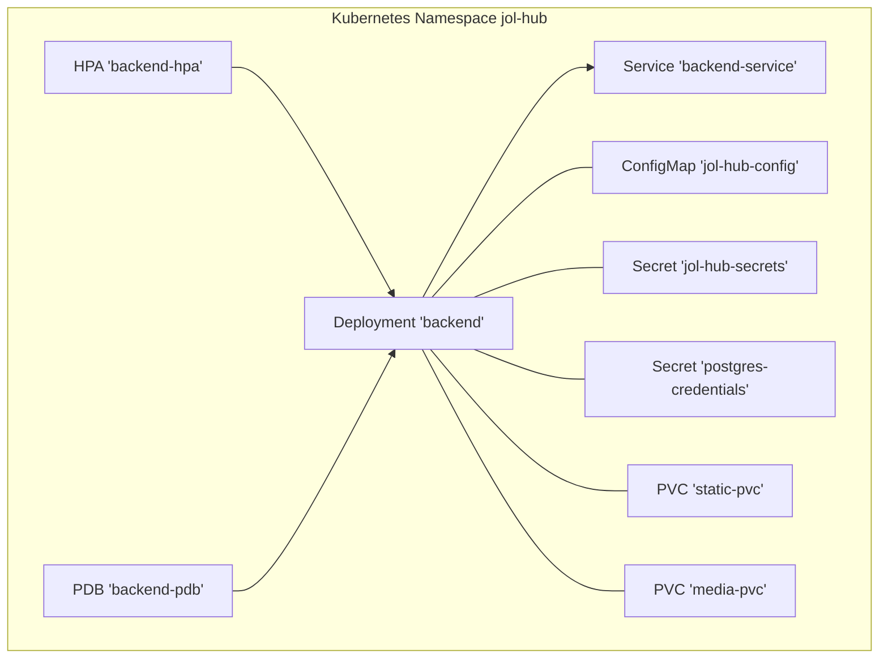
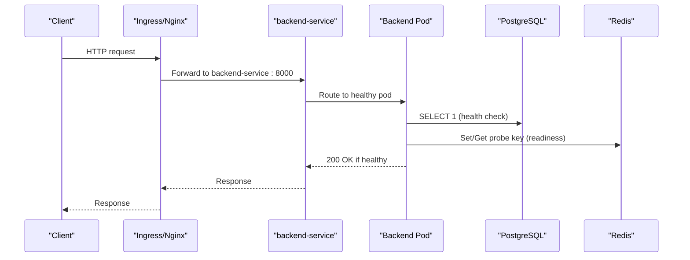
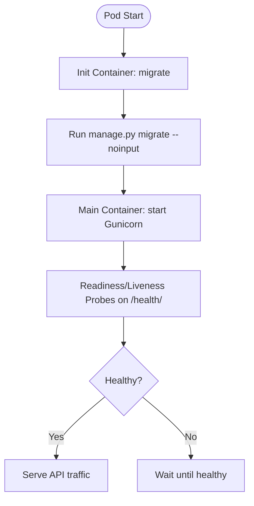
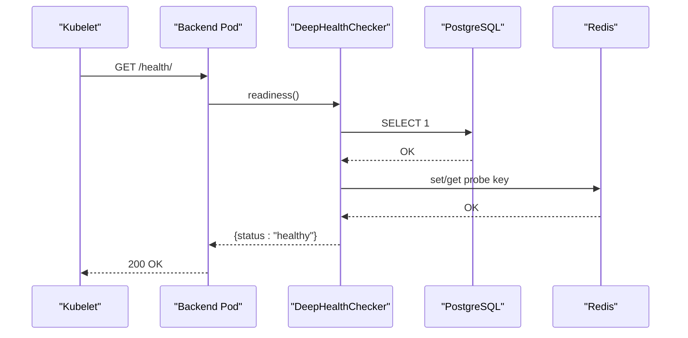
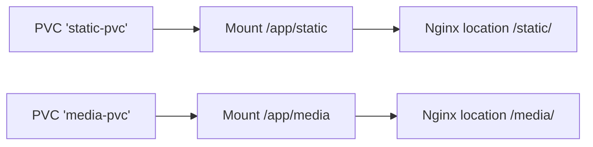
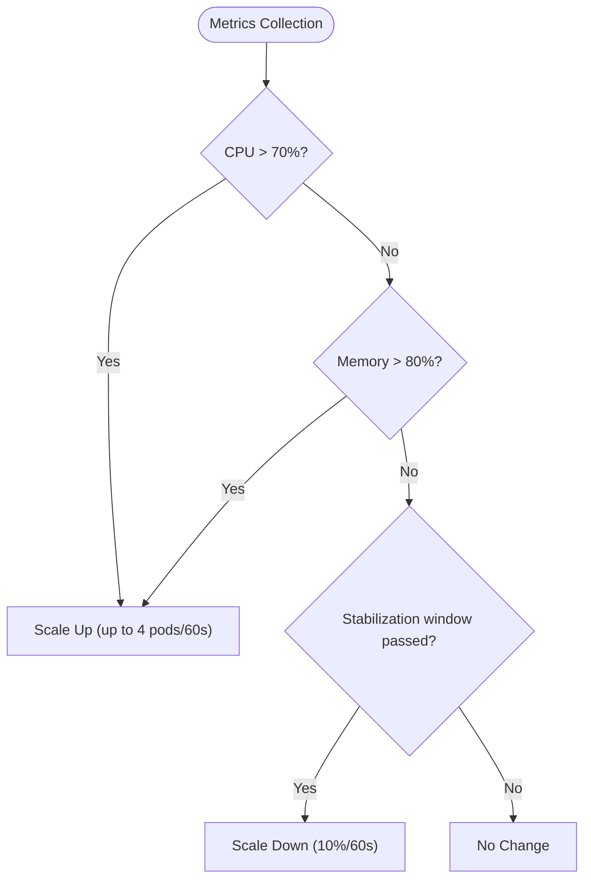
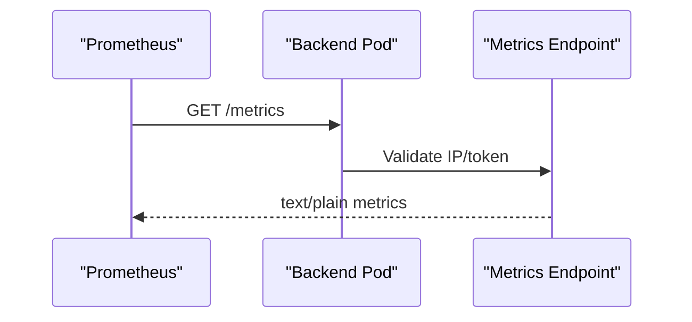
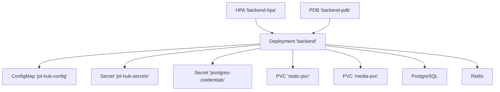

# Backend Django Service

<cite>
**Referenced Files in This Document**
- [backend.yaml](file://infra/kubernetes/apps/backend.yaml)
- [backend.yaml (Helm)](file://infra/helm/jol-hub/templates/backend.yaml)
- [values.yaml](file://infra/helm/jol-hub/values.yaml)
- [Dockerfile](file://backend/Dockerfile)
- [configmap.yaml](file://infra/kubernetes/base/configmap.yaml)
- [secrets.yaml](file://infra/kubernetes/base/secrets.yaml)
- [health.py](file://backend/django/apps/core/health.py)
- [metrics_endpoint.py](file://backend/django/apps/core/metrics_endpoint.py)
- [production.py](file://backend/django/core/settings/production.py)
- [prometheus.yaml](file://infra/kubernetes/monitoring/prometheus.yaml)
- [servicemonitor.yaml](file://infra/helm/jol-hub/templates/servicemonitor.yaml)
</cite>

## Table of Contents
1. [Introduction](#introduction)
2. [Project Structure](#project-structure)
3. [Core Components](#core-components)
4. [Architecture Overview](#architecture-overview)
5. [Detailed Component Analysis](#detailed-component-analysis)
6. [Dependency Analysis](#dependency-analysis)
7. [Performance Considerations](#performance-considerations)
8. [Troubleshooting Guide](#troubleshooting-guide)
9. [Conclusion](#conclusion)
10. [Appendices](#appendices)

## Introduction
This document provides comprehensive deployment documentation for the JOL-HUB Django backend service on Kubernetes. It covers replica management, rolling updates, resource allocation, init containers for database migrations, health checks via readiness and liveness probes, persistent volume mounts for static and media assets, HorizontalPodAutoscaler configuration, PodDisruptionBudget settings, Prometheus metrics collection, and operational guidance for troubleshooting and performance tuning.

## Project Structure
The backend is deployed using both raw Kubernetes manifests and a Helm chart:
- Raw manifests define the Deployment, Service, HPA, and PDB for the backend.
- The Helm chart templated version exposes values for replicas, resources, autoscaling, and PDB.
- Environment variables are injected from ConfigMaps and Secrets; database credentials are provided via a dedicated Secret.
- Persistent volumes are mounted for static files and media uploads.
- Prometheus annotations enable automatic scraping of application metrics.

**Diagram sources**
- [backend.yaml:1-204](file://infra/kubernetes/apps/backend.yaml#L1-L204)
- [configmap.yaml:1-198](file://infra/kubernetes/base/configmap.yaml#L1-L198)
- [secrets.yaml:1-88](file://infra/kubernetes/base/secrets.yaml#L1-L88)

**Section sources**
- [backend.yaml:1-204](file://infra/kubernetes/apps/backend.yaml#L1-L204)
- [backend.yaml (Helm):1-152](file://infra/helm/jol-hub/templates/backend.yaml#L1-L152)
- [values.yaml:1-264](file://infra/helm/jol-hub/values.yaml#L1-L264)

## Core Components
- Deployment: Defines replicas, rolling update strategy, security context, init container, main container, environment injection, probes, resources, and volume mounts.
- Service: Exposes port 8000 as ClusterIP for internal routing.
- HorizontalPodAutoscaler: Scales based on CPU and memory utilization with defined min/max replicas and behavior policies.
- PodDisruptionBudget: Ensures minimum availability during voluntary disruptions.
- Init Container: Runs database migrations before the app starts.
- Health Probes: Readiness and liveness probe against /health/.
- Metrics: Prometheus annotations configure scraping of /metrics.

Key configuration highlights:
- Replicas: 3 default; HPA minReplicas: 3, maxReplicas: 20.
- RollingUpdate: maxSurge 1, maxUnavailable 0.
- Resources: Requests and limits set for both init and main containers.
- Environment: Injected from ConfigMap and Secrets; DATABASE_URL sourced from postgres-credentials secret.
- Volumes: static-pvc and media-pvc mounted at /app/static and /app/media.

**Section sources**
- [backend.yaml:1-204](file://infra/kubernetes/apps/backend.yaml#L1-L204)
- [backend.yaml (Helm):1-152](file://infra/helm/jol-hub/templates/backend.yaml#L1-L152)
- [values.yaml:19-47](file://infra/helm/jol-hub/values.yaml#L19-L47)

## Architecture Overview
The backend runs behind an ingress/proxy that serves static and media content and proxies API requests to the Django service. Health endpoints are exposed for Kubernetes probes and external monitoring. Prometheus scrapes metrics from pods annotated for scraping.

**Diagram sources**
- [backend.yaml:62-117](file://infra/kubernetes/apps/backend.yaml#L62-L117)
- [health.py:55-99](file://backend/django/apps/core/health.py#L55-L99)
- [configmap.yaml:107-198](file://infra/kubernetes/base/configmap.yaml#L107-L198)

## Detailed Component Analysis

### Deployment Configuration
- Replicas: Set to 3 to ensure high availability.
- Rolling Update Strategy: RollingUpdate with maxSurge=1 and maxUnavailable=0 to maintain zero-downtime deployments.
- Security Context: Non-root user with restricted filesystem group.
- Init Container: Executes database migrations prior to starting the application.
- Main Container: Runs Gunicorn serving Django on port 8000.
- Environment Injection:
  - envFrom includes ConfigMap and Secrets.
  - DATABASE_URL is explicitly sourced from postgres-credentials secret.
  - REDIS_URL is set inline for Redis connectivity.
- Resource Allocation:
  - Init container: requests 100m CPU, 256Mi memory; limits 500m CPU, 512Mi memory.
  - Main container: requests 250m CPU, 512Mi memory; limits 1000m CPU, 1Gi memory.
- Volume Mounts:
  - static-volume mounted at /app/static.
  - media-volume mounted at /app/media.
- Affinity: Preferred anti-affinity by hostname to spread pods across nodes.

**Diagram sources**
- [backend.yaml:38-117](file://infra/kubernetes/apps/backend.yaml#L38-L117)

**Section sources**
- [backend.yaml:1-204](file://infra/kubernetes/apps/backend.yaml#L1-L204)
- [backend.yaml (Helm):1-152](file://infra/helm/jol-hub/templates/backend.yaml#L1-L152)

### Init Container Setup for Database Migrations
- Command: python manage.py migrate --noinput
- Environment:
  - envFrom references jol-hub-config ConfigMap and jol-hub-secrets Secret.
  - DATABASE_URL sourced from postgres-credentials secret key POSTGRES_URL.
- Purpose: Ensures schema is up-to-date before accepting traffic.

**Section sources**
- [backend.yaml:38-60](file://infra/kubernetes/apps/backend.yaml#L38-L60)
- [secrets.yaml:48-61](file://infra/kubernetes/base/secrets.yaml#L48-L61)

### Health Check Configuration (/health/)
- Readiness Probe: HTTP GET /health/, initialDelaySeconds=10, periodSeconds=5, timeoutSeconds=3, successThreshold=1, failureThreshold=3.
- Liveness Probe: HTTP GET /health/, initialDelaySeconds=30, periodSeconds=15, timeoutSeconds=5, failureThreshold=3.
- Application Health Logic:
  - Liveness checks database connectivity with lightweight query.
  - Readiness checks database and cache (Redis) availability.
  - Deep health includes Celery broker connectivity.

**Diagram sources**
- [backend.yaml:82-98](file://infra/kubernetes/apps/backend.yaml#L82-L98)
- [health.py:55-99](file://backend/django/apps/core/health.py#L55-L99)

**Section sources**
- [backend.yaml:82-98](file://infra/kubernetes/apps/backend.yaml#L82-L98)
- [health.py:55-99](file://backend/django/apps/core/health.py#L55-L99)

### Persistent Volume Mounts for Static Files and Media Uploads
- Volumes:
  - static-volume backed by PVC static-pvc.
  - media-volume backed by PVC media-pvc.
- Mount Paths:
  - /app/static for static assets.
  - /app/media for uploaded media.
- Nginx Proxy:
  - Serves /static/ and /media/ directly from mounted paths with appropriate caching headers.

**Diagram sources**
- [backend.yaml:106-117](file://infra/kubernetes/apps/backend.yaml#L106-L117)
- [configmap.yaml:140-152](file://infra/kubernetes/base/configmap.yaml#L140-L152)

**Section sources**
- [backend.yaml:106-117](file://infra/kubernetes/apps/backend.yaml#L106-L117)
- [configmap.yaml:140-152](file://infra/kubernetes/base/configmap.yaml#L140-L152)

### HorizontalPodAutoscaler Configuration
- Target: Deployment named backend.
- Min/Max Replicas: 3 to 20.
- Metrics:
  - CPU averageUtilization target: 70%.
  - Memory averageUtilization target: 80%.
- Behavior:
  - ScaleUp stabilizationWindowSeconds: 60; policy adds up to 4 pods per 60 seconds.
  - ScaleDown stabilizationWindowSeconds: 300; policy reduces by 10% per 60 seconds.

**Diagram sources**
- [backend.yaml:148-188](file://infra/kubernetes/apps/backend.yaml#L148-L188)

**Section sources**
- [backend.yaml:148-188](file://infra/kubernetes/apps/backend.yaml#L148-L188)
- [values.yaml:37-47](file://infra/helm/jol-hub/values.yaml#L37-L47)

### PodDisruptionBudget Settings
- Minimum Available: 2 pods.
- Selector: Matches backend component labels to protect during voluntary disruptions (e.g., node drains).

**Section sources**
- [backend.yaml:190-204](file://infra/kubernetes/apps/backend.yaml#L190-L204)
- [values.yaml:44-47](file://infra/helm/jol-hub/values.yaml#L44-L47)

### Prometheus Metrics Collection
- Annotations: Pods annotated with prometheus.io/scrape=true, port=8000, path=/metrics.
- Metrics Endpoint:
  - IP allowlist and optional bearer token protection.
  - Supports multi-process mode via multiprocess collector directory.
- Prometheus Stack:
  - Scrape config targets pods labeled with component=backend and annotation prometheus.io/scrape=true.
  - ServiceMonitor template enables Prometheus Operator integration when enabled.

**Diagram sources**
- [backend.yaml:28-31](file://infra/kubernetes/apps/backend.yaml#L28-L31)
- [metrics_endpoint.py:88-153](file://backend/django/apps/core/metrics_endpoint.py#L88-L153)
- [prometheus.yaml:126-140](file://infra/kubernetes/monitoring/prometheus.yaml#L126-L140)
- [servicemonitor.yaml:1-20](file://infra/helm/jol-hub/templates/servicemonitor.yaml#L1-L20)

**Section sources**
- [backend.yaml:28-31](file://infra/kubernetes/apps/backend.yaml#L28-L31)
- [metrics_endpoint.py:88-153](file://backend/django/apps/core/metrics_endpoint.py#L88-L153)
- [prometheus.yaml:126-140](file://infra/kubernetes/monitoring/prometheus.yaml#L126-L140)
- [servicemonitor.yaml:1-20](file://infra/helm/jol-hub/templates/servicemonitor.yaml#L1-L20)

## Dependency Analysis
- Deployment depends on:
  - ConfigMap jol-hub-config for non-sensitive settings.
  - Secrets jol-hub-secrets and postgres-credentials for sensitive data.
  - PVCs static-pvc and media-pvc for persistent storage.
  - PostgreSQL and Redis services for data and caching.
- Health checks depend on:
  - Database connectivity (liveness/readiness).
  - Redis connectivity (readiness/deep health).
- Autoscaling depends on:
  - Metrics server providing CPU/memory utilization.
- Monitoring depends on:
  - Prometheus scraping configured via annotations or ServiceMonitor.

**Diagram sources**
- [backend.yaml:1-204](file://infra/kubernetes/apps/backend.yaml#L1-L204)

**Section sources**
- [backend.yaml:1-204](file://infra/kubernetes/apps/backend.yaml#L1-L204)

## Performance Considerations
- Connection Pooling:
  - Production settings enable connection pooling with a max age for database connections.
- Static File Serving:
  - WhiteNoise storage class used for compressed manifest static files.
- Gunicorn Workers:
  - Dockerfile defaults to multiple workers and threads; tune based on CPU cores and workload.
- Resource Requests/Limits:
  - Ensure requests align with typical load to avoid throttling; limits prevent noisy neighbor issues.
- Autoscaling Policies:
  - Tune stabilization windows and scaling policies to match traffic patterns and minimize oscillation.
- Storage:
  - Use appropriate storage classes and sizes for PVCs; consider offloading large media to object storage where applicable.

[No sources needed since this section provides general guidance]

## Troubleshooting Guide
Common issues and resolutions:
- Migration failures:
  - Verify DATABASE_URL is correctly injected from postgres-credentials secret.
  - Check init container logs for migration errors.
- Health check failures:
  - Confirm database and Redis connectivity from within the pod.
  - Review readiness/liveness thresholds and timeouts.
- Scaling not triggered:
  - Ensure metrics server is available and HPA has correct target references.
  - Validate CPU/memory requests/limits and actual utilization.
- Disruptions blocked:
  - Check PDB constraints; ensure minAvailable can be satisfied.
- Metrics not scraped:
  - Verify pod annotations and Prometheus scrape configs.
  - If using ServiceMonitor, confirm it matches labels and endpoint path.

Operational checks:
- Inspect pod events and describe resources for scheduling issues.
- Review logs for application errors and health check responses.
- Validate secrets and configmaps exist and contain expected keys.

**Section sources**
- [backend.yaml:38-98](file://infra/kubernetes/apps/backend.yaml#L38-L98)
- [health.py:55-99](file://backend/django/apps/core/health.py#L55-L99)
- [metrics_endpoint.py:88-153](file://backend/django/apps/core/metrics_endpoint.py#L88-L153)

## Conclusion
The JOL-HUB Django backend is deployed with robust configurations for high availability, scalability, and observability. Replica management, rolling updates, resource allocation, init containers for migrations, health probes, persistent storage, autoscaling, and disruption budgets collectively ensure reliable operation. Prometheus-based monitoring provides visibility into application and infrastructure metrics. Following the troubleshooting and performance recommendations will help maintain optimal uptime and responsiveness.

[No sources needed since this section summarizes without analyzing specific files]

## Appendices

### Environment Variables Summary
- From ConfigMap jol-hub-config:
  - Application settings, CORS, CSRF, database host/port/name, Redis host/port, Celery broker/result backend, GDPR flags, email settings, feature flags, rate limiting.
- From Secrets jol-hub-secrets:
  - Django secret key, database credentials, Redis password, payment provider credentials, Bitrix24 OAuth, email credentials, Sentry DSN, MFA settings.
- Explicitly injected:
  - DATABASE_URL from postgres-credentials secret.
  - REDIS_URL set inline for Redis connectivity.

**Section sources**
- [configmap.yaml:12-49](file://infra/kubernetes/base/configmap.yaml#L12-L49)
- [secrets.yaml:16-47](file://infra/kubernetes/base/secrets.yaml#L16-L47)
- [backend.yaml:69-81](file://infra/kubernetes/apps/backend.yaml#L69-L81)

### Docker Image and Runtime
- Multi-stage build with slim Python base image.
- Non-root user execution.
- Healthcheck defined in Dockerfile targeting /health/.
- Default command runs Gunicorn with multiple workers and threads.

**Section sources**
- [Dockerfile:1-72](file://backend/Dockerfile#L1-L72)

### Production Settings Highlights
- Security: HTTPS enforcement, secure cookies, HSTS, CSP-related headers.
- Database: SSL required, connection pooling enabled.
- Caching: Timeout configured.
- REST Framework: JSON-only renderer, stricter throttle rates.
- Static Files: WhiteNoise compression and manifest storage.

**Section sources**
- [production.py:18-122](file://backend/django/core/settings/production.py#L18-L122)