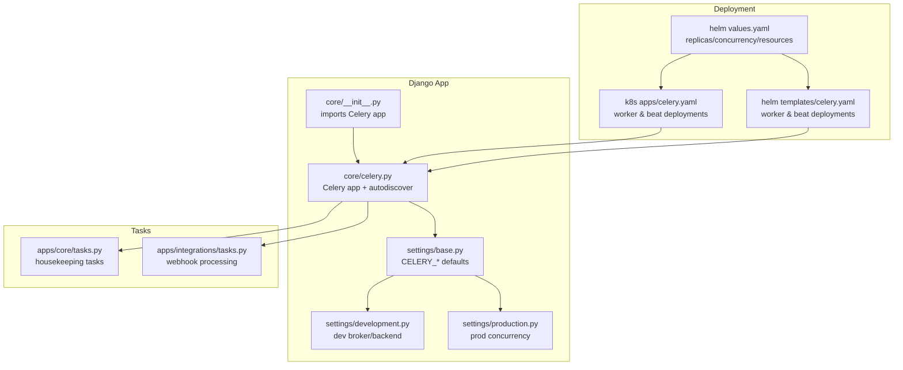
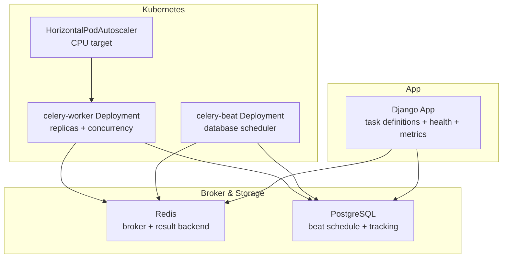
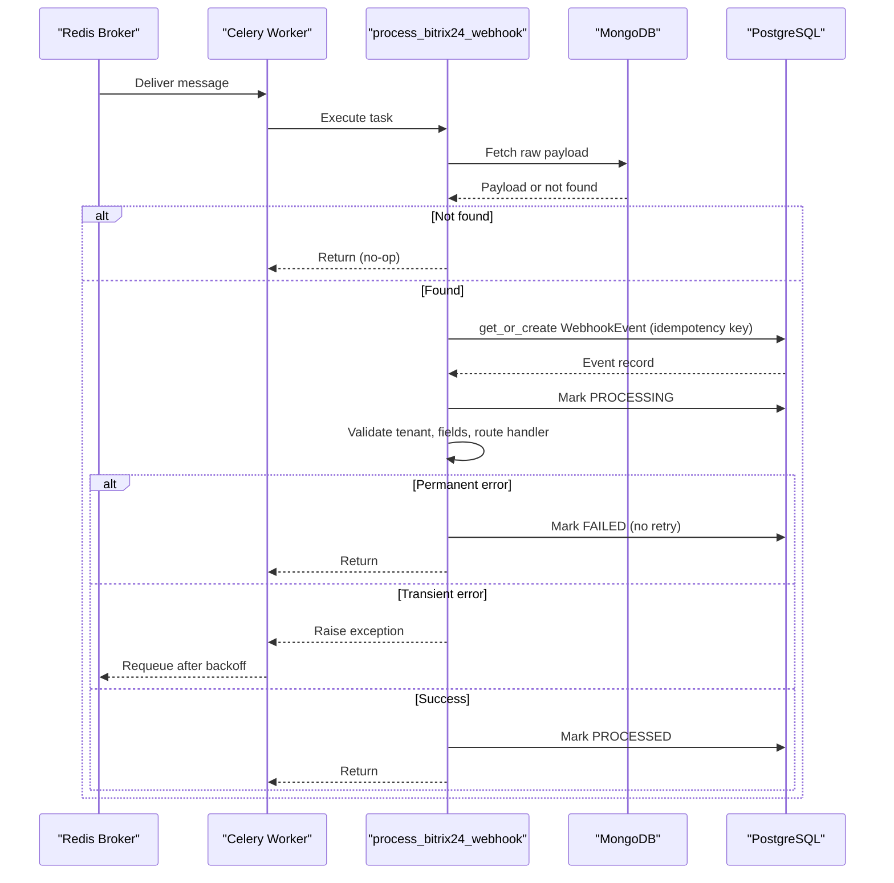
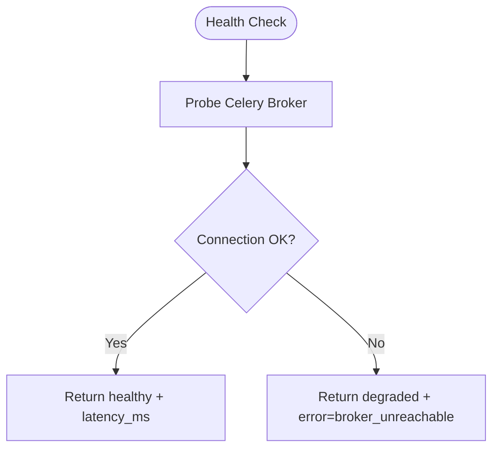
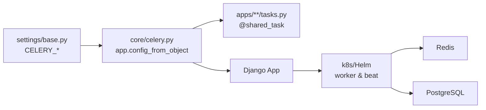

# Celery Worker Deployments

<cite>
**Referenced Files in This Document**
- [celery.py](file://backend/django/core/celery.py)
- [__init__.py](file://backend/django/core/__init__.py)
- [base.py](file://backend/django/core/settings/base.py)
- [development.py](file://backend/django/core/settings/development.py)
- [production.py](file://backend/django/core/settings/production.py)
- [tasks.py](file://backend/django/apps/core/tasks.py)
- [integrations_tasks.py](file://backend/django/apps/integrations/tasks.py)
- [health.py](file://backend/django/apps/core/health.py)
- [metrics_endpoint.py](file://backend/django/apps/core/metrics_endpoint.py)
- [celery.yaml (Helm)](file://infra/helm/jol-hub/templates/celery.yaml)
- [values.yaml](file://infra/helm/jol-hub/values.yaml)
- [celery.yaml (Kubernetes)](file://infra/kubernetes/apps/celery.yaml)
</cite>

## Table of Contents
1. Introduction
2. Project Structure
3. Core Components
4. Architecture Overview
5. Detailed Component Analysis
6. Dependency Analysis
7. Performance Considerations
8. Troubleshooting Guide
9. Conclusion
10. Appendices

## Introduction
This document provides comprehensive guidance for deploying and operating JOL-HUB Celery workers in Kubernetes and Helm-based environments. It covers worker pod configuration, task queues, concurrency, resource allocation, autoscaling strategies, process management, graceful shutdown, error handling, monitoring, debugging, best practices for idempotent tasks, and scaling recommendations for high-volume workloads.

## Project Structure
JOL-HUB uses a Django application with Celery for background processing. The Celery app is initialized in the Django core package and configured via Django settings. Workers and beat are deployed as separate Kubernetes resources or via Helm templates.

**Diagram sources**
- [__init__.py:1-8](file://backend/django/core/__init__.py#L1-L8)
- [celery.py:1-32](file://backend/django/core/celery.py#L1-L32)
- [base.py:361-386](file://backend/django/core/settings/base.py#L361-L386)
- [development.py:85-88](file://backend/django/core/settings/development.py#L85-L88)
- [production.py:74-79](file://backend/django/core/settings/production.py#L74-L79)
- [tasks.py:1-25](file://backend/django/apps/core/tasks.py#L1-L25)
- [integrations_tasks.py:1-132](file://backend/django/apps/integrations/tasks.py#L1-L132)
- [celery.yaml (Kubernetes):1-130](file://infra/kubernetes/apps/celery.yaml#L1-L130)
- [celery.yaml (Helm):1-105](file://infra/helm/jol-hub/templates/celery.yaml#L1-L105)
- [values.yaml:102-139](file://infra/helm/jol-hub/values.yaml#L102-L139)

**Section sources**
- [celery.py:1-32](file://backend/django/core/celery.py#L1-L32)
- [__init__.py:1-8](file://backend/django/core/__init__.py#L1-L8)
- [base.py:361-386](file://backend/django/core/settings/base.py#L361-L386)
- [development.py:85-88](file://backend/django/core/settings/development.py#L85-L88)
- [production.py:74-79](file://backend/django/core/settings/production.py#L74-L79)
- [tasks.py:1-25](file://backend/django/apps/core/tasks.py#L1-L25)
- [integrations_tasks.py:1-132](file://backend/django/apps/integrations/tasks.py#L1-L132)
- [celery.yaml (Kubernetes):1-130](file://infra/kubernetes/apps/celery.yaml#L1-L130)
- [celery.yaml (Helm):1-105](file://infra/helm/jol-hub/templates/celery.yaml#L1-L105)
- [values.yaml:102-139](file://infra/helm/jol-hub/values.yaml#L102-L139)

## Core Components
- Celery application initialization and task discovery
- Django settings for broker, result backend, serialization, time limits, prefetch multiplier, and concurrency
- Worker and beat deployment manifests (Kubernetes and Helm)
- Task modules for housekeeping and webhook processing with robust error handling and retries
- Health checks for broker connectivity
- Prometheus metrics endpoint for observability

**Section sources**
- [celery.py:1-32](file://backend/django/core/celery.py#L1-L32)
- [base.py:361-386](file://backend/django/core/settings/base.py#L361-L386)
- [development.py:85-88](file://backend/django/core/settings/development.py#L85-L88)
- [production.py:74-79](file://backend/django/core/settings/production.py#L74-L79)
- [tasks.py:1-25](file://backend/django/apps/core/tasks.py#L1-L25)
- [integrations_tasks.py:1-132](file://backend/django/apps/integrations/tasks.py#L1-L132)
- [health.py:185-212](file://backend/django/apps/core/health.py#L185-L212)
- [metrics_endpoint.py:1-154](file://backend/django/apps/core/metrics_endpoint.py#L1-L154)
- [celery.yaml (Kubernetes):1-130](file://infra/kubernetes/apps/celery.yaml#L1-L130)
- [celery.yaml (Helm):1-105](file://infra/helm/jol-hub/templates/celery.yaml#L1-L105)
- [values.yaml:102-139](file://infra/helm/jol-hub/values.yaml#L102-L139)

## Architecture Overview
The system deploys Celery workers and beat alongside the Django application. Workers consume tasks from a Redis broker and store results in Redis. Autoscaling is driven by CPU utilization via HorizontalPodAutoscaler. Beat schedules periodic tasks using a database-backed scheduler.

**Diagram sources**
- [celery.yaml (Kubernetes):1-130](file://infra/kubernetes/apps/celery.yaml#L1-L130)
- [celery.yaml (Helm):1-105](file://infra/helm/jol-hub/templates/celery.yaml#L1-L105)
- [base.py:361-386](file://backend/django/core/settings/base.py#L361-L386)
- [health.py:185-212](file://backend/django/apps/core/health.py#L185-L212)

**Section sources**
- [celery.yaml (Kubernetes):1-130](file://infra/kubernetes/apps/celery.yaml#L1-L130)
- [celery.yaml (Helm):1-105](file://infra/helm/jol-hub/templates/celery.yaml#L1-L105)
- [base.py:361-386](file://backend/django/core/settings/base.py#L361-L386)
- [health.py:185-212](file://backend/django/apps/core/health.py#L185-L212)

## Detailed Component Analysis

### Celery Application and Settings
- The Celery app is created and configured from Django settings under the CELERY_ namespace. Tasks are auto-discovered across installed apps.
- Broker and result backend default to Redis; development overrides may be used locally.
- Time limit per task, prefetch multiplier, and concurrency are set in base settings and can be overridden per environment.

Key behaviors:
- Autodiscovery ensures all @shared_task decorators are registered.
- Prefetch multiplier set to 1 prevents workers from pulling multiple messages ahead, improving fairness and responsiveness.
- Task time limit guards against long-running tasks.

**Section sources**
- [celery.py:1-32](file://backend/django/core/celery.py#L1-L32)
- [base.py:361-386](file://backend/django/core/settings/base.py#L361-L386)
- [development.py:85-88](file://backend/django/core/settings/development.py#L85-L88)
- [production.py:74-79](file://backend/django/core/settings/production.py#L74-L79)

### Worker Pod Configuration and Concurrency
- Worker command sets logging level and concurrency via CLI flag.
- Resources (requests/limits) are defined to ensure scheduling and QoS.
- Environment variables inject broker URL and result backend.

Configuration highlights:
- Concurrency is passed explicitly on the worker command line in both Helm and Kubernetes manifests.
- Resource requests and limits are tuned to balance throughput and node pressure.

**Section sources**
- [celery.yaml (Helm):25-36](file://infra/helm/jol-hub/templates/celery.yaml#L25-L36)
- [celery.yaml (Kubernetes):29-55](file://infra/kubernetes/apps/celery.yaml#L29-L55)
- [values.yaml:102-127](file://infra/helm/jol-hub/values.yaml#L102-L127)

### Autoscaling Strategy
- HorizontalPodAutoscaler scales the worker Deployment based on CPU utilization targets.
- Min/max replicas define the scaling bounds.

Operational notes:
- Tune CPU target and replica bounds according to workload characteristics.
- For queue-depth-driven scaling, consider adding custom metrics (e.g., queue length) if available in your cluster.

**Section sources**
- [celery.yaml (Kubernetes):108-130](file://infra/kubernetes/apps/celery.yaml#L108-L130)
- [celery.yaml (Helm):39-63](file://infra/helm/jol-hub/templates/celery.yaml#L39-L63)
- [values.yaml:122-127](file://infra/helm/jol-hub/values.yaml#L122-L127)

### Scheduled Tasks (Beat)
- Beat runs with a database-backed scheduler to execute periodic tasks.
- Sample scheduled tasks include digest sending, session cleanup, and recurring donation processing.

**Section sources**
- [celery.yaml (Kubernetes):57-106](file://infra/kubernetes/apps/celery.yaml#L57-L106)
- [celery.yaml (Helm):66-104](file://infra/helm/jol-hub/templates/celery.yaml#L66-L104)
- [base.py:372-386](file://backend/django/core/settings/base.py#L372-L386)

### Task Execution Flow and Error Handling
The Bitrix24 webhook processing task demonstrates robust patterns:
- Idempotency via unique keys and early-exit checks prevent double-processing.
- Transient errors trigger autoretry with backoff and jitter; permanent errors mark tasks as failed without retry.
- Structured audit logs capture state transitions for compliance.

**Diagram sources**
- [integrations_tasks.py:93-295](file://backend/django/apps/integrations/tasks.py#L93-L295)

**Section sources**
- [integrations_tasks.py:1-132](file://backend/django/apps/integrations/tasks.py#L1-L132)
- [integrations_tasks.py:93-295](file://backend/django/apps/integrations/tasks.py#L93-L295)

### Monitoring and Health
- Health check probes verify broker reachability and report latency.
- Prometheus metrics endpoint exposes standard metrics with IP allowlist and optional bearer token protection.

**Diagram sources**
- [health.py:185-212](file://backend/django/apps/core/health.py#L185-L212)

**Section sources**
- [health.py:185-212](file://backend/django/apps/core/health.py#L185-L212)
- [metrics_endpoint.py:1-154](file://backend/django/apps/core/metrics_endpoint.py#L1-L154)

### Process Management and Graceful Shutdown
- Workers run as containers managed by Kubernetes; restart policies and liveness/readiness probes should be configured at the platform level.
- Use Celery’s built-in signals and task timeouts to handle graceful shutdowns and avoid partial work during rolling updates.
- Ensure tasks are designed to be interruptible and safe to resume or re-run safely.

[No sources needed since this section provides general operational guidance]

### Debugging Long-Running Tasks, Timeouts, and Retries
- Inspect task logs and structured audit entries for state transitions and errors.
- Verify task time limits and adjust as needed based on workload profiles.
- For transient failures, rely on autoretry with exponential backoff and jitter; for permanent data issues, mark as failed and investigate inputs.

**Section sources**
- [integrations_tasks.py:19-36](file://backend/django/apps/integrations/tasks.py#L19-L36)
- [integrations_tasks.py:93-132](file://backend/django/apps/integrations/tasks.py#L93-L132)
- [base.py:367-370](file://backend/django/core/settings/base.py#L367-L370)

### Best Practices for Task Design and Data Consistency
- Make tasks idempotent using unique keys and upsert operations.
- Separate transient vs permanent errors to control retry behavior.
- Log structured audit records for critical state changes without including PII.
- Keep tasks focused and bounded; decompose large jobs into smaller steps where possible.

**Section sources**
- [integrations_tasks.py:107-132](file://backend/django/apps/integrations/tasks.py#L107-L132)
- [integrations_tasks.py:171-201](file://backend/django/apps/integrations/tasks.py#L171-L201)
- [integrations_tasks.py:240-295](file://backend/django/apps/integrations/tasks.py#L240-L295)

## Dependency Analysis
Celery depends on Django settings for broker/backend configuration and discovers tasks across apps. Deployment manifests inject environment variables and configure resources and autoscaling.

**Diagram sources**
- [base.py:361-386](file://backend/django/core/settings/base.py#L361-L386)
- [celery.py:1-32](file://backend/django/core/celery.py#L1-L32)
- [celery.yaml (Kubernetes):1-130](file://infra/kubernetes/apps/celery.yaml#L1-L130)
- [celery.yaml (Helm):1-105](file://infra/helm/jol-hub/templates/celery.yaml#L1-L105)

**Section sources**
- [base.py:361-386](file://backend/django/core/settings/base.py#L361-L386)
- [celery.py:1-32](file://backend/django/core/celery.py#L1-L32)
- [celery.yaml (Kubernetes):1-130](file://infra/kubernetes/apps/celery.yaml#L1-L130)
- [celery.yaml (Helm):1-105](file://infra/helm/jol-hub/templates/celery.yaml#L1-L105)

## Performance Considerations
- Set CELERY_WORKER_PREFETCH_MULTIPLIER to 1 to improve fairness and reduce memory spikes.
- Tune CELERY_TASK_TIME_LIMIT to match expected task durations; monitor for timeouts.
- Adjust worker concurrency and CPU/memory requests/limits based on observed utilization and latency.
- Use autoscaling to respond to load spikes; consider custom metrics for queue depth if supported.
- Monitor broker latency and connection health via health checks.

[No sources needed since this section provides general guidance]

## Troubleshooting Guide
Common issues and remedies:
- Broker unreachable: Health check returns degraded; verify Redis connectivity and network policies.
- High CPU or memory usage: Increase resource limits, tune concurrency, or scale out workers.
- Frequent retries: Identify transient vs permanent errors; fix data issues for permanent errors; adjust retry parameters for transient ones.
- Metrics access denied: Ensure Prometheus IPs are allowed and bearer token matches if enabled.

**Section sources**
- [health.py:185-212](file://backend/django/apps/core/health.py#L185-L212)
- [metrics_endpoint.py:95-129](file://backend/django/apps/core/metrics_endpoint.py#L95-L129)
- [integrations_tasks.py:19-36](file://backend/django/apps/integrations/tasks.py#L19-L36)

## Conclusion
JOL-HUB’s Celery setup provides a solid foundation for reliable background processing with clear separation of concerns between application logic, deployment configuration, and observability. By tuning concurrency, resources, and autoscaling, and by following idempotency and error-handling best practices, teams can achieve predictable performance and resilience under varying loads.

[No sources needed since this section summarizes without analyzing specific files]

## Appendices

### Worker Pod Configuration Reference
- Command-line flags: logging level and concurrency
- Environment variables: broker URL, result backend, database URL
- Resources: requests and limits for CPU and memory
- Autoscaling: min/max replicas and CPU target

**Section sources**
- [celery.yaml (Kubernetes):29-55](file://infra/kubernetes/apps/celery.yaml#L29-L55)
- [celery.yaml (Helm):25-36](file://infra/helm/jol-hub/templates/celery.yaml#L25-L36)
- [values.yaml:102-127](file://infra/helm/jol-hub/values.yaml#L102-L127)
- [celery.yaml (Kubernetes):108-130](file://infra/kubernetes/apps/celery.yaml#L108-L130)

### Scaling Recommendations for High-Volume Scenarios
- Start with conservative concurrency and gradually increase while monitoring CPU and memory.
- Enable autoscaling with appropriate CPU thresholds; add custom metrics for queue depth if available.
- Partition workloads across dedicated queues if necessary to isolate hot paths.
- Regularly review task time limits and optimize slow tasks.

[No sources needed since this section provides general guidance]