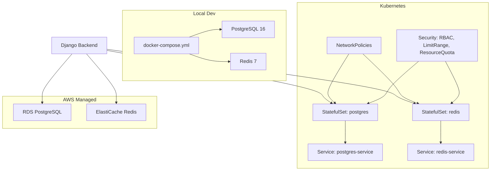
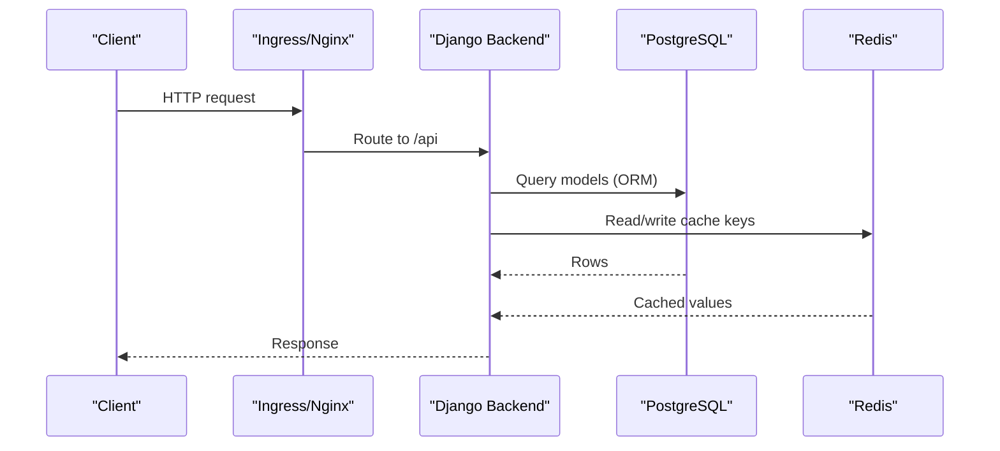
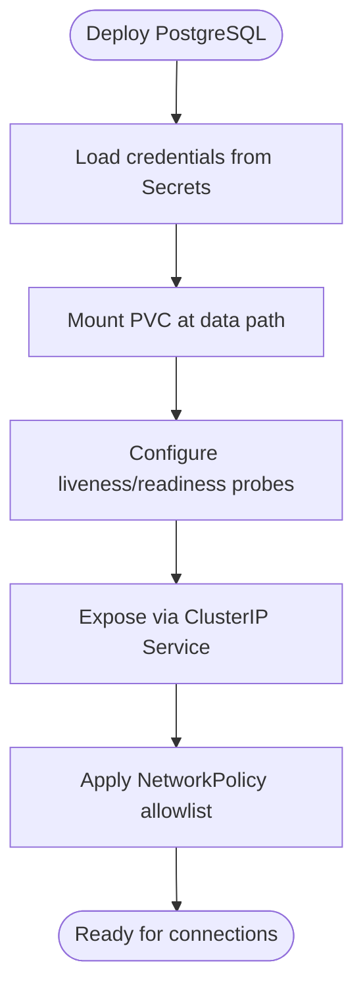
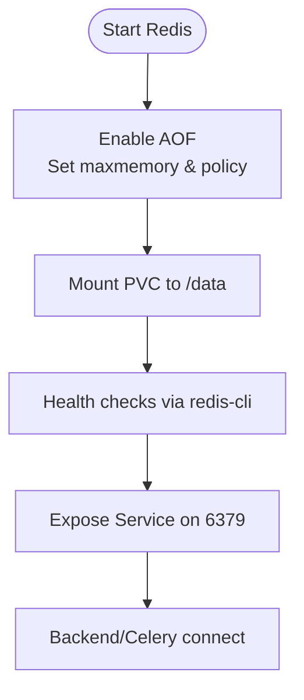
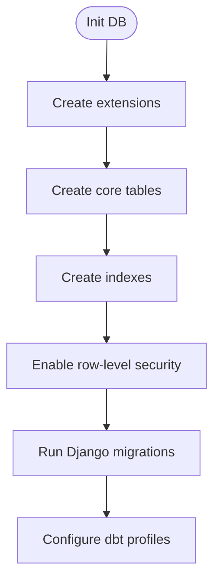
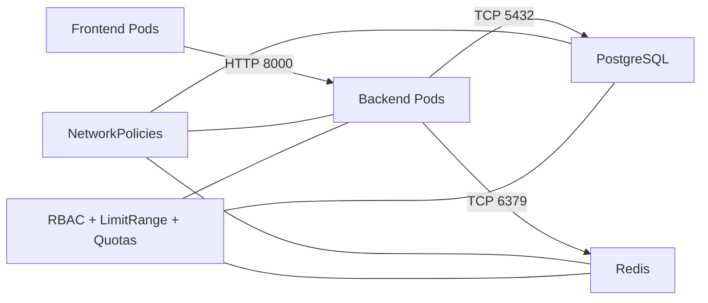
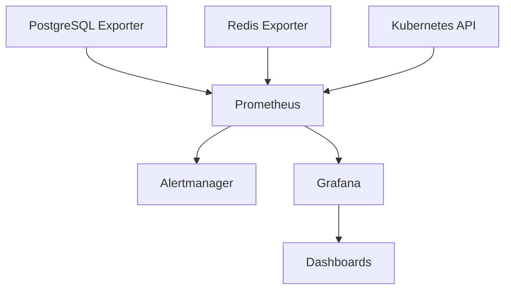
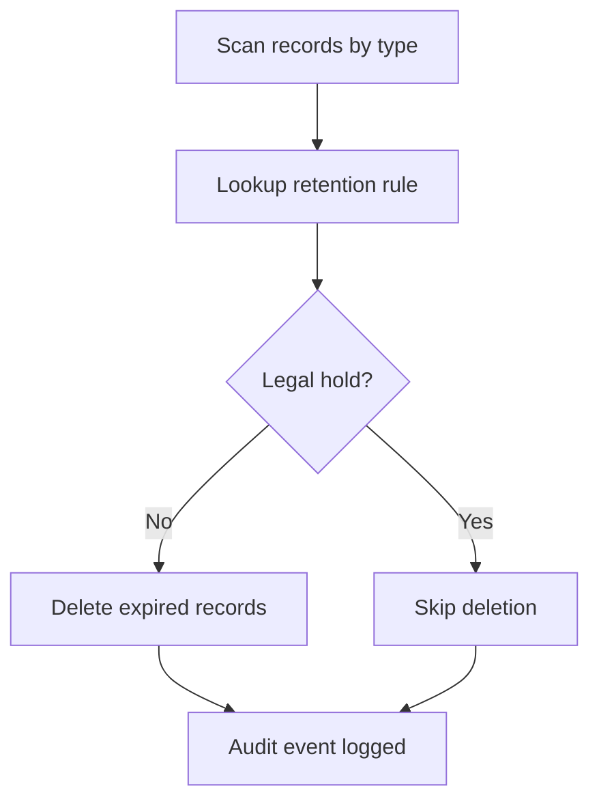
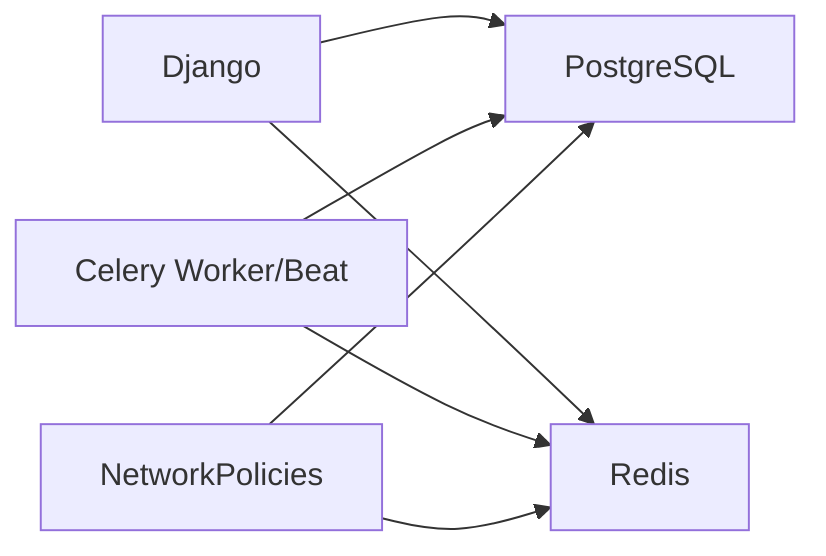

# Database Services

<cite>
**Referenced Files in This Document**
- [docker-compose.yml](file://docker-compose.yml)
- [database.yaml](file://infra/kubernetes/apps/database.yaml)
- [network-policy.yaml](file://infra/kubernetes/networking/network-policy.yaml)
- [security.yaml](file://infra/kubernetes/security/security.yaml)
- [prometheus.yaml](file://infra/kubernetes/monitoring/prometheus.yaml)
- [grafana.yaml](file://infra/kubernetes/monitoring/grafana.yaml)
- [main.tf (RDS)](file://infra/terraform/modules/database/main.tf)
- [main.tf (ElastiCache)](file://infra/terraform/modules/elasticache/main.tf)
- [base.py (Django settings)](file://backend/django/core/settings/base.py)
- [tasks.py (Celery tasks)](file://backend/django/apps/core/tasks.py)
- [001_initial_schema.sql](file://data/sql/schema_setup/001_initial_schema.sql)
- [profiles.yml (dbt)](file://data/dbt/profiles.yml)
- [retention_manager.py](file://data/src/gdpr/retention_manager.py)
- [config.py (Data module)](file://data/src/config.py)
- [mcp-postgres.py](file://tools/mcp-postgres.py)
</cite>

## Table of Contents
1. Introduction
2. Project Structure
3. Core Components
4. Architecture Overview
5. Detailed Component Analysis
6. Dependency Analysis
7. Performance Considerations
8. Troubleshooting Guide
9. Conclusion
10. Appendices

## Introduction
This document provides comprehensive operational guidance for JOL-HUB database services, focusing on PostgreSQL and Redis deployments across local development and Kubernetes environments, as well as managed AWS RDS and ElastiCache configurations. It covers persistent storage, backup strategies, connection pooling, initialization scripts, migration processes, schema versioning, security controls, monitoring, alerting, backup and recovery procedures, disaster recovery planning, data retention policies, troubleshooting, performance tuning, and capacity planning.

## Project Structure
JOL-HUB deploys databases using multiple layers:
- Local development via Docker Compose with PostgreSQL and Redis
- Kubernetes manifests for StatefulSets, Services, NetworkPolicies, and Security resources
- Terraform modules for AWS RDS (PostgreSQL) and ElastiCache (Redis)
- Django application configuration for caching and session management
- Data pipeline tooling (dbt profiles) and compliance-driven retention logic

**Diagram sources**
- [docker-compose.yml:15-46](file://docker-compose.yml#L15-L46)
- [database.yaml:1-196](file://infra/kubernetes/apps/database.yaml#L1-L196)
- [network-policy.yaml:1-188](file://infra/kubernetes/networking/network-policy.yaml#L1-L188)
- [security.yaml:1-187](file://infra/kubernetes/security/security.yaml#L1-L187)
- [main.tf (RDS):1-233](file://infra/terraform/modules/database/main.tf#L1-L233)
- [main.tf (ElastiCache):76-168](file://infra/terraform/modules/elasticache/main.tf#L76-L168)

**Section sources**
- [docker-compose.yml:15-46](file://docker-compose.yml#L15-L46)
- [database.yaml:1-196](file://infra/kubernetes/apps/database.yaml#L1-L196)
- [network-policy.yaml:1-188](file://infra/kubernetes/networking/network-policy.yaml#L1-L188)
- [security.yaml:1-187](file://infra/kubernetes/security/security.yaml#L1-L187)
- [main.tf (RDS):1-233](file://infra/terraform/modules/database/main.tf#L1-L233)
- [main.tf (ElastiCache):76-168](file://infra/terraform/modules/elasticache/main.tf#L76-L168)

## Core Components
- PostgreSQL:
  - Local dev container with named volume persistence
  - Kubernetes StatefulSet with PersistentVolumeClaim and health probes
  - AWS RDS instance with encryption, parameter group, backups, and CloudWatch alarms
- Redis:
  - Local dev container with named volume persistence
  - Kubernetes StatefulSet with append-only file (AOF), memory limits, and eviction policy
  - AWS ElastiCache replication group with snapshots and CloudWatch alarms
- Application integration:
  - Django cache backend configured to use Redis with connection pool options
  - Celery worker/beat using Redis as broker and Postgres for scheduled tasks
- Data integrity and compliance:
  - Initial schema setup enabling extensions and creating audit/retention tables
  - dbt profile for connecting to PostgreSQL
  - Retention manager enforcing legal holds and retention rules

**Section sources**
- [docker-compose.yml:15-46](file://docker-compose.yml#L15-L46)
- [database.yaml:1-196](file://infra/kubernetes/apps/database.yaml#L1-L196)
- [main.tf (RDS):65-162](file://infra/terraform/modules/database/main.tf#L65-L162)
- [main.tf (ElastiCache):76-168](file://infra/terraform/modules/elasticache/main.tf#L76-L168)
- [base.py (Django settings):392-410](file://backend/django/core/settings/base.py#L392-L410)
- [tasks.py (Celery tasks):1-24](file://backend/django/apps/core/tasks.py#L1-L24)
- [001_initial_schema.sql:1-75](file://data/sql/schema_setup/001_initial_schema.sql#L1-L75)
- [profiles.yml (dbt):1-25](file://data/dbt/profiles.yml#L1-L25)
- [retention_manager.py:78-106](file://data/src/gdpr/retention_manager.py#L78-L106)

## Architecture Overview
The system supports three deployment targets:
- Local development: Docker Compose runs PostgreSQL and Redis with volumes for persistence. The Django app migrates and starts the server.
- Kubernetes: StatefulSets deploy PostgreSQL and Redis with PVCs, Services expose them internally, and NetworkPolicies restrict traffic to only required pods.
- AWS managed: Terraform provisions RDS PostgreSQL and ElastiCache Redis with encryption, backups, monitoring, and alarms.

**Diagram sources**
- [network-policy.yaml:18-76](file://infra/kubernetes/networking/network-policy.yaml#L18-L76)
- [database.yaml:1-104](file://infra/kubernetes/apps/database.yaml#L1-L104)
- [base.py (Django settings):392-410](file://backend/django/core/settings/base.py#L392-L410)

## Detailed Component Analysis

### PostgreSQL Deployment Configuration
- Local development:
  - Container image and environment variables define database name, user, and password
  - Named volume persists data under the default PostgreSQL data directory
  - Health check uses pg_isready for readiness
- Kubernetes:
  - StatefulSet with a single replica, dedicated PVC (gp3), and resource requests/limits
  - Environment sourced from Kubernetes Secrets; PGDATA set to a subdirectory
  - Liveness/readiness probes ensure service availability
  - Service exposes ClusterIP on port 5432
- AWS RDS:
  - Parameter group tuned for Django workloads (connections, logging, buffer sizes)
  - Storage encrypted, auto minor upgrades, maintenance windows, optional Multi-AZ
  - Enhanced monitoring role and CloudWatch alarms for CPU and low storage
  - Credentials stored in AWS Secrets Manager

**Diagram sources**
- [database.yaml:25-104](file://infra/kubernetes/apps/database.yaml#L25-L104)
- [network-policy.yaml:115-151](file://infra/kubernetes/networking/network-policy.yaml#L115-L151)
- [main.tf (RDS):65-162](file://infra/terraform/modules/database/main.tf#L65-L162)

**Section sources**
- [docker-compose.yml:15-33](file://docker-compose.yml#L15-L33)
- [database.yaml:1-104](file://infra/kubernetes/apps/database.yaml#L1-L104)
- [main.tf (RDS):65-162](file://infra/terraform/modules/database/main.tf#L65-L162)

### Redis Deployment for Caching and Sessions
- Local development:
  - Container with named volume for persistence
  - Health check via redis-cli ping
- Kubernetes:
  - StatefulSet with AOF enabled, maxmemory limit, and allkeys-lru eviction
  - PVC for persistence, resource requests/limits, and health probes
  - Service exposes ClusterIP on port 6379
- AWS ElastiCache:
  - Replication group with automatic failover and multi-AZ when >1 cluster
  - Snapshots with configurable retention
  - CloudWatch alarms for memory usage
- Application integration:
  - Django cache backend uses Redis with connection pool size and timeout settings
  - Celery worker/beat use Redis as broker; sessions can be cleaned up by background tasks

**Diagram sources**
- [database.yaml:105-196](file://infra/kubernetes/apps/database.yaml#L105-L196)
- [base.py (Django settings):392-410](file://backend/django/core/settings/base.py#L392-L410)
- [tasks.py (Celery tasks):1-24](file://backend/django/apps/core/tasks.py#L1-L24)
- [main.tf (ElastiCache):76-168](file://infra/terraform/modules/elasticache/main.tf#L76-L168)

**Section sources**
- [docker-compose.yml:35-46](file://docker-compose.yml#L35-L46)
- [database.yaml:105-196](file://infra/kubernetes/apps/database.yaml#L105-L196)
- [base.py (Django settings):392-410](file://backend/django/core/settings/base.py#L392-L410)
- [tasks.py (Celery tasks):1-24](file://backend/django/apps/core/tasks.py#L1-L24)
- [main.tf (ElastiCache):76-168](file://infra/terraform/modules/elasticache/main.tf#L76-L168)

### Database Initialization Scripts, Migrations, and Schema Versioning
- Initial schema:
  - Enables uuid-ossp, pgcrypto, and pg_trgm extensions
  - Creates audit_log, gdpr_requests, retention_records, processing_activities tables
  - Adds indexes and enables row-level security on audit_log
- Django migrations:
  - Django apps maintain their own migrations under each app’s migrations folder
  - Development compose runs migrate on startup
- dbt profiles:
  - Profiles configure PostgreSQL connections for dev/prod with thread counts
- MCP tooling:
  - Read-only PostgreSQL client script enforces SSL and statement timeouts

**Diagram sources**
- [001_initial_schema.sql:1-75](file://data/sql/schema_setup/001_initial_schema.sql#L1-L75)
- [docker-compose.yml:73-80](file://docker-compose.yml#L73-L80)
- [profiles.yml (dbt):1-25](file://data/dbt/profiles.yml#L1-L25)
- [mcp-postgres.py:1-30](file://tools/mcp-postgres.py#L1-L30)

**Section sources**
- [001_initial_schema.sql:1-75](file://data/sql/schema_setup/001_initial_schema.sql#L1-L75)
- [docker-compose.yml:73-80](file://docker-compose.yml#L73-L80)
- [profiles.yml (dbt):1-25](file://data/dbt/profiles.yml#L1-L25)
- [mcp-postgres.py:1-30](file://tools/mcp-postgres.py#L1-L30)

### Security Configurations
- Network policies:
  - Restrict ingress/egress to only necessary components (frontend -> backend, backend -> db/redis, DNS)
- Kubernetes security:
  - Namespace restricted pod security standards
  - RBAC roles and bindings for limited API access
  - External Secrets Operator integrates with AWS Secrets Manager
  - Cert-manager issuers for TLS termination
  - LimitRanges and ResourceQuotas constrain resource usage
- AWS RDS/ElastiCache:
  - Encryption at rest for RDS storage
  - Private networking and security groups
  - Monitoring and alarms via CloudWatch

**Diagram sources**
- [network-policy.yaml:18-188](file://infra/kubernetes/networking/network-policy.yaml#L18-L188)
- [security.yaml:1-187](file://infra/kubernetes/security/security.yaml#L1-L187)
- [main.tf (RDS):111-162](file://infra/terraform/modules/database/main.tf#L111-L162)

**Section sources**
- [network-policy.yaml:18-188](file://infra/kubernetes/networking/network-policy.yaml#L18-L188)
- [security.yaml:1-187](file://infra/kubernetes/security/security.yaml#L1-L187)
- [main.tf (RDS):111-162](file://infra/terraform/modules/database/main.tf#L111-L162)

### Monitoring Setup
- Prometheus stack:
  - Scrapes Kubernetes nodes, pods, and exporters for PostgreSQL and Redis
  - Alertmanager integration and rule files for alerts
- Grafana:
  - Datasources for Prometheus and Loki
  - Pre-provisioned dashboards and storage via PVC
- AWS:
  - CloudWatch metric alarms for RDS CPU and storage
  - ElastiCache memory usage alarms

**Diagram sources**
- [prometheus.yaml:51-152](file://infra/kubernetes/monitoring/prometheus.yaml#L51-L152)
- [grafana.yaml:1-414](file://infra/kubernetes/monitoring/grafana.yaml#L1-L414)
- [main.tf (RDS):196-233](file://infra/terraform/modules/database/main.tf#L196-L233)
- [main.tf (ElastiCache):151-168](file://infra/terraform/modules/elasticache/main.tf#L151-L168)

**Section sources**
- [prometheus.yaml:51-152](file://infra/kubernetes/monitoring/prometheus.yaml#L51-L152)
- [grafana.yaml:1-414](file://infra/kubernetes/monitoring/grafana.yaml#L1-L414)
- [main.tf (RDS):196-233](file://infra/terraform/modules/database/main.tf#L196-L233)
- [main.tf (ElastiCache):151-168](file://infra/terraform/modules/elasticache/main.tf#L151-L168)

### Backup and Recovery Procedures
- PostgreSQL:
  - Local dev: rely on Docker volume persistence; back up the named volume
  - Kubernetes: rely on underlying PVC snapshots provided by the storage class
  - AWS RDS: automated backups with retention window and point-in-time recovery
- Redis:
  - Local dev: persist to named volume
  - Kubernetes: AOF enabled with PVC; consider periodic snapshots if needed
  - AWS ElastiCache: snapshots with retention configured
- Operational notes:
  - Ensure secrets are rotated and restored consistently
  - Validate restores in non-production before production drills

[No sources needed since this section provides general guidance]

### Disaster Recovery Planning
- Define RPO/RTO targets per environment
- Test restore procedures regularly
- Maintain runbooks for:
  - RDS snapshot restore and promotion
  - PVC restoration and reattachment
  - Redis AOF replay or snapshot restore
  - Re-seeding initial schema and running migrations

[No sources needed since this section provides general guidance]

### Data Retention Policies
- Retention rules defined for different data types (e.g., donations, user accounts, logs)
- Legal hold registry prevents deletion when holds are active
- Automated cleanup jobs respect retention periods and legal holds
- Reports can identify records approaching expiry

**Diagram sources**
- [retention_manager.py:78-106](file://data/src/gdpr/retention_manager.py#L78-L106)
- [retention_manager.py:188-246](file://data/src/gdpr/retention_manager.py#L188-L246)
- [retention_manager.py:257-317](file://data/src/gdpr/retention_manager.py#L257-L317)
- [config.py (Data module):20-26](file://data/src/config.py#L20-L26)

**Section sources**
- [retention_manager.py:78-106](file://data/src/gdpr/retention_manager.py#L78-L106)
- [retention_manager.py:188-246](file://data/src/gdpr/retention_manager.py#L188-L246)
- [retention_manager.py:257-317](file://data/src/gdpr/retention_manager.py#L257-L317)
- [config.py (Data module):20-26](file://data/src/config.py#L20-L26)

## Dependency Analysis
- Application dependencies:
  - Django connects to PostgreSQL for ORM operations
  - Django caches via Redis with connection pooling
  - Celery uses Redis as broker and Postgres for scheduling
- Infrastructure dependencies:
  - Kubernetes Services abstract Pod endpoints for DB and Redis
  - NetworkPolicies enforce allowed communication paths
  - AWS-managed services provide scalable, secure backends

**Diagram sources**
- [base.py (Django settings):392-410](file://backend/django/core/settings/base.py#L392-L410)
- [tasks.py (Celery tasks):1-24](file://backend/django/apps/core/tasks.py#L1-L24)
- [network-policy.yaml:18-188](file://infra/kubernetes/networking/network-policy.yaml#L18-L188)

**Section sources**
- [base.py (Django settings):392-410](file://backend/django/core/settings/base.py#L392-L410)
- [tasks.py (Celery tasks):1-24](file://backend/django/apps/core/tasks.py#L1-L24)
- [network-policy.yaml:18-188](file://infra/kubernetes/networking/network-policy.yaml#L18-L188)

## Performance Considerations
- PostgreSQL:
  - Tune shared_buffers, effective_cache_size, maintenance_work_mem via parameter groups
  - Monitor max_connections and query latency; enable slow query logging
  - Use appropriate indexing and partitioning where applicable
- Redis:
  - Set maxmemory and eviction policy suitable for workload
  - Enable AOF for durability; monitor memory usage and client connections
  - Keep cache key TTLs aligned with business needs
- Connection pooling:
  - Configure Django Redis client pool size and timeouts
  - Ensure application-level retries and circuit breakers for transient failures
- Capacity planning:
  - Right-size instances and storage based on growth projections
  - Plan for Multi-AZ and read replicas if needed
  - Monitor disk space and set alarms for low storage

[No sources needed since this section provides general guidance]

## Troubleshooting Guide
- Connectivity issues:
  - Verify NetworkPolicies allow backend to reach DB and Redis
  - Check Service endpoints and pod selectors
- Health checks failing:
  - Confirm liveness/readiness commands match actual users and ports
  - Inspect container logs for startup errors
- High CPU or storage warnings:
  - Review CloudWatch alarms and adjust thresholds
  - Investigate long-running queries and missing indexes
- Redis memory pressure:
  - Adjust maxmemory and eviction policy
  - Audit cache key lifetimes and sizes
- Session cleanup:
  - Ensure Celery tasks run to purge expired sessions

**Section sources**
- [network-policy.yaml:18-188](file://infra/kubernetes/networking/network-policy.yaml#L18-L188)
- [database.yaml:61-76](file://infra/kubernetes/apps/database.yaml#L61-L76)
- [database.yaml:155-168](file://infra/kubernetes/apps/database.yaml#L155-L168)
- [main.tf (RDS):196-233](file://infra/terraform/modules/database/main.tf#L196-L233)
- [main.tf (ElastiCache):151-168](file://infra/terraform/modules/elasticache/main.tf#L151-L168)
- [tasks.py (Celery tasks):1-24](file://backend/django/apps/core/tasks.py#L1-L24)

## Conclusion
JOL-HUB’s database services are deployed with strong emphasis on persistence, security, observability, and compliance. PostgreSQL and Redis are provisioned locally, in Kubernetes, and via managed AWS services with consistent patterns for storage, access control, and monitoring. Backups, retention, and disaster recovery are supported through platform-native features and application-level logic. Following the recommendations here will help maintain reliable, secure, and performant database operations across environments.

## Appendices

### Appendix A: Key Configuration References
- Local development:
  - PostgreSQL and Redis containers, volumes, and health checks
- Kubernetes:
  - StatefulSets, Services, NetworkPolicies, Security resources
- AWS:
  - RDS parameter group, backups, alarms
  - ElastiCache replication, snapshots, alarms
- Application:
  - Django cache backend and connection pool settings
  - Celery tasks for session cleanup

**Section sources**
- [docker-compose.yml:15-46](file://docker-compose.yml#L15-L46)
- [database.yaml:1-196](file://infra/kubernetes/apps/database.yaml#L1-L196)
- [network-policy.yaml:1-188](file://infra/kubernetes/networking/network-policy.yaml#L1-L188)
- [security.yaml:1-187](file://infra/kubernetes/security/security.yaml#L1-L187)
- [main.tf (RDS):65-162](file://infra/terraform/modules/database/main.tf#L65-L162)
- [main.tf (ElastiCache):76-168](file://infra/terraform/modules/elasticache/main.tf#L76-L168)
- [base.py (Django settings):392-410](file://backend/django/core/settings/base.py#L392-L410)
- [tasks.py (Celery tasks):1-24](file://backend/django/apps/core/tasks.py#L1-L24)