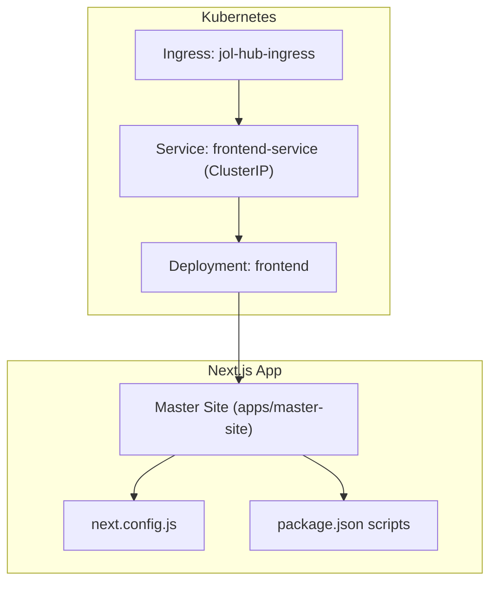
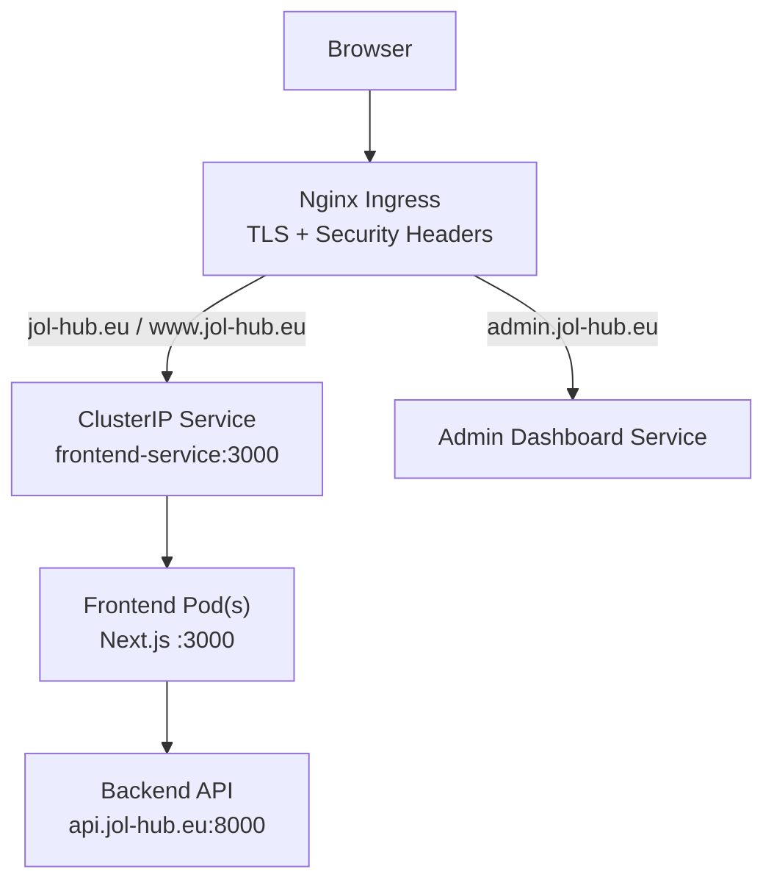
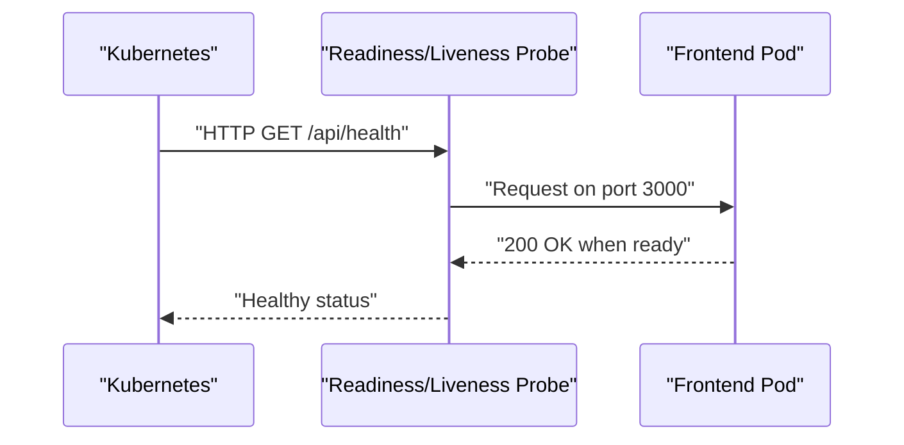
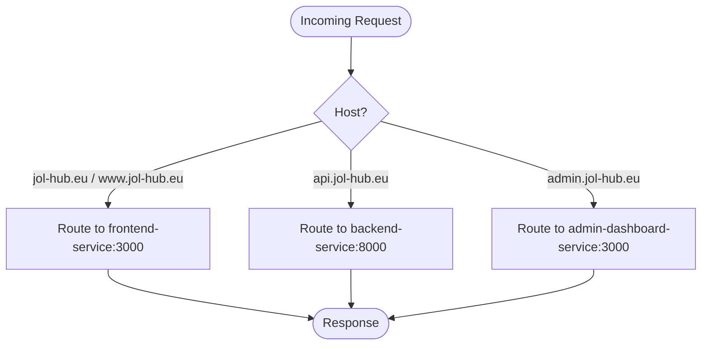
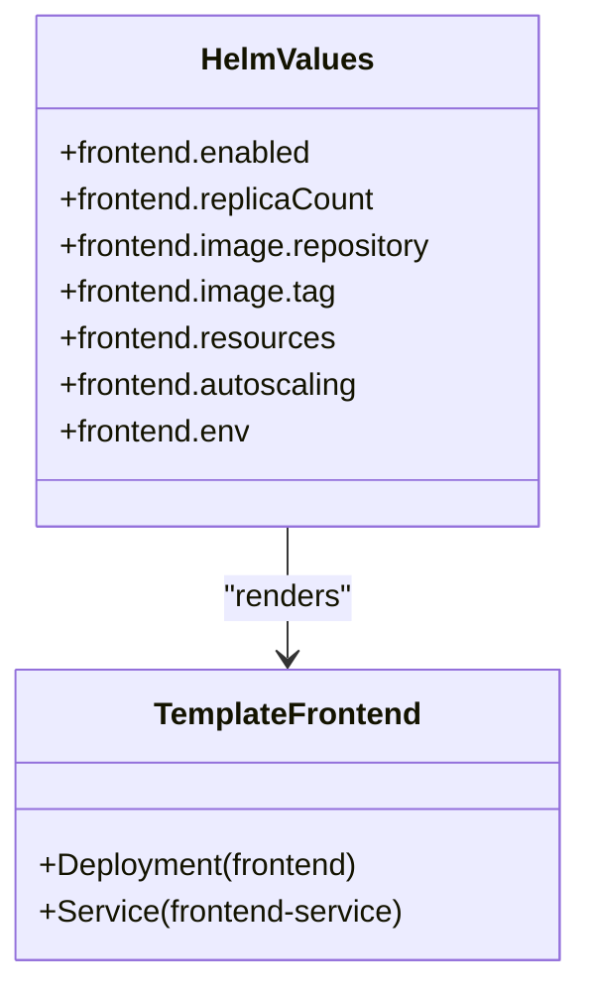
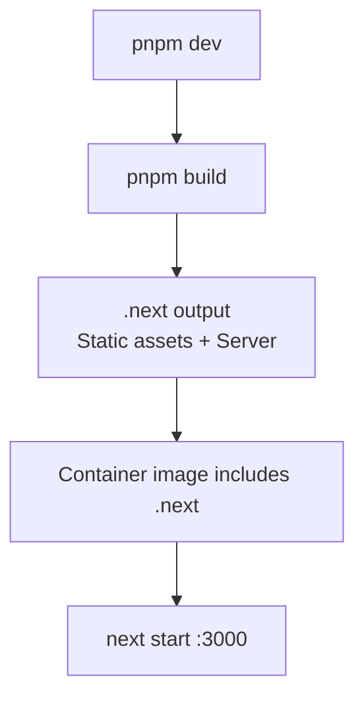
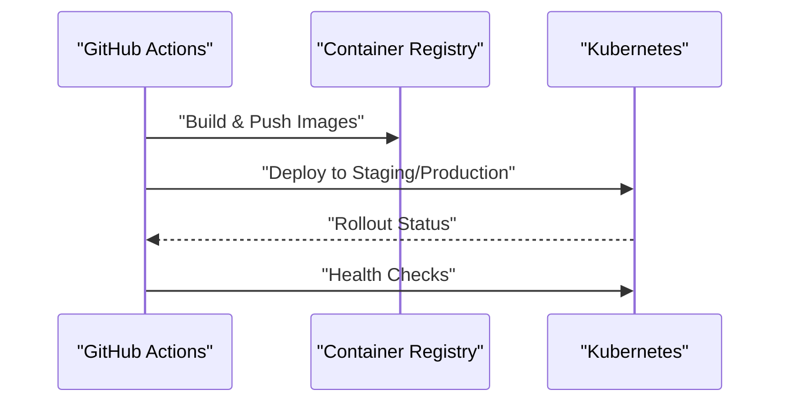
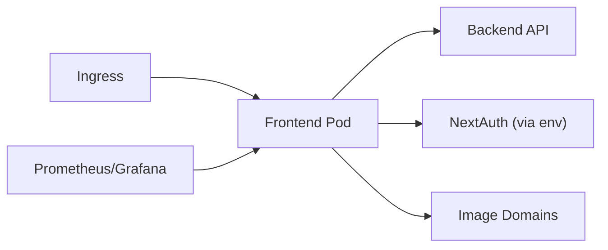

# Frontend Next.js Application

<cite>
**Referenced Files in This Document**
- [frontend.yaml](file://infra/kubernetes/apps/frontend.yaml)
- [ingress.yaml](file://infra/kubernetes/networking/ingress.yaml)
- [values.yaml](file://infra/helm/jol-hub/values.yaml)
- [templates/frontend.yaml](file://infra/helm/jol-hub/templates/frontend.yaml)
- [templates/ingress.yaml](file://infra/helm/jol-hub/templates/ingress.yaml)
- [next.config.js](file://frontend/apps/master-site/next.config.js)
- [package.json](file://frontend/apps/master-site/package.json)
- [cd.yml](file://.github/workflows/cd.yml)
- [ci.yml](file://.github/workflows/ci.yml)
- [grafana.yaml](file://infra/kubernetes/monitoring/grafana.yaml)
- [prometheus.yaml](file://infra/kubernetes/monitoring/prometheus.yaml)
</cite>

## Table of Contents
1. [Introduction](#introduction)
2. [Project Structure](#project-structure)
3. [Core Components](#core-components)
4. [Architecture Overview](#architecture-overview)
5. [Detailed Component Analysis](#detailed-component-analysis)
6. [Dependency Analysis](#dependency-analysis)
7. [Performance Considerations](#performance-considerations)
8. [Troubleshooting Guide](#troubleshooting-guide)
9. [Conclusion](#conclusion)
10. [Appendices](#appendices)

## Introduction
This document provides comprehensive deployment guidance for the JOL-HUB frontend Next.js application running on Kubernetes. It covers container specifications, environment variables, resource allocation, static asset handling and build optimization, service exposure via ClusterIP services and Ingress, environment-specific configuration, performance tuning (compression, caching, CDN), monitoring and logging, troubleshooting, and scaling strategies for high-traffic scenarios.

## Project Structure
The frontend is a Next.js application with multiple apps under a monorepo structure. The master site app is deployed as a containerized service within Kubernetes and exposed through an Ingress controller. Helm templates and raw Kubernetes manifests coexist to support different deployment workflows.

**Diagram sources**
- [frontend.yaml:1-105](file://infra/kubernetes/apps/frontend.yaml#L1-L105)
- [ingress.yaml:1-115](file://infra/kubernetes/networking/ingress.yaml#L1-L115)
- [next.config.js:1-15](file://frontend/apps/master-site/next.config.js#L1-L15)
- [package.json:1-58](file://frontend/apps/master-site/package.json#L1-L58)

**Section sources**
- [frontend.yaml:1-105](file://infra/kubernetes/apps/frontend.yaml#L1-L105)
- [ingress.yaml:1-115](file://infra/kubernetes/networking/ingress.yaml#L1-L115)
- [next.config.js:1-15](file://frontend/apps/master-site/next.config.js#L1-L15)
- [package.json:1-58](file://frontend/apps/master-site/package.json#L1-L58)

## Core Components
- Deployment: Runs two replicas of the frontend container with rolling updates and health probes.
- Service: Exposes the frontend internally via ClusterIP on port 3000.
- Ingress: Routes external traffic to the frontend service for main domains and admin dashboard.
- Helm values: Provide configurable defaults for replicas, resources, autoscaling, and environment variables.
- Next.js config: Defines i18n locales, image domains, and strict mode.
- CI/CD: Builds Docker images and deploys to staging and production environments.

**Section sources**
- [frontend.yaml:1-105](file://infra/kubernetes/apps/frontend.yaml#L1-L105)
- [ingress.yaml:1-115](file://infra/kubernetes/networking/ingress.yaml#L1-L115)
- [values.yaml:56-83](file://infra/helm/jol-hub/values.yaml#L56-L83)
- [next.config.js:1-15](file://frontend/apps/master-site/next.config.js#L1-L15)
- [cd.yml:94-147](file://.github/workflows/cd.yml#L94-L147)

## Architecture Overview
The frontend is served by Next.js inside a container listening on port 3000. Kubernetes Service routes internal traffic to pods, while Ingress handles TLS termination and host-based routing to the frontend and other components.

**Diagram sources**
- [ingress.yaml:28-84](file://infra/kubernetes/networking/ingress.yaml#L28-L84)
- [frontend.yaml:87-105](file://infra/kubernetes/apps/frontend.yaml#L87-L105)

## Detailed Component Analysis

### Kubernetes Deployment and Service
- Replicas: 2 for high availability.
- Rolling update strategy: maxSurge 1, maxUnavailable 0 for zero-downtime deployments.
- Health checks: readiness and liveness probes target /api/health on port 3000.
- Resources: requests and limits defined for CPU and memory.
- Security: runs as non-root user with restricted filesystem group.
- Service: ClusterIP type exposing port 3000 to the cluster.

**Diagram sources**
- [frontend.yaml:52-75](file://infra/kubernetes/apps/frontend.yaml#L52-L75)

**Section sources**
- [frontend.yaml:1-105](file://infra/kubernetes/apps/frontend.yaml#L1-L105)

### Ingress Configuration
- Hosts: Main site (jol-hub.eu, www.jol-hub.eu), API (api.jol-hub.eu), Admin Dashboard (admin.jol-hub.eu).
- TLS: Managed via cert-manager with specific secrets per host group.
- Security headers: X-Frame-Options, X-Content-Type-Options, X-XSS-Protection, Referrer-Policy, Permissions-Policy.
- Proxy settings: body size and timeouts configured.
- Rate limiting: annotations present for request throttling.

**Diagram sources**
- [ingress.yaml:28-84](file://infra/kubernetes/networking/ingress.yaml#L28-L84)

**Section sources**
- [ingress.yaml:1-115](file://infra/kubernetes/networking/ingress.yaml#L1-L115)

### Helm Templates and Values
- Templated Deployment and Service: Uses values for replica count, image, resources, and environment variables.
- Environment variables: NEXT_PUBLIC_API_URL injected via values; NEXTAUTH_URL derived from admin domain.
- Autoscaling: Enabled for frontend with min/max replicas and CPU target utilization.
- Ingress templating: Hosts and TLS secrets are parameterized via values.

**Diagram sources**
- [templates/frontend.yaml:1-75](file://infra/helm/jol-hub/templates/frontend.yaml#L1-L75)
- [values.yaml:56-83](file://infra/helm/jol-hub/values.yaml#L56-L83)

**Section sources**
- [templates/frontend.yaml:1-144](file://infra/helm/jol-hub/templates/frontend.yaml#L1-L144)
- [values.yaml:56-83](file://infra/helm/jol-hub/values.yaml#L56-L83)

### Next.js Build and Static Asset Handling
- Build script: next build produces optimized static assets and server bundle.
- i18n: Locales configured (lt, ru, en) with default locale lt.
- Images: Allowed domains include localhost and cdn.jol-hub.eu for optimized image serving.
- Strict mode: React strict mode enabled for development-time warnings.

**Diagram sources**
- [package.json:5-12](file://frontend/apps/master-site/package.json#L5-L12)
- [next.config.js:1-15](file://frontend/apps/master-site/next.config.js#L1-L15)

**Section sources**
- [package.json:1-58](file://frontend/apps/master-site/package.json#L1-L58)
- [next.config.js:1-15](file://frontend/apps/master-site/next.config.js#L1-L15)

### CI/CD Pipeline
- Build & push: Docker images built with metadata tags and pushed to registry.
- Staging deploy: On develop branch or manual trigger, updates deployments and waits for rollout.
- Production deploy: On main or tagged releases, applies manifests and performs health checks.
- Rollback: Supports rollback via kubectl rollout undo.

**Diagram sources**
- [cd.yml:94-147](file://.github/workflows/cd.yml#L94-L147)
- [cd.yml:153-206](file://.github/workflows/cd.yml#L153-L206)
- [cd.yml:211-295](file://.github/workflows/cd.yml#L211-L295)
- [cd.yml:301-335](file://.github/workflows/cd.yml#L301-L335)

**Section sources**
- [cd.yml:94-147](file://.github/workflows/cd.yml#L94-L147)
- [cd.yml:153-206](file://.github/workflows/cd.yml#L153-L206)
- [cd.yml:211-295](file://.github/workflows/cd.yml#L211-L295)
- [cd.yml:301-335](file://.github/workflows/cd.yml#L301-L335)

## Dependency Analysis
- Frontend depends on:
  - Backend API via NEXT_PUBLIC_API_URL.
  - Authentication via NEXTAUTH_URL and secret stored in Kubernetes Secrets.
  - Image CDN via configured domains in next.config.js.
- Kubernetes dependencies:
  - Ingress controller (nginx) for TLS and routing.
  - Cert-manager for certificate management.
  - Monitoring stack (Prometheus/Grafana) for observability.

**Diagram sources**
- [frontend.yaml:42-51](file://infra/kubernetes/apps/frontend.yaml#L42-L51)
- [next.config.js:5-11](file://frontend/apps/master-site/next.config.js#L5-L11)
- [ingress.yaml:28-84](file://infra/kubernetes/networking/ingress.yaml#L28-L84)
- [prometheus.yaml:126-140](file://infra/kubernetes/monitoring/prometheus.yaml#L126-L140)

**Section sources**
- [frontend.yaml:42-51](file://infra/kubernetes/apps/frontend.yaml#L42-L51)
- [next.config.js:5-11](file://frontend/apps/master-site/next.config.js#L5-L11)
- [ingress.yaml:28-84](file://infra/kubernetes/networking/ingress.yaml#L28-L84)
- [prometheus.yaml:126-140](file://infra/kubernetes/monitoring/prometheus.yaml#L126-L140)

## Performance Considerations
- Compression: Enable gzip/brotli at the Ingress layer using nginx annotations if supported by your ingress controller version.
- Caching:
  - Configure cache-control headers for static assets via Next.js response headers or reverse proxy rules.
  - Use CDN integration for images and static assets; configure allowed domains in next.config.js.
- Build Optimization:
  - Ensure next build runs in CI to produce optimized bundles.
  - Leverage Next.js image optimization and proper domain allowlisting.
- Resource Tuning:
  - Adjust CPU/memory requests and limits based on observed usage.
  - Enable Horizontal Pod Autoscaler with appropriate metrics targets.

[No sources needed since this section provides general guidance]

## Troubleshooting Guide
- Build failures:
  - Verify Node/pnpm versions and lockfiles in CI.
  - Check lint/type-check steps before build.
- Runtime errors:
  - Inspect pod logs and probe endpoints (/api/health).
  - Validate environment variables (NEXT_PUBLIC_API_URL, NEXTAUTH_URL, NEXTAUTH_SECRET).
- Ingress issues:
  - Confirm TLS secrets exist and are valid.
  - Check rate-limit and proxy timeout annotations.
- Scaling problems:
  - Review HPA metrics and resource utilization.
  - Ensure anti-affinity spreads pods across nodes.

**Section sources**
- [ci.yml:179-315](file://.github/workflows/ci.yml#L179-L315)
- [frontend.yaml:52-75](file://infra/kubernetes/apps/frontend.yaml#L52-L75)
- [ingress.yaml:12-27](file://infra/kubernetes/networking/ingress.yaml#L12-L27)
- [values.yaml:74-83](file://infra/helm/jol-hub/values.yaml#L74-L83)

## Conclusion
The JOL-HUB frontend is deployed as a scalable Next.js service on Kubernetes with robust CI/CD, secure Ingress routing, and observability via Prometheus and Grafana. By tuning resources, enabling compression and caching, and integrating a CDN for static assets, you can achieve high performance and reliability under load.

[No sources needed since this section summarizes without analyzing specific files]

## Appendices

### Environment-Specific Configurations
- Development:
  - Local env file example available for Bitrix24 OAuth, Django API URL, and NextAuth settings.
- Staging:
  - Deployed from develop branch; uses staging kubeconfig and namespace.
- Production:
  - Deployed from main or tagged releases; uses production kubeconfig and namespace.

**Section sources**
- [.env.example:1-15](file://frontend/apps/master-site/.env.example#L1-L15)
- [cd.yml:153-206](file://.github/workflows/cd.yml#L153-L206)
- [cd.yml:211-295](file://.github/workflows/cd.yml#L211-L295)

### Monitoring and Logging Setup
- Prometheus scrapes Kubernetes and application endpoints; Grafana dashboards visualize metrics.
- Logs can be aggregated via Loki (configured in monitoring stack) and queried from Grafana.

**Section sources**
- [prometheus.yaml:57-151](file://infra/kubernetes/monitoring/prometheus.yaml#L57-L151)
- [grafana.yaml:7-22](file://infra/kubernetes/monitoring/grafana.yaml#L7-L22)
- [grafana.yaml:317-393](file://infra/kubernetes/monitoring/grafana.yaml#L317-L393)

### Scaling and Load Balancing Strategies
- Horizontal Pod Autoscaler:
  - Frontend autoscaling enabled with CPU target utilization.
- Anti-affinity:
  - Preferred pod anti-affinity distributes replicas across nodes.
- Ingress-level rate limiting:
  - Annotations present for request throttling.

**Section sources**
- [values.yaml:74-83](file://infra/helm/jol-hub/values.yaml#L74-L83)
- [frontend.yaml:76-85](file://infra/kubernetes/apps/frontend.yaml#L76-L85)
- [ingress.yaml:20-21](file://infra/kubernetes/networking/ingress.yaml#L20-L21)