# Service Deployments

<cite>
**Referenced Files in This Document**
- [backend.yaml](file://infra/kubernetes/apps/backend.yaml)
- [frontend.yaml](file://infra/kubernetes/apps/frontend.yaml)
- [database.yaml](file://infra/kubernetes/apps/database.yaml)
- [celery.yaml](file://infra/kubernetes/apps/celery.yaml)
- [Dockerfile](file://backend/Dockerfile)
- [next.config.js](file://frontend/apps/master-site/next.config.js)
- [values.yaml](file://infra/helm/jol-hub/values.yaml)
- [configmap.yaml](file://infra/kubernetes/base/configmap.yaml)
- [secrets.yaml](file://infra/kubernetes/base/secrets.yaml)
- [ingress.yaml](file://infra/kubernetes/networking/ingress.yaml)
- [network-policy.yaml](file://infra/kubernetes/networking/network-policy.yaml)
- [production.py](file://backend/django/core/settings/production.py)
- [celery.py](file://backend/django/core/celery.py)
- [docker-compose.yml](file://docker-compose.yml)
- [prometheus.yaml](file://infra/kubernetes/monitoring/prometheus.yaml)
- [grafana.yaml](file://infra/kubernetes/monitoring/grafana.yaml)
</cite>

## Table of Contents
1. [Introduction](#introduction)
2. [Project Structure](#project-structure)
3. [Core Components](#core-components)
4. [Architecture Overview](#architecture-overview)
5. [Detailed Component Analysis](#detailed-component-analysis)
6. [Dependency Analysis](#dependency-analysis)
7. [Performance Considerations](#performance-considerations)
8. [Troubleshooting Guide](#troubleshooting-guide)
9. [Conclusion](#conclusion)
10. [Appendices](#appendices)

## Introduction
This document provides comprehensive service deployment guidance for JOL-HUB on Kubernetes. It covers the backend Django service, Next.js frontend applications, PostgreSQL and Redis data stores, Celery workers and scheduler, environment configuration and secrets, service discovery via Kubernetes services and Ingress, monitoring with Prometheus and Grafana, and operational best practices including scaling, health checks, and performance tuning.

## Project Structure
JOL-HUB deploys multiple components into a dedicated namespace:
- Backend (Django + Gunicorn) exposed via ClusterIP and Ingress
- Frontend apps (Next.js) served via ClusterIP and Ingress
- Data stores: PostgreSQL (StatefulSet) and Redis (StatefulSet)
- Background processing: Celery worker(s) and Celery Beat scheduler
- Networking: Ingress, NetworkPolicies, Services
- Observability: Prometheus and Grafana in a separate monitoring namespace
- Configuration: ConfigMaps and Secrets injected into pods

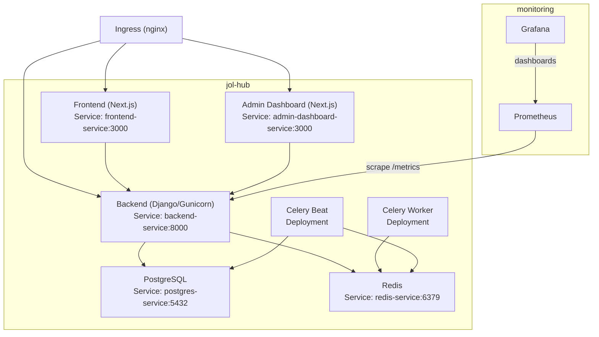

**Diagram sources**
- [backend.yaml:1-204](file://infra/kubernetes/apps/backend.yaml#L1-L204)
- [frontend.yaml:1-181](file://infra/kubernetes/apps/frontend.yaml#L1-L181)
- [database.yaml:1-196](file://infra/kubernetes/apps/database.yaml#L1-L196)
- [celery.yaml:1-130](file://infra/kubernetes/apps/celery.yaml#L1-L130)
- [ingress.yaml:1-115](file://infra/kubernetes/networking/ingress.yaml#L1-L115)
- [prometheus.yaml:1-225](file://infra/kubernetes/monitoring/prometheus.yaml#L1-L225)
- [grafana.yaml:1-414](file://infra/kubernetes/monitoring/grafana.yaml#L1-L414)

**Section sources**
- [backend.yaml:1-204](file://infra/kubernetes/apps/backend.yaml#L1-L204)
- [frontend.yaml:1-181](file://infra/kubernetes/apps/frontend.yaml#L1-L181)
- [database.yaml:1-196](file://infra/kubernetes/apps/database.yaml#L1-L196)
- [celery.yaml:1-130](file://infra/kubernetes/apps/celery.yaml#L1-L130)
- [ingress.yaml:1-115](file://infra/kubernetes/networking/ingress.yaml#L1-L115)
- [prometheus.yaml:1-225](file://infra/kubernetes/monitoring/prometheus.yaml#L1-L225)
- [grafana.yaml:1-414](file://infra/kubernetes/monitoring/grafana.yaml#L1-L414)

## Core Components
- Backend (Django): Production image built with multi-stage Dockerfile; runs Gunicorn; exposes /health for probes; uses persistent volumes for static/media; autoscaled via HPA; protected by PDB.
- Frontend (Next.js): Two deployments (main site and admin dashboard); expose /api/health; configured with API URLs and auth settings; scaled via replicas.
- Database (PostgreSQL): StatefulSet with persistent storage; readiness/liveness via pg_isready; credentials from secrets.
- Cache/Broker (Redis): StatefulSet with append-only file and memory policy; used as Celery broker/result backend and cache.
- Celery Workers/Beat: Workers consume tasks from Redis; Beat schedules periodic tasks using database-backed scheduler.
- Networking: Ingress routes to frontend/backend/admin; NetworkPolicies restrict traffic flows; Services provide stable endpoints.
- Monitoring: Prometheus scrapes pod metrics; Grafana visualizes dashboards; ServiceMonitor annotations enable scraping.

**Section sources**
- [Dockerfile:1-72](file://backend/Dockerfile#L1-L72)
- [backend.yaml:1-204](file://infra/kubernetes/apps/backend.yaml#L1-L204)
- [frontend.yaml:1-181](file://infra/kubernetes/apps/frontend.yaml#L1-L181)
- [database.yaml:1-196](file://infra/kubernetes/apps/database.yaml#L1-L196)
- [celery.yaml:1-130](file://infra/kubernetes/apps/celery.yaml#L1-L130)
- [ingress.yaml:1-115](file://infra/kubernetes/networking/ingress.yaml#L1-L115)
- [network-policy.yaml:1-188](file://infra/kubernetes/networking/network-policy.yaml#L1-L188)
- [prometheus.yaml:1-225](file://infra/kubernetes/monitoring/prometheus.yaml#L1-L225)
- [grafana.yaml:1-414](file://infra/kubernetes/monitoring/grafana.yaml#L1-L414)

## Architecture Overview
The system follows a layered architecture:
- Edge: Ingress terminates TLS and routes to services based on host/path.
- Presentation: Next.js apps serve UI and call backend APIs.
- Application: Django handles business logic, authentication, and data access.
- Data: PostgreSQL persists relational data; Redis provides caching and message brokering.
- Background: Celery workers process jobs asynchronously; Beat schedules recurring tasks.
- Observability: Prometheus collects metrics; Grafana displays dashboards.

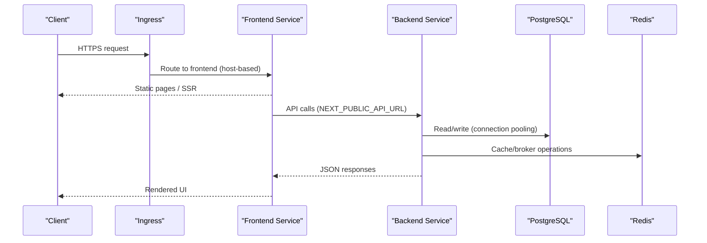

**Diagram sources**
- [ingress.yaml:1-115](file://infra/kubernetes/networking/ingress.yaml#L1-L115)
- [frontend.yaml:1-181](file://infra/kubernetes/apps/frontend.yaml#L1-L181)
- [backend.yaml:1-204](file://infra/kubernetes/apps/backend.yaml#L1-L204)
- [database.yaml:1-196](file://infra/kubernetes/apps/database.yaml#L1-L196)
- [database.yaml:105-196](file://infra/kubernetes/apps/database.yaml#L105-L196)

## Detailed Component Analysis

### Backend (Django) Deployment
- Container image: Multi-stage build ensures minimal runtime footprint and security hardening.
- Health checks: Readiness and liveness probes target /health/.
- Scaling: HPA targets CPU and memory utilization; PDB ensures minimum availability during disruptions.
- Storage: PersistentVolumeClaims mount static and media directories for persistence across restarts.
- Environment: ConfigMap provides non-sensitive settings; Secrets inject sensitive values; DATABASE_URL sourced from secret.
- Security: Non-root user, restricted capabilities, and network policies limit ingress/egress.

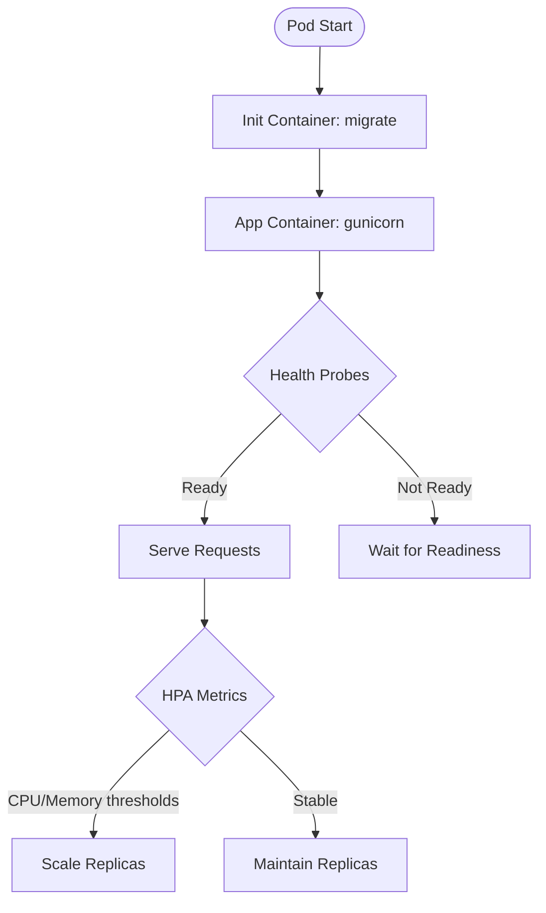

**Diagram sources**
- [backend.yaml:1-204](file://infra/kubernetes/apps/backend.yaml#L1-L204)
- [Dockerfile:1-72](file://backend/Dockerfile#L1-L72)

**Section sources**
- [backend.yaml:1-204](file://infra/kubernetes/apps/backend.yaml#L1-L204)
- [Dockerfile:1-72](file://backend/Dockerfile#L1-L72)
- [production.py:1-122](file://backend/django/core/settings/production.py#L1-L122)
- [configmap.yaml:1-198](file://infra/kubernetes/base/configmap.yaml#L1-L198)
- [secrets.yaml:1-88](file://infra/kubernetes/base/secrets.yaml#L1-L88)
- [network-policy.yaml:18-76](file://infra/kubernetes/networking/network-policy.yaml#L18-L76)

### Frontend (Next.js) Deployment
- Applications: Main site and admin dashboard are deployed as separate Next.js services.
- Configuration: NEXT_PUBLIC_API_URL and NEXTAUTH_* set via env; secrets injected for auth.
- Health checks: /api/health used for readiness/liveness.
- Performance: Next.js config enables strict mode, transpiles shared packages, sets i18n locales, and restricts image domains.
- Scaling: Default replicas ensure high availability; can be tuned via Helm values or Kustomize overlays.

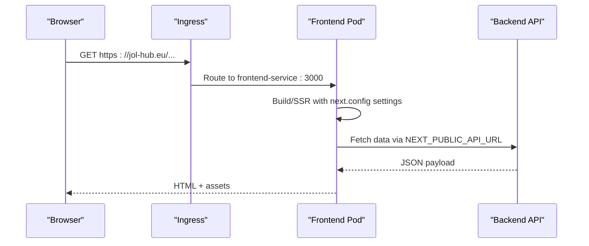

**Diagram sources**
- [frontend.yaml:1-181](file://infra/kubernetes/apps/frontend.yaml#L1-L181)
- [next.config.js:1-15](file://frontend/apps/master-site/next.config.js#L1-L15)
- [ingress.yaml:1-115](file://infra/kubernetes/networking/ingress.yaml#L1-L115)

**Section sources**
- [frontend.yaml:1-181](file://infra/kubernetes/apps/frontend.yaml#L1-L181)
- [next.config.js:1-15](file://frontend/apps/master-site/next.config.js#L1-L15)
- [ingress.yaml:1-115](file://infra/kubernetes/networking/ingress.yaml#L1-L115)

### Database (PostgreSQL) Deployment
- Persistence: StatefulSet with PVC ensures data durability across reschedules.
- Credentials: POSTGRES_DB, POSTGRES_USER, POSTGRES_PASSWORD sourced from secrets.
- Health: pg_isready used for readiness/liveness.
- Resources: Requests and limits sized for production workload.
- Connection pooling: Django uses connection max age and SSL requirements in production settings.

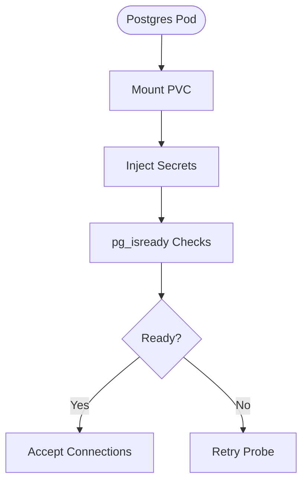

**Diagram sources**
- [database.yaml:1-104](file://infra/kubernetes/apps/database.yaml#L1-L104)
- [production.py:60-66](file://backend/django/core/settings/production.py#L60-L66)

**Section sources**
- [database.yaml:1-104](file://infra/kubernetes/apps/database.yaml#L1-L104)
- [production.py:60-66](file://backend/django/core/settings/production.py#L60-L66)
- [secrets.yaml:48-61](file://infra/kubernetes/base/secrets.yaml#L48-L61)

### Redis (Cache and Broker) Deployment
- Purpose: Caching layer and Celery broker/result backend.
- Persistence: Append-only file enabled; PVC retains data.
- Memory: Maxmemory and eviction policy configured to handle bursts.
- Health: redis-cli ping probes.

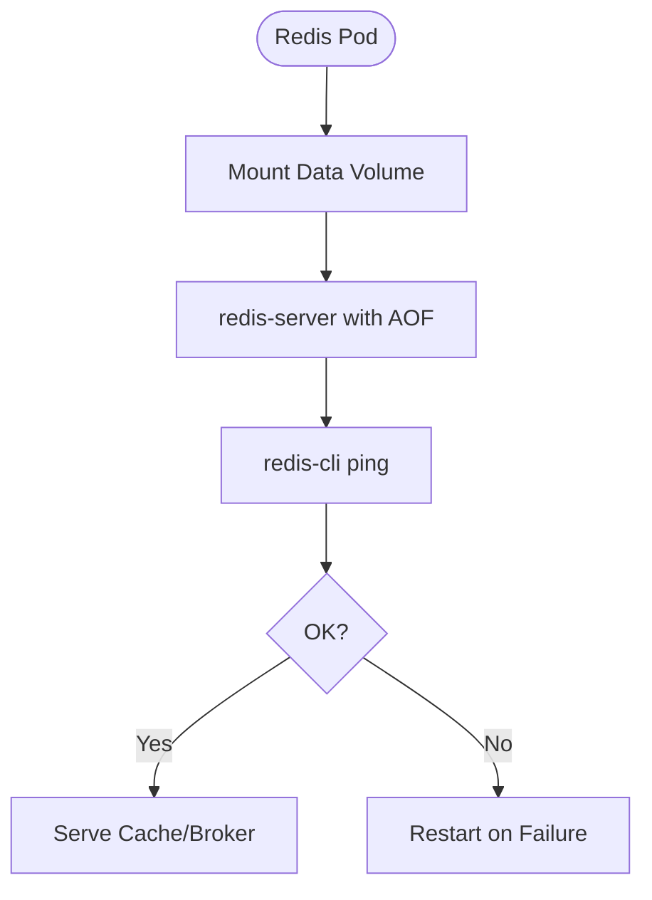

**Diagram sources**
- [database.yaml:105-196](file://infra/kubernetes/apps/database.yaml#L105-L196)

**Section sources**
- [database.yaml:105-196](file://infra/kubernetes/apps/database.yaml#L105-L196)

### Celery Workers and Beat
- Workers: Consume tasks from Redis broker; concurrency set per pod; autoscaled via HPA.
- Beat: Schedules periodic tasks using database-backed scheduler; connects to Redis broker and Postgres.
- Environment: DATABASE_URL and Redis URLs injected; logs at info level.

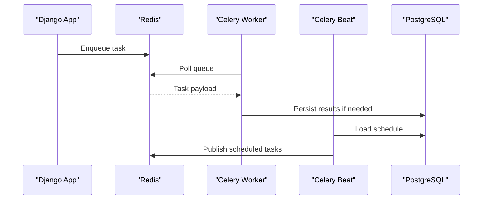

**Diagram sources**
- [celery.yaml:1-130](file://infra/kubernetes/apps/celery.yaml#L1-L130)
- [celery.py:1-32](file://backend/django/core/celery.py#L1-L32)

**Section sources**
- [celery.yaml:1-130](file://infra/kubernetes/apps/celery.yaml#L1-L130)
- [celery.py:1-32](file://backend/django/core/celery.py#L1-L32)

### Environment Variables and Secrets Injection
- ConfigMap: Non-sensitive application settings (domains, feature flags, rate limits).
- Secrets: Sensitive values (database credentials, auth keys, email credentials).
- Injection: envFrom references for ConfigMap and Secret; specific env overrides for critical values like DATABASE_URL.
- Best practice: Use External Secrets Operator or Sealed Secrets in production to avoid committing plaintext templates.

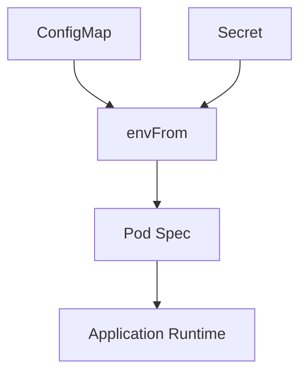

**Diagram sources**
- [configmap.yaml:1-198](file://infra/kubernetes/base/configmap.yaml#L1-L198)
- [secrets.yaml:1-88](file://infra/kubernetes/base/secrets.yaml#L1-L88)
- [backend.yaml:38-82](file://infra/kubernetes/apps/backend.yaml#L38-L82)
- [celery.yaml:34-48](file://infra/kubernetes/apps/celery.yaml#L34-L48)

**Section sources**
- [configmap.yaml:1-198](file://infra/kubernetes/base/configmap.yaml#L1-L198)
- [secrets.yaml:1-88](file://infra/kubernetes/base/secrets.yaml#L1-L88)
- [backend.yaml:38-82](file://infra/kubernetes/apps/backend.yaml#L38-L82)
- [celery.yaml:34-48](file://infra/kubernetes/apps/celery.yaml#L34-L48)

### Service Discovery and Networking
- Services: Each component has a ClusterIP Service exposing stable endpoints within the cluster.
- Ingress: Routes external traffic to appropriate services based on hostnames; TLS managed via cert-manager.
- Network Policies: Restrict ingress/egress to only required ports and namespaces; DNS egress allowed.

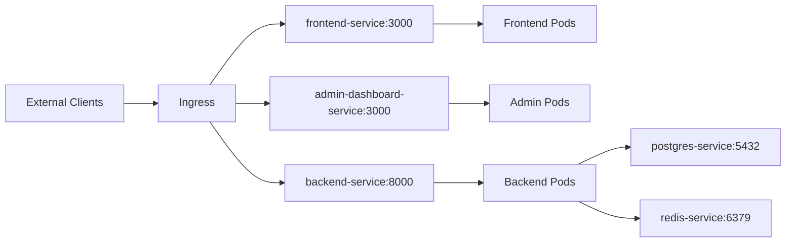

**Diagram sources**
- [ingress.yaml:1-115](file://infra/kubernetes/networking/ingress.yaml#L1-L115)
- [backend.yaml:129-147](file://infra/kubernetes/apps/backend.yaml#L129-L147)
- [frontend.yaml:87-105](file://infra/kubernetes/apps/frontend.yaml#L87-L105)
- [database.yaml:87-104](file://infra/kubernetes/apps/database.yaml#L87-L104)
- [database.yaml:179-196](file://infra/kubernetes/apps/database.yaml#L179-L196)
- [network-policy.yaml:1-188](file://infra/kubernetes/networking/network-policy.yaml#L1-L188)

**Section sources**
- [ingress.yaml:1-115](file://infra/kubernetes/networking/ingress.yaml#L1-L115)
- [network-policy.yaml:1-188](file://infra/kubernetes/networking/network-policy.yaml#L1-L188)

### Monitoring and Observability
- Prometheus: Scrapes Kubernetes objects and annotated pods; includes job for backend metrics.
- Grafana: Pre-provisioned datasources and dashboards; persistent storage for configurations.
- Annotations: Backend pods annotated for automatic scraping.

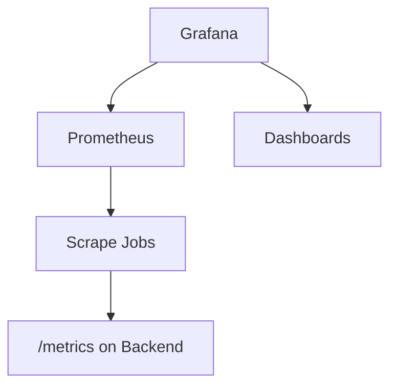

**Diagram sources**
- [prometheus.yaml:1-225](file://infra/kubernetes/monitoring/prometheus.yaml#L1-L225)
- [grafana.yaml:1-414](file://infra/kubernetes/monitoring/grafana.yaml#L1-L414)
- [backend.yaml:23-31](file://infra/kubernetes/apps/backend.yaml#L23-L31)

**Section sources**
- [prometheus.yaml:1-225](file://infra/kubernetes/monitoring/prometheus.yaml#L1-L225)
- [grafana.yaml:1-414](file://infra/kubernetes/monitoring/grafana.yaml#L1-L414)
- [backend.yaml:23-31](file://infra/kubernetes/apps/backend.yaml#L23-L31)

## Dependency Analysis
- Backend depends on PostgreSQL and Redis for data and messaging.
- Frontend depends on Backend API via configured URL.
- Celery depends on Redis for broker/results and PostgreSQL for scheduling.
- Monitoring depends on Kubernetes API and annotated services/pods.
- Network policies enforce strict communication boundaries.

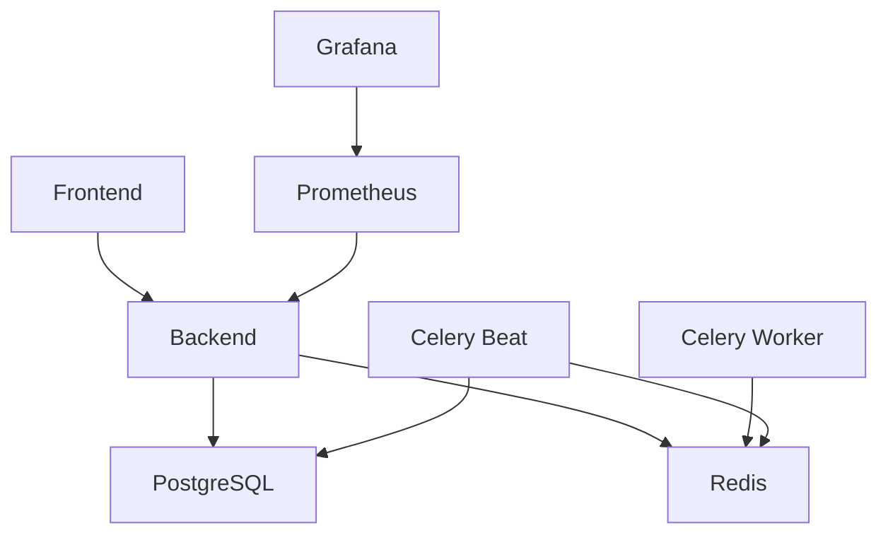

**Diagram sources**
- [backend.yaml:1-204](file://infra/kubernetes/apps/backend.yaml#L1-L204)
- [frontend.yaml:1-181](file://infra/kubernetes/apps/frontend.yaml#L1-L181)
- [database.yaml:1-196](file://infra/kubernetes/apps/database.yaml#L1-L196)
- [celery.yaml:1-130](file://infra/kubernetes/apps/celery.yaml#L1-L130)
- [prometheus.yaml:1-225](file://infra/kubernetes/monitoring/prometheus.yaml#L1-L225)
- [grafana.yaml:1-414](file://infra/kubernetes/monitoring/grafana.yaml#L1-L414)

**Section sources**
- [backend.yaml:1-204](file://infra/kubernetes/apps/backend.yaml#L1-L204)
- [frontend.yaml:1-181](file://infra/kubernetes/apps/frontend.yaml#L1-L181)
- [database.yaml:1-196](file://infra/kubernetes/apps/database.yaml#L1-L196)
- [celery.yaml:1-130](file://infra/kubernetes/apps/celery.yaml#L1-L130)
- [prometheus.yaml:1-225](file://infra/kubernetes/monitoring/prometheus.yaml#L1-L225)
- [grafana.yaml:1-414](file://infra/kubernetes/monitoring/grafana.yaml#L1-L414)

## Performance Considerations
- Backend:
  - Use connection pooling and SSL for database connections.
  - Enable compressed manifest static files storage.
  - Tune Gunicorn workers/threads via container command or Helm values.
  - Set resource requests/limits and HPA targets appropriately.
- Frontend:
  - Configure Next.js images domains and i18n locales for optimal delivery.
  - Ensure CDN integration for static assets where applicable.
- Database:
  - Size PVCs and storage class for growth; monitor disk usage.
  - Adjust connection timeouts and pool sizes based on load.
- Redis:
  - Tune maxmemory and eviction policy for workload patterns.
  - Monitor AOF persistence impact on latency.
- Monitoring:
  - Collect and alert on p95 response times, error rates, and resource utilization.
  - Use Grafana dashboards to track trends and anomalies.

[No sources needed since this section provides general guidance]

## Troubleshooting Guide
Common issues and resolutions:
- Backend not ready:
  - Check readiness probe path and port; verify migrations completed in init container.
  - Inspect logs for dependency connectivity (DB/Redis).
- Frontend cannot reach API:
  - Validate NEXT_PUBLIC_API_URL and Ingress routing rules.
  - Confirm CORS and CSRF trusted origins in ConfigMap.
- Database connectivity errors:
  - Verify secrets contain correct credentials; check pg_isready probes.
  - Ensure NetworkPolicy allows backend egress to database port.
- Redis issues:
  - Confirm broker/result backend URLs; check AOF and memory limits.
  - Validate NetworkPolicy allows backend and Celery egress to Redis.
- Celery tasks not executing:
  - Ensure broker is reachable; check worker logs and concurrency settings.
  - Verify Beat is running and connected to database for scheduling.
- Monitoring gaps:
  - Confirm pod annotations for scraping; check Prometheus scrape configs.
  - Validate Grafana datasources and dashboards provisioned.

**Section sources**
- [backend.yaml:82-98](file://infra/kubernetes/apps/backend.yaml#L82-L98)
- [frontend.yaml:52-68](file://infra/kubernetes/apps/frontend.yaml#L52-L68)
- [database.yaml:61-76](file://infra/kubernetes/apps/database.yaml#L61-L76)
- [database.yaml:155-168](file://infra/kubernetes/apps/database.yaml#L155-L168)
- [celery.yaml:29-55](file://infra/kubernetes/apps/celery.yaml#L29-L55)
- [prometheus.yaml:100-140](file://infra/kubernetes/monitoring/prometheus.yaml#L100-L140)
- [grafana.yaml:1-414](file://infra/kubernetes/monitoring/grafana.yaml#L1-L414)

## Conclusion
JOL-HUB’s Kubernetes deployment provides a robust, scalable, and observable platform. The backend leverages Django with production-grade settings, while the Next.js frontends deliver responsive user experiences. PostgreSQL and Redis ensure reliable data and messaging. Celery workers and Beat handle background processing efficiently. Networking is secured via Ingress and NetworkPolicies, and observability is enabled through Prometheus and Grafana. Following the recommended configurations and troubleshooting steps will help maintain high availability and performance.

[No sources needed since this section summarizes without analyzing specific files]

## Appendices

### Local Development with Docker Compose
- Services: PostgreSQL, Redis, MongoDB, Django dev server, Celery worker, Celery Beat.
- Volumes: Named volumes for data persistence and static/media mounts.
- Health checks: Built-in checks for each service to coordinate startup order.

**Section sources**
- [docker-compose.yml:1-156](file://docker-compose.yml#L1-L156)

### Helm Values Overview
- Centralized defaults for images, resources, autoscaling, and features.
- Enables toggling components (backend, frontend, celery, postgresql, redis, ingress, monitoring).
- Provides placeholders for secrets and domain configuration.

**Section sources**
- [values.yaml:1-264](file://infra/helm/jol-hub/values.yaml#L1-L264)