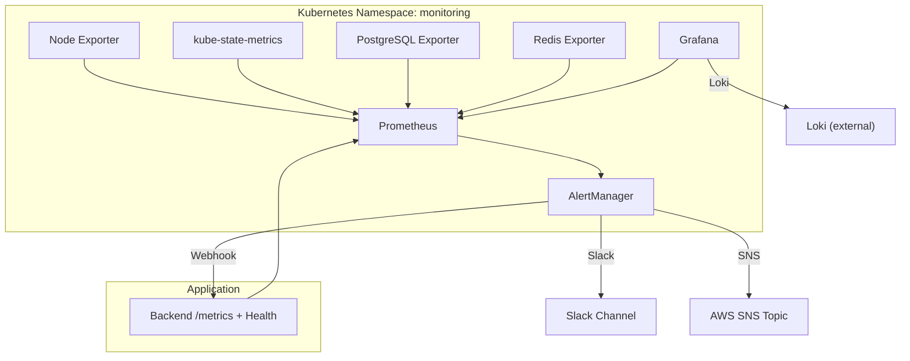
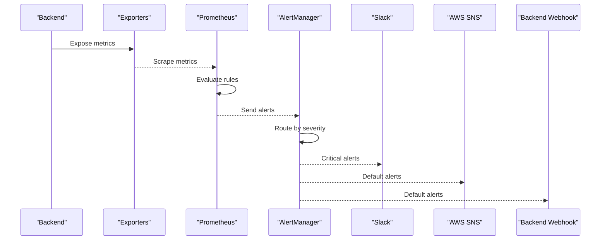
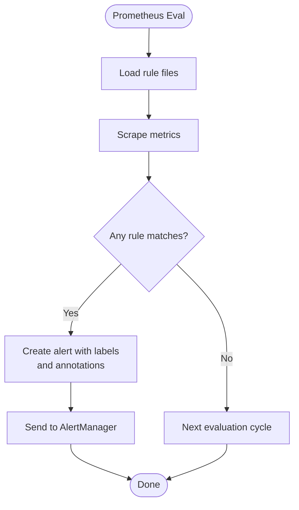
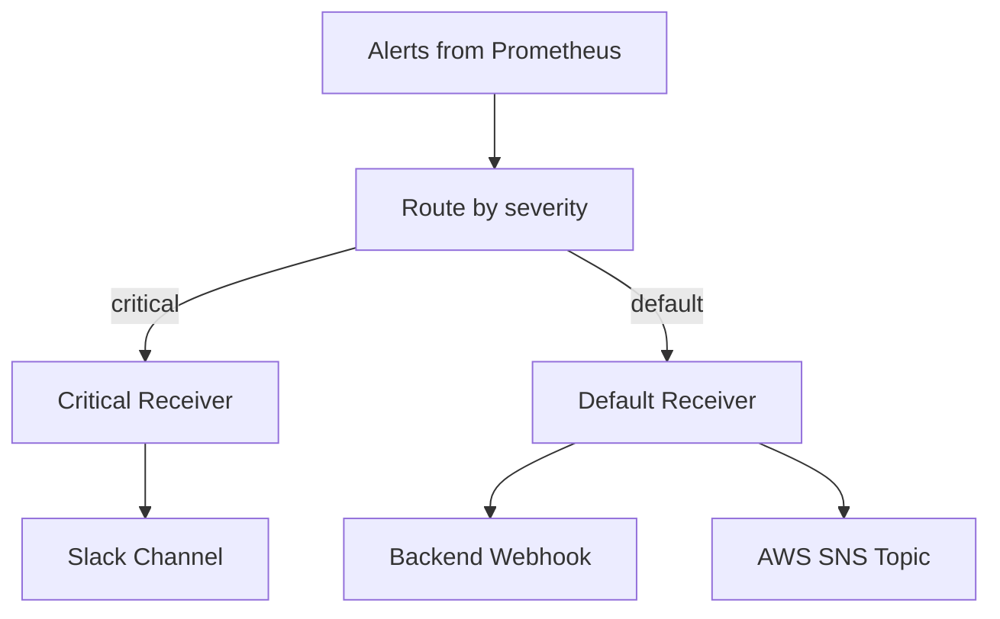
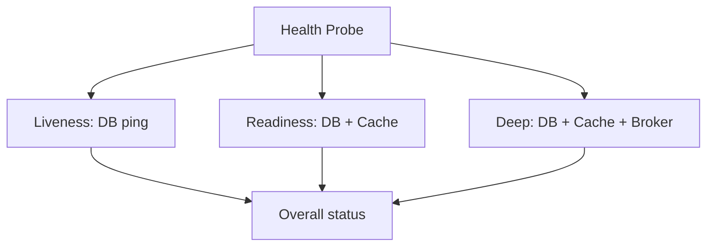
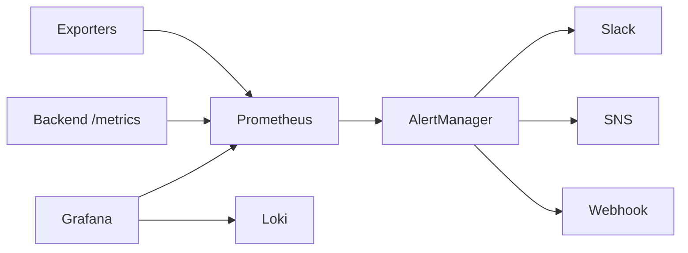

# Alerting System & Notifications

<cite>
**Referenced Files in This Document**
- [prometheus.yaml](file://infra/kubernetes/monitoring/prometheus.yaml)
- [grafana.yaml](file://infra/kubernetes/monitoring/grafana.yaml)
- [observability.yaml](file://infra/kubernetes/observability/observability.yaml)
- [alert-rules.yml](file://frontend/apps/template-renderer/observability/alert-rules.yml)
- [rules.yaml.tpl](file://infra/terraform/modules/monitoring/templates/rules.yaml.tpl)
- [alertmanager.yaml.tpl](file://infra/terraform/modules/monitoring/templates/alertmanager.yaml.tpl)
- [metrics_endpoint.py](file://backend/django/apps/core/metrics_endpoint.py)
- [health.py](file://backend/django/apps/core/health.py)
</cite>

## Table of Contents
1. [Introduction](#introduction)
2. [Project Structure](#project-structure)
3. [Core Components](#core-components)
4. [Architecture Overview](#architecture-overview)
5. [Detailed Component Analysis](#detailed-component-analysis)
6. [Dependency Analysis](#dependency-analysis)
7. [Performance Considerations](#performance-considerations)
8. [Troubleshooting Guide](#troubleshooting-guide)
9. [Conclusion](#conclusion)
10. [Appendices](#appendices)

## Introduction
This document explains the alerting and notification system for JOL-HUB, covering how Prometheus rules are defined and evaluated, how Grafana is configured as a visualization and alerting surface, and how AlertManager routes alerts to external channels such as Slack or AWS SNS. It also describes health probes and metrics endpoints that feed these systems, provides guidance on defining meaningful alerts for system health, performance thresholds, and business metrics, and outlines escalation procedures and alert fatigue prevention strategies.

## Project Structure
JOL-HUB’s observability stack is deployed via Kubernetes manifests and Terraform templates:
- Prometheus scrapes application and infrastructure metrics and evaluates rule files.
- Grafana is provisioned with data sources (Prometheus and Loki) and dashboards.
- AlertManager receives alerts from Prometheus and routes them to receivers (webhook, Slack, SNS).
- The backend exposes a secure /metrics endpoint and deep health checks used by probes and monitoring.

**Diagram sources**
- [prometheus.yaml:57-72](file://infra/kubernetes/monitoring/prometheus.yaml#L57-L72)
- [grafana.yaml:10-22](file://infra/kubernetes/monitoring/grafana.yaml#L10-L22)
- [observability.yaml:213-236](file://infra/kubernetes/observability/observability.yaml#L213-L236)
- [metrics_endpoint.py:68-153](file://backend/django/apps/core/metrics_endpoint.py#L68-L153)

**Section sources**
- [prometheus.yaml:57-72](file://infra/kubernetes/monitoring/prometheus.yaml#L57-L72)
- [grafana.yaml:10-22](file://infra/kubernetes/monitoring/grafana.yaml#L10-L22)
- [observability.yaml:213-236](file://infra/kubernetes/observability/observability.yaml#L213-L236)

## Core Components
- Prometheus configuration and scrape targets:
  - Scrape intervals, evaluation intervals, external labels, rule_files, and alertmanagers are defined in the Prometheus ConfigMap.
  - Jobs include Kubernetes API server, nodes, pods, backend service, PostgreSQL exporter, and Redis exporter.
- Grafana provisioning:
  - Data sources for Prometheus and Loki are provisioned via ConfigMaps.
  - Dashboards are mounted and auto-discovered.
- AlertManager:
  - Global settings, routing strategy (group_by, group_wait, repeat_interval), and receivers (webhook to backend, Slack channel).
  - In Terraform-managed environments, SNS receivers are templated.
- Backend metrics and health:
  - Secure /metrics endpoint with IP allowlist and optional bearer token.
  - Deep health checks for database, cache, and Celery broker used by probes and monitoring.

**Section sources**
- [prometheus.yaml:57-151](file://infra/kubernetes/monitoring/prometheus.yaml#L57-L151)
- [grafana.yaml:10-22](file://infra/kubernetes/monitoring/grafana.yaml#L10-L22)
- [observability.yaml:213-236](file://infra/kubernetes/observability/observability.yaml#L213-L236)
- [metrics_endpoint.py:68-153](file://backend/django/apps/core/metrics_endpoint.py#L68-L153)
- [health.py:55-127](file://backend/django/apps/core/health.py#L55-L127)

## Architecture Overview
The alerting pipeline follows a standard flow:
1. Metrics collection from exporters and application endpoints.
2. Rule evaluation in Prometheus against collected metrics.
3. Alert creation and forwarding to AlertManager.
4. Routing based on severity and labels to appropriate receivers.
5. External notifications via Slack, SNS, or internal webhook.

**Diagram sources**
- [prometheus.yaml:57-72](file://infra/kubernetes/monitoring/prometheus.yaml#L57-L72)
- [observability.yaml:213-236](file://infra/kubernetes/observability/observability.yaml#L213-L236)
- [alertmanager.yaml.tpl:1-24](file://infra/terraform/modules/monitoring/templates/alertmanager.yaml.tpl#L1-L24)

## Detailed Component Analysis

### Prometheus Configuration and Rules
- Evaluation and alerting integration:
  - Evaluation interval and alertmanager target are set in the Prometheus config.
  - Rule files are loaded from a specific path pattern.
- Scrape targets:
  - Kubernetes services, nodes, pods, backend, PostgreSQL, and Redis exporters are configured.
- Example alert groups and rules:
  - Frontend-specific rules define severity levels P0–P3 with annotations including runbooks and incident channels.
  - Terraform-managed rules cover API latency/error rates, database connections/replication lag, Redis memory/connections, Celery queue/backlog, container CPU/memory/restarts, and pod status issues.

**Diagram sources**
- [prometheus.yaml:57-72](file://infra/kubernetes/monitoring/prometheus.yaml#L57-L72)
- [alert-rules.yml:18-144](file://frontend/apps/template-renderer/observability/alert-rules.yml#L18-L144)
- [rules.yaml.tpl:1-163](file://infra/terraform/modules/monitoring/templates/rules.yaml.tpl#L1-L163)

**Section sources**
- [prometheus.yaml:57-151](file://infra/kubernetes/monitoring/prometheus.yaml#L57-L151)
- [alert-rules.yml:18-144](file://frontend/apps/template-renderer/observability/alert-rules.yml#L18-L144)
- [rules.yaml.tpl:1-163](file://infra/terraform/modules/monitoring/templates/rules.yaml.tpl#L1-L163)

### Grafana Provisioning and Dashboards
- Data sources:
  - Prometheus and Loki are provisioned via ConfigMaps for seamless querying.
- Dashboards:
  - A dashboard JSON is mounted and auto-discovered; includes panels for API response time, request rate, CPU, and memory usage.
- Integration points:
  - Grafana can be used to visualize alerts and build custom dashboards for SLOs and error budgets.

**Section sources**
- [grafana.yaml:10-22](file://infra/kubernetes/monitoring/grafana.yaml#L10-L22)
- [grafana.yaml:29-315](file://infra/kubernetes/monitoring/grafana.yaml#L29-L315)

### AlertManager Routing and Receivers
- Routing strategy:
  - Group alerts by alertname and severity; configure group_wait, group_interval, and repeat_interval to reduce noise.
  - Match-based routes forward critical alerts to a dedicated receiver.
- Receivers:
  - Default receiver sends alerts via webhook to the backend.
  - Critical receiver sends alerts to a Slack channel.
  - In Terraform-managed deployments, SNS topics are used for default and critical receivers.

**Diagram sources**
- [observability.yaml:213-236](file://infra/kubernetes/observability/observability.yaml#L213-L236)
- [alertmanager.yaml.tpl:1-24](file://infra/terraform/modules/monitoring/templates/alertmanager.yaml.tpl#L1-L24)

**Section sources**
- [observability.yaml:213-236](file://infra/kubernetes/observability/observability.yaml#L213-L236)
- [alertmanager.yaml.tpl:1-24](file://infra/terraform/modules/monitoring/templates/alertmanager.yaml.tpl#L1-L24)

### Backend Metrics Endpoint and Security
- Secure /metrics exposure:
  - IP allowlist gating via Django settings.
  - Optional bearer-token authentication for shared networks.
  - Multi-process support for metrics aggregation across workers.
- Usage:
  - Prometheus scrapes this endpoint to collect application-level metrics for alerting and dashboards.

**Section sources**
- [metrics_endpoint.py:68-153](file://backend/django/apps/core/metrics_endpoint.py#L68-L153)

### Health Checks and Probes
- Deep health checker:
  - Liveness probe verifies database connectivity.
  - Readiness probe checks database and cache availability.
  - Deep check includes Celery broker connectivity and returns environment metadata.
- Use cases:
  - Kubernetes probes use liveness/readiness.
  - External monitoring tools can call deep health to assess overall service health.

**Diagram sources**
- [health.py:55-127](file://backend/django/apps/core/health.py#L55-L127)

**Section sources**
- [health.py:55-127](file://backend/django/apps/core/health.py#L55-L127)

## Dependency Analysis
- Prometheus depends on:
  - Exporters (node-exporter, kube-state-metrics, postgres-exporter, redis-exporter).
  - Application metrics endpoint (/metrics).
- AlertManager depends on:
  - Prometheus for alert ingestion.
  - External channels (Slack, SNS, backend webhook).
- Grafana depends on:
  - Prometheus and Loki data sources.
- Terraform templates parameterize:
  - AlertManager receivers (SNS topic ARN).
  - Rule groups with project/environment labels.

**Diagram sources**
- [prometheus.yaml:57-151](file://infra/kubernetes/monitoring/prometheus.yaml#L57-L151)
- [observability.yaml:213-236](file://infra/kubernetes/observability/observability.yaml#L213-L236)
- [grafana.yaml:10-22](file://infra/kubernetes/monitoring/grafana.yaml#L10-L22)
- [alertmanager.yaml.tpl:1-24](file://infra/terraform/modules/monitoring/templates/alertmanager.yaml.tpl#L1-L24)

**Section sources**
- [prometheus.yaml:57-151](file://infra/kubernetes/monitoring/prometheus.yaml#L57-L151)
- [observability.yaml:213-236](file://infra/kubernetes/observability/observability.yaml#L213-L236)
- [grafana.yaml:10-22](file://infra/kubernetes/monitoring/grafana.yaml#L10-L22)
- [alertmanager.yaml.tpl:1-24](file://infra/terraform/modules/monitoring/templates/alertmanager.yaml.tpl#L1-L24)

## Performance Considerations
- Evaluation cadence:
  - Set evaluation_interval appropriately to balance responsiveness and load.
- Scrape tuning:
  - Ensure scrape intervals align with metric volatility and storage capacity.
- Rule design:
  - Use aggregations and ranges judiciously to avoid expensive queries.
  - Prefer ratio-based thresholds for error rates and utilization.
- Alert grouping:
  - Configure group_wait and repeat_interval to prevent alert storms.
- Storage:
  - Size Prometheus TSDB and retention windows to sustain required lookback periods.

[No sources needed since this section provides general guidance]

## Troubleshooting Guide
- Prometheus cannot reach /metrics:
  - Verify IP allowlist and bearer token configuration on the backend metrics endpoint.
  - Confirm network policies and service discovery for scraping jobs.
- Alerts not firing:
  - Check rule_files paths and ensure rules are loaded.
  - Validate expressions using Prometheus query UI.
- AlertManager not sending notifications:
  - Inspect receiver configurations (webhook URL, Slack token/channel, SNS topic ARN).
  - Review routing match conditions and severity labels.
- Health checks failing:
  - Use deep health to identify which component (database, cache, broker) is unhealthy.
  - Correlate with exporter metrics and logs.

**Section sources**
- [metrics_endpoint.py:95-129](file://backend/django/apps/core/metrics_endpoint.py#L95-L129)
- [health.py:133-212](file://backend/django/apps/core/health.py#L133-L212)
- [observability.yaml:213-236](file://infra/kubernetes/observability/observability.yaml#L213-L236)

## Conclusion
JOL-HUB implements a robust alerting and notification system leveraging Prometheus for metric collection and rule evaluation, Grafana for visualization, and AlertManager for routing alerts to Slack, SNS, and internal webhooks. Health checks and secure metrics endpoints provide reliable inputs for monitoring. By following the documented rule patterns, routing strategies, and operational practices, teams can maintain high reliability while minimizing alert fatigue.

[No sources needed since this section summarizes without analyzing specific files]

## Appendices

### Alert Severity and Escalation Strategy
- Severity mapping:
  - P0/Critical: Immediate on-call, incident channel, fast resolution.
  - P1/Business: Business-hours response, impact on revenue or core flows.
  - P2/Performance: Planned optimization, budget regressions.
  - P3/Warning: Hygiene backlog, long-term improvements.
- Escalation:
  - Use AlertManager routes to escalate critical alerts to Slack and SNS.
  - Include runbook links and incident channels in alert annotations.

**Section sources**
- [alert-rules.yml:18-144](file://frontend/apps/template-renderer/observability/alert-rules.yml#L18-L144)
- [observability.yaml:213-236](file://infra/kubernetes/observability/observability.yaml#L213-L236)
- [alertmanager.yaml.tpl:1-24](file://infra/terraform/modules/monitoring/templates/alertmanager.yaml.tpl#L1-L24)

### Defining Meaningful Alerts
- System health:
  - Database connection saturation and replication lag.
  - Cache memory and connection limits.
  - Pod crash loops and readiness states.
- Performance thresholds:
  - API latency percentiles and error rates.
  - Container CPU and memory usage.
  - Frontend performance indicators (e.g., LCP budgets).
- Business metrics:
  - Conversion rate drops compared to baseline.
  - Booking failure rates.
  - Queue backlogs impacting throughput.

**Section sources**
- [rules.yaml.tpl:1-163](file://infra/terraform/modules/monitoring/templates/rules.yaml.tpl#L1-L163)
- [alert-rules.yml:18-144](file://frontend/apps/template-renderer/observability/alert-rules.yml#L18-L144)

### Alert Testing Procedures
- Validate rules:
  - Use Prometheus UI to test expressions and verify expected behavior.
- Simulate failures:
  - Temporarily disable dependencies to trigger health-related alerts.
  - Inject errors into endpoints to validate error-rate alerts.
- Notification testing:
  - Trigger test alerts and confirm delivery to Slack/SNS/webhook.
  - Verify routing matches and receiver configurations.

[No sources needed since this section provides general guidance]