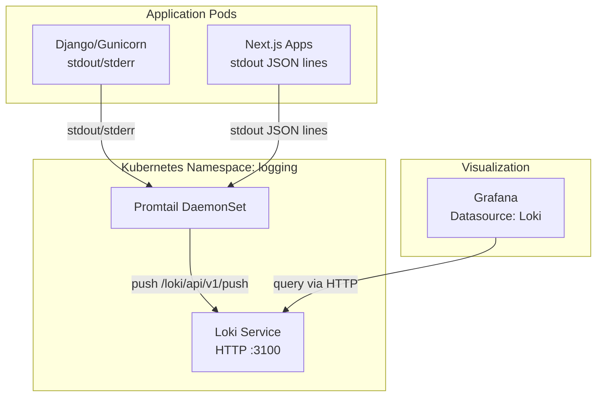
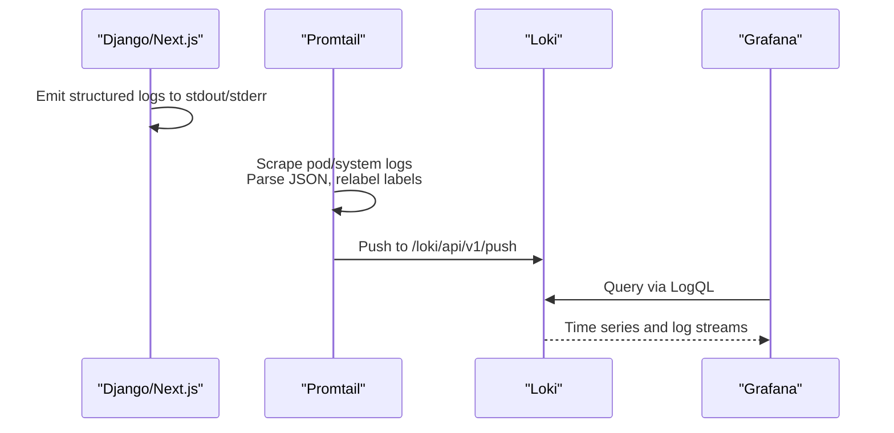
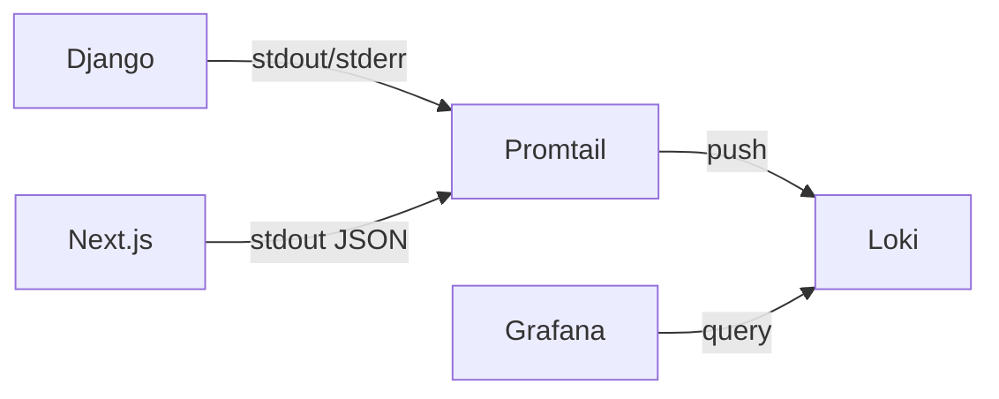

# Centralized Logging with Loki

<cite>
**Referenced Files in This Document**
- [loki.yaml](file://infra/kubernetes/logging/loki.yaml)
- [grafana.yaml](file://infra/kubernetes/monitoring/grafana.yaml)
- [base.py](file://backend/django/core/settings/base.py)
- [Dockerfile](file://backend/Dockerfile)
- [logger.ts](file://frontend/packages/observability/src/logger.ts)
- [redact.ts](file://frontend/packages/observability/src/redact.ts)
- [index.ts](file://frontend/packages/observability/src/index.ts)
- [logger.ts (template-renderer)](file://frontend/apps/template-renderer/src/lib/logger.ts)
- [audit_logger.py](file://backend/django/apps/crm/audit_logger.py)
- [grafana-dashboard.json](file://frontend/apps/template-renderer/observability/grafana-dashboard.json)
</cite>

## Table of Contents
1. [Introduction](#introduction)
2. [Project Structure](#project-structure)
3. [Core Components](#core-components)
4. [Architecture Overview](#architecture-overview)
5. [Detailed Component Analysis](#detailed-component-analysis)
6. [Dependency Analysis](#dependency-analysis)
7. [Performance Considerations](#performance-considerations)
8. [Troubleshooting Guide](#troubleshooting-guide)
9. [Conclusion](#conclusion)
10. [Appendices](#appendices)

## Introduction
This document explains how JOL-HUB centralizes logs using the Loki stack, how Django and Next.js applications emit structured logs, and how to query and visualize those logs in Grafana. It covers deployment of Loki and Promtail, log ingestion from containerized services, structured logging standards, level management, retention policies, LogQL queries, cross-service correlation, and debugging techniques.

## Project Structure
The logging system spans infrastructure manifests, application code, and visualization assets:
- Infrastructure: Loki server, Promtail daemonset, and Grafana datasource configuration are defined under Kubernetes manifests.
- Backend: Django uses Python logging; Gunicorn is configured to stream access and error logs to stdout for collection by Promtail.
- Frontend: Next.js apps use a shared observability package that emits one JSON object per line on stdout, which Promtail ships to Loki.
- Visualization: Grafana dashboards reference Loki as a data source and include LogQL expressions for operational views.

**Diagram sources**
- [loki.yaml:23-71](file://infra/kubernetes/logging/loki.yaml#L23-L71)
- [loki.yaml:158-195](file://infra/kubernetes/logging/loki.yaml#L158-L195)
- [grafana.yaml:10-22](file://infra/kubernetes/monitoring/grafana.yaml#L10-L22)

**Section sources**
- [loki.yaml:1-251](file://infra/kubernetes/logging/loki.yaml#L1-L251)
- [grafana.yaml:1-62](file://infra/kubernetes/monitoring/grafana.yaml#L1-L62)

## Core Components
- Loki Server: In-memory ring, filesystem storage, schema v11, embedded query cache, retention policy, compactor, ruler integration.
- Promtail: Discovers Kubernetes pods and system logs, parses Docker JSON, relabels labels (app, namespace, pod, container), pushes to Loki.
- Django Logging: Python logging configuration with console/file handlers; Gunicorn configured to write access/error logs to stdout/stderr.
- Next.js Structured Logger: Zero-dependency logger emitting one JSON object per line with fields time, level, msg, service; supports child bindings and PII redaction; level gating based on environment.
- Grafana Datasource: Configured to proxy Loki at http://loki:3100; dashboards include LogQL targets.

Key responsibilities:
- Applications produce structured logs to stdout/stderr.
- Promtail scrapes and enriches logs with Kubernetes metadata.
- Loki indexes and stores logs with retention and compaction.
- Grafana queries logs via LogQL for dashboards and ad-hoc investigation.

**Section sources**
- [loki.yaml:23-71](file://infra/kubernetes/logging/loki.yaml#L23-L71)
- [loki.yaml:158-195](file://infra/kubernetes/logging/loki.yaml#L158-L195)
- [base.py:439-513](file://backend/django/core/settings/base.py#L439-L513)
- [Dockerfile:58-71](file://backend/Dockerfile#L58-L71)
- [logger.ts:1-108](file://frontend/packages/observability/src/logger.ts#L1-L108)
- [grafana.yaml:10-22](file://infra/kubernetes/monitoring/grafana.yaml#L10-L22)

## Architecture Overview
End-to-end flow from application to visualization:

**Diagram sources**
- [loki.yaml:158-195](file://infra/kubernetes/logging/loki.yaml#L158-L195)
- [grafana.yaml:10-22](file://infra/kubernetes/monitoring/grafana.yaml#L10-L22)

## Detailed Component Analysis

### Loki Stack Deployment
- Namespace and ServiceAccount isolate logging components.
- ConfigMap defines Loki configuration: ports, path prefix, storage paths, schema v11, embedded cache, retention period, compactor settings, and ruler alertmanager URL.
- Deployment runs grafana/loki with config mounted and persistent storage via PVC.
- Service exposes HTTP and gRPC endpoints.
- Retention: reject old samples beyond max age and enforce retention_period; compactor enabled with delete delay.

Operational notes:
- Embedded cache improves query performance.
- Filesystem-based object store requires adequate disk sizing (PVC).
- Ruler points to Alertmanager for alert rules.

**Section sources**
- [loki.yaml:17-71](file://infra/kubernetes/logging/loki.yaml#L17-L71)
- [loki.yaml:73-147](file://infra/kubernetes/logging/loki.yaml#L73-L147)

### Promtail Configuration and Scraping
- ConfigMap defines server port, positions file, client pushing to Loki push endpoint.
- Scrape configs:
  - kubernetes-pods: discovers pods, parses Docker JSON, relabels app/namespace/pod/container.
  - kubernetes-system: discovers nodes for system logs.
- DaemonSet mounts host logs and container directories read-only, ensuring all container logs are shipped.

Label strategy:
- app, namespace, pod, container labels enable filtering by service and environment.

**Section sources**
- [loki.yaml:152-195](file://infra/kubernetes/logging/loki.yaml#L152-L195)
- [loki.yaml:196-251](file://infra/kubernetes/logging/loki.yaml#L196-L251)

### Django Logging Integration
- Python logging configuration includes formatters (verbose, simple, json), filters, handlers (console, rotating files, admin email), and root logger levels.
- The jolhub logger adapts level based on DEBUG flag.
- Gunicorn command writes access and error logs to stdout/stderr, enabling Promtail to collect them.

Best practices:
- Use structured JSON where possible for consistent parsing.
- Keep sensitive data out of logs or rely on downstream redaction.

**Section sources**
- [base.py:439-513](file://backend/django/core/settings/base.py#L439-L513)
- [Dockerfile:58-71](file://backend/Dockerfile#L58-L71)

### Next.js Structured Logging and Redaction
- Shared observability package provides a zero-dependency logger that emits one JSON object per line on stdout.
- Required fields: time, level, msg, service; additional context via child bindings.
- Level gating: production defaults to info; debug can be overridden via LOG_LEVEL but never allowed below info in production.
- Redaction: deep redaction of sensitive keys and patterns in text (emails, tokens, card numbers, AWS keys, phone numbers); protects UUIDs and ISO timestamps to preserve traceability.
- Batching sink available for client-side telemetry with flush-on-error behavior.

Integration points:
- template-renderer binds a logger instance with service name and environment bindings.
- Tests validate single-line JSON output, level gating, PII redaction, and child binding merging.

**Section sources**
- [logger.ts:1-108](file://frontend/packages/observability/src/logger.ts#L1-L108)
- [logger.ts:108-173](file://frontend/packages/observability/src/logger.ts#L108-L173)
- [redact.ts:1-131](file://frontend/packages/observability/src/redact.ts#L1-L131)
- [index.ts:1-61](file://frontend/packages/observability/src/index.ts#L1-L61)
- [logger.ts (template-renderer):1-19](file://frontend/apps/template-renderer/src/lib/logger.ts#L1-L19)

### Audit Logging in Django CRM
- ComplianceAuditLogger captures tamper-evident audit events with HMAC signatures, field-level change tracking, actor context, GDPR legal basis, and classification flags.
- Emits structured messages via Python logger for external consumption.
- Integrates with Django models and signals to record create/update/delete/access events, consent changes, financial transactions, and unauthorized access attempts.

Compliance alignment:
- Aligns with GDPR, PCI-DSS, SOC2, and ISO 27001 requirements through detailed event capture and integrity checks.

**Section sources**
- [audit_logger.py:1-716](file://backend/django/apps/crm/audit_logger.py#L1-L716)

### Grafana Integration and Dashboards
- Grafana datasource configured to proxy Loki at http://loki:3100.
- Dashboard JSON includes LogQL targets for:
  - HTTP status distribution
  - Client errors by category
  - Top error fingerprints
  - Per-tenant error rates
  - Security and rate-limit events
  - Performance metrics derived from logs

These dashboards demonstrate practical LogQL usage for operational visibility.

**Section sources**
- [grafana.yaml:10-22](file://infra/kubernetes/monitoring/grafana.yaml#L10-L22)
- [grafana-dashboard.json:44-154](file://frontend/apps/template-renderer/observability/grafana-dashboard.json#L44-L154)

## Dependency Analysis
Component relationships and coupling:
- Applications depend on their respective logging libraries (Python logging, Next.js observability package).
- Promtail depends on Kubernetes API for service discovery and on Loki push API.
- Grafana depends on Loki HTTP API for querying.
- Retention and compaction are managed within Loki configuration.

**Diagram sources**
- [loki.yaml:158-195](file://infra/kubernetes/logging/loki.yaml#L158-L195)
- [grafana.yaml:10-22](file://infra/kubernetes/monitoring/grafana.yaml#L10-L22)

**Section sources**
- [loki.yaml:158-195](file://infra/kubernetes/logging/loki.yaml#L158-L195)
- [grafana.yaml:10-22](file://infra/kubernetes/monitoring/grafana.yaml#L10-L22)

## Performance Considerations
- Loki embedded query cache reduces repeated query latency.
- Filesystem object store requires sufficient I/O capacity; monitor disk usage and adjust PVC size accordingly.
- Compactor enables retention cleanup; tune retention_delete_delay based on workload.
- Promtail resource requests/limits should match expected log volume; consider scaling replicas if needed.
- Application-level batching (Next.js) reduces network overhead for client telemetry.

[No sources needed since this section provides general guidance]

## Troubleshooting Guide
Common issues and diagnostics:
- Logs not appearing in Loki:
  - Verify Promtail scrape_configs and relabel_configs target correct labels.
  - Ensure containers emit logs to stdout/stderr (Django Gunicorn flags, Next.js logger default sink).
  - Check Loki push endpoint connectivity and permissions.
- High cardinality or slow queries:
  - Review label cardinality (e.g., high-cardinality request IDs) and avoid indexing excessive fields.
  - Use targeted LogQL filters and time ranges.
- Retention not applied:
  - Confirm retention_period and compactor settings; ensure compactor has enough resources and storage.
- PII leakage concerns:
  - Validate Next.js redaction rules; ensure no sensitive fields bypass redaction.
  - For Django, avoid logging sensitive payloads; rely on structured fields and sanitization.

Debugging steps:
- Inspect Promtail logs for errors and dropped entries.
- Use Grafana Explore to test LogQL queries incrementally.
- Correlate across services using requestId or tenant labels.

[No sources needed since this section provides general guidance]

## Conclusion
JOL-HUB’s centralized logging leverages Loki and Promtail to aggregate structured logs from Django and Next.js into a unified, queryable store. The Next.js observability package enforces strict structured logging and PII redaction, while Django’s logging and Gunicorn configuration ensure comprehensive coverage. Grafana integrates with Loki for visualization and monitoring, and retention policies keep storage manageable. Following the documented standards and query patterns will streamline debugging and compliance reporting.

[No sources needed since this section summarizes without analyzing specific files]

## Appendices

### Log Structure Standards
- Next.js structured records must include:
  - time: ISO timestamp
  - level: debug | info | warn | error | fatal
  - msg: message string
  - service: application identifier
  - Additional fields via child bindings (e.g., tenant, requestId)
- Django logs should be structured where feasible; ensure stdout/stderr emission for collection.

**Section sources**
- [logger.ts:1-108](file://frontend/packages/observability/src/logger.ts#L1-L108)
- [base.py:439-513](file://backend/django/core/settings/base.py#L439-L513)

### Log Level Management
- Next.js: minimum level resolved from environment; production defaults to info; explicit LOG_LEVEL overrides allowed.
- Django: root logger set to INFO; jolhub logger adapts to DEBUG flag.

**Section sources**
- [logger.ts:108-173](file://frontend/packages/observability/src/logger.ts#L108-L173)
- [base.py:492-513](file://backend/django/core/settings/base.py#L492-L513)

### Log Retention Policies
- Loki retention_period set to 744 hours (~31 days).
- Reject old samples older than 168 hours.
- Compactor enabled with retention_enabled and retention_delete_delay.

**Section sources**
- [loki.yaml:62-71](file://infra/kubernetes/logging/loki.yaml#L62-L71)

### LogQL Examples and Patterns
- HTTP status distribution:
  - sum by (status) (count_over_time({service="template-renderer-edge", event="request.handled"}[5m]))
- Client errors by category:
  - sum by (category) (count_over_time({service="template-renderer", event="client-error"}[15m]))
- Top error fingerprints:
  - topk(10, sum by (fingerprint) (count_over_time({service="template-renderer", event="client-error"}[1h])))
- Per-tenant error rate:
  - sum by (tenant) (count_over_time({service="template-renderer-edge", level="warn"}[15m]))
- Latency quantiles:
  - quantile_over_time(0.95, {service="template-renderer-edge", event="request.handled", tenant=~"$tenant"} | json | unwrap durationMs [15m])
- Security and rate limiting:
  - sum(count_over_time({service="template-renderer-edge", event="security.auth-denied"}[15m]))
  - sum(count_over_time({service="template-renderer-edge", event="security.rate-limit"}[15m]))

**Section sources**
- [grafana-dashboard.json:44-154](file://frontend/apps/template-renderer/observability/grafana-dashboard.json#L44-L154)

### Cross-Service Correlation Techniques
- Use requestId or tenant labels propagated via child bindings to correlate logs across services.
- Filter by service and namespace in Promtail relabeling to scope queries.
- Combine LogQL with JSON parsing to extract correlated fields.

**Section sources**
- [logger.ts:1-108](file://frontend/packages/observability/src/logger.ts#L1-L108)
- [loki.yaml:174-184](file://infra/kubernetes/logging/loki.yaml#L174-L184)

### Debugging Techniques Using Centralized Logs
- Start with service and level filters to narrow scope.
- Use time windows appropriate to incident timeframe.
- Leverage topk and count_over_time to identify hotspots.
- Validate redaction effectiveness by searching for known sensitive patterns.

[No sources needed since this section provides general guidance]