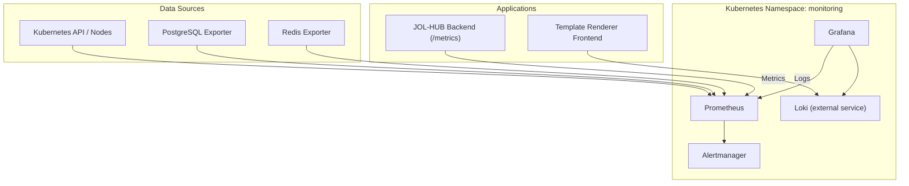
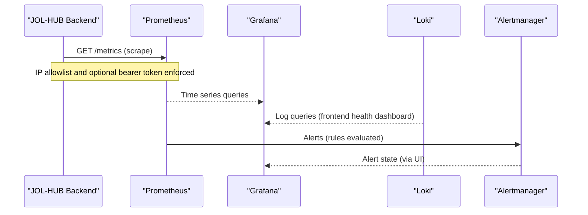
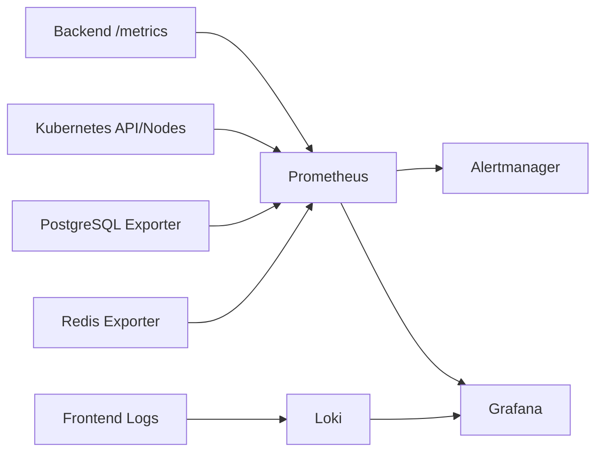

# Grafana Dashboards & Visualization

<cite>
**Referenced Files in This Document**
- [grafana.yaml](file://infra/kubernetes/monitoring/grafana.yaml)
- [prometheus.yaml](file://infra/kubernetes/monitoring/prometheus.yaml)
- [observability.yaml](file://infra/kubernetes/observability/observability.yaml)
- [metrics_endpoint.py](file://backend/django/apps/core/metrics_endpoint.py)
- [grafana-dashboard.json](file://frontend/apps/template-renderer/observability/grafana-dashboard.json)
- [alert-rules.yml](file://frontend/apps/template-renderer/observability/alert-rules.yml)
</cite>

## Table of Contents
1. [Introduction](#introduction)
2. [Project Structure](#project-structure)
3. [Core Components](#core-components)
4. [Architecture Overview](#architecture-overview)
5. [Detailed Component Analysis](#detailed-component-analysis)
6. [Dependency Analysis](#dependency-analysis)
7. [Performance Considerations](#performance-considerations)
8. [Troubleshooting Guide](#troubleshooting-guide)
9. [Conclusion](#conclusion)
10. [Appendices](#appendices)

## Introduction
This document explains how Grafana dashboards and visualizations are set up and used in JOL-HUB. It covers the pre-configured dashboards, data sources, provisioning via Kubernetes ConfigMaps, creating custom dashboards, templating and variables, alerting with Prometheus rules and Alertmanager, and procedures for exporting and sharing dashboards. The goal is to help teams monitor API performance, resource utilization, and business KPIs effectively.

## Project Structure
JOL-HUB deploys a monitoring stack in the monitoring namespace:
- Grafana serves dashboards and connects to Prometheus and Loki.
- Prometheus scrapes metrics from Kubernetes components, exporters, and the backend /metrics endpoint.
- Alertmanager receives alerts from Prometheus and routes them to webhooks or Slack.
- A frontend-specific dashboard uses Loki logs and Prometheus RUM metrics.

**Diagram sources**
- [grafana.yaml:1-414](file://infra/kubernetes/monitoring/grafana.yaml#L1-L414)
- [prometheus.yaml:1-225](file://infra/kubernetes/monitoring/prometheus.yaml#L1-L225)
- [observability.yaml:204-392](file://infra/kubernetes/observability/observability.yaml#L204-L392)

**Section sources**
- [grafana.yaml:1-414](file://infra/kubernetes/monitoring/grafana.yaml#L1-L414)
- [prometheus.yaml:1-225](file://infra/kubernetes/monitoring/prometheus.yaml#L1-L225)
- [observability.yaml:1-392](file://infra/kubernetes/observability/observability.yaml#L1-L392)

## Core Components
- Grafana deployment and provisioning:
  - Datasources provisioned via ConfigMap (Prometheus and Loki).
  - Dashboard provider configured to load JSON files from a mounted path.
  - A built-in “JOL-HUB Overview” dashboard included as a ConfigMap with panels for API response time, request rate, CPU usage, and memory usage.
- Prometheus configuration:
  - Scrape jobs for Kubernetes API servers, nodes, pods, JOL-HUB backend, PostgreSQL exporter, and Redis exporter.
  - Rule files directory mounted for alert rules.
  - Alertmanager target configured.
- Alertmanager:
  - Receives alerts from Prometheus and forwards to a webhook and/or Slack channel.

Key responsibilities:
- Data ingestion: Prometheus scrapes metrics; Loki ingests logs.
- Visualization: Grafana renders dashboards against Prometheus and Loki.
- Alerting: Prometheus evaluates rules; Alertmanager routes notifications.

**Section sources**
- [grafana.yaml:1-414](file://infra/kubernetes/monitoring/grafana.yaml#L1-L414)
- [prometheus.yaml:51-152](file://infra/kubernetes/monitoring/prometheus.yaml#L51-L152)
- [observability.yaml:204-293](file://infra/kubernetes/observability/observability.yaml#L204-L293)

## Architecture Overview
The visualization pipeline connects application telemetry to dashboards and alerts:

**Diagram sources**
- [metrics_endpoint.py:68-153](file://backend/django/apps/core/metrics_endpoint.py#L68-L153)
- [prometheus.yaml:51-152](file://infra/kubernetes/monitoring/prometheus.yaml#L51-L152)
- [grafana.yaml:1-414](file://infra/kubernetes/monitoring/grafana.yaml#L1-L414)
- [observability.yaml:204-293](file://infra/kubernetes/observability/observability.yaml#L204-L293)

## Detailed Component Analysis

### Pre-configured Dashboards
- JOL-HUB Overview:
  - Panels include API Response Time (p95), Request Rate, CPU Usage, Memory Usage.
  - Uses Prometheus datasource and thresholds for quick status visibility.
  - Provisioned via a labeled ConfigMap so Grafana auto-discovers it.
- Frontend Health Dashboard:
  - Uses Loki for log-based metrics (error rates, HTTP status distribution, client errors, per-tenant error rates, slowest tenants).
  - Uses Prometheus for Web Vitals poor-rating share.
  - Includes a tenant variable to filter by tenant label.

How to access:
- The Grafana Service exposes port 80 targeting container port 3000.
- Admin credentials are provided via a Secret; update the default password before production use.

**Section sources**
- [grafana.yaml:41-315](file://infra/kubernetes/monitoring/grafana.yaml#L41-L315)
- [grafana.yaml:317-393](file://infra/kubernetes/monitoring/grafana.yaml#L317-L393)
- [grafana-dashboard.json:1-162](file://frontend/apps/template-renderer/observability/grafana-dashboard.json#L1-L162)

### Data Source Configuration
- Prometheus:
  - Default datasource configured in Grafana’s datasources ConfigMap.
  - Scrape targets include Kubernetes API, nodes, pods, JOL-HUB backend, PostgreSQL exporter, Redis exporter.
- Loki:
  - Datasource configured in Grafana’s datasources ConfigMap for log queries.
- Security:
  - Backend /metrics endpoint enforces an IP allowlist and optional bearer token.

**Section sources**
- [grafana.yaml:5-22](file://infra/kubernetes/monitoring/grafana.yaml#L5-L22)
- [prometheus.yaml:74-152](file://infra/kubernetes/monitoring/prometheus.yaml#L74-L152)
- [metrics_endpoint.py:95-129](file://backend/django/apps/core/metrics_endpoint.py#L95-L129)

### Dashboard Provisioning through ConfigMaps
- Datasources:
  - Mounted into Grafana at /etc/grafana/provisioning/datasources.
- Dashboard provider:
  - Configured to read dashboards from /var/lib/grafana/dashboards.
- Built-in dashboard:
  - A labeled ConfigMap containing jol-hub-overview.json is mounted into the same path for automatic discovery.

To add more dashboards:
- Create additional JSON files and mount them under the same path, or extend the existing dashboard ConfigMap.

**Section sources**
- [grafana.yaml:23-40](file://infra/kubernetes/monitoring/grafana.yaml#L23-L40)
- [grafana.yaml:351-376](file://infra/kubernetes/monitoring/grafana.yaml#L351-L376)

### Custom Dashboard Creation
- Use Grafana UI to build panels against Prometheus or Loki.
- Save dashboards as JSON and commit to version control.
- Add the JSON to a ConfigMap and mount it to the dashboards folder for provisioning.
- For the frontend health dashboard, reuse patterns:
  - Query labels like service and tenant.
  - Compute rates and ratios over time windows.
  - Use thresholds and units for clarity.

**Section sources**
- [grafana.yaml:23-40](file://infra/kubernetes/monitoring/grafana.yaml#L23-L40)
- [grafana-dashboard.json:8-19](file://frontend/apps/template-renderer/observability/grafana-dashboard.json#L8-L19)
- [grafana-dashboard.json:21-162](file://frontend/apps/template-renderer/observability/grafana-dashboard.json#L21-L162)

### Templating and Variables
- The frontend health dashboard defines a query variable named tenant sourced from Loki labels.
- Use variables to:
  - Filter panels by tenant, environment, or service.
  - Enable multi-select for broad comparisons.
  - Combine with PromQL/Loki queries for dynamic filtering.

Example variable pattern:
- Type: query
- Datasource: Loki
- Query: label_values({service="template-renderer-edge"}, tenant)
- Multi: true, Include All: true

**Section sources**
- [grafana-dashboard.json:8-19](file://frontend/apps/template-renderer/observability/grafana-dashboard.json#L8-L19)

### Creating Effective Visualizations
- Choose the right panel type:
  - Timeseries for trends and rates.
  - Gauge for single-value KPIs with thresholds.
  - Table for top-N lists and instant queries.
- Set meaningful thresholds and units:
  - Percentages for error rates.
  - Milliseconds for latency.
  - Requests per second for throughput.
- Keep legends concise and consistent.
- Group related panels and use rows for navigation.

**Section sources**
- [grafana.yaml:60-296](file://infra/kubernetes/monitoring/grafana.yaml#L60-L296)
- [grafana-dashboard.json:21-162](file://frontend/apps/template-renderer/observability/grafana-dashboard.json#L21-L162)

### Setting Up Alerts within Grafana and Prometheus
- Prometheus rules:
  - Rule files are mounted under /etc/prometheus/rules/*.yml.
  - Example frontend rules define severity levels and annotations.
- Alertmanager routing:
  - Routes group by alertname and severity.
  - Default receiver sends webhooks; critical receiver sends Slack messages.
- Grafana integration:
  - Grafana can display alert states and link to runbooks defined in rule annotations.

Best practices:
- Define clear severity levels (P0–P3).
- Include runbook links and incident channels in annotations.
- Tune evaluation intervals and “for” durations to reduce noise.

**Section sources**
- [prometheus.yaml:65-73](file://infra/kubernetes/monitoring/prometheus.yaml#L65-L73)
- [alert-rules.yml:1-144](file://frontend/apps/template-renderer/observability/alert-rules.yml#L1-L144)
- [observability.yaml:204-293](file://infra/kubernetes/observability/observability.yaml#L204-L293)

### Sharing Dashboards with Team Members
- Use Grafana’s built-in sharing features to generate public links or embed snippets.
- For team collaboration:
  - Store dashboards as JSON in version control.
  - Provision via ConfigMaps to ensure consistency across environments.
  - Use folders and tags to organize dashboards.
- Restrict access using RBAC and secure admin credentials.

[No sources needed since this section provides general guidance]

### Export and Import Procedures
- Export:
  - From Grafana UI, export a dashboard to JSON.
  - Commit the JSON to the repository under observability assets.
- Import:
  - Add the JSON to a ConfigMap and mount it to the dashboards folder.
  - Ensure the dashboard provider path matches the mounted location.
- Reuse:
  - Template common panels and variables into reusable libraries.
  - Version dashboards alongside code changes.

**Section sources**
- [grafana.yaml:23-40](file://infra/kubernetes/monitoring/grafana.yaml#L23-L40)
- [grafana.yaml:351-376](file://infra/kubernetes/monitoring/grafana.yaml#L351-L376)

## Dependency Analysis
The following diagram shows key dependencies between components:

**Diagram sources**
- [prometheus.yaml:74-152](file://infra/kubernetes/monitoring/prometheus.yaml#L74-L152)
- [grafana.yaml:1-414](file://infra/kubernetes/monitoring/grafana.yaml#L1-L414)
- [observability.yaml:204-392](file://infra/kubernetes/observability/observability.yaml#L204-L392)

**Section sources**
- [prometheus.yaml:74-152](file://infra/kubernetes/monitoring/prometheus.yaml#L74-L152)
- [grafana.yaml:1-414](file://infra/kubernetes/monitoring/grafana.yaml#L1-L414)
- [observability.yaml:204-392](file://infra/kubernetes/observability/observability.yaml#L204-L392)

## Performance Considerations
- Scrape intervals:
  - Prometheus global scrape interval is set to 30 seconds.
- Retention:
  - Prometheus storage retention is configured for 15 days.
- Resource limits:
  - Grafana and Prometheus have requests and limits to ensure stability.
- Metrics exposure:
  - Backend /metrics supports multiprocess collectors for multi-worker deployments.
- Logging:
  - Loki-based queries should be scoped with labels to minimize scanning overhead.

**Section sources**
- [prometheus.yaml:57-64](file://infra/kubernetes/monitoring/prometheus.yaml#L57-L64)
- [prometheus.yaml:171-180](file://infra/kubernetes/monitoring/prometheus.yaml#L171-L180)
- [grafana.yaml:337-366](file://infra/kubernetes/monitoring/grafana.yaml#L337-L366)
- [metrics_endpoint.py:131-148](file://backend/django/apps/core/metrics_endpoint.py#L131-L148)

## Troubleshooting Guide
Common issues and resolutions:
- No data in Grafana:
  - Verify Prometheus is scraping the backend /metrics endpoint.
  - Check IP allowlist and bearer token settings on the backend.
- High error rates:
  - Use the frontend health dashboard to identify spikes and categories.
  - Review Loki queries for error fingerprints and tenant breakdowns.
- Alerts not firing:
  - Confirm Prometheus rule files are mounted and loaded.
  - Validate Alertmanager receivers and network reachability.
- Dashboard not loading:
  - Ensure ConfigMaps are correctly mounted and labeled for discovery.

Operational checks:
- Test backend /metrics endpoint directly.
- Inspect Prometheus targets and rule evaluation status.
- Validate Alertmanager configuration and connectivity.

**Section sources**
- [metrics_endpoint.py:95-129](file://backend/django/apps/core/metrics_endpoint.py#L95-L129)
- [grafana-dashboard.json:21-162](file://frontend/apps/template-renderer/observability/grafana-dashboard.json#L21-L162)
- [prometheus.yaml:65-73](file://infra/kubernetes/monitoring/prometheus.yaml#L65-L73)
- [observability.yaml:204-293](file://infra/kubernetes/observability/observability.yaml#L204-L293)

## Conclusion
JOL-HUB provides a complete observability stack with Grafana dashboards, Prometheus metrics, Loki logs, and robust alerting. Pre-configured dashboards cover API performance, resource utilization, and frontend health. Dashboards are provisioned via ConfigMaps, enabling reproducible setups. Teams can extend visualizations with templating, create targeted alerts, and share insights securely. Following the guidance here ensures reliable monitoring and rapid issue resolution.

[No sources needed since this section summarizes without analyzing specific files]

## Appendices

### Appendix A: Key Endpoints and Services
- Grafana Service: port 80 -> container port 3000
- Prometheus Service: port 9090
- Alertmanager Service: port 9093
- Backend /metrics: secured by IP allowlist and optional bearer token

**Section sources**
- [grafana.yaml:381-393](file://infra/kubernetes/monitoring/grafana.yaml#L381-L393)
- [prometheus.yaml:202-213](file://infra/kubernetes/monitoring/prometheus.yaml#L202-L213)
- [observability.yaml:282-293](file://infra/kubernetes/observability/observability.yaml#L282-L293)
- [metrics_endpoint.py:95-129](file://backend/django/apps/core/metrics_endpoint.py#L95-L129)

### Appendix B: Business KPIs and Metrics
- API performance: p95 latency, request rate
- Resource utilization: CPU and memory gauges
- Frontend health: error rates, HTTP status distribution, Web Vitals
- Business indicators: commerce conversion drops, booking failure rates (via rules and dashboards)

**Section sources**
- [grafana.yaml:60-296](file://infra/kubernetes/monitoring/grafana.yaml#L60-L296)
- [grafana-dashboard.json:21-162](file://frontend/apps/template-renderer/observability/grafana-dashboard.json#L21-L162)
- [alert-rules.yml:67-95](file://frontend/apps/template-renderer/observability/alert-rules.yml#L67-L95)