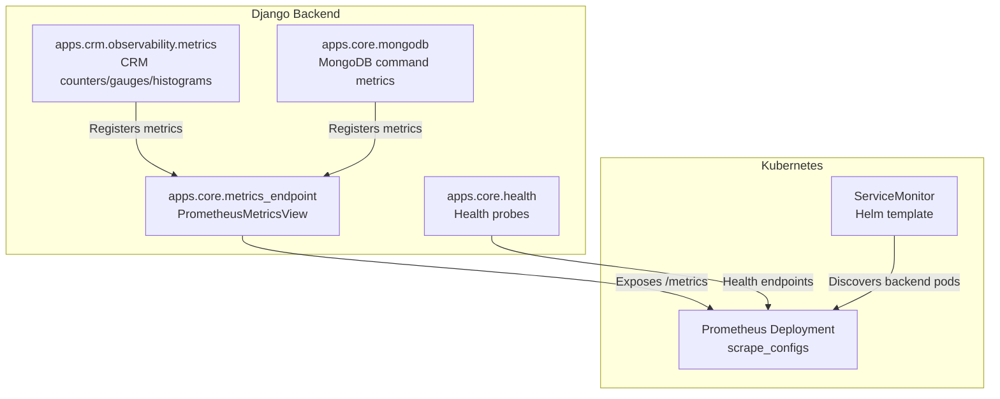
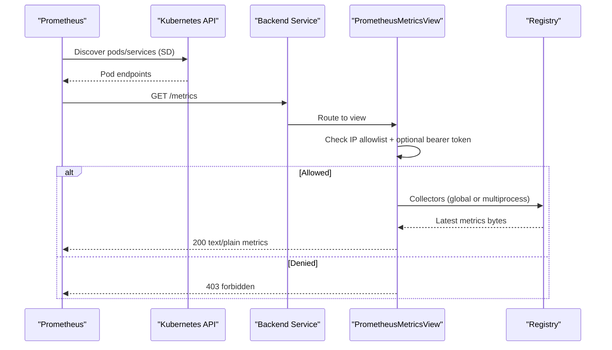
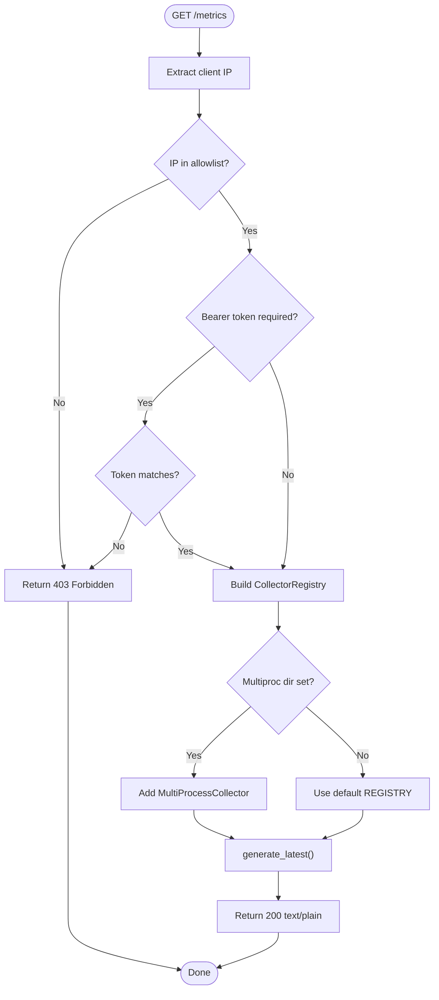
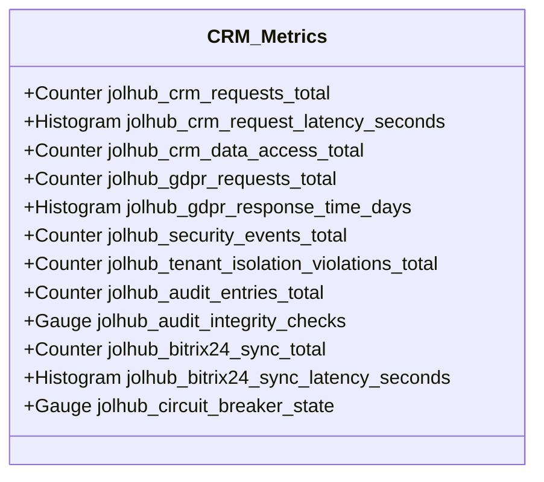
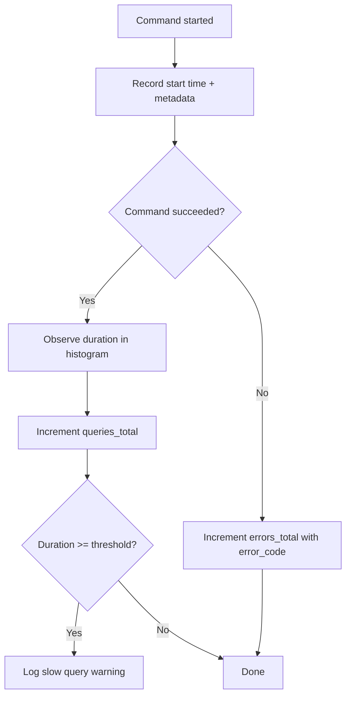
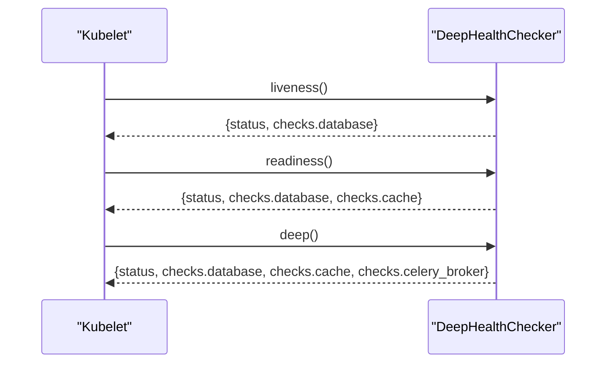
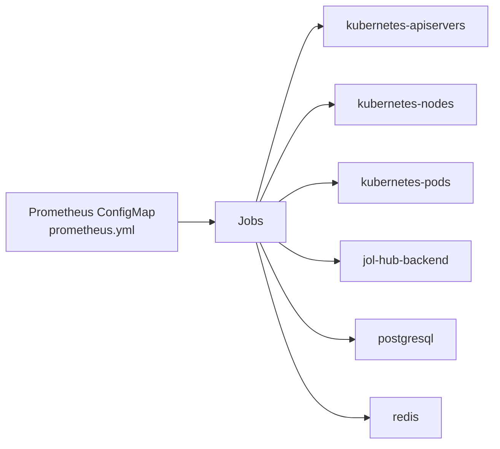
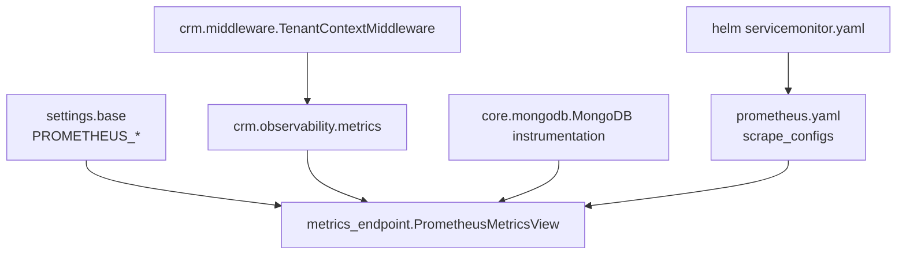

# Metrics Collection & Prometheus

<cite>
**Referenced Files in This Document**
- [metrics_endpoint.py](file://backend/django/apps/core/metrics_endpoint.py)
- [metrics.py](file://backend/django/apps/crm/observability/metrics.py)
- [base.py](file://backend/django/core/settings/base.py)
- [prometheus.yaml](file://infra/kubernetes/monitoring/prometheus.yaml)
- [servicemonitor.yaml](file://infra/helm/jol-hub/templates/servicemonitor.yaml)
- [values.yaml](file://infra/helm/jol-hub/values.yaml)
- [mongodb.py](file://backend/django/apps/core/mongodb.py)
- [health.py](file://backend/django/apps/core/health.py)
</cite>

## Table of Contents
1. Introduction
2. Project Structure
3. Core Components
4. Architecture Overview
5. Detailed Component Analysis
6. Dependency Analysis
7. Performance Considerations
8. Troubleshooting Guide
9. Conclusion
10. Appendices

## Introduction
This document explains how JOL-HUB collects and exposes metrics for Prometheus, including the Django metrics endpoint, custom application metrics, system and integration metrics, and Kubernetes-based scraping configuration. It also covers label strategies, metric types (counters, gauges, histograms), performance monitoring patterns, retention policies, and query optimization techniques.

## Project Structure
JOL-HUB implements a secure /metrics HTTP endpoint that exposes all registered Prometheus collectors. Application-level metrics are defined in the CRM observability module and MongoDB instrumentation. Prometheus is deployed in Kubernetes with ServiceMonitor support via Helm.

**Diagram sources**
- [metrics_endpoint.py:68-153](file://backend/django/apps/core/metrics_endpoint.py#L68-L153)
- [metrics.py:33-113](file://backend/django/apps/crm/observability/metrics.py#L33-L113)
- [mongodb.py:62-79](file://backend/django/apps/core/mongodb.py#L62-L79)
- [health.py:55-127](file://backend/django/apps/core/health.py#L55-L127)
- [servicemonitor.yaml:1-19](file://infra/helm/jol-hub/templates/servicemonitor.yaml#L1-L19)
- [prometheus.yaml:51-151](file://infra/kubernetes/monitoring/prometheus.yaml#L51-L151)

**Section sources**
- [metrics_endpoint.py:1-153](file://backend/django/apps/core/metrics_endpoint.py#L1-L153)
- [metrics.py:1-113](file://backend/django/apps/crm/observability/metrics.py#L1-L113)
- [mongodb.py:43-79](file://backend/django/apps/core/mongodb.py#L43-L79)
- [prometheus.yaml:51-151](file://infra/kubernetes/monitoring/prometheus.yaml#L51-L151)
- [servicemonitor.yaml:1-19](file://infra/helm/jol-hub/templates/servicemonitor.yaml#L1-L19)

## Core Components
- Secure /metrics endpoint: IP allowlist and optional bearer token gating; multi-process registry support.
- CRM observability metrics: request counts/latency, data access, GDPR requests/response time, security events, tenant isolation violations, audit entries/integrity, Bitrix24 sync operations/latency, circuit breaker state.
- MongoDB instrumentation: per-command duration histogram, total queries counter, error counter with error codes.
- Health checks: liveness/readiness/deep health aggregators for database, cache, and Celery broker.
- Prometheus stack: scrape intervals, job definitions for Kubernetes components and exporters, persistent storage, and retention policy.

**Section sources**
- [metrics_endpoint.py:68-153](file://backend/django/apps/core/metrics_endpoint.py#L68-L153)
- [metrics.py:33-113](file://backend/django/apps/crm/observability/metrics.py#L33-L113)
- [mongodb.py:62-79](file://backend/django/apps/core/mongodb.py#L62-L79)
- [health.py:55-127](file://backend/django/apps/core/health.py#L55-L127)
- [prometheus.yaml:51-151](file://infra/kubernetes/monitoring/prometheus.yaml#L51-L151)

## Architecture Overview
The Django app registers Prometheus collectors at startup. The /metrics endpoint validates the caller’s identity and returns the latest metrics in Prometheus text format. Prometheus discovers the backend via Kubernetes service discovery or ServiceMonitor and scrapes the endpoint at configured intervals. System and third-party exporters expose infrastructure metrics alongside application metrics.

**Diagram sources**
- [metrics_endpoint.py:84-153](file://backend/django/apps/core/metrics_endpoint.py#L84-L153)
- [prometheus.yaml:100-151](file://infra/kubernetes/monitoring/prometheus.yaml#L100-L151)

## Detailed Component Analysis

### Django Metrics Endpoint
- Purpose: Expose all registered Prometheus metrics in standard text exposition format.
- Security:
  - IP allowlist from settings; empty list allows all (development).
  - Optional bearer token check via Authorization header.
- Multi-process support: Uses multiprocess collector when configured; otherwise uses global registry.
- Response: HTTP 200 with content type set to the latest Prometheus exposition type; HTTP 403 on authorization failure.

**Diagram sources**
- [metrics_endpoint.py:48-153](file://backend/django/apps/core/metrics_endpoint.py#L48-L153)

**Section sources**
- [metrics_endpoint.py:68-153](file://backend/django/apps/core/metrics_endpoint.py#L68-L153)
- [base.py:673-686](file://backend/django/core/settings/base.py#L673-L686)

### CRM Observability Metrics
- Request metrics:
  - Counter for total CRM API requests with labels: tenant_id, endpoint, method, status.
  - Histogram for request latency with labels: tenant_id, endpoint.
- Data access metrics:
  - Counter for data access operations with labels: tenant_id, entity_type, operation, data_classification.
- GDPR metrics:
  - Counter for data subject requests with labels: tenant_id, request_type, status.
  - Histogram for response time in days with labels: tenant_id, request_type.
- Security and compliance:
  - Counters for security events and tenant isolation violations.
  - Audit entry counter and integrity gauge.
- Integrations:
  - Bitrix24 sync operation counter and latency histogram.
  - Circuit breaker state gauge.

**Diagram sources**
- [metrics.py:33-113](file://backend/django/apps/crm/observability/metrics.py#L33-L113)

**Section sources**
- [metrics.py:33-113](file://backend/django/apps/crm/observability/metrics.py#L33-L113)

### MongoDB Instrumentation
- Tracks MongoDB command durations using a histogram with fine-grained buckets around the slow-query threshold.
- Counts total commands and failed commands with labels for command name, collection/database, and error code.
- Logs warnings for slow queries based on configurable threshold.

**Diagram sources**
- [mongodb.py:62-79](file://backend/django/apps/core/mongodb.py#L62-L79)
- [mongodb.py:121-190](file://backend/django/apps/core/mongodb.py#L121-L190)

**Section sources**
- [mongodb.py:62-79](file://backend/django/apps/core/mongodb.py#L62-L79)
- [mongodb.py:121-190](file://backend/django/apps/core/mongodb.py#L121-L190)

### Health Checks
- Liveness: minimal DB ping to detect unrecoverable failures.
- Readiness: DB and cache availability to gate traffic.
- Deep: includes Celery broker connectivity for external monitoring systems.

**Diagram sources**
- [health.py:55-127](file://backend/django/apps/core/health.py#L55-L127)

**Section sources**
- [health.py:55-127](file://backend/django/apps/core/health.py#L55-L127)

### Prometheus Scraping Configuration
- Global scrape and evaluation intervals.
- Jobs for:
  - Kubernetes API server and nodes.
  - Pods annotated for scraping.
  - JOL-HUB backend pods filtered by labels.
  - PostgreSQL and Redis exporters via static targets.
- Retention: time-based retention configured in Prometheus args.
- Storage: persistent volume claim for TSDB.

**Diagram sources**
- [prometheus.yaml:51-151](file://infra/kubernetes/monitoring/prometheus.yaml#L51-L151)

**Section sources**
- [prometheus.yaml:51-151](file://infra/kubernetes/monitoring/prometheus.yaml#L51-L151)
- [prometheus.yaml:172-179](file://infra/kubernetes/monitoring/prometheus.yaml#L172-L179)

### Helm ServiceMonitor Integration
- ServiceMonitor resource enables automatic discovery of the backend service port and path for scraping.
- Interval and path are configurable via Helm values.

**Section sources**
- [servicemonitor.yaml:1-19](file://infra/helm/jol-hub/templates/servicemonitor.yaml#L1-L19)
- [values.yaml:242-249](file://infra/helm/jol-hub/values.yaml#L242-L249)

## Dependency Analysis
- The metrics endpoint depends on Django settings for access control and multiprocess directory.
- CRM metrics depend on tenant context middleware to obtain tenant_id for labeling.
- MongoDB metrics depend on pymongo monitoring hooks and settings for thresholds.
- Prometheus depends on Kubernetes SD and/or ServiceMonitor to discover targets.

**Diagram sources**
- [base.py:673-686](file://backend/django/core/settings/base.py#L673-L686)
- [metrics_endpoint.py:84-153](file://backend/django/apps/core/metrics_endpoint.py#L84-L153)
- [metrics.py:33-113](file://backend/django/apps/crm/observability/metrics.py#L33-L113)
- [mongodb.py:62-79](file://backend/django/apps/core/mongodb.py#L62-L79)
- [prometheus.yaml:100-151](file://infra/kubernetes/monitoring/prometheus.yaml#L100-L151)
- [servicemonitor.yaml:1-19](file://infra/helm/jol-hub/templates/servicemonitor.yaml#L1-L19)

**Section sources**
- [base.py:673-686](file://backend/django/core/settings/base.py#L673-L686)
- [metrics_endpoint.py:84-153](file://backend/django/apps/core/metrics_endpoint.py#L84-L153)
- [metrics.py:33-113](file://backend/django/apps/crm/observability/metrics.py#L33-L113)
- [mongodb.py:62-79](file://backend/django/apps/core/mongodb.py#L62-L79)
- [prometheus.yaml:100-151](file://infra/kubernetes/monitoring/prometheus.yaml#L100-L151)
- [servicemonitor.yaml:1-19](file://infra/helm/jol-hub/templates/servicemonitor.yaml#L1-L19)

## Performance Considerations
- Label cardinality:
  - Prefer bounded label sets (e.g., tenant_id, endpoint, method, status). Avoid high-cardinality free-form strings.
  - For CRM metrics, use stable endpoint names and methods rather than raw URLs.
- Histogram bucket design:
  - CRM latency and MongoDB duration histograms include buckets around critical thresholds to detect regressions quickly.
- Multi-process mode:
  - When running multiple workers, configure the multiprocess directory so each worker writes metrics files aggregated by Prometheus.
- Scrape tuning:
  - Adjust scrape_interval and scrapeTimeout to balance freshness and load.
  - Use relabeling to keep only necessary labels and reduce memory usage.
- Query optimization:
  - Pre-aggregate with rate(), increase(), and histogram_quantile() to reduce query cost.
  - Filter by namespace/job labels early in PromQL expressions.

[No sources needed since this section provides general guidance]

## Troubleshooting Guide
- 403 Forbidden on /metrics:
  - Verify PROMETHEUS_ALLOWED_IPS contains the Prometheus server IPs.
  - If PROMETHEUS_AUTH_TOKEN is set, ensure the Authorization header includes the correct bearer token.
- Missing metrics:
  - Ensure the app process has imported the modules that define metrics (CRM observability and MongoDB instrumentation).
  - Confirm multiprocess directory is set if using multiple workers and that Prometheus can read it.
- High cardinality or memory pressure:
  - Reduce label dimensions or cap unique values (e.g., avoid raw user IDs or long paths).
  - Review relabel_configs to drop unnecessary labels before ingestion.
- Slow queries not captured:
  - Check MONGODB_SLOW_QUERY_THRESHOLD_S setting and adjust as needed.
  - Validate that pymongo monitoring hooks are active.

**Section sources**
- [metrics_endpoint.py:95-129](file://backend/django/apps/core/metrics_endpoint.py#L95-L129)
- [base.py:673-686](file://backend/django/core/settings/base.py#L673-L686)
- [mongodb.py:161-172](file://backend/django/apps/core/mongodb.py#L161-L172)

## Conclusion
JOL-HUB provides a secure, production-ready metrics pipeline:
- A hardened /metrics endpoint with IP and optional token gating.
- Rich application metrics across CRM workflows, GDPR handling, security, and integrations.
- MongoDB instrumentation for query performance and error tracking.
- Kubernetes-native Prometheus deployment with ServiceMonitor-driven scraping and persistent storage.
Adopting low-cardinality labels, tuned histograms, and efficient PromQL will ensure scalable and actionable observability.

[No sources needed since this section summarizes without analyzing specific files]

## Appendices

### Metric Types and Examples
- Counters:
  - Total CRM API requests, data access operations, GDPR requests, security events, tenant isolation violations, audit entries, Bitrix24 sync operations, MongoDB queries total/errors.
- Gauges:
  - Audit integrity checks result, Bitrix24 circuit breaker state.
- Histograms:
  - CRM request latency seconds, GDPR response time days, Bitrix24 sync latency seconds, MongoDB query duration seconds.

**Section sources**
- [metrics.py:33-113](file://backend/django/apps/crm/observability/metrics.py#L33-L113)
- [mongodb.py:62-79](file://backend/django/apps/core/mongodb.py#L62-L79)

### Label Strategies
- Use tenant_id consistently for multi-tenant segmentation.
- Keep endpoint and method labels stable; avoid embedding dynamic IDs.
- For MongoDB metrics, use command_name, collection, and database; avoid high-cardinality fields like user IDs.

**Section sources**
- [metrics.py:33-113](file://backend/django/apps/crm/observability/metrics.py#L33-L113)
- [mongodb.py:62-79](file://backend/django/apps/core/mongodb.py#L62-L79)

### Prometheus Scraping and Retention
- Scrape intervals:
  - Global scrape_interval and evaluation_interval configured in Prometheus config.
- Jobs:
  - Kubernetes API, nodes, pods, JOL-HUB backend, PostgreSQL exporter, Redis exporter.
- Retention:
  - Time-based retention configured via Prometheus arguments.
- Storage:
  - PersistentVolumeClaim sized for expected retention.

**Section sources**
- [prometheus.yaml:51-151](file://infra/kubernetes/monitoring/prometheus.yaml#L51-L151)
- [prometheus.yaml:172-179](file://infra/kubernetes/monitoring/prometheus.yaml#L172-L179)
- [prometheus.yaml:214-224](file://infra/kubernetes/monitoring/prometheus.yaml#L214-L224)

### Helm Values for Monitoring
- Enable monitoring and ServiceMonitor with configurable interval and path.

**Section sources**
- [values.yaml:242-249](file://infra/helm/jol-hub/values.yaml#L242-L249)