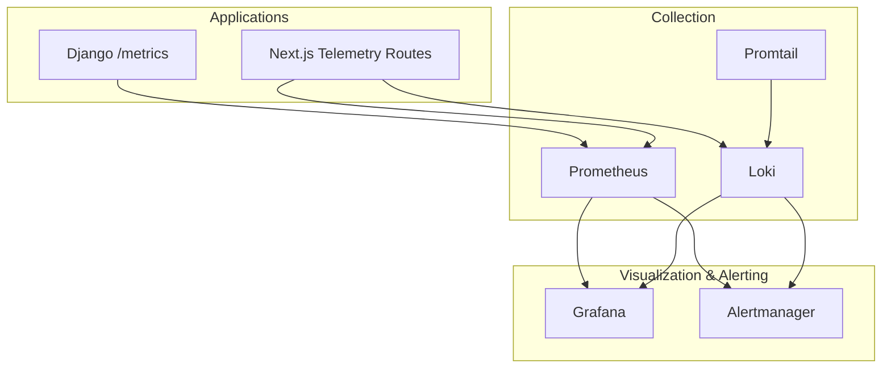
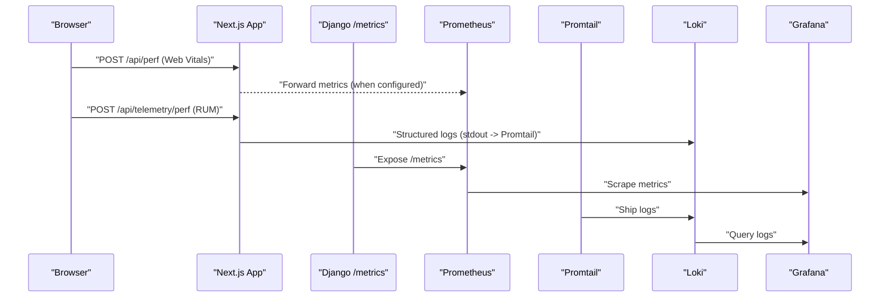
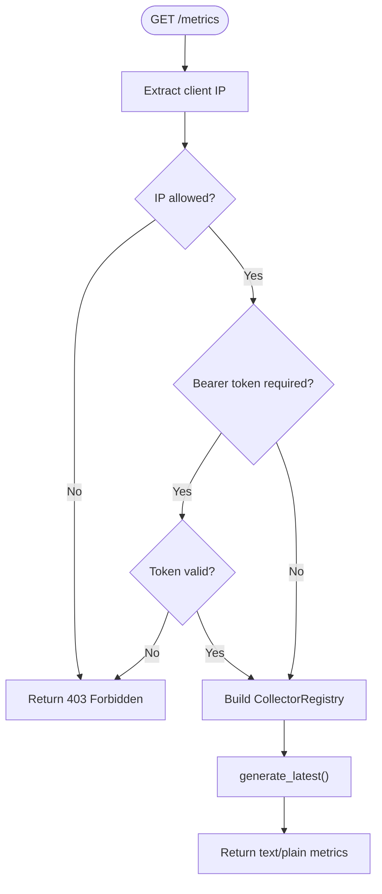
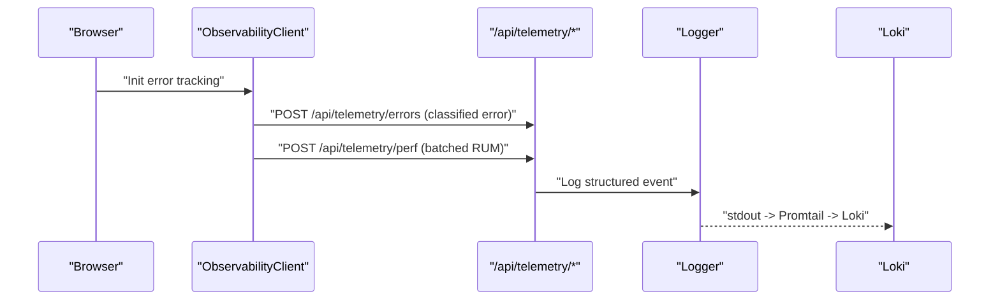
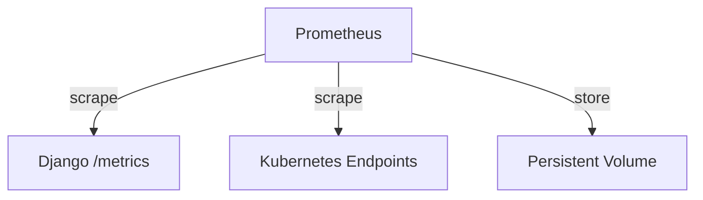
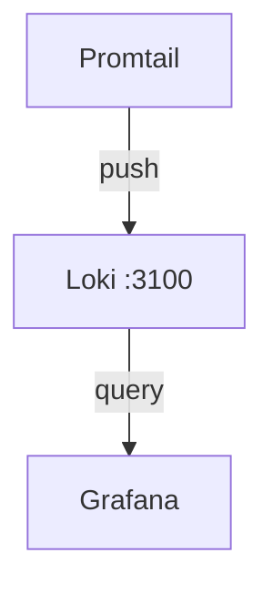
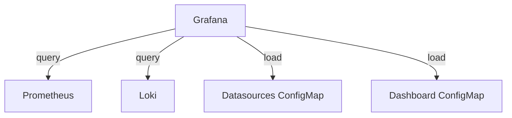
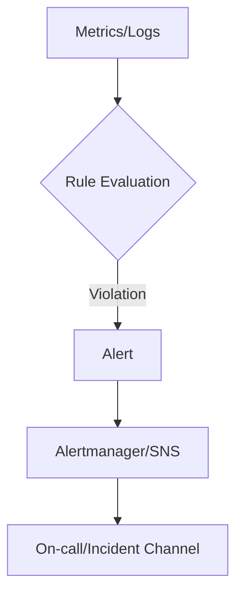
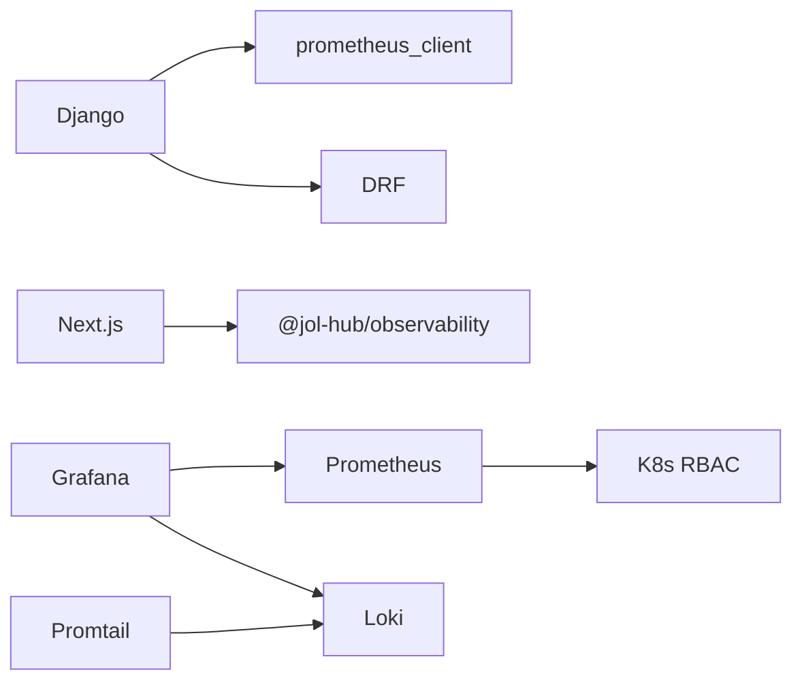

# Monitoring & Observability

<cite>
**Referenced Files in This Document**
- [metrics_endpoint.py](file://backend/django/apps/core/metrics_endpoint.py)
- [base.py](file://backend/django/core/settings/base.py)
- [health.py](file://backend/django/apps/core/health.py)
- [prometheus.yaml](file://infra/kubernetes/monitoring/prometheus.yaml)
- [grafana.yaml](file://infra/kubernetes/monitoring/grafana.yaml)
- [loki.yaml](file://infra/kubernetes/logging/loki.yaml)
- [logger.ts](file://frontend/packages/observability/src/logger.ts)
- [ObservabilityClient.tsx](file://frontend/apps/template-renderer/src/components/ObservabilityClient.tsx)
- [route.ts (perf)](file://frontend/apps/template-renderer/src/app/api/perf/route.ts)
- [route.ts (telemetry perf)](file://frontend/apps/template-renderer/src/app/api/telemetry/perf/route.ts)
- [error-tracking.ts](file://frontend/apps/template-renderer/src/lib/error-tracking.ts)
- [alert-rules.yml](file://frontend/apps/template-renderer/observability/alert-rules.yml)
- [rules.yaml.tpl](file://infra/terraform/modules/monitoring/templates/rules.yaml.tpl)
- [main.tf (monitoring)](file://infra/terraform/modules/monitoring/main.tf)
</cite>

## Table of Contents
1. Introduction
2. Project Structure
3. Core Components
4. Architecture Overview
5. Detailed Component Analysis
6. Dependency Analysis
7. Performance Considerations
8. Troubleshooting Guide
9. Conclusion
10. Appendices

## Introduction
This document describes the monitoring and observability stack for JOL-HUB, covering Prometheus metrics collection, Grafana dashboards, centralized logging with Loki, alerting rules, application-level metrics in Django and Next.js, custom dashboard creation, log aggregation strategies, incident response procedures, performance monitoring, error tracking, capacity planning, and troubleshooting techniques.

## Project Structure
JOL-HUB implements a layered observability strategy:
- Application layer: Django exposes a secure /metrics endpoint; Next.js apps emit structured logs and RUM telemetry via dedicated routes.
- Collection layer: Prometheus scrapes application metrics; Promtail ships container logs to Loki.
- Visualization and alerting: Grafana provides dashboards and integrates with Prometheus and Loki; Alertmanager and Terraform-managed alerts handle notifications.

**Diagram sources**
- [metrics_endpoint.py:68-153](file://backend/django/apps/core/metrics_endpoint.py#L68-L153)
- [prometheus.yaml:57-63](file://infra/kubernetes/monitoring/prometheus.yaml#L57-L63)
- [loki.yaml:23-69](file://infra/kubernetes/logging/loki.yaml#L23-L69)
- [grafana.yaml:10-22](file://infra/kubernetes/monitoring/grafana.yaml#L10-L22)

**Section sources**
- [metrics_endpoint.py:68-153](file://backend/django/apps/core/metrics_endpoint.py#L68-L153)
- [prometheus.yaml:57-63](file://infra/kubernetes/monitoring/prometheus.yaml#L57-L63)
- [loki.yaml:23-69](file://infra/kubernetes/logging/loki.yaml#L23-L69)
- [grafana.yaml:10-22](file://infra/kubernetes/monitoring/grafana.yaml#L10-L22)

## Core Components
- Django metrics endpoint: Securely exposes Prometheus metrics with IP allowlist and optional bearer token, supports multi-process collectors.
- Next.js observability: Structured JSON-lines logger, client-side error tracking, performance telemetry ingestion endpoints, consent-gated analytics.
- Prometheus: Scrapes application metrics with cluster labels and evaluation intervals.
- Loki: Centralized log storage with retention and compactor settings; Promtail collects Kubernetes pod logs.
- Grafana: Pre-provisioned datasources and a JOL-HUB overview dashboard; persistent storage for dashboards.
- Alerting: Frontend alert rules (P0–P3), backend Terraform-managed Prometheus rules, and CloudWatch alarms for infrastructure.

**Section sources**
- [metrics_endpoint.py:68-153](file://backend/django/apps/core/metrics_endpoint.py#L68-L153)
- [logger.ts:1-173](file://frontend/packages/observability/src/logger.ts#L1-L173)
- [ObservabilityClient.tsx:1-75](file://frontend/apps/template-renderer/src/components/ObservabilityClient.tsx#L1-L75)
- [prometheus.yaml:57-63](file://infra/kubernetes/monitoring/prometheus.yaml#L57-L63)
- [loki.yaml:23-69](file://infra/kubernetes/logging/loki.yaml#L23-L69)
- [grafana.yaml:10-22](file://infra/kubernetes/monitoring/grafana.yaml#L10-L22)
- [alert-rules.yml:18-144](file://frontend/apps/template-renderer/observability/alert-rules.yml#L18-L144)
- [rules.yaml.tpl:37-115](file://infra/terraform/modules/monitoring/templates/rules.yaml.tpl#L37-L115)
- [main.tf (monitoring):163-247](file://infra/terraform/modules/monitoring/main.tf#L163-L247)

## Architecture Overview
The observability architecture spans application instrumentation, metric/log collection, visualization, and alerting.

**Diagram sources**
- [route.ts (perf):1-36](file://frontend/apps/template-renderer/src/app/api/perf/route.ts#L1-L36)
- [route.ts (telemetry perf):1-39](file://frontend/apps/template-renderer/src/app/api/telemetry/perf/route.ts#L1-L39)
- [metrics_endpoint.py:68-153](file://backend/django/apps/core/metrics_endpoint.py#L68-L153)
- [prometheus.yaml:57-63](file://infra/kubernetes/monitoring/prometheus.yaml#L57-L63)
- [loki.yaml:158-177](file://infra/kubernetes/logging/loki.yaml#L158-L177)
- [grafana.yaml:10-22](file://infra/kubernetes/monitoring/grafana.yaml#L10-L22)

## Detailed Component Analysis

### Django Metrics Endpoint
- Purpose: Expose Prometheus-compatible metrics with strict access control.
- Security: IP allowlist check and optional Bearer token validation; logs denied attempts.
- Multi-process support: Uses multiprocess collector when configured; otherwise uses global registry.
- GDPR note: No PII in metrics; labels must be pre-registered and safe.

**Diagram sources**
- [metrics_endpoint.py:68-153](file://backend/django/apps/core/metrics_endpoint.py#L68-L153)

**Section sources**
- [metrics_endpoint.py:68-153](file://backend/django/apps/core/metrics_endpoint.py#L68-L153)

### Next.js Logging and Error Tracking
- Structured logger: Produces JSON-lines with time, level, msg, service; deep redaction applied to all fields; production-safe minimum log level.
- Client bootstrap: Installs global error handlers, batches navigation/resource performance samples, sends to /api/telemetry/perf when analytics consent is given.
- Error reporting: Classifies errors by category/severity, deduplicates within a window, attaches breadcrumbs, and posts to /api/telemetry/errors.

**Diagram sources**
- [ObservabilityClient.tsx:1-75](file://frontend/apps/template-renderer/src/components/ObservabilityClient.tsx#L1-L75)
- [logger.ts:1-173](file://frontend/packages/observability/src/logger.ts#L1-L173)
- [error-tracking.ts:44-83](file://frontend/apps/template-renderer/src/lib/error-tracking.ts#L44-L83)
- [route.ts (telemetry perf):1-39](file://frontend/apps/template-renderer/src/app/api/telemetry/perf/route.ts#L1-L39)
- [loki.yaml:158-177](file://infra/kubernetes/logging/loki.yaml#L158-L177)

**Section sources**
- [logger.ts:1-173](file://frontend/packages/observability/src/logger.ts#L1-L173)
- [ObservabilityClient.tsx:1-75](file://frontend/apps/template-renderer/src/components/ObservabilityClient.tsx#L1-L75)
- [error-tracking.ts:44-83](file://frontend/apps/template-renderer/src/lib/error-tracking.ts#L44-L83)

### Prometheus Configuration and Scraping
- Global scrape and evaluation intervals set to 30s; external labels include cluster and environment.
- RBAC grants read access to nodes, services, endpoints, pods, ingresses, and /metrics non-resource URL.
- Persistent storage provisioned for metric retention.

**Diagram sources**
- [prometheus.yaml:57-63](file://infra/kubernetes/monitoring/prometheus.yaml#L57-L63)
- [prometheus.yaml:17-36](file://infra/kubernetes/monitoring/prometheus.yaml#L17-L36)
- [prometheus.yaml:182-224](file://infra/kubernetes/monitoring/prometheus.yaml#L182-L224)

**Section sources**
- [prometheus.yaml:57-63](file://infra/kubernetes/monitoring/prometheus.yaml#L57-L63)
- [prometheus.yaml:17-36](file://infra/kubernetes/monitoring/prometheus.yaml#L17-L36)
- [prometheus.yaml:182-224](file://infra/kubernetes/monitoring/prometheus.yaml#L182-L224)

### Loki Log Aggregation
- Single-node Loki with filesystem storage, query cache, schema v11, retention policy, and compactor enabled.
- Promtail configured to collect Kubernetes pod logs and push to Loki’s HTTP endpoint.

**Diagram sources**
- [loki.yaml:23-69](file://infra/kubernetes/logging/loki.yaml#L23-L69)
- [loki.yaml:158-177](file://infra/kubernetes/logging/loki.yaml#L158-L177)

**Section sources**
- [loki.yaml:23-69](file://infra/kubernetes/logging/loki.yaml#L23-L69)
- [loki.yaml:158-177](file://infra/kubernetes/logging/loki.yaml#L158-L177)

### Grafana Dashboards and Datasources
- Datasources: Prometheus and Loki provisioned via ConfigMap.
- Dashboard provider: File-based provisioning from ConfigMap; includes a JOL-HUB overview dashboard with panels for API latency, request rate, CPU, and memory.
- Storage: Persistent volume for Grafana data.

**Diagram sources**
- [grafana.yaml:10-22](file://infra/kubernetes/monitoring/grafana.yaml#L10-L22)
- [grafana.yaml:24-47](file://infra/kubernetes/monitoring/grafana.yaml#L24-L47)
- [grafana.yaml:48-315](file://infra/kubernetes/monitoring/grafana.yaml#L48-L315)

**Section sources**
- [grafana.yaml:10-22](file://infra/kubernetes/monitoring/grafana.yaml#L10-L22)
- [grafana.yaml:48-315](file://infra/kubernetes/monitoring/grafana.yaml#L48-L315)

### Alerting Rules
- Frontend alert rules define severity tiers (P0–P3) based on log rates, health probes, and RUM metrics.
- Backend Prometheus rules cover database, Redis, Celery, and container resource thresholds.
- CloudWatch alarms monitor API latency, error rate, and database CPU.

**Diagram sources**
- [alert-rules.yml:18-144](file://frontend/apps/template-renderer/observability/alert-rules.yml#L18-L144)
- [rules.yaml.tpl:37-115](file://infra/terraform/modules/monitoring/templates/rules.yaml.tpl#L37-L115)
- [main.tf (monitoring):163-247](file://infra/terraform/modules/monitoring/main.tf#L163-L247)

**Section sources**
- [alert-rules.yml:18-144](file://frontend/apps/template-renderer/observability/alert-rules.yml#L18-L144)
- [rules.yaml.tpl:37-115](file://infra/terraform/modules/monitoring/templates/rules.yaml.tpl#L37-L115)
- [main.tf (monitoring):163-247](file://infra/terraform/modules/monitoring/main.tf#L163-L247)

## Dependency Analysis
- Django depends on prometheus_client and DRF for metrics exposure; security enforced via settings and view logic.
- Next.js depends on internal observability package for logger and error tracking; routes validate payloads and forward or log telemetry.
- Prometheus depends on Kubernetes RBAC and ServiceMonitors to discover targets.
- Loki depends on Promtail for log shipping; Grafana depends on Prometheus and Loki datasources.

**Diagram sources**
- [metrics_endpoint.py:27-45](file://backend/django/apps/core/metrics_endpoint.py#L27-L45)
- [logger.ts:1-173](file://frontend/packages/observability/src/logger.ts#L1-L173)
- [prometheus.yaml:17-36](file://infra/kubernetes/monitoring/prometheus.yaml#L17-L36)
- [grafana.yaml:10-22](file://infra/kubernetes/monitoring/grafana.yaml#L10-L22)
- [loki.yaml:158-177](file://infra/kubernetes/logging/loki.yaml#L158-L177)

**Section sources**
- [metrics_endpoint.py:27-45](file://backend/django/apps/core/metrics_endpoint.py#L27-L45)
- [logger.ts:1-173](file://frontend/packages/observability/src/logger.ts#L1-L173)
- [prometheus.yaml:17-36](file://infra/kubernetes/monitoring/prometheus.yaml#L17-L36)
- [grafana.yaml:10-22](file://infra/kubernetes/monitoring/grafana.yaml#L10-L22)
- [loki.yaml:158-177](file://infra/kubernetes/logging/loki.yaml#L158-L177)

## Performance Considerations
- Scrape cadence: Prometheus global scrape_interval and evaluation_interval are set to 30 seconds; tune based on cardinality and storage capacity.
- Retention: Loki retention_period configured for 31 days; adjust based on compliance and storage budgets.
- Multi-process metrics: Ensure PROMETHEUS_MULTIPROC_DIR is set when running multiple workers to aggregate metrics correctly.
- Redaction and batching: Logger applies deep redaction and batching to reduce overhead; ensure LOG_LEVEL remains production-safe.
- Health checks: Use /api/health for readiness/liveness; deep health includes Celery broker checks.

[No sources needed since this section provides general guidance]

## Troubleshooting Guide
- Metrics access denied: Verify Prometheus server IPs are in PROMETHEUS_ALLOWED_IPS and bearer token matches PROMETHEUS_AUTH_TOKEN if configured.
- Missing metrics: Confirm Django process sets PROMETHEUS_MULTIPROC_DIR and that Prometheus can reach the endpoint.
- Logs not appearing: Ensure Promtail job kubernetes-pods is active and Loki is reachable at http://loki:3100/loki/api/v1/push.
- High error rates: Inspect frontend error categories and severities; correlate with HTTP status codes and route context.
- Capacity planning: Monitor CPU/memory gauges and request rates; plan scaling when sustained usage approaches thresholds.

**Section sources**
- [metrics_endpoint.py:95-129](file://backend/django/apps/core/metrics_endpoint.py#L95-L129)
- [prometheus.yaml:57-63](file://infra/kubernetes/monitoring/prometheus.yaml#L57-L63)
- [loki.yaml:158-177](file://infra/kubernetes/logging/loki.yaml#L158-L177)
- [grafana.yaml:48-315](file://infra/kubernetes/monitoring/grafana.yaml#L48-L315)

## Conclusion
JOL-HUB’s observability stack combines secure application metrics, structured logging, centralized log aggregation, rich dashboards, and tiered alerting to provide comprehensive visibility into system health, performance, and reliability. The design emphasizes privacy, scalability, and operational clarity, enabling effective incident response and capacity planning.

[No sources needed since this section summarizes without analyzing specific files]

## Appendices

### Custom Dashboard Creation
- Add new panels to the JOL-HUB overview dashboard by editing the dashboard ConfigMap; use Prometheus queries for metrics and Loki queries for logs.
- Persist changes via the Grafana UI or update the ConfigMap and redeploy.

**Section sources**
- [grafana.yaml:24-47](file://infra/kubernetes/monitoring/grafana.yaml#L24-L47)
- [grafana.yaml:48-315](file://infra/kubernetes/monitoring/grafana.yaml#L48-L315)

### Incident Response Procedures
- Detection: Alerts fire based on frontend and backend rules; SNS notifies on-call channels.
- Triage: Use Grafana dashboards and Loki logs to identify affected components and scope.
- Containment: Scale or isolate failing services; disable problematic features if necessary.
- Eradication: Apply fixes and verify via health checks and reduced error rates.
- Recovery: Roll back if needed; confirm stability through dashboards and alerts.
- Lessons Learned: Update runbooks and alert thresholds based on post-incident analysis.

**Section sources**
- [alert-rules.yml:18-144](file://frontend/apps/template-renderer/observability/alert-rules.yml#L18-L144)
- [main.tf (monitoring):163-247](file://infra/terraform/modules/monitoring/main.tf#L163-L247)