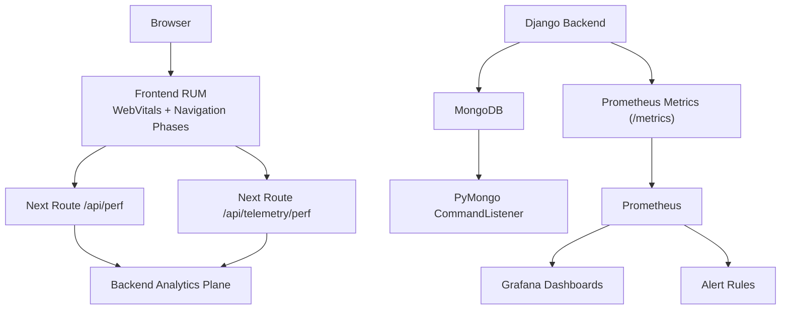
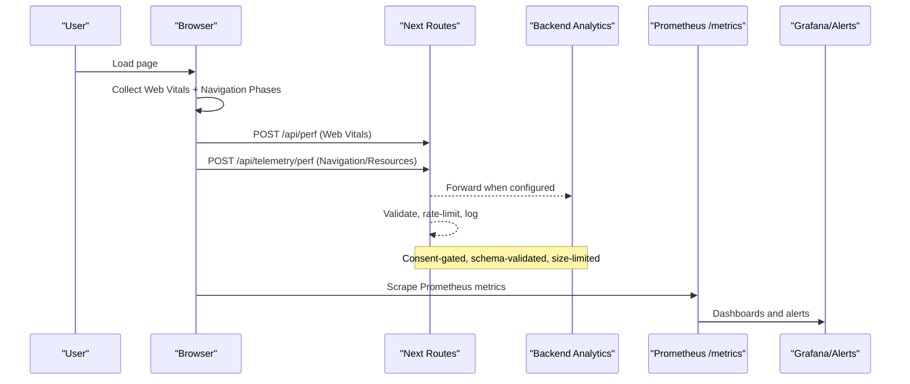
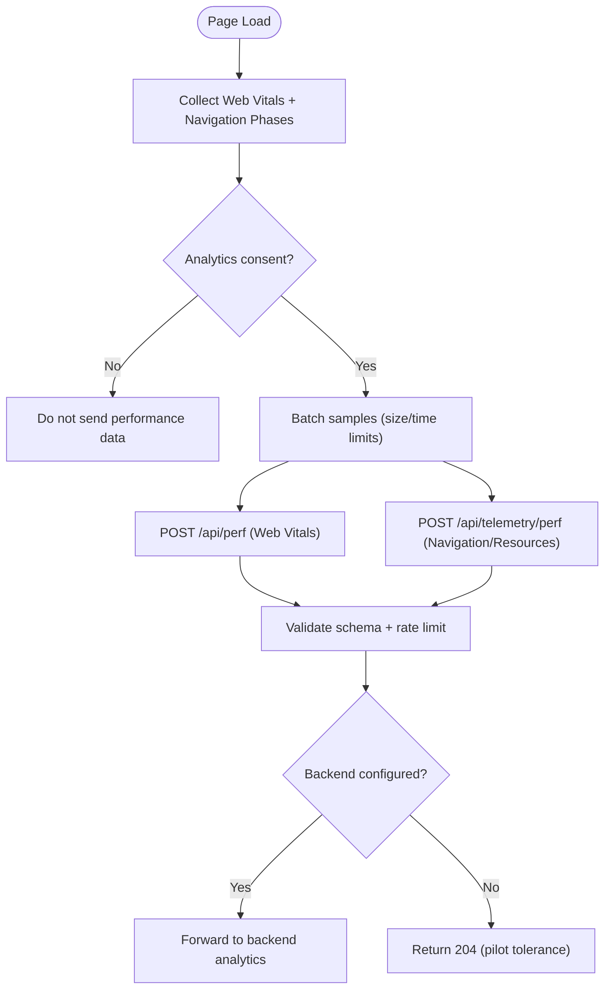
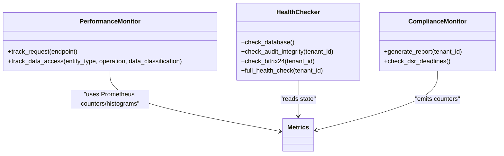
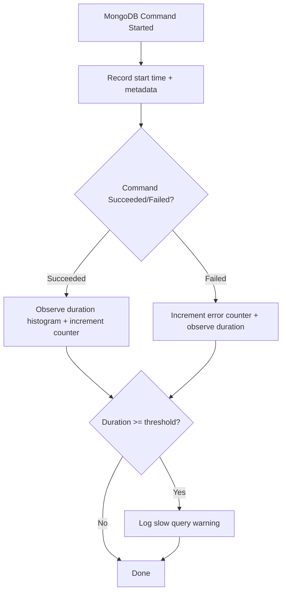
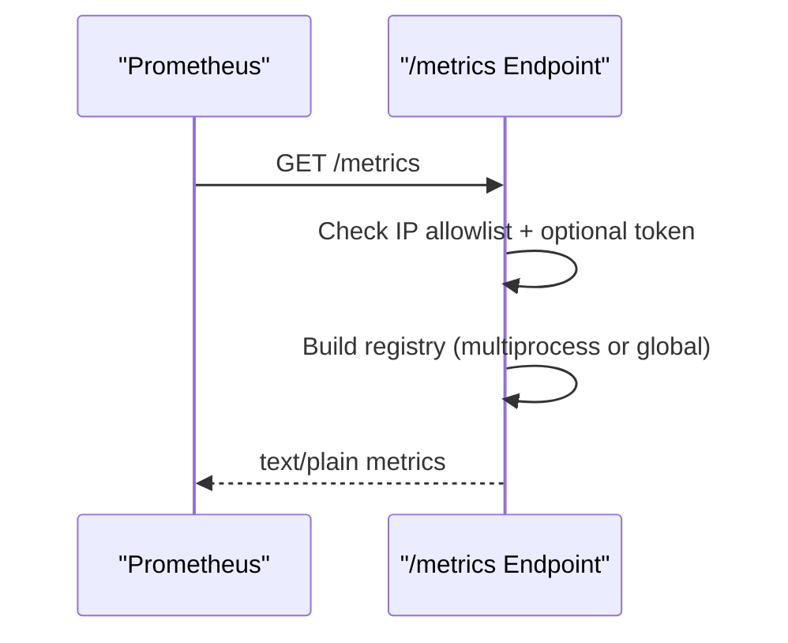
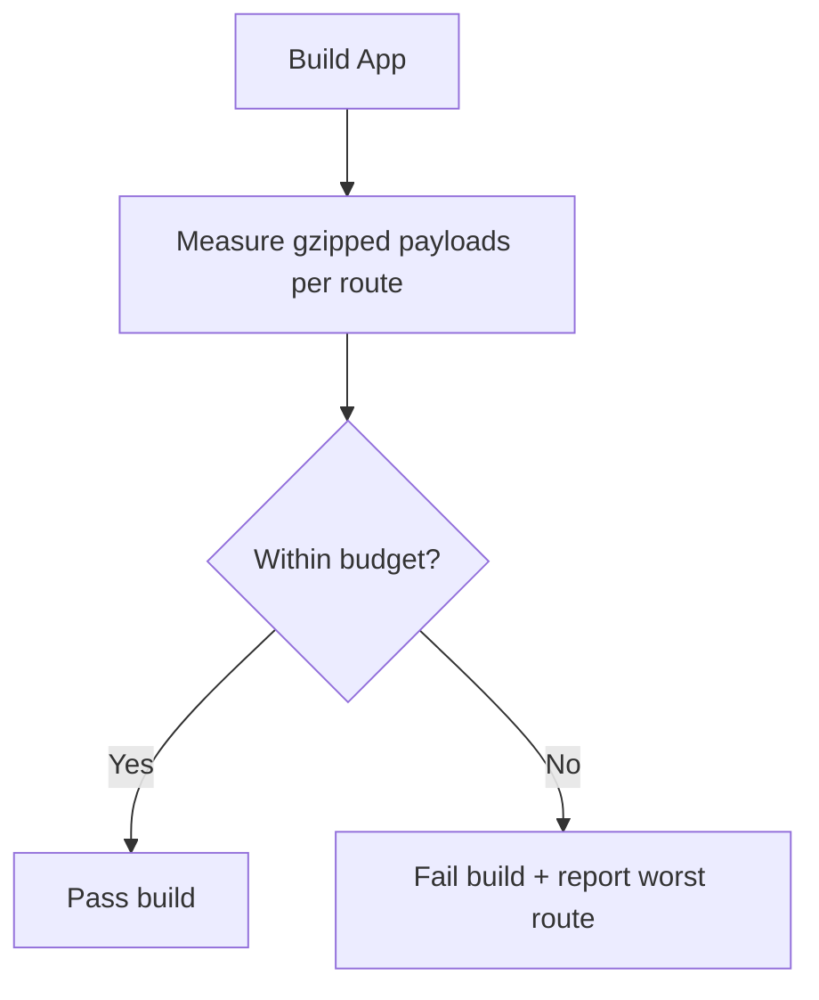
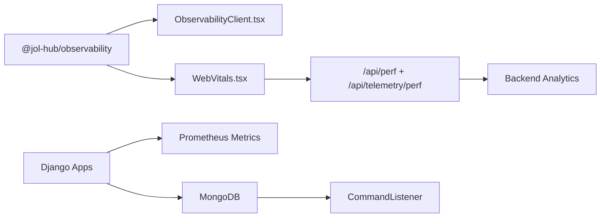

# Performance Monitoring & Profiling

<cite>
**Referenced Files in This Document**
- [metrics.py](file://backend/django/apps/crm/observability/metrics.py)
- [metrics_endpoint.py](file://backend/django/apps/core/metrics_endpoint.py)
- [mongodb.py](file://backend/django/apps/core/mongodb.py)
- [performance.ts](file://frontend/packages/observability/src/performance.ts)
- [ObservabilityClient.tsx](file://frontend/apps/template-renderer/src/components/ObservabilityClient.tsx)
- [WebVitals.tsx](file://frontend/apps/template-renderer/src/components/WebVitals.tsx)
- [perf route.ts](file://frontend/apps/template-renderer/src/app/api/perf/route.ts)
- [telemetry perf route.ts](file://frontend/apps/template-renderer/src/app/api/telemetry/perf/route.ts)
- [alert-rules.yml](file://frontend/apps/template-renderer/observability/alert-rules.yml)
- [OBSERVABILITY.md](file://frontend/apps/template-renderer/OBSERVABILITY.md)
- [PERFORMANCE.md](file://frontend/apps/template-renderer/PERFORMANCE.md)
- [budget.ts](file://frontend/packages/perf/src/budget.ts)
- [index.ts](file://frontend/packages/observability/src/index.ts)
</cite>

## Table of Contents
1. Introduction
2. Project Structure
3. Core Components
4. Architecture Overview
5. Detailed Component Analysis
6. Dependency Analysis
7. Performance Considerations
8. Troubleshooting Guide
9. Conclusion
10. Appendices

## Introduction
This document explains how JOL-HUB collects and analyzes performance data across the frontend, backend, and data layers. It covers:
- Frontend performance tracking (Core Web Vitals, navigation phases, slow resources)
- Backend metrics (request latency, CRM operations, health checks)
- Database query monitoring (MongoDB command-level observability)
- Capacity planning and budget enforcement
- Alerting, baselines, SLIs/SLOs, and proactive monitoring practices
- APM integration patterns and regression detection

The goal is to help you identify bottlenecks, analyze slow queries, monitor memory and CPU via infrastructure metrics, track API response times, and establish reliable performance baselines with automated guardrails.

## Project Structure
JOL-HUB implements a layered observability strategy:
- Frontend RUM and deep telemetry: browser collects Web Vitals and navigation/resource timings, batches them, and posts to Next.js routes that validate and forward to the backend analytics plane.
- Backend metrics: Prometheus counters/histograms for CRM requests, GDPR flows, Bitrix24 syncs, and health checks; a secured /metrics endpoint for Prometheus scraping.
- Database observability: PyMongo CommandListener records every MongoDB operation to Prometheus with fine-grained buckets and slow-query logging.
- Alerting and dashboards: Prometheus rules and Grafana assets define P0–P3 alerts and visualization targets.

**Diagram sources**
- [WebVitals.tsx:36-58](file://frontend/apps/template-renderer/src/components/WebVitals.tsx#L36-L58)
- [ObservabilityClient.tsx:39-75](file://frontend/apps/template-renderer/src/components/ObservabilityClient.tsx#L39-L75)
- [perf route.ts:1-62](file://frontend/apps/template-renderer/src/app/api/perf/route.ts#L1-L62)
- [telemetry perf route.ts:1-85](file://frontend/apps/template-renderer/src/app/api/telemetry/perf/route.ts#L1-L85)
- [metrics_endpoint.py:68-154](file://backend/django/apps/core/metrics_endpoint.py#L68-L154)
- [mongodb.py:101-220](file://backend/django/apps/core/mongodb.py#L101-L220)

**Section sources**
- [OBSERVABILITY.md:1-112](file://frontend/apps/template-renderer/OBSERVABILITY.md#L1-L112)
- [PERFORMANCE.md:1-203](file://frontend/apps/template-renderer/PERFORMANCE.md#L1-L203)

## Core Components
- Frontend RUM and deep telemetry:
  - Web Vitals reporter sends standardized metrics to a same-origin ingress.
  - Deep telemetry captures navigation phase breakdown and slowest resources, batched and consent-gated.
- Backend metrics:
  - CRM request counts and latencies, GDPR request metrics, security events, audit entries, and Bitrix24 sync metrics.
  - Health checks for database, cache, and external services.
- Database observability:
  - Per-command duration histograms, total counts, error counters, and pool gauges for MongoDB.
  - Slow-query threshold logging and configurable thresholds.
- Alerting:
  - P0–P3 Prometheus alert rules covering error rates, 5xx spikes, auth down, LCP regressions, bundle budgets, and security advisories.

**Section sources**
- [metrics.py:33-113](file://backend/django/apps/crm/observability/metrics.py#L33-L113)
- [metrics_endpoint.py:1-154](file://backend/django/apps/core/metrics_endpoint.py#L1-L154)
- [mongodb.py:53-91](file://backend/django/apps/core/mongodb.py#L53-L91)
- [alert-rules.yml:18-144](file://frontend/apps/template-renderer/observability/alert-rules.yml#L18-L144)

## Architecture Overview
End-to-end flow from user interaction to actionable insights:

**Diagram sources**
- [WebVitals.tsx:36-58](file://frontend/apps/template-renderer/src/components/WebVitals.tsx#L36-L58)
- [ObservabilityClient.tsx:39-75](file://frontend/apps/template-renderer/src/components/ObservabilityClient.tsx#L39-L75)
- [perf route.ts:1-62](file://frontend/apps/template-renderer/src/app/api/perf/route.ts#L1-L62)
- [telemetry perf route.ts:41-85](file://frontend/apps/template-renderer/src/app/api/telemetry/perf/route.ts#L41-L85)
- [metrics_endpoint.py:84-154](file://backend/django/apps/core/metrics_endpoint.py#L84-L154)

## Detailed Component Analysis

### Frontend Performance Tracking (RUM and Deep Telemetry)
- Web Vitals:
  - Collects TTFB, FCP, LCP, CLS, FID/INP, and forwards to /api/perf.
  - Payload validated server-side; pilot mode returns 204 without errors.
- Deep telemetry:
  - Computes navigation phases (DNS/TCP/SSL/TTFB/download) and identifies slowest resources.
  - Batches samples and flushes periodically or on unload; rate-limited at ingress.
- Consent and privacy:
  - Client enforces analytics consent before sending performance data.
  - Server re-redacts any sensitive fields; no personal data in payloads.

**Diagram sources**
- [performance.ts:40-59](file://frontend/packages/observability/src/performance.ts#L40-L59)
- [performance.ts:65-80](file://frontend/packages/observability/src/performance.ts#L65-L80)
- [performance.ts:98-133](file://frontend/packages/observability/src/performance.ts#L98-L133)
- [WebVitals.tsx:36-58](file://frontend/apps/template-renderer/src/components/WebVitals.tsx#L36-L58)
- [ObservabilityClient.tsx:39-75](file://frontend/apps/template-renderer/src/components/ObservabilityClient.tsx#L39-L75)
- [perf route.ts:1-62](file://frontend/apps/template-renderer/src/app/api/perf/route.ts#L1-L62)
- [telemetry perf route.ts:41-85](file://frontend/apps/template-renderer/src/app/api/telemetry/perf/route.ts#L41-L85)

**Section sources**
- [WebVitals.tsx:36-58](file://frontend/apps/template-renderer/src/components/WebVitals.tsx#L36-L58)
- [ObservabilityClient.tsx:39-75](file://frontend/apps/template-renderer/src/components/ObservabilityClient.tsx#L39-L75)
- [performance.ts:40-133](file://frontend/packages/observability/src/performance.ts#L40-L133)
- [perf route.ts:1-62](file://frontend/apps/template-renderer/src/app/api/perf/route.ts#L1-L62)
- [telemetry perf route.ts:1-85](file://frontend/apps/template-renderer/src/app/api/telemetry/perf/route.ts#L1-L85)

### Backend Metrics and Health Checks
- CRM and business metrics:
  - Request counts and latency histograms per tenant and endpoint.
  - Data access counters for compliance tracking.
  - GDPR request counters and response time histograms.
  - Security event counters and circuit breaker state gauge.
- Health checks:
  - Database connectivity, audit integrity, and Bitrix24 availability.
  - Aggregated health status suitable for load balancer probes.

**Diagram sources**
- [metrics.py:335-387](file://backend/django/apps/crm/observability/metrics.py#L335-L387)
- [metrics.py:393-478](file://backend/django/apps/crm/observability/metrics.py#L393-L478)

**Section sources**
- [metrics.py:33-113](file://backend/django/apps/crm/observability/metrics.py#L33-L113)
- [metrics.py:335-478](file://backend/django/apps/crm/observability/metrics.py#L335-L478)

### Database Query Monitoring (MongoDB)
- Command-level observability:
  - Histograms for query durations with fine-grained buckets around the slow-query threshold.
  - Counters for total commands and errors, with labels for command name, collection, and database.
  - Pool gauges for active and available connections.
- Slow query detection:
  - Logs warnings when duration exceeds configured threshold.
- Connection management:
  - Lazy initialization, TLS support, pooling configuration, and graceful shutdown.

**Diagram sources**
- [mongodb.py:101-220](file://backend/django/apps/core/mongodb.py#L101-L220)

**Section sources**
- [mongodb.py:53-91](file://backend/django/apps/core/mongodb.py#L53-L91)
- [mongodb.py:101-220](file://backend/django/apps/core/mongodb.py#L101-L220)

### Prometheus Metrics Endpoint
- Secured exposure of all registered Prometheus metrics in standard text format.
- IP allowlist gating and optional bearer token authentication.
- Multi-process collector support for worker-based deployments.

**Diagram sources**
- [metrics_endpoint.py:68-154](file://backend/django/apps/core/metrics_endpoint.py#L68-L154)

**Section sources**
- [metrics_endpoint.py:1-154](file://backend/django/apps/core/metrics_endpoint.py#L1-L154)

### Alerting and Dashboards
- P0–P3 alert rules:
  - Error rate > 1% for 5 minutes (P0).
  - HTTP 5xx spike > 10/min (P0).
  - Auth service down (P0).
  - Health endpoint down (P0).
  - LCP regression (P2), bundle size over budget (P2).
  - Security advisories and deprecation warnings (P3).
- Dashboards:
  - Grafana dashboard JSON included for frontend observability.

**Section sources**
- [alert-rules.yml:18-144](file://frontend/apps/template-renderer/observability/alert-rules.yml#L18-L144)
- [OBSERVABILITY.md:70-112](file://frontend/apps/template-renderer/OBSERVABILITY.md#L70-L112)

### Capacity Planning and Budget Enforcement
- Budget contract:
  - Centralized Lighthouse-style budget file defines resource sizes and timing budgets.
  - Parser validates structure and values; used by both offline gate and CI.
- Offline byte-budget gate:
  - Measures real gzipped first-load payloads per route without a browser.
  - Exits non-zero on breach; integrates into build pipeline.
- Lighthouse CI:
  - Asserts budget and score floors across representative pages.

**Diagram sources**
- [budget.ts:51-77](file://frontend/packages/perf/src/budget.ts#L51-L77)
- [PERFORMANCE.md:42-62](file://frontend/apps/template-renderer/PERFORMANCE.md#L42-L62)

**Section sources**
- [budget.ts:51-77](file://frontend/packages/perf/src/budget.ts#L51-L77)
- [PERFORMANCE.md:20-62](file://frontend/apps/template-renderer/PERFORMANCE.md#L20-L62)

## Dependency Analysis
Key dependencies and coupling:
- Frontend components depend on the observability package for batching, redaction, and performance utilities.
- Next.js routes depend on validation libraries and environment variables for forwarding to backend analytics.
- Backend metrics are decoupled via Prometheus collectors; endpoints expose aggregated state.
- MongoDB observability depends on PyMongo’s CommandListener and Django settings for thresholds and connection parameters.

**Diagram sources**
- [index.ts:1-61](file://frontend/packages/observability/src/index.ts#L1-L61)
- [ObservabilityClient.tsx:39-75](file://frontend/apps/template-renderer/src/components/ObservabilityClient.tsx#L39-L75)
- [WebVitals.tsx:36-58](file://frontend/apps/template-renderer/src/components/WebVitals.tsx#L36-L58)
- [perf route.ts:1-62](file://frontend/apps/template-renderer/src/app/api/perf/route.ts#L1-L62)
- [telemetry perf route.ts:41-85](file://frontend/apps/template-renderer/src/app/api/telemetry/perf/route.ts#L41-L85)
- [metrics_endpoint.py:68-154](file://backend/django/apps/core/metrics_endpoint.py#L68-L154)
- [mongodb.py:101-220](file://backend/django/apps/core/mongodb.py#L101-L220)

**Section sources**
- [index.ts:1-61](file://frontend/packages/observability/src/index.ts#L1-L61)
- [metrics_endpoint.py:68-154](file://backend/django/apps/core/metrics_endpoint.py#L68-L154)
- [mongodb.py:101-220](file://backend/django/apps/core/mongodb.py#L101-L220)

## Performance Considerations
- Frontend:
  - Keep initial JS/CSS within budgets; use code splitting and dynamic imports.
  - Prefer system fonts, optimize images (AVIF/WebP), and leverage caching headers.
  - Use RUM to detect regressions early; enforce budgets in CI and offline gates.
- Backend:
  - Use histograms to track p95/p99 latencies; set SLOs based on observed distributions.
  - Monitor CRM-specific endpoints and Bitrix24 sync latency; tune timeouts and retries.
- Database:
  - Tune MongoDB pool sizes and idle timeouts; watch active/available gauges.
  - Investigate slow queries flagged by thresholds; add indexes where needed.
- Infrastructure:
  - Configure Prometheus scrape intervals and retention aligned with storage capacity.
  - Set up Grafana dashboards and alert rules for proactive monitoring.

[No sources needed since this section provides general guidance]

## Troubleshooting Guide
Common issues and diagnostics:
- High error rate or 5xx spikes:
  - Check P0 alerts and Loki logs for stack traces; correlate via requestId.
  - Validate backend health endpoints and dependency statuses.
- LCP regressions:
  - Inspect RUM data for poor ratings; review bundle budgets and resource loading.
  - Re-run offline budget gate and Lighthouse CI to pinpoint changes.
- Slow MongoDB queries:
  - Review slow-query logs and histograms; examine collection and command labels.
  - Add or adjust indexes; reduce N+1 queries; consider aggregation pipelines.
- Rate limiting on telemetry:
  - Ensure client batching respects max batch and flush intervals; verify ingress rate limits.

**Section sources**
- [alert-rules.yml:18-144](file://frontend/apps/template-renderer/observability/alert-rules.yml#L18-L144)
- [mongodb.py:161-172](file://backend/django/apps/core/mongodb.py#L161-L172)
- [telemetry perf route.ts:46-50](file://frontend/apps/template-renderer/src/app/api/telemetry/perf/route.ts#L46-L50)

## Conclusion
JOL-HUB provides a comprehensive performance monitoring and profiling foundation:
- Frontend RUM and deep telemetry capture user experience signals with strict privacy controls.
- Backend metrics and health checks offer operational visibility and reliability signals.
- MongoDB observability enables precise identification of slow queries and connection issues.
- Alerting and budget enforcement ensure proactive detection of regressions and capacity constraints.
Adopt these capabilities to establish baselines, define SLIs/SLOs, and maintain high performance under scale.

[No sources needed since this section summarizes without analyzing specific files]

## Appendices

### Setting Up Baselines and SLIs/SLOs
- Establish baselines:
  - Use RUM percentiles (TTFB, LCP, INP) to define baseline distributions.
  - Capture backend p95/p99 latencies per endpoint; record MongoDB histogram tails.
- Define SLIs/SLOs:
  - SLI examples: fraction of requests under target latency; percentage of good LCP.
  - SLO targets: e.g., 95th percentile LCP < 2.5s; error rate < 1%.
- Proactive monitoring:
  - Configure alerts for SLO breaches; implement runbooks and incident channels.
  - Integrate budget gates into CI to prevent regressions.

[No sources needed since this section provides general guidance]

### APM Integration Patterns
- Distributed tracing:
  - Correlate frontend requestId with backend spans; propagate through services.
- OpenTelemetry:
  - Instrument key endpoints and database calls; export traces to a backend APM.
- Error tracking:
  - Attach breadcrumbs and context; ensure PII redaction at ingestion points.

[No sources needed since this section provides general guidance]

### Performance Regression Detection
- Automated gates:
  - Enforce budgets in CI; fail builds on violations.
- Field validation:
  - Monitor RUM trends; alert on sustained degradation.
- Root cause analysis:
  - Use bundle analyzer and Lighthouse reports; bisect commits to isolate changes.

**Section sources**
- [PERFORMANCE.md:42-62](file://frontend/apps/template-renderer/PERFORMANCE.md#L42-L62)
- [alert-rules.yml:97-121](file://frontend/apps/template-renderer/observability/alert-rules.yml#L97-L121)