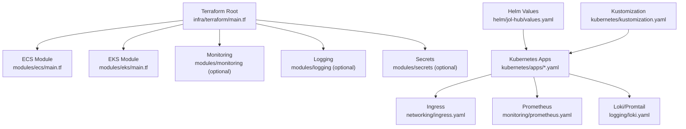
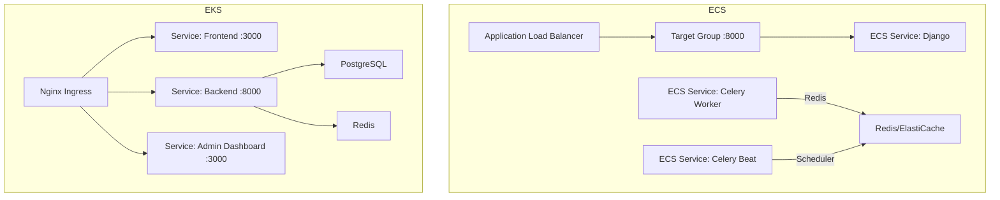
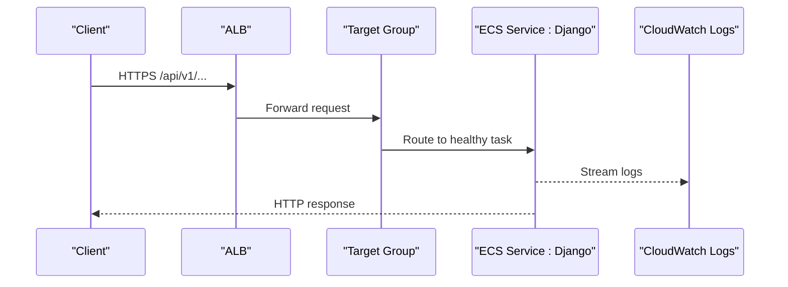
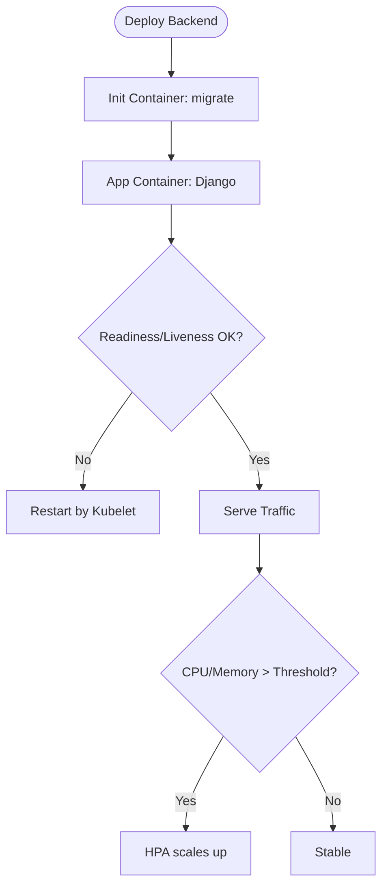
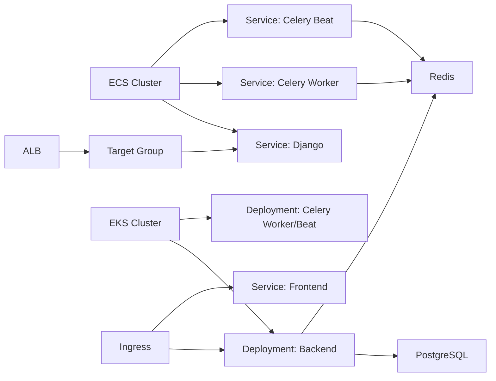

# Compute Services

<cite>
**Referenced Files in This Document**
- [infra/terraform/main.tf](file://infra/terraform/main.tf)
- [infra/terraform/variables.tf](file://infra/terraform/variables.tf)
- [infra/terraform/modules/ecs/main.tf](file://infra/terraform/modules/ecs/main.tf)
- [infra/terraform/modules/eks/main.tf](file://infra/terraform/modules/eks/main.tf)
- [infra/helm/jol-hub/values.yaml](file://infra/helm/jol-hub/values.yaml)
- [infra/kubernetes/kustomization.yaml](file://infra/kubernetes/kustomization.yaml)
- [infra/kubernetes/apps/backend.yaml](file://infra/kubernetes/apps/backend.yaml)
- [infra/kubernetes/apps/celery.yaml](file://infra/kubernetes/apps/celery.yaml)
- [infra/kubernetes/networking/ingress.yaml](file://infra/kubernetes/networking/ingress.yaml)
- [infra/kubernetes/monitoring/prometheus.yaml](file://infra/kubernetes/monitoring/prometheus.yaml)
- [infra/kubernetes/logging/loki.yaml](file://infra/kubernetes/logging/loki.yaml)
- [infra/helm/jol-hub/templates/backend.yaml](file://infra/helm/jol-hub/templates/backend.yaml)
</cite>

## Table of Contents
1. [Introduction](#introduction)
2. [Project Structure](#project-structure)
3. [Core Components](#core-components)
4. [Architecture Overview](#architecture-overview)
5. [Detailed Component Analysis](#detailed-component-analysis)
6. [Dependency Analysis](#dependency-analysis)
7. [Performance Considerations](#performance-considerations)
8. [Troubleshooting Guide](#troubleshooting-guide)
9. [Conclusion](#conclusion)
10. [Appendices](#appendices)

## Introduction
This document provides comprehensive infrastructure documentation for compute services in JOL-HUB, covering both AWS ECS Fargate and EKS Kubernetes options. It explains task definitions, service configurations, load balancer setup, auto-scaling policies (ECS), cluster provisioning, node groups, container orchestration, and service mesh integration (EKS). It also details deployment strategies, environment-specific configurations, resource allocation patterns, monitoring and logging setup, troubleshooting procedures, migration paths between ECS and EKS, and hybrid deployment scenarios.

## Project Structure
The repository organizes infrastructure using Terraform modules for AWS resources (VPC, security, database, storage, ECS, EKS, monitoring, logging, secrets) and Kubernetes manifests/Helm charts for application deployments. The root Terraform file orchestrates all modules and conditionally enables EKS. Helm values define default application settings, autoscaling, ingress, and observability. Kustomize overlays assemble base and app manifests for direct Kubernetes deployment.

**Diagram sources**
- [infra/terraform/main.tf:63-271](file://infra/terraform/main.tf#L63-L271)
- [infra/helm/jol-hub/values.yaml:1-264](file://infra/helm/jol-hub/values.yaml#L1-L264)
- [infra/kubernetes/kustomization.yaml:1-58](file://infra/kubernetes/kustomization.yaml#L1-L58)

**Section sources**
- [infra/terraform/main.tf:1-326](file://infra/terraform/main.tf#L1-L326)
- [infra/helm/jol-hub/values.yaml:1-264](file://infra/helm/jol-hub/values.yaml#L1-L264)
- [infra/kubernetes/kustomization.yaml:1-58](file://infra/kubernetes/kustomization.yaml#L1-L58)

## Core Components
- ECS Fargate: Cluster with capacity providers, ECR repositories, CloudWatch log groups, Application Load Balancer (ALB), task definitions for Django web, Celery worker, and Celery beat, ECS services with target tracking auto-scaling, IAM roles for execution and tasks, and Secrets Manager integration.
- EKS Kubernetes: Managed cluster with encryption at rest, managed node groups (general and compute-tainted), core add-ons (VPC CNI, coredns, kube-proxy, EBS CSI), OIDC provider for IRSA, and Kubernetes manifests/Helm templates for backend, celery workers/beat, ingress, autoscaling (HPA), and pod disruption budgets.
- Observability: Prometheus stack for metrics collection and Loki/Promtail for log aggregation; optional AWS Managed Prometheus/Grafana via Terraform module.
- Networking: ALB for ECS; Nginx Ingress Controller with TLS and rate limiting for EKS; Network Policies for isolation.

**Section sources**
- [infra/terraform/modules/ecs/main.tf:22-711](file://infra/terraform/modules/ecs/main.tf#L22-L711)
- [infra/terraform/modules/eks/main.tf:15-405](file://infra/terraform/modules/eks/main.tf#L15-L405)
- [infra/kubernetes/networking/ingress.yaml:1-115](file://infra/kubernetes/networking/ingress.yaml#L1-L115)
- [infra/kubernetes/monitoring/prometheus.yaml:1-225](file://infra/kubernetes/monitoring/prometheus.yaml#L1-L225)
- [infra/kubernetes/logging/loki.yaml:1-251](file://infra/kubernetes/logging/loki.yaml#L1-L251)

## Architecture Overview
Two compute options are supported:

- ECS Fargate path:
  - ALB terminates HTTPS and forwards to a single Django target group on port 8000.
  - ECS services run stateless containers behind the ALB; Celery workers and beat run as separate services.
  - Auto-scaling uses target tracking on CPU and memory.

- EKS path:
  - Nginx Ingress routes traffic to frontend, backend, and admin dashboard services.
  - Backend and Celery pods scale via HorizontalPodAutoscalers based on CPU/memory utilization.
  - Node groups are labeled/tainted to schedule workloads appropriately.

**Diagram sources**
- [infra/terraform/modules/ecs/main.tf:122-199](file://infra/terraform/modules/ecs/main.tf#L122-L199)
- [infra/kubernetes/networking/ingress.yaml:40-83](file://infra/kubernetes/networking/ingress.yaml#L40-L83)

**Section sources**
- [infra/terraform/modules/ecs/main.tf:122-199](file://infra/terraform/modules/ecs/main.tf#L122-L199)
- [infra/kubernetes/networking/ingress.yaml:40-83](file://infra/kubernetes/networking/ingress.yaml#L40-L83)

## Detailed Component Analysis

### ECS Fargate: Task Definitions, Services, ALB, Auto Scaling
- Task definitions:
  - Django web container exposes port 8000, health-checked against /api/v1/health/, logs to CloudWatch, injects secrets from Secrets Manager and SSM parameters.
  - Celery worker runs with concurrency flag and connects to Redis broker/result backend.
  - Celery beat runs with database scheduler and single instance.
- Services:
  - Django service registers with ALB target group and uses awsvpc networking in private subnets without public IPs.
  - Celery services run headless without load balancing.
- ALB:
  - HTTP listener redirects to HTTPS; HTTPS listener forwards to Django target group with strict TLS policy.
  - Access logs shipped to an S3 bucket with lifecycle expiration.
- Auto scaling:
  - Target tracking policies for CPU and memory on Django service; CPU-based target tracking for Celery workers.

**Diagram sources**
- [infra/terraform/modules/ecs/main.tf:122-199](file://infra/terraform/modules/ecs/main.tf#L122-L199)
- [infra/terraform/modules/ecs/main.tf:498-586](file://infra/terraform/modules/ecs/main.tf#L498-L586)
- [infra/terraform/modules/ecs/main.tf:644-711](file://infra/terraform/modules/ecs/main.tf#L644-L711)

**Section sources**
- [infra/terraform/modules/ecs/main.tf:22-711](file://infra/terraform/modules/ecs/main.tf#L22-L711)

### EKS: Cluster, Node Groups, Container Orchestration, Autoscaling
- Cluster:
  - Managed EKS cluster with API audit/controller/scheduler logs enabled, encryption for secrets via KMS, and controlled public/private endpoints.
- Node groups:
  - General-purpose nodes for baseline workloads.
  - Compute-optimized nodes tainted to schedule Celery workloads only.
- Add-ons:
  - VPC CNI, coredns, kube-proxy, EBS CSI driver with IRSA role for secure volume operations.
- Applications:
  - Backend Deployment with init container running migrations, readiness/liveness probes, persistent volumes for static/media, anti-affinity for distribution.
  - Celery worker and beat Deployments with Redis URLs configured.
  - HorizontalPodAutoscalers for backend and celery-worker targeting CPU/memory thresholds.
  - PodDisruptionBudgets to maintain availability during rollouts.

**Diagram sources**
- [infra/kubernetes/apps/backend.yaml:1-204](file://infra/kubernetes/apps/backend.yaml#L1-L204)
- [infra/kubernetes/apps/celery.yaml:1-130](file://infra/kubernetes/apps/celery.yaml#L1-L130)

**Section sources**
- [infra/terraform/modules/eks/main.tf:15-405](file://infra/terraform/modules/eks/main.tf#L15-L405)
- [infra/kubernetes/apps/backend.yaml:1-204](file://infra/kubernetes/apps/backend.yaml#L1-L204)
- [infra/kubernetes/apps/celery.yaml:1-130](file://infra/kubernetes/apps/celery.yaml#L1-L130)

### Helm Chart Configuration (EKS)
- Default values configure replicas, images, resource requests/limits, autoscaling targets, PDBs, ingress class and annotations, network policies, service accounts, pod security contexts, and observability toggles.
- Service mesh is disabled by default but can be enabled to integrate with Istio or similar.

**Section sources**
- [infra/helm/jol-hub/values.yaml:1-264](file://infra/helm/jol-hub/values.yaml#L1-L264)
- [infra/helm/jol-hub/templates/backend.yaml:1-152](file://infra/helm/jol-hub/templates/backend.yaml#L1-L152)

### Monitoring and Logging
- Prometheus:
  - Scrapes Kubernetes API, nodes, pods annotated for scraping, and dedicated jobs for backend, PostgreSQL exporter, and Redis exporter.
  - Persistent storage configured for retention.
- Loki/Promtail:
  - Loki stores logs with retention and compaction; Promtail DaemonSet collects pod and system logs and pushes to Loki.

**Section sources**
- [infra/kubernetes/monitoring/prometheus.yaml:1-225](file://infra/kubernetes/monitoring/prometheus.yaml#L1-L225)
- [infra/kubernetes/logging/loki.yaml:1-251](file://infra/kubernetes/logging/loki.yaml#L1-L251)

## Dependency Analysis
- ECS dependencies:
  - ECS services depend on ALB listeners and target groups.
  - Task definitions depend on Secrets Manager and SSM parameters for credentials.
  - Auto scaling depends on ECS service metrics.
- EKS dependencies:
  - Backend and Celery depend on Redis and PostgreSQL services.
  - Ingress depends on Nginx controller and TLS secrets.
  - HPA depends on metrics server and pod metrics.

**Diagram sources**
- [infra/terraform/modules/ecs/main.tf:122-199](file://infra/terraform/modules/ecs/main.tf#L122-L199)
- [infra/kubernetes/networking/ingress.yaml:40-83](file://infra/kubernetes/networking/ingress.yaml#L40-L83)

**Section sources**
- [infra/terraform/modules/ecs/main.tf:122-199](file://infra/terraform/modules/ecs/main.tf#L122-L199)
- [infra/kubernetes/networking/ingress.yaml:40-83](file://infra/kubernetes/networking/ingress.yaml#L40-L83)

## Performance Considerations
- ECS:
  - Use target tracking for CPU and memory to balance responsiveness and cost.
  - Enable container insights for visibility into task performance.
  - Configure appropriate health check intervals and grace periods to avoid premature scaling.
- EKS:
  - Set resource requests/limits to ensure fair scheduling and prevent noisy neighbor issues.
  - Use HPA with stabilization windows to avoid flapping.
  - Schedule Celery on compute-tainted nodes to isolate CPU-intensive workloads.
- Storage:
  - Use gp3 storage classes for balanced performance and cost.
  - Ensure persistent volumes are sized appropriately for media and static assets.
- Networking:
  - ALB access logs and Nginx rate limiting help mitigate abuse and provide diagnostics.

[No sources needed since this section provides general guidance]

## Troubleshooting Guide
- ECS:
  - Check CloudWatch log groups for Django, Celery worker, and Celery beat streams.
  - Validate ALB target group health checks against /api/v1/health/.
  - Verify IAM roles allow Secrets Manager and SSM parameter reads.
- EKS:
  - Inspect pod events and logs for failed migrations or readiness probe failures.
  - Confirm HPA status and metrics availability.
  - Validate Ingress TLS configuration and cert-manager issuance.
- Monitoring:
  - Use Prometheus dashboards to identify spikes in latency or error rates.
  - Query Loki for structured logs filtered by app labels and namespaces.

**Section sources**
- [infra/terraform/modules/ecs/main.tf:88-116](file://infra/terraform/modules/ecs/main.tf#L88-L116)
- [infra/terraform/modules/ecs/main.tf:144-168](file://infra/terraform/modules/ecs/main.tf#L144-L168)
- [infra/kubernetes/apps/backend.yaml:82-98](file://infra/kubernetes/apps/backend.yaml#L82-L98)
- [infra/kubernetes/monitoring/prometheus.yaml:74-151](file://infra/kubernetes/monitoring/prometheus.yaml#L74-L151)
- [infra/kubernetes/logging/loki.yaml:169-195](file://infra/kubernetes/logging/loki.yaml#L169-L195)

## Conclusion
JOL-HUB supports two robust compute backends: ECS Fargate for simplified, serverless container orchestration with ALB and target tracking auto-scaling, and EKS for advanced Kubernetes-native orchestration with HPA, node taints, and rich ecosystem integrations. Both options include comprehensive monitoring and logging, secure secret management, and scalable networking. Teams can choose the platform that best fits their operational model and migrate between them using shared container images and consistent configuration patterns.

[No sources needed since this section summarizes without analyzing specific files]

## Appendices

### Migration Paths Between ECS and EKS
- Container image strategy:
  - Build once and push to ECR; use the same image tag across ECS and EKS deployments.
- Configuration alignment:
  - Map environment variables and secrets consistently between ECS task definitions and Kubernetes ConfigMaps/Secrets.
  - Align health check endpoints (/api/v1/health/) and ports (8000) across platforms.
- Data plane:
  - Use managed RDS and ElastiCache for ECS; use managed databases or Helm-installed Postgres/Redis for EKS.
- Networking:
  - ECS uses ALB; EKS uses Nginx Ingress. Maintain domain routing and TLS termination at the edge.
- Observability:
  - Export metrics to Prometheus; stream logs to CloudWatch (ECS) or Loki (EKS).

[No sources needed since this section provides conceptual guidance]

### Hybrid Deployment Scenarios
- Run stateless web services on ECS Fargate while offloading background jobs to EKS Celery workers.
- Share Redis and database across environments; route traffic via ALB for ECS and Ingress for EKS.
- Centralize secrets in AWS Secrets Manager and reference them from both ECS and EKS.

[No sources needed since this section provides conceptual guidance]