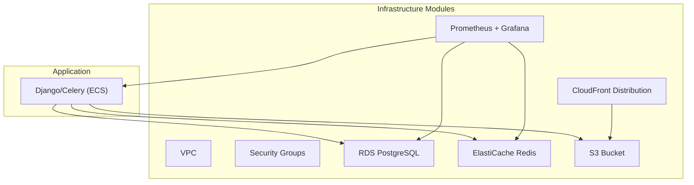
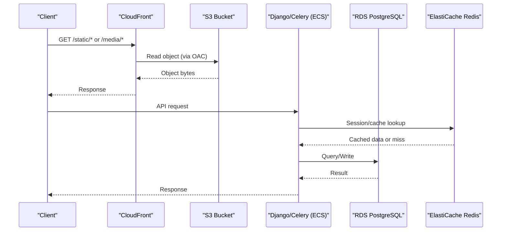
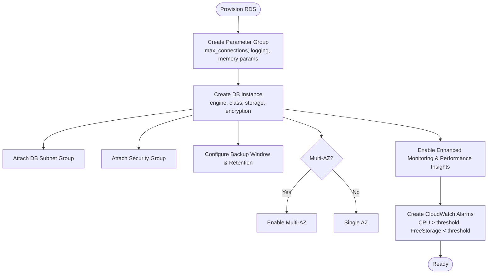
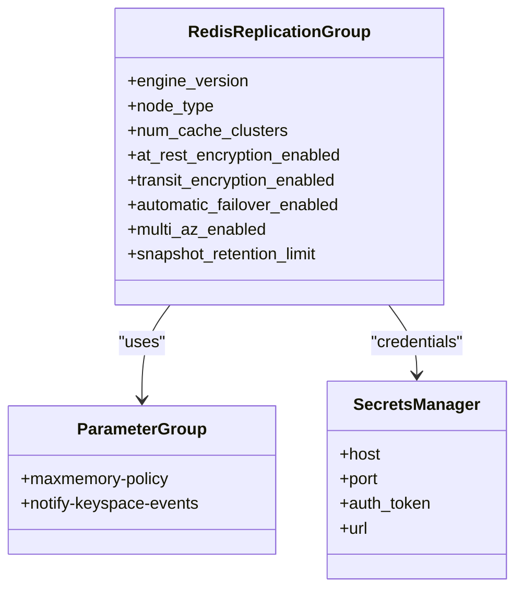
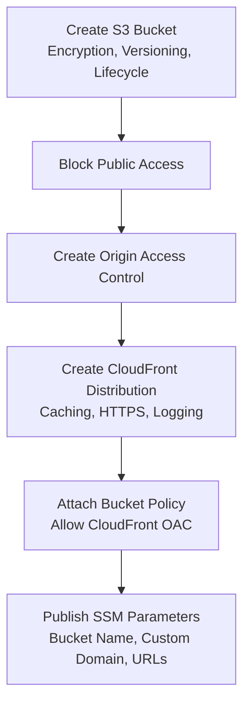
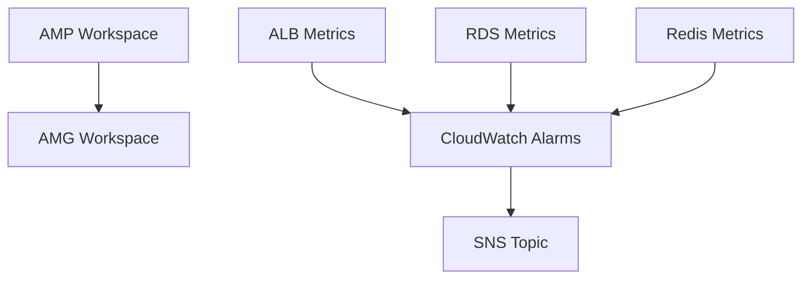
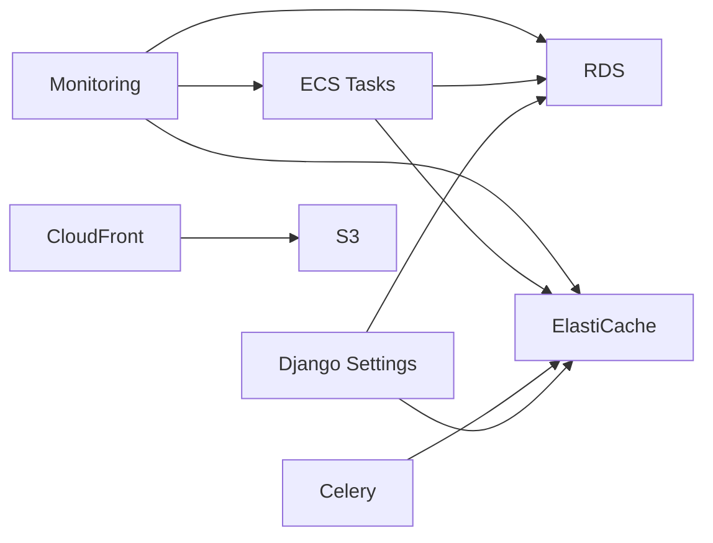

# Database & Storage

<cite>
**Referenced Files in This Document**
- [main.tf](file://infra/terraform/main.tf)
- [variables.tf](file://infra/terraform/variables.tf)
- [database/main.tf](file://infra/terraform/modules/database/main.tf)
- [database/variables.tf](file://infra/terraform/modules/database/variables.tf)
- [elasticache/main.tf](file://infra/terraform/modules/elasticache/main.tf)
- [elasticache/variables.tf](file://infra/terraform/modules/elasticache/variables.tf)
- [storage/main.tf](file://infra/terraform/modules/storage/main.tf)
- [storage/variables.tf](file://infra/terraform/modules/storage/variables.tf)
- [security/main.tf](file://infra/terraform/modules/security/main.tf)
- [monitoring/main.tf](file://infra/terraform/modules/monitoring/main.tf)
- [base.py](file://backend/django/core/settings/base.py)
- [system-overview.md](file://docs/architecture/system-overview.md)
</cite>

## Table of Contents
1. [Introduction](#introduction)
2. [Project Structure](#project-structure)
3. [Core Components](#core-components)
4. [Architecture Overview](#architecture-overview)
5. [Detailed Component Analysis](#detailed-component-analysis)
6. [Dependency Analysis](#dependency-analysis)
7. [Performance Considerations](#performance-considerations)
8. [Troubleshooting Guide](#troubleshooting-guide)
9. [Conclusion](#conclusion)
10. [Appendices](#appendices)

## Introduction
This document describes the database and storage infrastructure for JOL-HUB, focusing on RDS PostgreSQL, ElastiCache Redis, S3 with CloudFront, security configurations (encryption at rest, access policies, IAM roles), monitoring and alerting, performance tuning recommendations, and disaster recovery procedures. It synthesizes Terraform modules, application settings, and architectural notes to provide a comprehensive reference for operators and engineers.

## Project Structure
JOL-HUB provisions its data plane via Terraform modules:
- Database module provisions an encrypted RDS PostgreSQL instance with parameter tuning, backups, and alarms.
- ElastiCache module provisions a Redis replication group with encryption and snapshots.
- Storage module provisions an S3 bucket with server-side encryption, lifecycle rules, and a CloudFront distribution using Origin Access Control.
- Security module defines restrictive security groups for ALB, ECS tasks, RDS, and ElastiCache.
- Monitoring module sets up AWS Managed Prometheus and Grafana workspaces, plus CloudWatch alarms for API latency, error rate, DB CPU, DB connections, and Redis memory.

**Diagram sources**
- [main.tf:94-145](file://infra/terraform/main.tf#L94-L145)
- [security/main.tf:94-165](file://infra/terraform/modules/security/main.tf#L94-L165)
- [monitoring/main.tf:11-85](file://infra/terraform/modules/monitoring/main.tf#L11-L85)

**Section sources**
- [main.tf:94-145](file://infra/terraform/main.tf#L94-L145)
- [security/main.tf:94-165](file://infra/terraform/modules/security/main.tf#L94-L165)

## Core Components
- RDS PostgreSQL: Encrypted, parameter-tuned, with backups, optional Multi-AZ, Performance Insights, enhanced monitoring, and CloudWatch alarms.
- ElastiCache Redis: Encryption at rest and in transit, snapshot retention, automatic failover when multi-node, and CloudWatch alarms.
- S3 + CloudFront: Private S3 bucket with AES-256 encryption, versioning (production), lifecycle transitions/expirations, and a CloudFront distribution with OAC and caching behaviors.
- Security: Least-privilege security groups; ECS can reach RDS and Redis; RDS and Redis are not publicly accessible.
- Monitoring: AMP workspace, AMG dashboard, CloudWatch alarms for API latency/error rate, DB CPU/connections, and Redis memory.

**Section sources**
- [database/main.tf:65-162](file://infra/terraform/modules/database/main.tf#L65-L162)
- [elasticache/main.tf:28-92](file://infra/terraform/modules/elasticache/main.tf#L28-L92)
- [storage/main.tf:14-169](file://infra/terraform/modules/storage/main.tf#L14-L169)
- [security/main.tf:94-165](file://infra/terraform/modules/security/main.tf#L94-L165)
- [monitoring/main.tf:163-287](file://infra/terraform/modules/monitoring/main.tf#L163-L287)

## Architecture Overview
The application runs on ECS and connects privately to RDS and Redis within the same VPC. Static/media assets are served from S3 through CloudFront using Origin Access Control to keep the bucket private. Monitoring is centralized via AMP and AMG, with CloudWatch alarms notifying via SNS.

**Diagram sources**
- [storage/main.tf:79-169](file://infra/terraform/modules/storage/main.tf#L79-L169)
- [database/main.tf:111-162](file://infra/terraform/modules/database/main.tf#L111-L162)
- [elasticache/main.tf:53-92](file://infra/terraform/modules/elasticache/main.tf#L53-L92)

## Detailed Component Analysis

### RDS PostgreSQL
- Instance class and engine: Configurable via variables; defaults to a small general-purpose instance class and PostgreSQL 16.x.
- Storage: gp3 storage with allocated size and maximum auto-scaling limit; encryption at rest enabled.
- Backups: Retention period configurable; maintenance window set; auto minor version upgrades enabled.
- High availability: Optional Multi-AZ deployment controlled by variable.
- Parameter group: Optimized for Django with connection limits, logging, and memory-related parameters derived from instance memory.
- Monitoring: Enhanced monitoring role attached; Performance Insights enabled; CloudWatch alarms for high CPU and low free storage.
- Secrets: Credentials stored in Secrets Manager with environment-specific naming and recovery windows.

**Diagram sources**
- [database/main.tf:65-162](file://infra/terraform/modules/database/main.tf#L65-L162)
- [database/main.tf:196-232](file://infra/terraform/modules/database/main.tf#L196-L232)

**Section sources**
- [database/main.tf:15-45](file://infra/terraform/modules/database/main.tf#L15-L45)
- [database/main.tf:65-162](file://infra/terraform/modules/database/main.tf#L65-L162)
- [database/main.tf:168-190](file://infra/terraform/modules/database/main.tf#L168-L190)
- [database/main.tf:196-232](file://infra/terraform/modules/database/main.tf#L196-L232)
- [variables.tf:58-110](file://infra/terraform/variables.tf#L58-L110)
- [database/variables.tf:22-80](file://infra/terraform/modules/database/variables.tf#L22-L80)

### ElastiCache Redis
- Engine and nodes: Redis 7.x with configurable node type and number of cache clusters.
- Encryption: At-rest and in-transit encryption enabled; auth token generated and stored in Secrets Manager.
- High availability: Automatic failover and Multi-AZ enabled when multiple nodes are configured.
- Maintenance: Snapshot window and retention configured; auto minor version upgrades enabled.
- Parameters: LRU eviction policy and keyspace notifications enabled for Celery compatibility.
- Application integration: Django uses django_redis with connection pooling and compression; Celery broker/result backend configured via environment variables.

**Diagram sources**
- [elasticache/main.tf:28-92](file://infra/terraform/modules/elasticache/main.tf#L28-L92)
- [elasticache/main.tf:98-126](file://infra/terraform/modules/elasticache/main.tf#L98-L126)

**Section sources**
- [elasticache/main.tf:28-92](file://infra/terraform/modules/elasticache/main.tf#L28-L92)
- [elasticache/main.tf:98-126](file://infra/terraform/modules/elasticache/main.tf#L98-L126)
- [elasticache/main.tf:132-168](file://infra/terraform/modules/elasticache/main.tf#L132-L168)
- [variables.tf:116-138](file://infra/terraform/variables.tf#L116-L138)
- [elasticache/variables.tf:22-50](file://infra/terraform/modules/elasticache/variables.tf#L22-L50)
- [base.py:392-410](file://backend/django/core/settings/base.py#L392-L410)
- [base.py:361-370](file://backend/django/core/settings/base.py#L361-L370)

### S3 and CloudFront
- S3 bucket: Private by default, ownership enforced, public access blocked, AES-256 server-side encryption, versioning enabled in production, lifecycle rules for noncurrent versions and log expiration.
- CloudFront: Distribution with OAC to restrict S3 access to CDN only; caching behaviors for static files with longer TTLs; HTTPS redirect; optional ACM certificate; logging to a dedicated logs bucket.
- Integration: SSM parameters expose bucket name and custom domain URLs for Django configuration.

**Diagram sources**
- [storage/main.tf:14-73](file://infra/terraform/modules/storage/main.tf#L14-L73)
- [storage/main.tf:79-169](file://infra/terraform/modules/storage/main.tf#L79-L169)
- [storage/main.tf:175-197](file://infra/terraform/modules/storage/main.tf#L175-L197)
- [storage/main.tf:257-287](file://infra/terraform/modules/storage/main.tf#L257-L287)

**Section sources**
- [storage/main.tf:14-73](file://infra/terraform/modules/storage/main.tf#L14-L73)
- [storage/main.tf:79-169](file://infra/terraform/modules/storage/main.tf#L79-L169)
- [storage/main.tf:175-197](file://infra/terraform/modules/storage/main.tf#L175-L197)
- [storage/main.tf:203-249](file://infra/terraform/modules/storage/main.tf#L203-L249)
- [storage/main.tf:257-287](file://infra/terraform/modules/storage/main.tf#L257-L287)
- [variables.tf:144-154](file://infra/terraform/variables.tf#L144-L154)
- [storage/variables.tf:12-22](file://infra/terraform/modules/storage/variables.tf#L12-L22)

### Security Configuration
- Network isolation: Security groups restrict ingress to ALB (internet-facing), ECS tasks (from ALB), RDS (from ECS and optionally VPC), and Redis (from ECS). No public access to databases or caches.
- Encryption at rest: RDS storage encrypted; S3 buckets use AES-256; Redis at-rest encryption enabled.
- Encryption in transit: Redis transit encryption enabled; CloudFront enforces HTTPS redirects; ACM certificate support available.
- Access control: S3 bucket policy allows only CloudFront OAC; secrets managed via Secrets Manager with recovery windows; IAM roles for enhanced monitoring and Grafana.

**Section sources**
- [security/main.tf:15-202](file://infra/terraform/modules/security/main.tf#L15-L202)
- [database/main.tf:120-133](file://infra/terraform/modules/database/main.tf#L120-L133)
- [storage/main.tf:30-55](file://infra/terraform/modules/storage/main.tf#L30-L55)
- [storage/main.tf:175-197](file://infra/terraform/modules/storage/main.tf#L175-L197)
- [elasticache/main.tf:71-74](file://infra/terraform/modules/elasticache/main.tf#L71-L74)
- [monitoring/main.tf:114-157](file://infra/terraform/modules/monitoring/main.tf#L114-L157)

### Monitoring and Alerting
- Prometheus/Grafana: Workspace created with logging to CloudWatch; Grafana workspace with SAML auth and data sources for Prometheus, CloudWatch, Loki; network restricted to VPC egress.
- CloudWatch Alarms: API latency and error rate on ALB; DB CPU and connections; Redis memory usage; SNS notifications for alerts.
- Dashboards: Centralized metrics for API response time, request count, DB CPU/connections, Redis memory, and 5XX errors.

**Diagram sources**
- [monitoring/main.tf:11-85](file://infra/terraform/modules/monitoring/main.tf#L11-L85)
- [monitoring/main.tf:163-287](file://infra/terraform/modules/monitoring/main.tf#L163-L287)

**Section sources**
- [monitoring/main.tf:11-85](file://infra/terraform/modules/monitoring/main.tf#L11-L85)
- [monitoring/main.tf:163-287](file://infra/terraform/modules/monitoring/main.tf#L163-L287)
- [monitoring/main.tf:293-390](file://infra/terraform/modules/monitoring/main.tf#L293-L390)

## Dependency Analysis
- Application dependencies:
  - Django database settings point to PostgreSQL via environment variables; connection pooling and health checks configured.
  - Caching via django_redis with connection pool options and compression.
  - Celery broker and result backend use Redis endpoints from environment variables.
- Infrastructure dependencies:
  - Database module depends on VPC subnets and security groups.
  - ElastiCache module depends on VPC subnets and security groups.
  - Storage module depends on VPC and optionally ACM certificates; CloudFront depends on S3 OAC.
  - Monitoring module depends on ALB, RDS, and Redis identifiers for alarms.

**Diagram sources**
- [base.py:172-186](file://backend/django/core/settings/base.py#L172-L186)
- [base.py:361-370](file://backend/django/core/settings/base.py#L361-L370)
- [base.py:392-410](file://backend/django/core/settings/base.py#L392-L410)
- [main.tf:94-145](file://infra/terraform/main.tf#L94-L145)

**Section sources**
- [base.py:172-186](file://backend/django/core/settings/base.py#L172-L186)
- [base.py:361-370](file://backend/django/core/settings/base.py#L361-L370)
- [base.py:392-410](file://backend/django/core/settings/base.py#L392-L410)
- [main.tf:94-145](file://infra/terraform/main.tf#L94-L145)

## Performance Considerations
- RDS PostgreSQL:
  - Use appropriate instance class and enable Multi-AZ for production HA.
  - Tune max_connections and memory-related parameters based on workload and instance size.
  - Enable Performance Insights and enhanced monitoring for query profiling.
  - Set backup retention aligned with compliance requirements; schedule maintenance during low traffic.
- ElastiCache Redis:
  - Choose node type and cluster count based on cache size and throughput needs.
  - Keep eviction policy as allkeys-lru; enable keyspace notifications if required by Celery.
  - Configure snapshot retention for operational recovery; ensure automatic failover for multi-node setups.
- S3 + CloudFront:
  - Use versioning in production for rollback safety; apply lifecycle rules to reduce costs.
  - Configure CloudFront caching with appropriate TTLs for static assets; enforce HTTPS and use ACM certificates.
  - Restrict S3 access to CloudFront via OAC to prevent direct public access.
- Application:
  - Use connection pooling and timeouts for DB and Redis clients.
  - Compress cached values where beneficial; tune cache timeouts per data volatility.
  - Monitor connection counts and memory usage to proactively scale.

[No sources needed since this section provides general guidance]

## Troubleshooting Guide
- High CPU on RDS:
  - Review slow queries and connection patterns; adjust parameters and scaling if necessary.
  - Check CloudWatch alarm thresholds and SNS notifications.
- Low Free Storage on RDS:
  - Investigate table growth and indexes; consider archiving or purging historical data.
  - Adjust allocated storage and max_allocated_storage; verify backup retention impact.
- Redis Memory Pressure:
  - Analyze cache key distribution and TTLs; consider increasing node size or adding nodes.
  - Verify eviction policy and keyspace events if used by Celery.
- CloudFront 403 Errors:
  - Ensure OAC is correctly configured and bucket policy allows CloudFront.
  - Validate viewer protocol policy and cache behaviors.
- API Latency/Errors:
  - Inspect ALB metrics and CloudWatch alarms; correlate with backend logs and DB load.

**Section sources**
- [database/main.tf:196-232](file://infra/terraform/modules/database/main.tf#L196-L232)
- [elasticache/main.tf:132-168](file://infra/terraform/modules/elasticache/main.tf#L132-L168)
- [storage/main.tf:175-197](file://infra/terraform/modules/storage/main.tf#L175-L197)
- [monitoring/main.tf:163-287](file://infra/terraform/modules/monitoring/main.tf#L163-L287)

## Conclusion
JOL-HUB’s database and storage infrastructure is provisioned securely and scalably using Terraform modules. RDS PostgreSQL provides encrypted storage, backups, and optional Multi-AZ HA; ElastiCache Redis offers secure caching and task queuing; S3 with CloudFront delivers efficient, private content delivery. Security is enforced through restrictive security groups, encryption at rest/in transit, and least-privilege access controls. Monitoring and alerting are centralized via AMP/AMG and CloudWatch, enabling proactive operations. Disaster recovery is supported by continuous backups, point-in-time recovery, and documented objectives for RTO/RPO.

[No sources needed since this section summarizes without analyzing specific files]

## Appendices

### Disaster Recovery Procedures
- Backup Strategy:
  - Continuous database backups with point-in-time recovery capability.
  - S3 versioning and lifecycle policies for asset protection.
  - Regular restoration tests to validate recoverability.
- Business Continuity:
  - Multi-region failover considerations and geographic redundancy planning.
  - Target RTO under 4 hours and RPO under 15 minutes.

**Section sources**
- [system-overview.md:205-217](file://docs/architecture/system-overview.md#L205-L217)