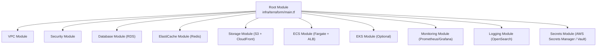
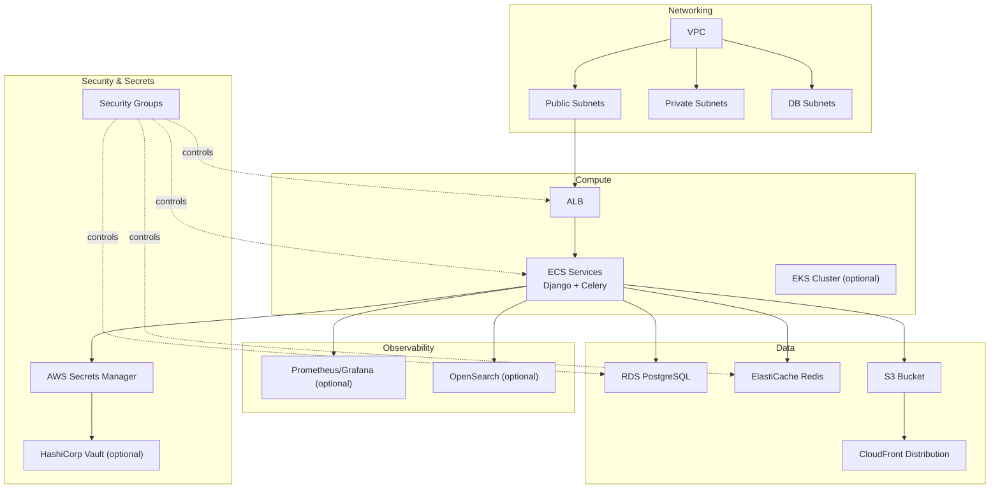
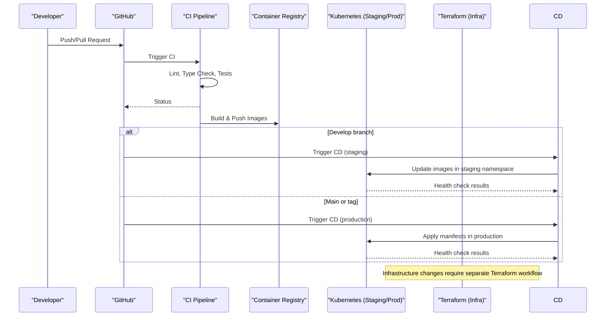
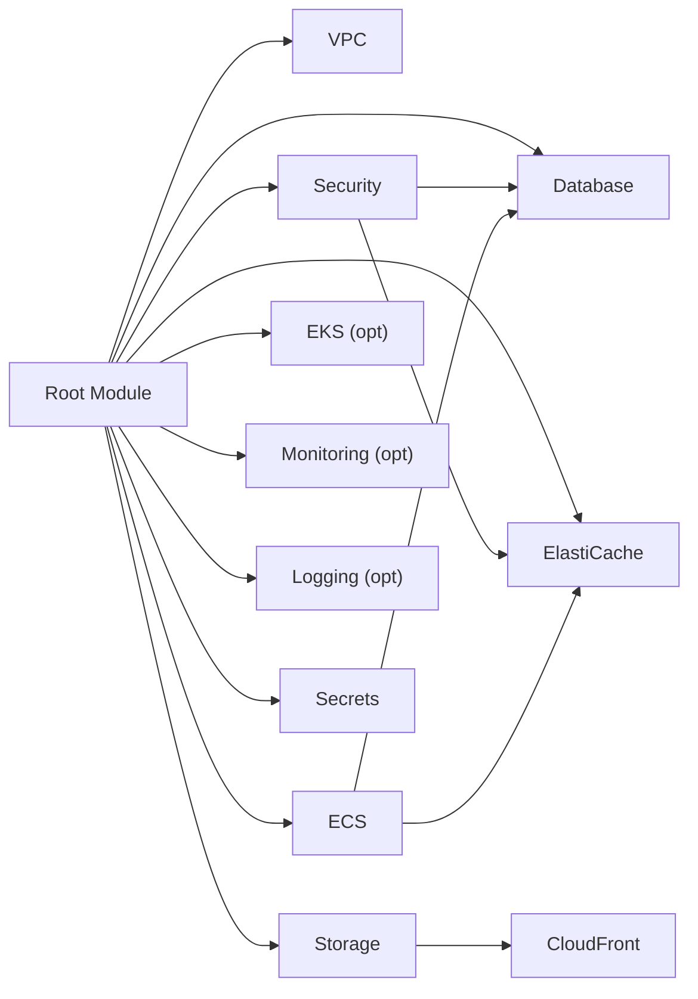

# Environment Management

<cite>
**Referenced Files in This Document**
- [main.tf](file://infra/terraform/main.tf)
- [variables.tf](file://infra/terraform/variables.tf)
- [outputs.tf](file://infra/terraform/outputs.tf)
- [terraform.tfvars.example](file://infra/terraform/terraform.tfvars.example)
- [database/main.tf](file://infra/terraform/modules/database/main.tf)
- [security/main.tf](file://infra/terraform/modules/security/main.tf)
- [storage/main.tf](file://infra/terraform/modules/storage/main.tf)
- [ci.yml](file://.github/workflows/ci.yml)
- [cd.yml](file://.github/workflows/cd.yml)
- [release.yml](file://.github/workflows/release.yml)
- [dependabot.yml](file://.github/dependabot.yml)
</cite>

## Table of Contents
1. [Introduction](#introduction)
2. [Project Structure](#project-structure)
3. [Core Components](#core-components)
4. [Architecture Overview](#architecture-overview)
5. [Detailed Component Analysis](#detailed-component-analysis)
6. [Dependency Analysis](#dependency-analysis)
7. [Performance Considerations](#performance-considerations)
8. [Troubleshooting Guide](#troubleshooting-guide)
9. [Conclusion](#conclusion)
10. [Appendices](#appendices)

## Introduction
This document explains how JOL-HUB manages environments and configuration for its Terraform-based infrastructure on AWS. It covers variable organization, environment-specific settings, state storage and locking, secrets management, validation, promotion strategies, and CI/CD automation. It also provides practical examples for creating new environments, updating existing infrastructure, and performing disaster recovery.

## Project Structure
The Terraform root module orchestrates multiple reusable modules to provision networking, security, compute, data stores, storage, monitoring, logging, and secrets. The repository also includes GitHub Actions workflows that implement continuous integration and deployment across staging and production.

**Diagram sources**
- [main.tf:63-325](file://infra/terraform/main.tf#L63-L325)

**Section sources**
- [main.tf:1-326](file://infra/terraform/main.tf#L1-L326)
- [variables.tf:1-513](file://infra/terraform/variables.tf#L1-L513)
- [outputs.tf:1-226](file://infra/terraform/outputs.tf#L1-L226)

## Core Components
- Root orchestration: Declares providers, default tags, and composes all modules with environment-scoped variables.
- Variables: Strongly typed inputs for environment, region, networking, database, cache, ECS/EKS sizing, DNS, monitoring, logging, and secrets.
- Outputs: Expose endpoints, ARNs, URLs, and secret references for downstream consumption.
- Modules: Encapsulate VPC, security groups, RDS, ElastiCache, S3/CloudFront, ECS, optional EKS, monitoring, logging, and secrets.

Key responsibilities:
- Environment isolation via variables and tagging.
- Secure defaults (private subnets, encryption, least privilege).
- Optional features toggled by boolean variables (monitoring, logging, EKS).
- Centralized secrets exposure through outputs and secure parameters.

**Section sources**
- [main.tf:8-46](file://infra/terraform/main.tf#L8-L46)
- [variables.tf:5-513](file://infra/terraform/variables.tf#L5-L513)
- [outputs.tf:5-226](file://infra/terraform/outputs.tf#L5-L226)

## Architecture Overview
The infrastructure is composed of a VPC with public/private subnets, an Application Load Balancer fronting ECS services, a managed PostgreSQL database, Redis cache, S3-backed static/media storage served via CloudFront, and optional Kubernetes (EKS), monitoring, and logging stacks. Secrets are stored in AWS Secrets Manager (with optional HashiCorp Vault integration).

**Diagram sources**
- [main.tf:63-325](file://infra/terraform/main.tf#L63-L325)
- [security/main.tf:15-202](file://infra/terraform/modules/security/main.tf#L15-L202)
- [database/main.tf:111-162](file://infra/terraform/modules/database/main.tf#L111-L162)
- [storage/main.tf:14-169](file://infra/terraform/modules/storage/main.tf#L14-L169)

## Detailed Component Analysis

### Variable Organization and Environment-Specific Configuration
- Global variables define project name, environment, and region; these propagate as tags and resource identifiers.
- Feature flags enable/disable optional components (EKS, monitoring, logging).
- Environment-specific values are supplied via tfvars files or CLI overrides; the example file demonstrates typical staging values.
- Sensitive variables are marked sensitive to prevent accidental logging.

Environment strategy recommendations:
- Use separate tfvars per environment (e.g., terraform.tfvars for dev, staging-prod.tfvars for prod).
- Pin provider versions and required Terraform version at the root.
- Enforce consistent naming and tagging using the environment variable.

**Section sources**
- [variables.tf:5-20](file://infra/terraform/variables.tf#L5-L20)
- [variables.tf:259-374](file://infra/terraform/variables.tf#L259-L374)
- [variables.tf:380-513](file://infra/terraform/variables.tf#L380-L513)
- [terraform.tfvars.example:1-110](file://infra/terraform/terraform.tfvars.example#L1-L110)

### State Management and Remote Backend
- The root module defines a backend block for S3 with DynamoDB-based locking, currently commented out for local development.
- For multi-environment deployments, use one workspace per environment and a remote backend with a unique key per environment.
- Enable encryption and configure a DynamoDB table for state locking to prevent concurrent modifications.

Operational guidance:
- Initialize with a remote backend before first apply.
- Use workspaces to isolate state per environment when sharing a single bucket/key prefix.
- Restrict IAM permissions to the CI runner and admins only.

**Section sources**
- [main.tf:26-34](file://infra/terraform/main.tf#L26-L34)

### Workspace Usage for Multi-Environment Deployments
- Workspaces allow you to maintain separate state files under the same configuration.
- Typical pattern: create a workspace per environment (dev, staging, production) and set environment-specific variables via tfvars or env.
- Combine workspaces with a remote backend to ensure isolated state per environment.

Best practices:
- Never store secrets in workspace variables; use Secrets Manager or CI/CD environment variables.
- Tag all resources with environment to simplify cost allocation and auditing.

[No sources needed since this section provides general guidance]

### Secrets Management
- Secrets are centralized in AWS Secrets Manager with KMS encryption and rotation options.
- Database credentials are generated and stored securely; application code reads them via task roles.
- Payment-related secrets are scoped separately for PCI-DSS compliance; card-processor credentials are intentionally excluded from the hub.
- Optional HashiCorp Vault integration is supported via variables.

Outputs expose ARNs for each secret category so applications can reference them securely.

**Section sources**
- [main.tf:277-325](file://infra/terraform/main.tf#L277-L325)
- [variables.tf:380-513](file://infra/terraform/variables.tf#L380-L513)
- [outputs.tf:172-226](file://infra/terraform/outputs.tf#L172-L226)
- [database/main.tf:15-45](file://infra/terraform/modules/database/main.tf#L15-L45)

### Configuration Validation
- Provider and Terraform versions are pinned to ensure compatibility.
- Sensitive variables are explicitly marked to avoid accidental exposure.
- CI pipeline enforces linting, type checks, and tests for application code; infrastructure changes should be gated by similar checks (e.g., terraform validate, fmt, plan diffs).

Recommendations:
- Add terraform validate and fmt checks to CI.
- Use policy-as-code tools (e.g., Sentinel, OPA) to enforce guardrails.
- Require manual approval for production deployments.

**Section sources**
- [main.tf:8-24](file://infra/terraform/main.tf#L8-L24)
- [variables.tf:369-374](file://infra/terraform/variables.tf#L369-L374)
- [ci.yml:36-174](file://.github/workflows/ci.yml#L36-L174)

### Environment Promotion Strategies
- Branch model: develop for staging, main for production.
- CD pipeline deploys automatically to staging on develop merges and to production on main merges or tagged releases.
- Staging uses kubectl image updates; production applies manifests and runs health checks.
- Rollback is automated on failure via workflow dispatch.

Promotion checklist:
- Ensure CI passes.
- Verify staging smoke tests.
- Approve production deployment (manual gate recommended).
- Monitor post-deploy metrics and logs.

**Section sources**
- [cd.yml:10-33](file://.github/workflows/cd.yml#L10-L33)
- [cd.yml:153-206](file://.github/workflows/cd.yml#L153-L206)
- [cd.yml:211-295](file://.github/workflows/cd.yml#L211-L295)
- [cd.yml:301-335](file://.github/workflows/cd.yml#L301-L335)

### CI/CD Integration Patterns
- CI performs linting, type checking, unit/integration tests, Docker build verification, and coverage reporting.
- CD builds images, pushes to registry, and deploys to staging or production based on branch/tag.
- Dependabot automates dependency updates across ecosystems including Terraform.

Deployment flow overview:

**Diagram sources**
- [ci.yml:36-379](file://.github/workflows/ci.yml#L36-L379)
- [cd.yml:39-335](file://.github/workflows/cd.yml#L39-L335)

**Section sources**
- [ci.yml:1-379](file://.github/workflows/ci.yml#L1-L379)
- [cd.yml:1-335](file://.github/workflows/cd.yml#L1-L335)
- [release.yml:1-48](file://.github/workflows/release.yml#L1-L48)
- [dependabot.yml:103-119](file://.github/dependabot.yml#L103-L119)

## Dependency Analysis
The root module depends on multiple modules, which encapsulate specific AWS resources. Security groups control traffic between ALB, ECS, RDS, and Redis. Storage uses S3 with CloudFront origin access control. Monitoring and logging are optional and conditionally created.

**Diagram sources**
- [main.tf:63-325](file://infra/terraform/main.tf#L63-L325)
- [security/main.tf:15-202](file://infra/terraform/modules/security/main.tf#L15-L202)
- [storage/main.tf:79-169](file://infra/terraform/modules/storage/main.tf#L79-L169)

**Section sources**
- [main.tf:63-325](file://infra/terraform/main.tf#L63-L325)

## Performance Considerations
- Database parameter group tunes connection limits, logging, and memory usage for Django workloads.
- Auto-scaling thresholds for ECS tasks are configurable via variables.
- CloudFront caching policies optimize static assets delivery.
- Monitoring thresholds are exposed as variables to tune alerts without code changes.

Recommendations:
- Right-size instance types per environment.
- Enable performance insights in production.
- Use autoscaling policies aligned with load patterns.

**Section sources**
- [database/main.tf:65-105](file://infra/terraform/modules/database/main.tf#L65-L105)
- [variables.tf:172-231](file://infra/terraform/variables.tf#L172-L231)
- [storage/main.tf:104-144](file://infra/terraform/modules/storage/main.tf#L104-L144)
- [variables.tf:253-287](file://infra/terraform/variables.tf#L253-L287)

## Troubleshooting Guide
Common issues and resolutions:
- State lock conflicts: Ensure only one process applies at a time; verify DynamoDB table exists and is accessible.
- Secret access errors: Confirm task execution and task roles have read permissions to secret ARNs; check IAM policies.
- Network connectivity failures: Validate security groups allow ALB to ECS, ECS to RDS/Redis, and restrict public access where appropriate.
- Deployment rollbacks: Use the rollback job in the CD workflow to revert to previous revisions quickly.

Operational steps:
- Inspect CloudWatch alarms for database CPU and storage thresholds.
- Review CloudFront and S3 logs for CDN issues.
- Use outputs to retrieve endpoints and ARNs for debugging.

**Section sources**
- [main.tf:26-34](file://infra/terraform/main.tf#L26-L34)
- [outputs.tf:34-109](file://infra/terraform/outputs.tf#L34-L109)
- [database/main.tf:196-232](file://infra/terraform/modules/database/main.tf#L196-L232)
- [security/main.tf:15-202](file://infra/terraform/modules/security/main.tf#L15-L202)
- [cd.yml:301-335](file://.github/workflows/cd.yml#L301-L335)

## Conclusion
JOL-HUB’s Terraform infrastructure follows a modular, environment-driven approach with strong defaults for security and observability. Variables centralize configuration, modules encapsulate complexity, and CI/CD automates safe promotions. Secrets are centrally managed with clear scoping for compliance. With remote state locking, workspaces, and robust pipelines, teams can confidently manage multi-environment deployments and recover quickly from incidents.

[No sources needed since this section summarizes without analyzing specific files]

## Appendices

### Common Operations

- Create a new environment
  - Add a new tfvars file with environment-specific values.
  - Initialize Terraform with the remote backend and select a workspace for the environment.
  - Run plan and apply after reviewing changes.

- Update existing infrastructure
  - Modify variables or modules as needed.
  - Run terraform plan to preview changes.
  - Apply during a maintenance window; monitor alarms and logs.

- Disaster recovery procedures
  - Restore state from S3 if corrupted; re-import resources if necessary.
  - Recreate critical resources using Terraform; verify secrets and network policies.
  - Validate application health and run smoke tests.

[No sources needed since this section provides general guidance]