# Monitoring & Logging

<cite>
**Referenced Files in This Document**
- [prometheus.yaml](file://infra/kubernetes/monitoring/prometheus.yaml)
- [grafana.yaml](file://infra/kubernetes/monitoring/grafana.yaml)
- [loki.yaml](file://infra/kubernetes/logging/loki.yaml)
- [observability.yaml](file://infra/kubernetes/observability/observability.yaml)
- [servicemonitor.yaml](file://infra/helm/jol-hub/templates/servicemonitor.yaml)
- [metrics_endpoint.py](file://backend/django/apps/core/metrics_endpoint.py)
- [metrics.py](file://backend/django/apps/crm/observability/metrics.py)
- [health.py](file://backend/django/apps/core/health.py)
- [alert-rules.yml](file://frontend/apps/template-renderer/observability/alert-rules.yml)
- [grafana-dashboard.json](file://frontend/apps/template-renderer/observability/grafana-dashboard.json)
- [logger.ts](file://frontend/packages/observability/src/logger.ts)
- [docker-compose.yml](file://docker-compose.yml)
</cite>

## Table of Contents
1. Introduction
2. Project Structure
3. Core Components
4. Architecture Overview
5. Detailed Component Analysis
6. Dependency Analysis
7. Performance Considerations
8. Troubleshooting Guide
9. Conclusion
10. Appendices

## Introduction
This document describes the monitoring and logging infrastructure for JOL-HUB. It covers Prometheus-based metrics collection, Grafana dashboards and datasources, Loki-based centralized logging with Promtail collectors, AlertManager alerting and escalation, application health checks, and observability patterns across backend and frontend services. It also provides guidance on custom metrics, log parsing rules, retention policies, and dashboard creation workflows.

## Project Structure
The observability stack is deployed as Kubernetes resources:
- Metrics: Prometheus with scrape targets for Kubernetes components, JOL-HUB backend pods, PostgreSQL exporter, and Redis exporter.
- Visualization: Grafana with provisioned datasources (Prometheus and Loki) and a default dashboard.
- Logs: Loki with retention configured and Promtail DaemonSet to ship container logs.
- Alerting: AlertManager with routing and receivers; Prometheus rule files are referenced by Prometheus configuration.
- Service discovery: Helm ServiceMonitor template for scraping app metrics endpoints.

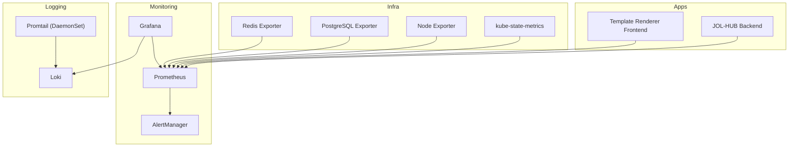

**Diagram sources**
- [prometheus.yaml:51-152](file://infra/kubernetes/monitoring/prometheus.yaml#L51-L152)
- [grafana.yaml:5-22](file://infra/kubernetes/monitoring/grafana.yaml#L5-L22)
- [loki.yaml:18-72](file://infra/kubernetes/logging/loki.yaml#L18-L72)
- [observability.yaml:8-87](file://infra/kubernetes/observability/observability.yaml#L8-L87)
- [observability.yaml:88-203](file://infra/kubernetes/observability/observability.yaml#L88-L203)
- [observability.yaml:204-293](file://infra/kubernetes/observability/observability.yaml#L204-L293)

**Section sources**
- [prometheus.yaml:51-152](file://infra/kubernetes/monitoring/prometheus.yaml#L51-L152)
- [grafana.yaml:5-22](file://infra/kubernetes/monitoring/grafana.yaml#L5-L22)
- [loki.yaml:18-72](file://infra/kubernetes/logging/loki.yaml#L18-L72)
- [observability.yaml:8-87](file://infra/kubernetes/observability/observability.yaml#L8-L87)
- [observability.yaml:88-203](file://infra/kubernetes/observability/observability.yaml#L88-L203)
- [observability.yaml:204-293](file://infra/kubernetes/observability/observability.yaml#L204-L293)

## Core Components
- Prometheus: Scrapes Kubernetes API, nodes, pods, and exporters; stores metrics with retention policy; references AlertManager and rule files.
- Grafana: Provisioned with Prometheus and Loki datasources; loads a default dashboard via ConfigMap; exposes UI via LoadBalancer service.
- Loki: Centralized log store with retention and compactor; uses filesystem storage; configured with query cache and ruler pointing to AlertManager.
- Promtail: DaemonSet that scrapes Kubernetes pod and system logs, parses Docker JSON, relabels labels, and pushes to Loki.
- AlertManager: Routes alerts by severity, supports webhook and Slack receivers.
- Health checks: Deep health aggregator for database, cache, and Celery broker; used for liveness/readiness probes.
- Custom metrics: Django endpoint exposing Prometheus text format with IP allowlist and optional bearer token; CRM observability module defines counters, histograms, gauges, and compliance/performance monitors.
- Frontend observability: Structured logger emitting JSON-lines; Loki-based Grafana dashboard and Prometheus alert rules for frontend error rates and performance budgets.

**Section sources**
- [prometheus.yaml:51-152](file://infra/kubernetes/monitoring/prometheus.yaml#L51-L152)
- [grafana.yaml:5-22](file://infra/kubernetes/monitoring/grafana.yaml#L5-L22)
- [loki.yaml:18-72](file://infra/kubernetes/logging/loki.yaml#L18-L72)
- [loki.yaml:149-251](file://infra/kubernetes/logging/loki.yaml#L149-L251)
- [observability.yaml:204-293](file://infra/kubernetes/observability/observability.yaml#L204-L293)
- [health.py:39-127](file://backend/django/apps/core/health.py#L39-L127)
- [metrics_endpoint.py:68-154](file://backend/django/apps/core/metrics_endpoint.py#L68-L154)
- [metrics.py:33-113](file://backend/django/apps/crm/observability/metrics.py#L33-L113)
- [alert-rules.yml:18-144](file://frontend/apps/template-renderer/observability/alert-rules.yml#L18-L144)
- [grafana-dashboard.json:1-163](file://frontend/apps/template-renderer/observability/grafana-dashboard.json#L1-L163)
- [logger.ts:1-108](file://frontend/packages/observability/src/logger.ts#L1-L108)

## Architecture Overview
The observability architecture integrates metrics, logs, and alerts into a cohesive stack:
- Application metrics are exposed via a secured Django endpoint and scraped by Prometheus using Kubernetes SD or ServiceMonitors.
- Logs from containers are shipped by Promtail to Loki with structured labels for filtering and querying.
- Grafana visualizes both metrics and logs, with provisioned datasources and dashboards.
- Alerts defined in Prometheus rule files evaluate against metrics/logs and route through AlertManager to webhooks and Slack.

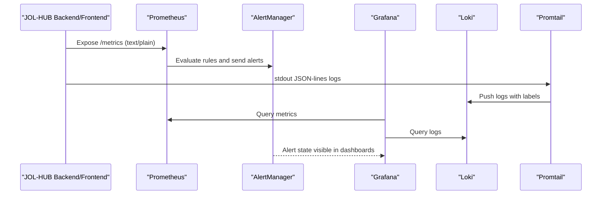

**Diagram sources**
- [metrics_endpoint.py:68-154](file://backend/django/apps/core/metrics_endpoint.py#L68-L154)
- [prometheus.yaml:51-152](file://infra/kubernetes/monitoring/prometheus.yaml#L51-L152)
- [observability.yaml:204-293](file://infra/kubernetes/observability/observability.yaml#L204-L293)
- [loki.yaml:149-251](file://infra/kubernetes/logging/loki.yaml#L149-L251)
- [grafana.yaml:5-22](file://infra/kubernetes/monitoring/grafana.yaml#L5-L22)

## Detailed Component Analysis

### Prometheus Configuration and Scrape Targets
- Global settings define scrape and evaluation intervals and external labels for cluster/environment identification.
- Alerting target points to AlertManager service.
- Rule files are loaded from a mounted directory.
- Scrape configs include:
  - Kubernetes API server over HTTPS with RBAC tokens.
  - Node metrics via HTTPS.
  - Pod metrics via annotations for dynamic discovery.
  - JOL-HUB backend pods filtered by label and annotation.
  - Static targets for PostgreSQL and Redis exporters.

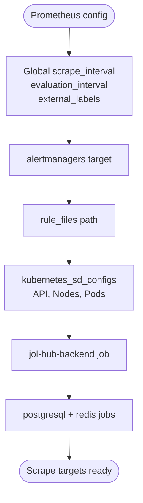

**Diagram sources**
- [prometheus.yaml:51-152](file://infra/kubernetes/monitoring/prometheus.yaml#L51-L152)

**Section sources**
- [prometheus.yaml:51-152](file://infra/kubernetes/monitoring/prometheus.yaml#L51-L152)

### Grafana Datasources and Dashboards
- Datasources provisioned via ConfigMap:
  - Prometheus at http://prometheus:9090
  - Loki at http://loki:3100
- Dashboard provider configured to load JSON dashboards from a mounted path.
- A default dashboard JSON is provided as a labeled ConfigMap for automatic loading.

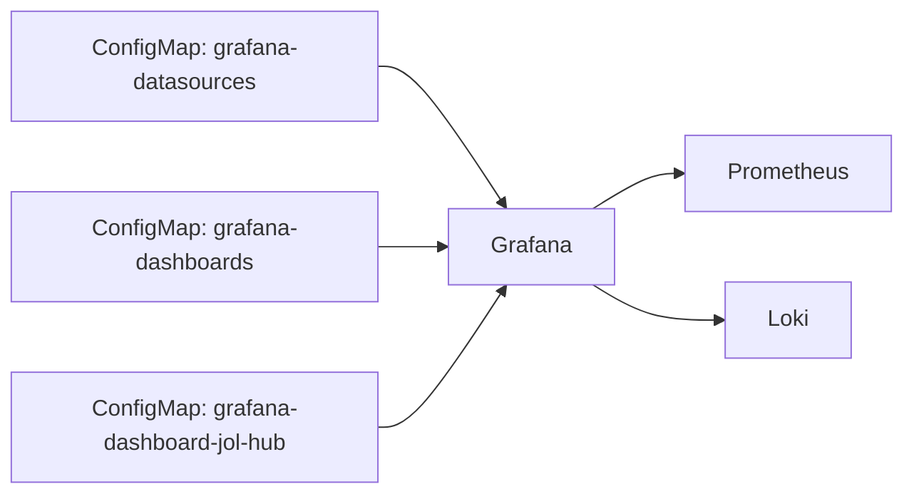

**Diagram sources**
- [grafana.yaml:5-22](file://infra/kubernetes/monitoring/grafana.yaml#L5-L22)
- [grafana.yaml:23-40](file://infra/kubernetes/monitoring/grafana.yaml#L23-L40)
- [grafana.yaml:41-315](file://infra/kubernetes/monitoring/grafana.yaml#L41-L315)

**Section sources**
- [grafana.yaml:5-22](file://infra/kubernetes/monitoring/grafana.yaml#L5-L22)
- [grafana.yaml:23-40](file://infra/kubernetes/monitoring/grafana.yaml#L23-L40)
- [grafana.yaml:41-315](file://infra/kubernetes/monitoring/grafana.yaml#L41-L315)

### Loki and Promtail Log Pipeline
- Loki runs with filesystem storage, retention period set to 31 days, compaction enabled, and query cache configured.
- Promtail DaemonSet:
  - Discovers Kubernetes pods and node logs.
  - Parses Docker JSON logs.
  - Relabels logs with app, namespace, pod, container labels.
  - Pushes to Loki HTTP endpoint.

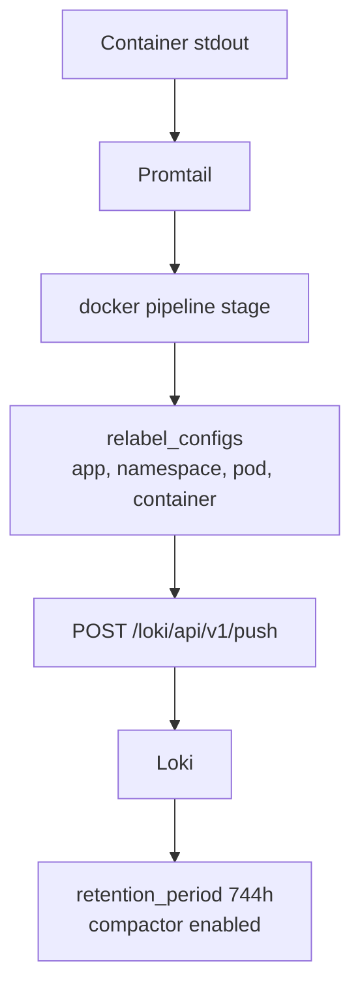

**Diagram sources**
- [loki.yaml:18-72](file://infra/kubernetes/logging/loki.yaml#L18-L72)
- [loki.yaml:149-251](file://infra/kubernetes/logging/loki.yaml#L149-L251)

**Section sources**
- [loki.yaml:18-72](file://infra/kubernetes/logging/loki.yaml#L18-L72)
- [loki.yaml:149-251](file://infra/kubernetes/logging/loki.yaml#L149-L251)

### AlertManager Routing and Receivers
- AlertManager routes alerts grouped by alertname and severity, with group_wait, group_interval, and repeat_interval.
- Default receiver sends webhooks to a backend endpoint.
- Critical severity receiver sends Slack notifications with resolved messages.

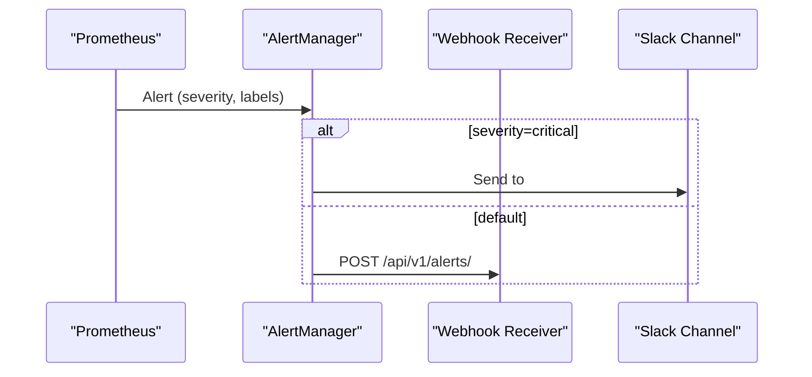

**Diagram sources**
- [observability.yaml:204-293](file://infra/kubernetes/observability/observability.yaml#L204-L293)

**Section sources**
- [observability.yaml:204-293](file://infra/kubernetes/observability/observability.yaml#L204-L293)

### Backend Metrics Endpoint and Security
- The Django view exposes Prometheus metrics in standard text exposition format.
- Access control:
  - IP allowlist via setting; when empty, all IPs allowed (development).
  - Optional bearer token check via Authorization header.
- Multi-process support via multiprocess collector directory setting.

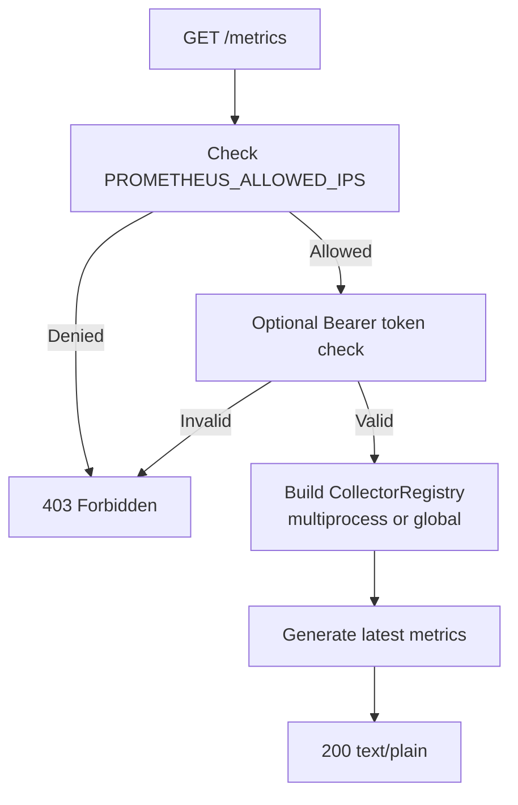

**Diagram sources**
- [metrics_endpoint.py:68-154](file://backend/django/apps/core/metrics_endpoint.py#L68-L154)

**Section sources**
- [metrics_endpoint.py:68-154](file://backend/django/apps/core/metrics_endpoint.py#L68-L154)

### CRM Observability Metrics and Compliance Monitor
- Defines counters, histograms, and gauges for request volume, latency, data access, GDPR requests, security events, audit integrity, Bitrix24 sync operations and latency, and circuit breaker state.
- ComplianceMonitor aggregates tenant-level compliance status including DSR counts, consent metrics, legal holds, audit integrity, and security events, with caching and score calculation.
- PerformanceMonitor tracks request latency and data access operations.
- HealthChecker validates database connectivity, audit integrity, and Bitrix24 client availability.

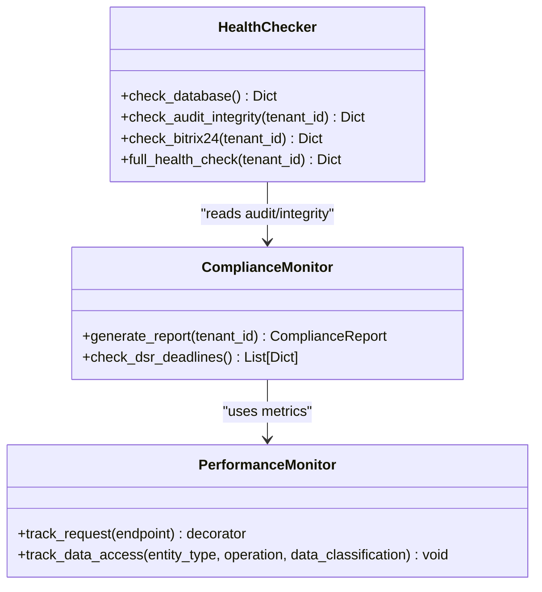

**Diagram sources**
- [metrics.py:33-113](file://backend/django/apps/crm/observability/metrics.py#L33-L113)
- [metrics.py:182-329](file://backend/django/apps/crm/observability/metrics.py#L182-L329)
- [metrics.py:335-478](file://backend/django/apps/crm/observability/metrics.py#L335-L478)

**Section sources**
- [metrics.py:33-113](file://backend/django/apps/crm/observability/metrics.py#L33-L113)
- [metrics.py:182-329](file://backend/django/apps/crm/observability/metrics.py#L182-L329)
- [metrics.py:335-478](file://backend/django/apps/crm/observability/metrics.py#L335-L478)

### Health Checks and Probes
- DeepHealthChecker provides liveness, readiness, and deep checks:
  - Liveness: minimal database ping.
  - Readiness: database and cache checks.
  - Deep: includes Celery broker connectivity.
- Rollup logic computes overall status prioritizing unhealthy > degraded > healthy.

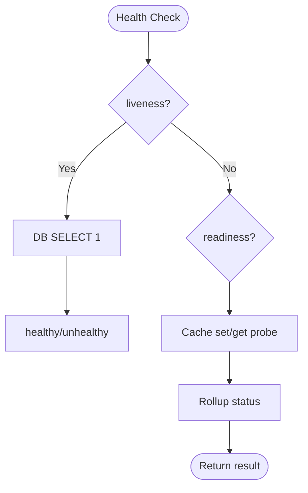

**Diagram sources**
- [health.py:39-127](file://backend/django/apps/core/health.py#L39-L127)
- [health.py:218-231](file://backend/django/apps/core/health.py#L218-L231)

**Section sources**
- [health.py:39-127](file://backend/django/apps/core/health.py#L39-L127)
- [health.py:218-231](file://backend/django/apps/core/health.py#L218-L231)

### Frontend Observability: Logger, Dashboards, and Alert Rules
- Structured logger emits one-line JSON records with time, level, msg, service, and redacted fields; supports child bindings and level gating.
- Grafana dashboard queries Loki for frontend error rate, HTTP status distribution, client errors, per-tenant error rate, slow tenants, commerce health, auth health, and Web Vitals poor-rating share.
- Prometheus alert rules define severity ladder (P0-P3) based on log-derived rates and health probes, with runbook links and incident channels.

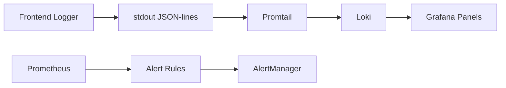

**Diagram sources**
- [logger.ts:1-108](file://frontend/packages/observability/src/logger.ts#L1-L108)
- [grafana-dashboard.json:1-163](file://frontend/apps/template-renderer/observability/grafana-dashboard.json#L1-L163)
- [alert-rules.yml:18-144](file://frontend/apps/template-renderer/observability/alert-rules.yml#L18-L144)
- [loki.yaml:149-251](file://infra/kubernetes/logging/loki.yaml#L149-L251)

**Section sources**
- [logger.ts:1-108](file://frontend/packages/observability/src/logger.ts#L1-L108)
- [grafana-dashboard.json:1-163](file://frontend/apps/template-renderer/observability/grafana-dashboard.json#L1-L163)
- [alert-rules.yml:18-144](file://frontend/apps/template-renderer/observability/alert-rules.yml#L18-L144)

### ServiceMonitor Integration
- Helm template conditionally creates a ServiceMonitor resource to scrape the app’s metrics endpoint with configurable path and interval.

**Section sources**
- [servicemonitor.yaml:1-20](file://infra/helm/jol-hub/templates/servicemonitor.yaml#L1-L20)

## Dependency Analysis
- Prometheus depends on Kubernetes API, Node Exporter, kube-state-metrics, and application/exporter services.
- Grafana depends on Prometheus and Loki datasources.
- Loki depends on persistent storage and compactor; Promtail depends on Kubernetes API for service discovery.
- AlertManager depends on Prometheus rule evaluation and receivers (webhook, Slack).
- Backend metrics endpoint depends on Django settings and prometheus_client registry.

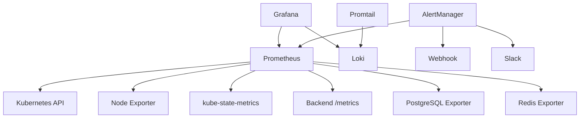

**Diagram sources**
- [prometheus.yaml:51-152](file://infra/kubernetes/monitoring/prometheus.yaml#L51-L152)
- [observability.yaml:8-87](file://infra/kubernetes/observability/observability.yaml#L8-L87)
- [observability.yaml:88-203](file://infra/kubernetes/observability/observability.yaml#L88-L203)
- [observability.yaml:204-293](file://infra/kubernetes/observability/observability.yaml#L204-L293)
- [loki.yaml:149-251](file://infra/kubernetes/logging/loki.yaml#L149-L251)
- [grafana.yaml:5-22](file://infra/kubernetes/monitoring/grafana.yaml#L5-L22)

**Section sources**
- [prometheus.yaml:51-152](file://infra/kubernetes/monitoring/prometheus.yaml#L51-L152)
- [observability.yaml:8-87](file://infra/kubernetes/observability/observability.yaml#L8-L87)
- [observability.yaml:88-203](file://infra/kubernetes/observability/observability.yaml#L88-L203)
- [observability.yaml:204-293](file://infra/kubernetes/observability/observability.yaml#L204-L293)
- [loki.yaml:149-251](file://infra/kubernetes/logging/loki.yaml#L149-L251)
- [grafana.yaml:5-22](file://infra/kubernetes/monitoring/grafana.yaml#L5-L22)

## Performance Considerations
- Prometheus retention is set to 15 days; adjust storage and PVC size accordingly.
- Loki retention is set to 31 days with compaction enabled; ensure sufficient PVC capacity.
- Scrape intervals are 30 seconds; tune based on workload and cardinality.
- Use histogram buckets appropriate for your latency profiles to avoid excessive cardinality.
- Label cardinality in metrics and logs should be controlled to prevent high memory usage in Prometheus and Loki.
- For multi-process deployments, configure multiprocess directory to aggregate metrics correctly.

[No sources needed since this section provides general guidance]

## Troubleshooting Guide
- Metrics endpoint returns 403:
  - Verify IP allowlist configuration and bearer token if enabled.
  - Ensure Prometheus server IP is included in the allowlist.
- No metrics scraped:
  - Confirm pod annotations for scraping are present and correct.
  - Validate ServiceMonitor path and interval values.
- Logs not appearing in Loki:
  - Check Promtail DaemonSet logs and relabel configurations.
  - Verify Loki HTTP endpoint and push URL.
- Alerts not firing:
  - Review Prometheus rule files and evaluation intervals.
  - Confirm AlertManager routing and receivers are configured.
- Health checks failing:
  - Inspect database connectivity and cache reachability.
  - Validate Celery broker URL and network policies.

**Section sources**
- [metrics_endpoint.py:95-129](file://backend/django/apps/core/metrics_endpoint.py#L95-L129)
- [prometheus.yaml:100-140](file://infra/kubernetes/monitoring/prometheus.yaml#L100-L140)
- [loki.yaml:149-251](file://infra/kubernetes/logging/loki.yaml#L149-L251)
- [observability.yaml:204-293](file://infra/kubernetes/observability/observability.yaml#L204-L293)
- [health.py:133-212](file://backend/django/apps/core/health.py#L133-L212)

## Conclusion
JOL-HUB’s observability stack combines Prometheus for metrics, Loki for centralized logs, Grafana for visualization, and AlertManager for alerting. The backend exposes secure metrics endpoints and rich observability modules, while the frontend ships structured logs and defines alert rules and dashboards. Proper configuration of retention, scrape intervals, label cardinality, and alert routing ensures reliable monitoring and actionable insights.

[No sources needed since this section summarizes without analyzing specific files]

## Appendices

### Example: Custom Metrics Workflow
- Define counters/histograms/gauges in an observability module.
- Instrument request handlers and background tasks to record metrics.
- Expose a Prometheus-compatible endpoint with access controls.
- Configure Prometheus to scrape the endpoint via annotations or ServiceMonitor.
- Create Grafana panels and dashboards to visualize key indicators.

**Section sources**
- [metrics.py:33-113](file://backend/django/apps/crm/observability/metrics.py#L33-L113)
- [metrics_endpoint.py:68-154](file://backend/django/apps/core/metrics_endpoint.py#L68-L154)
- [servicemonitor.yaml:1-20](file://infra/helm/jol-hub/templates/servicemonitor.yaml#L1-L20)

### Example: Log Parsing Rules
- Use Promtail docker parser to parse JSON lines emitted by the frontend logger.
- Relabel logs with service, namespace, pod, container labels for targeted queries.
- Apply retention policies in Loki to manage storage costs.

**Section sources**
- [logger.ts:1-108](file://frontend/packages/observability/src/logger.ts#L1-L108)
- [loki.yaml:149-251](file://infra/kubernetes/logging/loki.yaml#L149-L251)

### Example: Dashboard Creation Workflow
- Provision Grafana datasources via ConfigMap.
- Add dashboard JSON via labeled ConfigMap for automatic loading.
- Use Loki queries to build panels for error rates, status distributions, and performance metrics.

**Section sources**
- [grafana.yaml:5-22](file://infra/kubernetes/monitoring/grafana.yaml#L5-L22)
- [grafana.yaml:41-315](file://infra/kubernetes/monitoring/grafana.yaml#L41-L315)
- [grafana-dashboard.json:1-163](file://frontend/apps/template-renderer/observability/grafana-dashboard.json#L1-L163)

### Example: Alerting Configuration
- Define alert groups and rules in Prometheus rule files.
- Route alerts by severity to appropriate receivers (webhook, Slack).
- Include runbooks and incident channels in alert annotations.

**Section sources**
- [alert-rules.yml:18-144](file://frontend/apps/template-renderer/observability/alert-rules.yml#L18-L144)
- [observability.yaml:204-293](file://infra/kubernetes/observability/observability.yaml#L204-L293)