# Security & Compliance

<cite>
**Referenced Files in This Document**
- [main.tf](file://infra/terraform/main.tf)
- [security/main.tf](file://infra/terraform/modules/security/main.tf)
- [vpc/main.tf](file://infra/terraform/modules/vpc/main.tf)
- [ecs/main.tf](file://infra/terraform/modules/ecs/main.tf)
- [database/main.tf](file://infra/terraform/modules/database/main.tf)
- [storage/main.tf](file://infra/terraform/modules/storage/main.tf)
- [eks/main.tf](file://infra/terraform/modules/eks/main.tf)
- [security-model.md](file://docs/architecture/security-model.md)
- [entity_ropa.py](file://data/src/gdpr/entity_ropa.py)
- [retention_manager.py](file://data/src/gdpr/retention_manager.py)
- [models.py](file://backend/django/apps/core/models.py)
- [security-scan.yml](file://.github/workflows/security-scan.yml)
</cite>

## Table of Contents
1. Introduction
2. Project Structure
3. Core Components
4. Architecture Overview
5. Detailed Component Analysis
6. Dependency Analysis
7. Performance Considerations
8. Troubleshooting Guide
9. Conclusion
10. Appendices

## Introduction
This document provides comprehensive security and compliance guidance for JOL-HUB’s Terraform-managed infrastructure on AWS. It covers network segmentation, least privilege IAM, encryption at rest and in transit, secrets management, audit logging, vulnerability scanning, and compliance alignment with GDPR, SOC 2, and ISO 27001. It also includes incident response considerations and best practices for secure operations.

## Project Structure
JOL-HUB’s infrastructure is organized into reusable Terraform modules that encapsulate networking, compute, storage, database, security controls, and optional EKS/logging/monitoring components. The root module wires these together and exposes environment-specific variables.

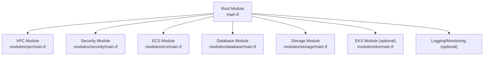

**Diagram sources**
- [main.tf:63-271](file://infra/terraform/main.tf#L63-L271)

**Section sources**
- [main.tf:8-46](file://infra/terraform/main.tf#L8-L46)
- [main.tf:63-271](file://infra/terraform/main.tf#L63-L271)

## Core Components
- Networking and segmentation: VPC with public/private/database subnets, NAT Gateways per AZ, and VPC Endpoints to keep traffic within AWS.
- Security groups: Least-privilege ingress/egress for ALB, ECS tasks, RDS, ElastiCache, and optional bastion.
- Compute: ECS services (Django web, Celery worker, Celery beat) behind an Application Load Balancer with HTTPS listeners and TLS policies.
- Data stores: RDS PostgreSQL with encryption at rest, backups, performance insights; ElastiCache Redis; S3 buckets with server-side encryption and lifecycle rules; CloudFront distribution with OAC.
- Secrets: AWS Secrets Manager for DB credentials and Django settings; SSM Parameters for configuration values; optional HashiCorp Vault integration.
- Optional EKS: Managed Kubernetes cluster with OIDC-backed IRSA, KMS-encrypted secrets, and scoped IAM roles.

**Section sources**
- [vpc/main.tf:20-283](file://infra/terraform/modules/vpc/main.tf#L20-L283)
- [security/main.tf:15-202](file://infra/terraform/modules/security/main.tf#L15-L202)
- [ecs/main.tf:122-242](file://infra/terraform/modules/ecs/main.tf#L122-L242)
- [database/main.tf:111-162](file://infra/terraform/modules/database/main.tf#L111-L162)
- [storage/main.tf:14-169](file://infra/terraform/modules/storage/main.tf#L14-L169)
- [eks/main.tf:15-46](file://infra/terraform/modules/eks/main.tf#L15-L46)

## Architecture Overview
The runtime path enforces TLS termination at the ALB, forwards to ECS tasks in private subnets, which access RDS and Redis via strict security group rules. S3 media assets are served through CloudFront using Origin Access Control to restrict direct bucket access. Logs and metrics flow to CloudWatch and optional OpenSearch/Prometheus stacks.

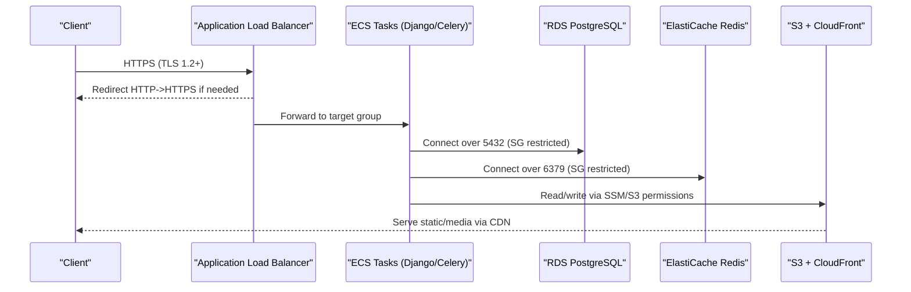

**Diagram sources**
- [ecs/main.tf:171-199](file://infra/terraform/modules/ecs/main.tf#L171-L199)
- [security/main.tf:65-106](file://infra/terraform/modules/security/main.tf#L65-L106)
- [storage/main.tf:79-169](file://infra/terraform/modules/storage/main.tf#L79-L169)

## Detailed Component Analysis

### Network Security and Segmentation
- Public subnets host the ALB; private subnets run ECS tasks without public IPs; database subnets isolate RDS.
- NAT Gateways provide outbound internet access for private subnets with one per AZ for HA.
- VPC Endpoints route service calls (ECR, Logs, S3) privately, reducing exposure and cost.

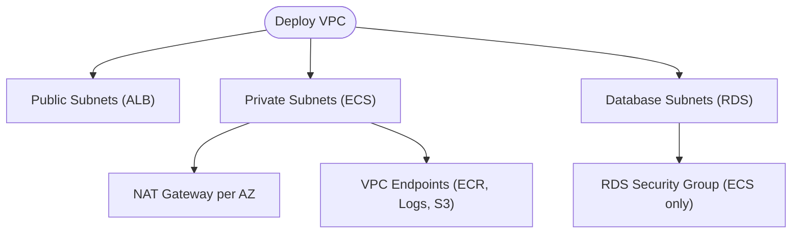

**Diagram sources**
- [vpc/main.tf:34-82](file://infra/terraform/modules/vpc/main.tf#L34-L82)
- [vpc/main.tf:116-177](file://infra/terraform/modules/vpc/main.tf#L116-L177)
- [vpc/main.tf:202-250](file://infra/terraform/modules/vpc/main.tf#L202-L250)

**Section sources**
- [vpc/main.tf:20-283](file://infra/terraform/modules/vpc/main.tf#L20-L283)

### Security Groups and Least Privilege Ingress/Egress
- ALB allows inbound 80/443 from the internet; egress open for upstream calls.
- ECS tasks allow inbound 8000 only from ALB security group; egress open for outbound dependencies.
- RDS allows inbound 5432 only from ECS security group and optionally VPC CIDR for management.
- ElastiCache allows inbound 6379 only from ECS security group.
- Bastion (optional) restricts SSH to admin CIDRs.

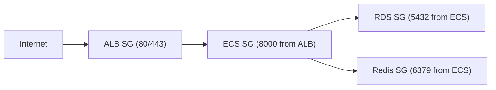

**Diagram sources**
- [security/main.tf:15-53](file://infra/terraform/modules/security/main.tf#L15-L53)
- [security/main.tf:59-88](file://infra/terraform/modules/security/main.tf#L59-L88)
- [security/main.tf:94-131](file://infra/terraform/modules/security/main.tf#L94-L131)
- [security/main.tf:137-165](file://infra/terraform/modules/security/main.tf#L137-L165)
- [security/main.tf:171-202](file://infra/terraform/modules/security/main.tf#L171-L202)

**Section sources**
- [security/main.tf:15-202](file://infra/terraform/modules/security/main.tf#L15-L202)

### Encryption in Transit and At Rest
- TLS termination at ALB with modern policy; HTTP listener redirects to HTTPS.
- CloudFront enforces viewer protocol redirect to HTTPS; default certificate or custom ACM cert.
- RDS storage encrypted; backups retained; performance insights enabled.
- S3 buckets enforce server-side encryption (AES-256), block public access, and apply lifecycle rules.
- EKS cluster encrypts secrets with KMS.

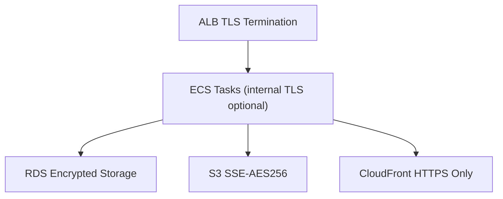

**Diagram sources**
- [ecs/main.tf:171-199](file://infra/terraform/modules/ecs/main.tf#L171-L199)
- [storage/main.tf:47-55](file://infra/terraform/modules/storage/main.tf#L47-L55)
- [storage/main.tf:91-169](file://infra/terraform/modules/storage/main.tf#L91-L169)
- [database/main.tf:111-162](file://infra/terraform/modules/database/main.tf#L111-L162)
- [eks/main.tf:36-41](file://infra/terraform/modules/eks/main.tf#L36-L41)

**Section sources**
- [ecs/main.tf:171-199](file://infra/terraform/modules/ecs/main.tf#L171-L199)
- [storage/main.tf:47-169](file://infra/terraform/modules/storage/main.tf#L47-L169)
- [database/main.tf:111-162](file://infra/terraform/modules/database/main.tf#L111-L162)
- [eks/main.tf:36-41](file://infra/terraform/modules/eks/main.tf#L36-L41)

### Secrets Management and Configuration
- RDS credentials stored in AWS Secrets Manager; task execution role granted read-only access.
- Django settings secret created and injected into containers via ECS secrets mapping.
- SSM Parameters expose non-sensitive configuration (bucket names, URLs).
- Optional HashiCorp Vault integration supported by variables.

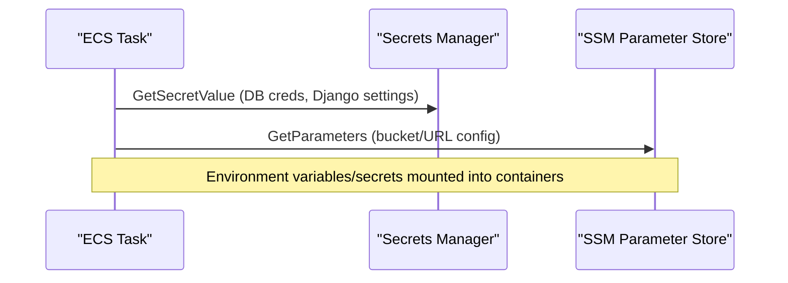

**Diagram sources**
- [database/main.tf:25-45](file://infra/terraform/modules/database/main.tf#L25-L45)
- [ecs/main.tf:275-302](file://infra/terraform/modules/ecs/main.tf#L275-L302)
- [ecs/main.tf:371-394](file://infra/terraform/modules/ecs/main.tf#L371-L394)
- [ecs/main.tf:418-422](file://infra/terraform/modules/ecs/main.tf#L418-L422)
- [storage/main.tf:257-287](file://infra/terraform/modules/storage/main.tf#L257-L287)

**Section sources**
- [database/main.tf:25-45](file://infra/terraform/modules/database/main.tf#L25-L45)
- [ecs/main.tf:275-302](file://infra/terraform/modules/ecs/main.tf#L275-L302)
- [ecs/main.tf:371-394](file://infra/terraform/modules/ecs/main.tf#L371-L394)
- [storage/main.tf:257-287](file://infra/terraform/modules/storage/main.tf#L257-L287)

### IAM Policies and Least Privilege
- ECS Execution Role: minimal permissions to pull images and read specific secrets/parameters.
- ECS Task Role: scoped S3 read/write to project bucket and SES send permissions.
- EKS Node Role: standard worker policies plus read-only ECR; additional S3 access scoped to project bucket.
- EBS CSI Driver uses IRSA with narrowly scoped EC2 actions.

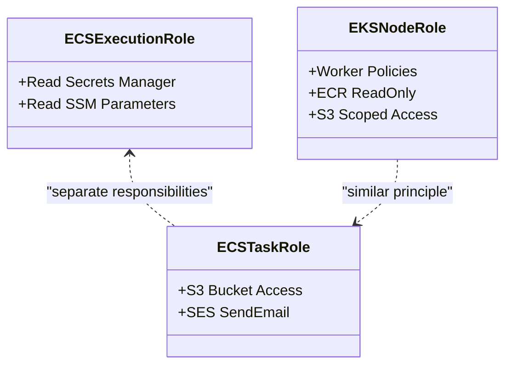

**Diagram sources**
- [ecs/main.tf:250-302](file://infra/terraform/modules/ecs/main.tf#L250-L302)
- [ecs/main.tf:324-365](file://infra/terraform/modules/ecs/main.tf#L324-L365)
- [eks/main.tf:92-147](file://infra/terraform/modules/eks/main.tf#L92-L147)
- [eks/main.tf:290-391](file://infra/terraform/modules/eks/main.tf#L290-L391)

**Section sources**
- [ecs/main.tf:250-365](file://infra/terraform/modules/ecs/main.tf#L250-L365)
- [eks/main.tf:92-147](file://infra/terraform/modules/eks/main.tf#L92-L147)
- [eks/main.tf:290-391](file://infra/terraform/modules/eks/main.tf#L290-L391)

### Audit Logging and Access Controls
- RDS parameter group enables statement logging and slow query logs.
- ECS services stream logs to CloudWatch log groups with retention policies.
- ALB access logs written to a dedicated S3 bucket with lifecycle expiration.
- Application-level immutable audit model captures user actions, consent, DSR events, and legal holds.

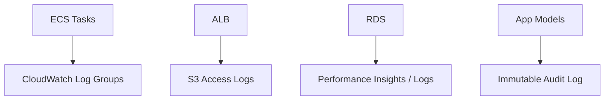

**Diagram sources**
- [ecs/main.tf:91-116](file://infra/terraform/modules/ecs/main.tf#L91-L116)
- [ecs/main.tf:205-242](file://infra/terraform/modules/ecs/main.tf#L205-L242)
- [database/main.tf:65-105](file://infra/terraform/modules/database/main.tf#L65-L105)
- [models.py:67-155](file://backend/django/apps/core/models.py#L67-L155)

**Section sources**
- [ecs/main.tf:91-116](file://infra/terraform/modules/ecs/main.tf#L91-L116)
- [ecs/main.tf:205-242](file://infra/terraform/modules/ecs/main.tf#L205-L242)
- [database/main.tf:65-105](file://infra/terraform/modules/database/main.tf#L65-L105)
- [models.py:67-155](file://backend/django/apps/core/models.py#L67-L155)

### Vulnerability Scanning and Secure SDLC
- CI pipeline runs secret detection (Gitleaks, TruffleHog), SAST (Bandit, Semgrep), SCA (Safety, pip-audit, pnpm audit, Snyk), container scans (Trivy), IaC scans (Checkov, Terrascan), and CodeQL analysis.
- Results uploaded as artifacts and SARIF reports for tracking.

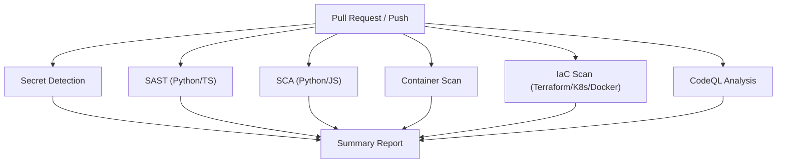

**Diagram sources**
- [security-scan.yml:35-57](file://.github/workflows/security-scan.yml#L35-L57)
- [security-scan.yml:62-103](file://.github/workflows/security-scan.yml#L62-L103)
- [security-scan.yml:105-141](file://.github/workflows/security-scan.yml#L105-L141)
- [security-scan.yml:147-231](file://.github/workflows/security-scan.yml#L147-L231)
- [security-scan.yml:237-302](file://.github/workflows/security-scan.yml#L237-L302)
- [security-scan.yml:315-345](file://.github/workflows/security-scan.yml#L315-L345)

**Section sources**
- [security-scan.yml:35-345](file://.github/workflows/security-scan.yml#L35-L345)

### Compliance Alignment (GDPR, SOC 2, ISO 27001)
- GDPR:
  - Records of Processing Activities generated per entity type with legal basis, data categories, recipients, retention, and security measures.
  - Retention manager enforces storage limitation and right to erasure, with legal hold checks preventing deletion when required.
  - Immutable audit logs capture consent, DSR actions, and legal holds.
- SOC 2:
  - Access controls, encryption, monitoring, and change control via CI/CD and IaC scanning support CC6–CC7 controls.
  - Least privilege IAM and scoped permissions align with logical access requirements.
- ISO 27001:
  - Network segmentation, encryption, logging, and vulnerability scanning map to A.13, A.10, A.12, and A.14 controls.

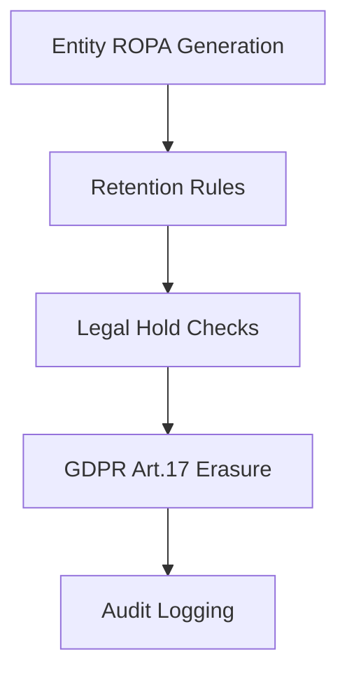

**Diagram sources**
- [entity_ropa.py:39-65](file://data/src/gdpr/entity_ropa.py#L39-L65)
- [retention_manager.py:188-247](file://data/src/gdpr/retention_manager.py#L188-L247)
- [retention_manager.py:257-317](file://data/src/gdpr/retention_manager.py#L257-L317)
- [models.py:67-155](file://backend/django/apps/core/models.py#L67-L155)

**Section sources**
- [entity_ropa.py:39-65](file://data/src/gdpr/entity_ropa.py#L39-L65)
- [retention_manager.py:188-317](file://data/src/gdpr/retention_manager.py#L188-L317)
- [models.py:67-155](file://backend/django/apps/core/models.py#L67-L155)

### Penetration Testing Considerations
- Restrict public endpoints to ALB; ensure no direct database or cache exposure.
- Validate TLS configurations and cipher suites at ALB and CloudFront.
- Test IAM boundaries by simulating compromised task roles to confirm least privilege.
- Verify WAF/rate limiting at edge (if integrated) and ALB health checks.
- Confirm that secrets are not present in logs or error responses.

[No sources needed since this section provides general guidance]

### Incident Response Procedures
- Detection: CloudWatch alarms for DB CPU/storage; application health endpoints; SIEM alerts from logs.
- Containment: Isolate affected tasks/services; revoke temporary credentials; rotate secrets if necessary.
- Eradication: Patch vulnerabilities identified by scans; remediate misconfigurations flagged by IaC scans.
- Recovery: Restore from encrypted backups; validate integrity via checksums and audit logs.
- Post-incident: Update runbooks, tighten policies, and retest controls.

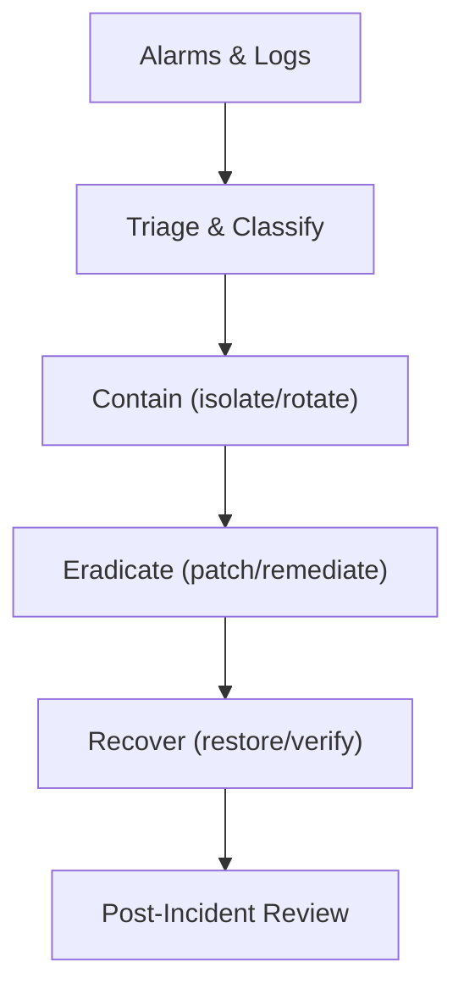

[No sources needed since this diagram shows conceptual workflow]

## Dependency Analysis
The root module composes modules with explicit inputs/outputs, ensuring clear dependency boundaries. Security controls are enforced at each layer (network, IAM, data).

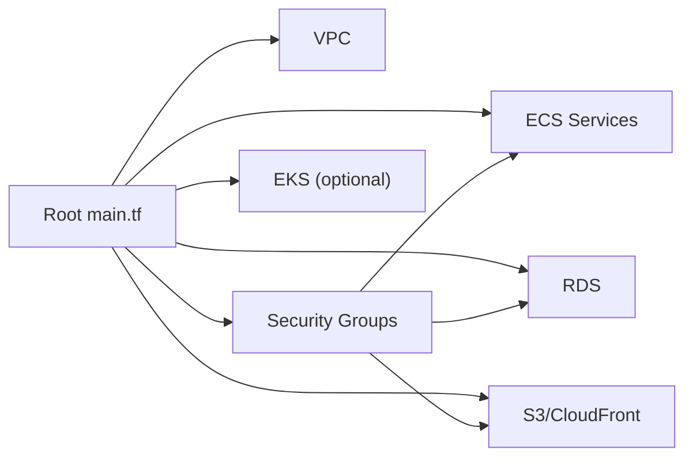

**Diagram sources**
- [main.tf:63-271](file://infra/terraform/main.tf#L63-L271)

**Section sources**
- [main.tf:63-271](file://infra/terraform/main.tf#L63-L271)

## Performance Considerations
- Use autoscaling policies targeting CPU/memory thresholds for ECS services.
- Enable CloudWatch metrics and set alarms for critical resources (DB CPU, low storage).
- Leverage VPC Endpoints to reduce latency and costs for AWS service calls.
- Configure CloudFront caching for static assets to reduce origin load.

[No sources needed since this section provides general guidance]

## Troubleshooting Guide
- Connectivity issues:
  - Verify security groups allow ALB->ECS and ECS->RDS/Redis.
  - Ensure private subnets route outbound via NAT Gateways or use VPC Endpoints.
- Secrets access failures:
  - Confirm ECS execution/task roles have correct Secrets Manager and SSM permissions.
  - Check secret ARNs and parameter paths match deployed resources.
- TLS errors:
  - Validate ALB listener certificates and minimum TLS versions.
  - Ensure CloudFront viewer protocol policy forces HTTPS.
- High DB CPU or low storage:
  - Review CloudWatch alarms and adjust instance class or storage limits.
  - Analyze slow queries via RDS parameter group settings.

**Section sources**
- [security/main.tf:65-106](file://infra/terraform/modules/security/main.tf#L65-L106)
- [vpc/main.tf:116-177](file://infra/terraform/modules/vpc/main.tf#L116-L177)
- [ecs/main.tf:275-302](file://infra/terraform/modules/ecs/main.tf#L275-L302)
- [ecs/main.tf:171-199](file://infra/terraform/modules/ecs/main.tf#L171-L199)
- [database/main.tf:196-232](file://infra/terraform/modules/database/main.tf#L196-L232)

## Conclusion
JOL-HUB’s Terraform infrastructure implements defense-in-depth with strong network segmentation, least privilege IAM, robust encryption, centralized secrets management, and comprehensive auditing. Integrated CI/CD security scans and compliance tooling support GDPR, SOC 2, and ISO 27001 objectives. Continuous monitoring, automated retention, and legal hold enforcement strengthen privacy and operational resilience.

[No sources needed since this section summarizes without analyzing specific files]

## Appendices

### Security Model Reference
The repository’s security model outlines zero-trust principles, layered defenses, API protections, data classification, key management, and incident response processes aligned with enterprise standards.

**Section sources**
- [security-model.md:1-623](file://docs/architecture/security-model.md#L1-L623)