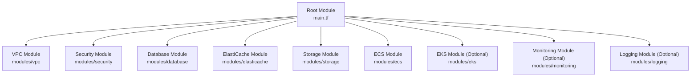
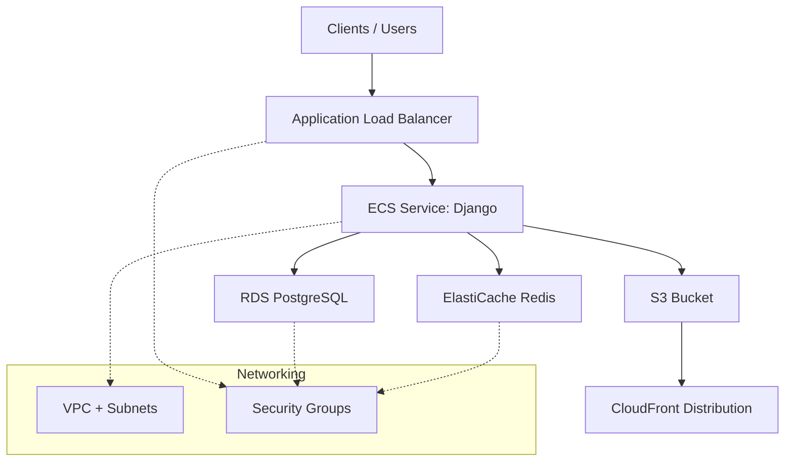
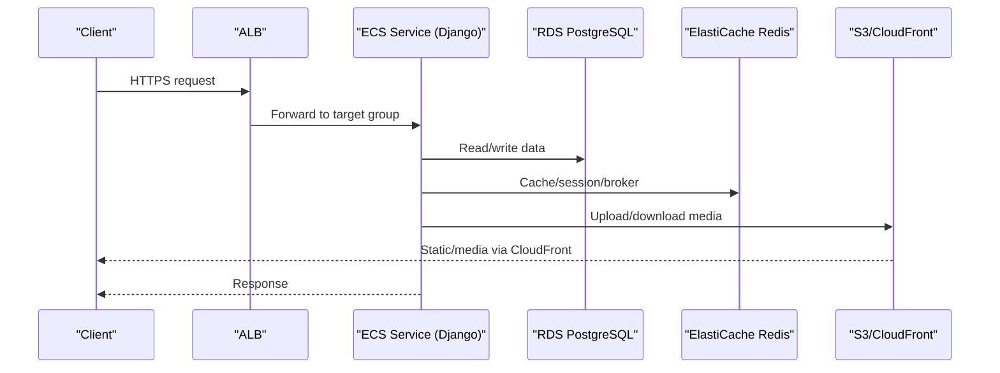
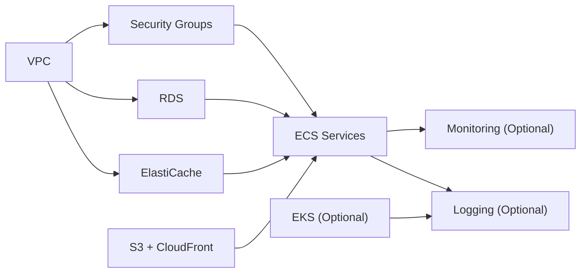

# Terraform Infrastructure

<cite>
**Referenced Files in This Document**
- [main.tf](file://infra/terraform/main.tf)
- [variables.tf](file://infra/terraform/variables.tf)
- [outputs.tf](file://infra/terraform/outputs.tf)
- [terraform.tfvars.example](file://infra/terraform/terraform.tfvars.example)
- [vpc/main.tf](file://infra/terraform/modules/vpc/main.tf)
- [security/main.tf](file://infra/terraform/modules/security/main.tf)
- [database/main.tf](file://infra/terraform/modules/database/main.tf)
- [elasticache/main.tf](file://infra/terraform/modules/elasticache/main.tf)
- [storage/main.tf](file://infra/terraform/modules/storage/main.tf)
- [ecs/main.tf](file://infra/terraform/modules/ecs/main.tf)
- [eks/main.tf](file://infra/terraform/modules/eks/main.tf)
- [monitoring/main.tf](file://infra/terraform/modules/monitoring/main.tf)
- [logging/main.tf](file://infra/terraform/modules/logging/main.tf)
</cite>

## Table of Contents
1. Introduction
2. Project Structure
3. Core Components
4. Architecture Overview
5. Detailed Component Analysis
6. Dependency Analysis
7. Performance Considerations
8. Troubleshooting Guide
9. Conclusion
10. Appendices

## Introduction
This document provides comprehensive Terraform infrastructure documentation for the JOL-HUB platform on AWS. It explains the modular architecture, including VPC networking, RDS PostgreSQL databases, ElastiCache Redis clusters, S3 storage with CloudFront CDN, ECS Fargate services, and optional EKS Kubernetes clusters. It covers module purposes, configuration parameters, security groups, resource dependencies, environment-specific configurations, variable management, state backend setup, and best practices for multi-environment deployments. It also includes examples of common operations such as provisioning, updating, and destroying infrastructure resources.

## Project Structure
The Terraform code is organized into a root module that orchestrates multiple submodules:
- Root module: main.tf defines providers, modules, and cross-module wiring; variables.tf centralizes all inputs; outputs.tf exposes key endpoints and ARNs; terraform.tfvars.example shows environment-specific values.
- Submodules: vpc, security, database, elasticache, storage, ecs, eks (optional), monitoring (optional), logging (optional).

**Diagram sources**
- [main.tf:63-271](file://infra/terraform/main.tf#L63-L271)

**Section sources**
- [main.tf:1-326](file://infra/terraform/main.tf#L1-L326)
- [variables.tf:1-513](file://infra/terraform/variables.tf#L1-L513)
- [outputs.tf:1-226](file://infra/terraform/outputs.tf#L1-L226)
- [terraform.tfvars.example:1-110](file://infra/terraform/terraform.tfvars.example#L1-L110)

## Core Components
- VPC: Multi-AZ public/private/database subnets, NAT Gateways per AZ, Internet Gateway, VPC Endpoints for private access to AWS services.
- Security Groups: Strict ingress rules for ALB, ECS tasks, RDS, ElastiCache, and optional bastion.
- Database: RDS PostgreSQL with parameter group tuned for Django, Secrets Manager credentials, enhanced monitoring, alarms.
- Cache: ElastiCache Redis replication group with encryption, secrets, and alarms.
- Storage: S3 bucket with versioning/lifecycle, CloudFront distribution with OAC, log bucket, SSM parameters for app config.
- ECS: Cluster, ECR repositories, ALB, task definitions for Django web, Celery worker, Celery beat; auto-scaling policies; IAM roles for execution and tasks.
- EKS (Optional): Managed cluster, node groups, addons, OIDC provider, IRSA support.
- Monitoring (Optional): Amazon Managed Prometheus and Grafana workspaces, alert rules, dashboards, alarms.
- Logging (Optional): OpenSearch domain with encryption, logging to CloudWatch, Fluent Bit role for log shipping.

**Section sources**
- [vpc/main.tf:1-283](file://infra/terraform/modules/vpc/main.tf#L1-L283)
- [security/main.tf:1-202](file://infra/terraform/modules/security/main.tf#L1-L202)
- [database/main.tf:1-233](file://infra/terraform/modules/database/main.tf#L1-L233)
- [elasticache/main.tf:1-169](file://infra/terraform/modules/elasticache/main.tf#L1-L169)
- [storage/main.tf:1-288](file://infra/terraform/modules/storage/main.tf#L1-L288)
- [ecs/main.tf:1-711](file://infra/terraform/modules/ecs/main.tf#L1-L711)
- [eks/main.tf:1-405](file://infra/terraform/modules/eks/main.tf#L1-L405)
- [monitoring/main.tf:1-391](file://infra/terraform/modules/monitoring/main.tf#L1-L391)
- [logging/main.tf:1-265](file://infra/terraform/modules/logging/main.tf#L1-L265)

## Architecture Overview
The platform uses a layered architecture:
- Edge: ALB terminates HTTPS and forwards to ECS tasks; optional Route53 alias points to ALB.
- Compute: ECS Fargate runs Django web service and background workers (Celery worker and beat).
- Data: RDS PostgreSQL stores application data; ElastiCache Redis used for caching and Celery broker.
- Storage: S3 holds static/media assets; CloudFront serves content globally via CDN.
- Optional: EKS cluster for containerized workloads; Monitoring and Logging stacks for observability.

**Diagram sources**
- [ecs/main.tf:122-199](file://infra/terraform/modules/ecs/main.tf#L122-L199)
- [database/main.tf:111-162](file://infra/terraform/modules/database/main.tf#L111-L162)
- [elasticache/main.tf:53-92](file://infra/terraform/modules/elasticache/main.tf#L53-L92)
- [storage/main.tf:91-169](file://infra/terraform/modules/storage/main.tf#L91-L169)
- [security/main.tf:15-165](file://infra/terraform/modules/security/main.tf#L15-L165)

## Detailed Component Analysis

### VPC Networking
- Creates a VPC with DNS enabled and three tiers of subnets across availability zones: public (ALB), private (ECS tasks), and database (RDS/ElastiCache).
- Provides Internet Gateway and per-AZ NAT Gateways for outbound traffic from private subnets.
- Adds VPC Endpoints for ECR API/DKR, Logs, and S3 to reduce NAT costs and improve security.
- Exposes subnet IDs and CIDRs for downstream modules.

Key configuration highlights:
- Public subnets route to Internet Gateway; private subnets route to NAT Gateways; database subnets have no internet egress.
- Security group for VPC endpoints restricts inbound to HTTPS within VPC.

**Section sources**
- [vpc/main.tf:20-196](file://infra/terraform/modules/vpc/main.tf#L20-L196)
- [vpc/main.tf:202-283](file://infra/terraform/modules/vpc/main.tf#L202-L283)

### Security Groups
- ALB allows HTTP/HTTPS from the internet and forwards to ECS.
- ECS tasks allow inbound only from ALB on port 8000.
- RDS allows inbound from ECS tasks and optionally VPC CIDR for management.
- ElastiCache allows inbound from ECS tasks.
- Optional bastion allows SSH from specified admin CIDRs.

**Section sources**
- [security/main.tf:15-202](file://infra/terraform/modules/security/main.tf#L15-L202)

### RDS PostgreSQL Database
- Creates DB subnet group, parameter group optimized for Django (connection limits, logging, memory tuning).
- Deploys encrypted RDS instance with backups, maintenance windows, performance insights, and enhanced monitoring.
- Stores credentials in Secrets Manager with recovery window based on environment.
- Sets CloudWatch alarms for CPU and low storage.

Important parameters:
- Instance class, allocated storage, max autoscaling storage, backup retention, Multi-AZ, performance insights toggle.

**Section sources**
- [database/main.tf:11-45](file://infra/terraform/modules/database/main.tf#L11-L45)
- [database/main.tf:51-162](file://infra/terraform/modules/database/main.tf#L51-L162)
- [database/main.tf:168-233](file://infra/terraform/modules/database/main.tf#L168-L233)

### ElastiCache Redis
- Creates subnet group and parameter group tuned for cache behavior and Celery compatibility.
- Deploys Redis replication group with at-rest/transit encryption, auth token, automatic failover and Multi-AZ when using multiple nodes.
- Stores endpoint and auth details in Secrets Manager.
- Sets CloudWatch alarms for CPU and memory usage.

**Section sources**
- [elasticache/main.tf:14-92](file://infra/terraform/modules/elasticache/main.tf#L14-L92)
- [elasticache/main.tf:98-169](file://infra/terraform/modules/elasticache/main.tf#L98-L169)

### S3 Storage and CloudFront CDN
- S3 bucket with enforced ownership, public access blocked, server-side encryption, lifecycle rules for noncurrent versions, and versioning in production.
- CloudFront distribution with Origin Access Control to securely serve from S3, caching behaviors for static files, logging to a dedicated logs bucket.
- SSM parameters expose bucket name, custom domain, and URLs for Django settings.

**Section sources**
- [storage/main.tf:14-73](file://infra/terraform/modules/storage/main.tf#L14-L73)
- [storage/main.tf:79-169](file://infra/terraform/modules/storage/main.tf#L79-L169)
- [storage/main.tf:175-288](file://infra/terraform/modules/storage/main.tf#L175-L288)

### ECS Fargate Services
- ECS cluster with container insights and capacity providers (FARGATE and FARGATE_SPOT).
- ECR repository with image scanning and lifecycle policy to retain recent images.
- Application Load Balancer with HTTP-to-HTTPS redirect, health checks, and access logs.
- Task definitions for Django web, Celery worker, and Celery beat with secrets injected from Secrets Manager and environment variables.
- IAM roles: execution role for pulling images and reading secrets; task role for S3 and SES access.
- Auto-scaling policies for Django and Celery workers based on CPU/memory targets.

**Diagram sources**
- [ecs/main.tf:122-199](file://infra/terraform/modules/ecs/main.tf#L122-L199)
- [ecs/main.tf:498-546](file://infra/terraform/modules/ecs/main.tf#L498-L546)
- [ecs/main.tf:553-638](file://infra/terraform/modules/ecs/main.tf#L553-L638)

**Section sources**
- [ecs/main.tf:22-116](file://infra/terraform/modules/ecs/main.tf#L22-L116)
- [ecs/main.tf:122-244](file://infra/terraform/modules/ecs/main.tf#L122-L244)
- [ecs/main.tf:250-395](file://infra/terraform/modules/ecs/main.tf#L250-L395)
- [ecs/main.tf:498-711](file://infra/terraform/modules/ecs/main.tf#L498-L711)

### EKS Kubernetes Cluster (Optional)
- Creates managed EKS cluster with encryption for secrets, logging enabled, and restricted public access CIDRs.
- Two node groups: general-purpose and compute-optimized (with taints for specific workloads).
- Installs core addons (VPC CNI, CoreDNS, kube-proxy, EBS CSI driver) and sets up IRSA via OIDC provider.
- Grants node roles permissions for EKS, CNI, ECR read, and S3 access.

**Section sources**
- [eks/main.tf:15-57](file://infra/terraform/modules/eks/main.tf#L15-L57)
- [eks/main.tf:63-147](file://infra/terraform/modules/eks/main.tf#L63-L147)
- [eks/main.tf:153-240](file://infra/terraform/modules/eks/main.tf#L153-L240)
- [eks/main.tf:246-405](file://infra/terraform/modules/eks/main.tf#L246-L405)

### Monitoring (Optional)
- Amazon Managed Prometheus workspace with alert manager and rule groups.
- Amazon Managed Grafana workspace with SAML authentication, data sources (Prometheus, CloudWatch, Loki), and VPC egress-only network mode.
- CloudWatch alarms for API latency, error rate, database CPU and connections, and Redis memory.
- CloudWatch dashboard aggregating key metrics.

**Section sources**
- [monitoring/main.tf:11-48](file://infra/terraform/modules/monitoring/main.tf#L11-L48)
- [monitoring/main.tf:54-157](file://infra/terraform/modules/monitoring/main.tf#L54-L157)
- [monitoring/main.tf:163-391](file://infra/terraform/modules/monitoring/main.tf#L163-L391)

### Logging (Optional)
- OpenSearch domain with encryption at rest and node-to-node encryption, TLS enforcement, and advanced security options.
- Publishes slow/error logs to CloudWatch log groups.
- IAM roles for OpenSearch logging and Fluent Bit log shipping with IRSA support.

**Section sources**
- [logging/main.tf:11-84](file://infra/terraform/modules/logging/main.tf#L11-L84)
- [logging/main.tf:87-151](file://infra/terraform/modules/logging/main.tf#L87-L151)
- [logging/main.tf:153-265](file://infra/terraform/modules/logging/main.tf#L153-L265)

## Dependency Analysis
Module dependency graph illustrates how components rely on each other:

**Diagram sources**
- [main.tf:63-271](file://infra/terraform/main.tf#L63-L271)

**Section sources**
- [main.tf:63-271](file://infra/terraform/main.tf#L63-L271)

## Performance Considerations
- Use Multi-AZ RDS and ElastiCache for high availability in production.
- Enable performance insights and enhanced monitoring for RDS.
- Configure CloudFront caching with appropriate TTLs for static assets.
- Set ECS auto-scaling policies targeting CPU/memory thresholds to handle load spikes.
- Use VPC Endpoints to reduce latency and cost for private AWS service calls.
- Tune RDS parameter group for connection limits and memory allocation suitable for Django workloads.

[No sources needed since this section provides general guidance]

## Troubleshooting Guide
Common issues and resolutions:
- Cannot connect to RDS: Verify security groups allow ECS to reach RDS on port 5432; ensure DB subnet group and VPC are correct.
- Redis connectivity errors: Confirm ECS tasks can reach ElastiCache on port 6379 and that auth tokens match secrets.
- 502/503 from ALB: Check ECS service health checks and target group configuration; inspect CloudWatch logs for task failures.
- CloudFront returns 403: Ensure Origin Access Control is configured and S3 bucket policy allows CloudFront.
- Monitoring not available: Confirm optional modules are enabled and SNS topic ARN is provided for alarms.

Operational tips:
- Use outputs to retrieve endpoints and ARNs for debugging.
- Inspect CloudWatch dashboards and alarms for performance anomalies.
- Validate IAM roles and policies for ECS execution/task roles and EKS node roles.

**Section sources**
- [security/main.tf:15-202](file://infra/terraform/modules/security/main.tf#L15-L202)
- [ecs/main.tf:122-199](file://infra/terraform/modules/ecs/main.tf#L122-L199)
- [storage/main.tf:175-197](file://infra/terraform/modules/storage/main.tf#L175-L197)
- [monitoring/main.tf:163-391](file://infra/terraform/modules/monitoring/main.tf#L163-L391)

## Conclusion
The JOL-HUB Terraform configuration provides a robust, modular, and secure AWS infrastructure supporting scalable web services, background processing, caching, storage with CDN, and optional Kubernetes orchestration. The separation into focused modules enables environment-specific customization, clear dependency management, and operational visibility through monitoring and logging. Following the recommended practices ensures reliable deployments across development, staging, and production environments.

[No sources needed since this section summarizes without analyzing specific files]

## Appendices

### Environment-Specific Configuration and Variable Management
- Use terraform.tfvars.example as a template; copy to terraform.tfvars per environment and override variables accordingly.
- Key variables include project_name, environment, aws_region, networking CIDRs, database and cache sizing, ECS scaling, certificates, and optional feature toggles (enable_eks, enable_monitoring, enable_logging).
- Sensitive values (passwords, client secrets) should be passed via secure mechanisms or environment variables and marked sensitive where applicable.

**Section sources**
- [variables.tf:1-513](file://infra/terraform/variables.tf#L1-L513)
- [terraform.tfvars.example:1-110](file://infra/terraform/terraform.tfvars.example#L1-L110)

### State Backend Setup
- The root module includes a commented S3 backend configuration for remote state with DynamoDB locking.
- To enable: uncomment and configure bucket, key, region, encryption, and DynamoDB table; ensure the bucket exists and is accessible by the executing identity.

**Section sources**
- [main.tf:8-34](file://infra/terraform/main.tf#L8-L34)

### Common Operations
- Initialize and plan:
  - terraform init
  - terraform plan -var-file="terraform.tfvars"
- Apply changes:
  - terraform apply -var-file="terraform.tfvars"
- Update infrastructure:
  - Modify variables or module configurations, then run plan and apply.
- Destroy resources:
  - terraform destroy -var-file="terraform.tfvars"
- View outputs:
  - terraform output -json

[No sources needed since this section provides general guidance]