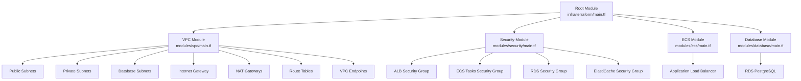
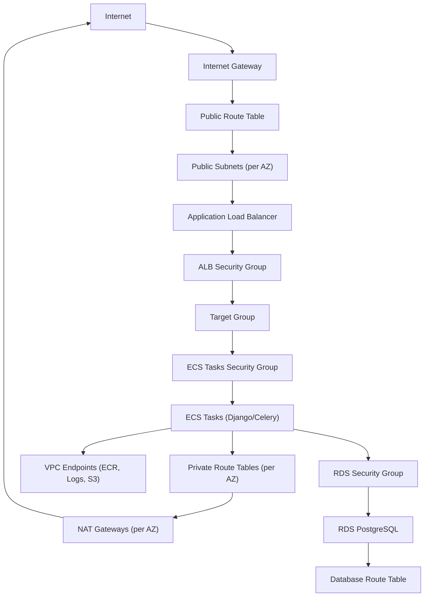
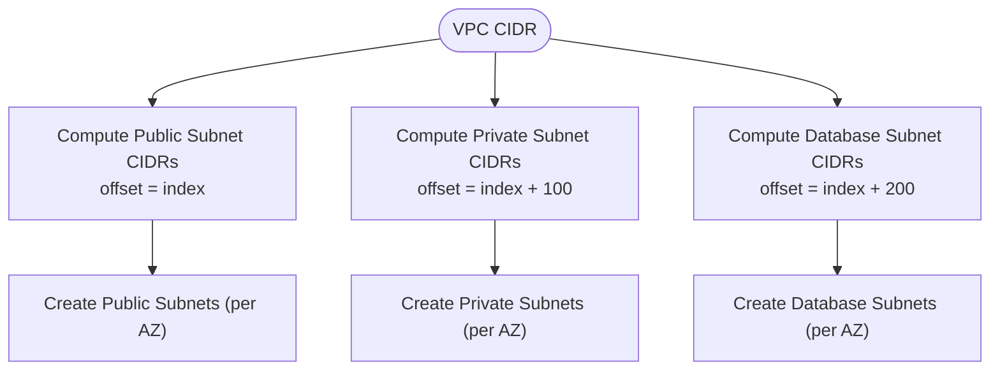
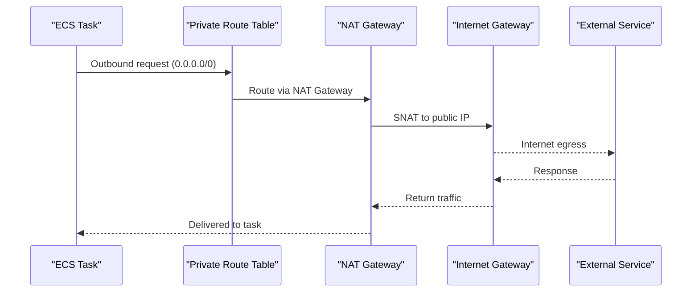
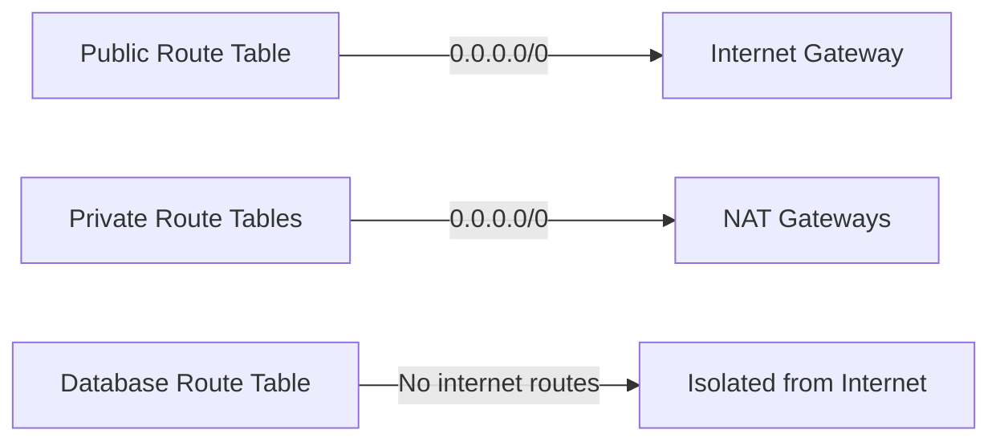
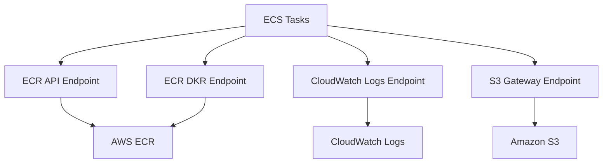
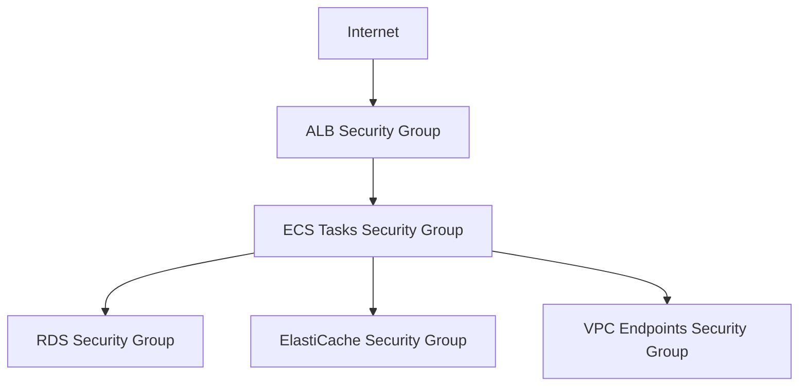
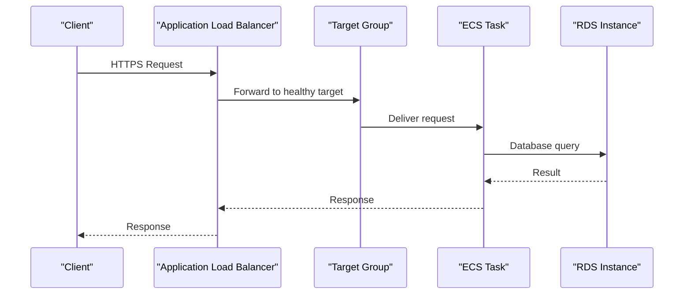
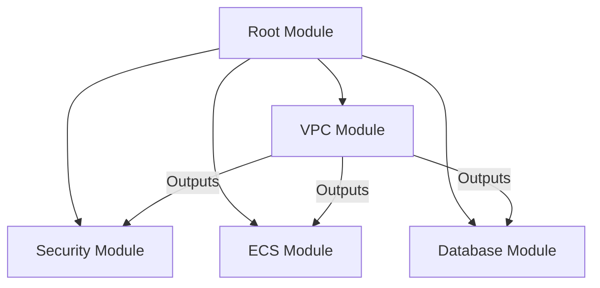

# VPC Networking

<cite>
**Referenced Files in This Document**
- [main.tf](file://infra/terraform/modules/vpc/main.tf)
- [variables.tf](file://infra/terraform/modules/vpc/variables.tf)
- [outputs.tf](file://infra/terraform/modules/vpc/outputs.tf)
- [main.tf](file://infra/terraform/modules/security/main.tf)
- [main.tf](file://infra/terraform/modules/ecs/main.tf)
- [main.tf](file://infra/terraform/modules/database/main.tf)
- [main.tf](file://infra/terraform/main.tf)
- [variables.tf](file://infra/terraform/variables.tf)
- [terraform.tfvars.example](file://infra/terraform/terraform.tfvars.example)
</cite>

## Table of Contents
1. [Introduction](#introduction)
2. [Project Structure](#project-structure)
3. [Core Components](#core-components)
4. [Architecture Overview](#architecture-overview)
5. [Detailed Component Analysis](#detailed-component-analysis)
6. [Dependency Analysis](#dependency-analysis)
7. [Performance Considerations](#performance-considerations)
8. [Troubleshooting Guide](#troubleshooting-guide)
9. [Conclusion](#conclusion)
10. [Appendices](#appendices)

## Introduction
This document explains the Virtual Private Cloud (VPC) networking module used by JOL-HUB’s Terraform infrastructure. It covers the design and implementation of public and private subnets, internet gateway, NAT gateways, route tables, security groups, and VPC endpoints that enable secure, scalable, and isolated networking for multi-environment deployments. It also outlines configuration variables for different environments, subnet sizing strategies, performance considerations, and guidance for extending the network with custom DNS, VPN connections, and peering relationships.

## Project Structure
The VPC networking is implemented as a reusable Terraform module under infra/terraform/modules/vpc. The root module wires this module together with other infrastructure components such as ECS, database, storage, and security modules.

**Diagram sources**
- [main.tf:63-72](file://infra/terraform/main.tf#L63-L72)
- [main.tf:78-88](file://infra/terraform/main.tf#L78-L88)
- [main.tf:151-178](file://infra/terraform/main.tf#L151-L178)
- [main.tf:94-112](file://infra/terraform/main.tf#L94-L112)
- [main.tf:20-28](file://infra/terraform/modules/vpc/main.tf#L20-L28)
- [main.tf:34-82](file://infra/terraform/modules/vpc/main.tf#L34-L82)
- [main.tf:88-127](file://infra/terraform/modules/vpc/main.tf#L88-L127)
- [main.tf:133-196](file://infra/terraform/modules/vpc/main.tf#L133-L196)
- [main.tf:202-250](file://infra/terraform/modules/vpc/main.tf#L202-L250)
- [main.tf:15-53](file://infra/terraform/modules/security/main.tf#L15-L53)
- [main.tf:59-88](file://infra/terraform/modules/security/main.tf#L59-L88)
- [main.tf:94-131](file://infra/terraform/modules/security/main.tf#L94-L131)
- [main.tf:137-165](file://infra/terraform/modules/security/main.tf#L137-L165)
- [main.tf:122-141](file://infra/terraform/modules/ecs/main.tf#L122-L141)
- [main.tf:111-162](file://infra/terraform/modules/database/main.tf#L111-L162)

**Section sources**
- [main.tf:63-72](file://infra/terraform/main.tf#L63-L72)
- [main.tf:78-88](file://infra/terraform/main.tf#L78-L88)
- [main.tf:151-178](file://infra/terraform/main.tf#L151-L178)
- [main.tf:94-112](file://infra/terraform/main.tf#L94-L112)

## Core Components
- VPC with DNS hostnames and support enabled
- Public subnets (one per AZ) for ALB and internet-facing resources
- Private subnets (one per AZ) for ECS tasks and internal services
- Database subnets (one per AZ) for RDS, isolated from internet access
- Internet Gateway for public subnets
- NAT Gateways (one per AZ) for outbound internet access from private subnets
- Route tables:
  - Public route table routing to Internet Gateway
  - Private route tables routing to per-AZ NAT Gateways
  - Database route table with no internet routes
- VPC Endpoints for AWS services (ECR API/DKR, Logs, S3) to avoid NAT costs and keep traffic within AWS network
- Security Groups:
  - ALB allows inbound HTTP/HTTPS from internet
  - ECS tasks allow inbound from ALB only
  - RDS allows inbound from ECS tasks and optionally intra-VPC
  - ElastiCache allows inbound from ECS tasks
  - VPC Endpoints security group restricts ingress to HTTPS from VPC CIDR

**Section sources**
- [main.tf:20-28](file://infra/terraform/modules/vpc/main.tf#L20-L28)
- [main.tf:34-82](file://infra/terraform/modules/vpc/main.tf#L34-L82)
- [main.tf:88-127](file://infra/terraform/modules/vpc/main.tf#L88-L127)
- [main.tf:133-196](file://infra/terraform/modules/vpc/main.tf#L133-L196)
- [main.tf:202-250](file://infra/terraform/modules/vpc/main.tf#L202-L250)
- [main.tf:256-282](file://infra/terraform/modules/vpc/main.tf#L256-L282)
- [main.tf:15-53](file://infra/terraform/modules/security/main.tf#L15-L53)
- [main.tf:59-88](file://infra/terraform/modules/security/main.tf#L59-L88)
- [main.tf:94-131](file://infra/terraform/modules/security/main.tf#L94-L131)
- [main.tf:137-165](file://infra/terraform/modules/security/main.tf#L137-L165)

## Architecture Overview
The network topology follows a three-tier pattern across multiple availability zones:
- Public tier: ALB receives internet traffic on HTTP/HTTPS and forwards to private targets.
- Private tier: ECS tasks run in private subnets; they access external services via NAT Gateways or VPC Endpoints.
- Database tier: RDS resides in isolated database subnets with no internet access and restricted inbound access.

**Diagram sources**
- [main.tf:88-127](file://infra/terraform/modules/vpc/main.tf#L88-L127)
- [main.tf:133-196](file://infra/terraform/modules/vpc/main.tf#L133-L196)
- [main.tf:202-250](file://infra/terraform/modules/vpc/main.tf#L202-L250)
- [main.tf:15-53](file://infra/terraform/modules/security/main.tf#L15-L53)
- [main.tf:59-88](file://infra/terraform/modules/security/main.tf#L59-L88)
- [main.tf:94-131](file://infra/terraform/modules/security/main.tf#L94-L131)
- [main.tf:122-141](file://infra/terraform/modules/ecs/main.tf#L122-L141)
- [main.tf:111-162](file://infra/terraform/modules/database/main.tf#L111-L162)

## Detailed Component Analysis

### VPC and Subnet Design
- VPC CIDR is configurable and defaults to a large block to accommodate multiple /8-sized subnets per AZ.
- Subnet allocation uses cidrsubnet offsets:
  - Public subnets start at offset 0
  - Private subnets start at offset 100
  - Database subnets start at offset 200
- Each subnet type is created per availability zone based on az_count.

**Diagram sources**
- [main.tf:34-82](file://infra/terraform/modules/vpc/main.tf#L34-L82)

**Section sources**
- [main.tf:34-82](file://infra/terraform/modules/vpc/main.tf#L34-L82)
- [variables.tf:18-28](file://infra/terraform/modules/vpc/variables.tf#L18-L28)

### Internet Gateway and NAT Gateways
- Internet Gateway enables inbound/outbound internet access for public subnets.
- Per-AZ NAT Gateways provide outbound-only internet access for private subnets, each backed by an Elastic IP.
- High availability is achieved by distributing NAT Gateways across all configured AZs.

**Diagram sources**
- [main.tf:88-127](file://infra/terraform/modules/vpc/main.tf#L88-L127)
- [main.tf:157-177](file://infra/terraform/modules/vpc/main.tf#L157-L177)

**Section sources**
- [main.tf:88-127](file://infra/terraform/modules/vpc/main.tf#L88-L127)
- [main.tf:157-177](file://infra/terraform/modules/vpc/main.tf#L157-L177)

### Route Tables
- Public route table directs all traffic (0.0.0.0/0) to the Internet Gateway.
- Private route tables direct all traffic to their respective NAT Gateways.
- Database route table has no internet routes, ensuring isolation.

**Diagram sources**
- [main.tf:133-196](file://infra/terraform/modules/vpc/main.tf#L133-L196)

**Section sources**
- [main.tf:133-196](file://infra/terraform/modules/vpc/main.tf#L133-L196)

### VPC Endpoints
- Interface endpoints for ECR API/DKR and CloudWatch Logs are attached to private subnets and secured by a dedicated security group allowing HTTPS from the VPC CIDR.
- Gateway endpoint for S3 is attached to private route tables to avoid NAT costs and keep traffic within AWS.

**Diagram sources**
- [main.tf:202-250](file://infra/terraform/modules/vpc/main.tf#L202-L250)
- [main.tf:256-282](file://infra/terraform/modules/vpc/main.tf#L256-L282)

**Section sources**
- [main.tf:202-250](file://infra/terraform/modules/vpc/main.tf#L202-L250)
- [main.tf:256-282](file://infra/terraform/modules/vpc/main.tf#L256-L282)

### Security Groups
- ALB allows inbound HTTP/HTTPS from anywhere and forwards to ECS targets.
- ECS tasks allow inbound only from ALB on application port.
- RDS allows inbound from ECS tasks and optionally from the entire VPC CIDR.
- ElastiCache allows inbound from ECS tasks.
- VPC Endpoints security group restricts ingress to HTTPS from VPC CIDR.

**Diagram sources**
- [main.tf:15-53](file://infra/terraform/modules/security/main.tf#L15-L53)
- [main.tf:59-88](file://infra/terraform/modules/security/main.tf#L59-L88)
- [main.tf:94-131](file://infra/terraform/modules/security/main.tf#L94-L131)
- [main.tf:137-165](file://infra/terraform/modules/security/main.tf#L137-L165)
- [main.tf:256-282](file://infra/terraform/modules/vpc/main.tf#L256-L282)

**Section sources**
- [main.tf:15-53](file://infra/terraform/modules/security/main.tf#L15-L53)
- [main.tf:59-88](file://infra/terraform/modules/security/main.tf#L59-L88)
- [main.tf:94-131](file://infra/terraform/modules/security/main.tf#L94-L131)
- [main.tf:137-165](file://infra/terraform/modules/security/main.tf#L137-L165)
- [main.tf:256-282](file://infra/terraform/modules/vpc/main.tf#L256-L282)

### Integration with ECS and Database
- ECS module provisions an Application Load Balancer in public subnets and target groups that forward to ECS tasks in private subnets.
- Database module creates RDS instances in database subnets using a DB subnet group and applies security group restrictions.

**Diagram sources**
- [main.tf:122-141](file://infra/terraform/modules/ecs/main.tf#L122-L141)
- [main.tf:144-168](file://infra/terraform/modules/ecs/main.tf#L144-L168)
- [main.tf:111-162](file://infra/terraform/modules/database/main.tf#L111-L162)

**Section sources**
- [main.tf:122-141](file://infra/terraform/modules/ecs/main.tf#L122-L141)
- [main.tf:144-168](file://infra/terraform/modules/ecs/main.tf#L144-L168)
- [main.tf:111-162](file://infra/terraform/modules/database/main.tf#L111-L162)

## Dependency Analysis
- Root module depends on VPC outputs to configure downstream modules (security, ECS, database).
- ECS module depends on public/private subnet IDs and ALB security group ID.
- Database module depends on database subnet IDs and RDS security group ID.
- VPC module provides consistent naming and tagging through shared tags.

**Diagram sources**
- [main.tf:63-72](file://infra/terraform/main.tf#L63-L72)
- [main.tf:78-88](file://infra/terraform/main.tf#L78-L88)
- [main.tf:151-178](file://infra/terraform/main.tf#L151-L178)
- [main.tf:94-112](file://infra/terraform/main.tf#L94-L112)
- [outputs.tf:1-39](file://infra/terraform/modules/vpc/outputs.tf#L1-L39)

**Section sources**
- [main.tf:63-72](file://infra/terraform/main.tf#L63-L72)
- [main.tf:78-88](file://infra/terraform/main.tf#L78-L88)
- [main.tf:151-178](file://infra/terraform/main.tf#L151-L178)
- [main.tf:94-112](file://infra/terraform/main.tf#L94-L112)
- [outputs.tf:1-39](file://infra/terraform/modules/vpc/outputs.tf#L1-L39)

## Performance Considerations
- Multi-AZ distribution:
  - Public and private subnets span multiple AZs for resilience.
  - NAT Gateways are per-AZ to reduce cross-AZ data transfer and improve throughput.
- VPC Endpoints:
  - Using interface endpoints for ECR and Logs reduces latency and avoids NAT costs.
  - Gateway endpoint for S3 keeps traffic within AWS backbone.
- Security Group granularity:
  - Restricting inbound to specific security groups minimizes attack surface and improves predictable traffic flows.
- ALB configuration:
  - HTTP/2 enabled and HTTPS listeners enforce modern TLS policies.
- RDS parameter tuning:
  - Parameter group sets connection limits and memory-related parameters suitable for Django workloads.

[No sources needed since this section provides general guidance]

## Troubleshooting Guide
Common issues and checks:
- Private subnets cannot reach the internet:
  - Verify NAT Gateways exist in each AZ and are associated with public subnets.
  - Confirm private route tables have 0.0.0.0/0 routes pointing to NAT Gateways.
  - Check that Elastic IPs are allocated and not released.
- ECS tasks cannot pull images:
  - Ensure VPC Endpoints for ECR API/DKR are present and allowed by the VPC Endpoints security group.
  - Validate that private subnets are associated with route tables that include the S3 Gateway Endpoint if pulling via S3-backed registries.
- RDS connectivity failures:
  - Confirm RDS security group allows inbound from ECS tasks security group.
  - Verify DB subnet group includes database subnets across AZs.
  - Check that RDS is not publicly accessible unless required.
- ALB health check failures:
  - Ensure ALB security group allows inbound HTTP/HTTPS.
  - Confirm ECS tasks security group allows inbound from ALB on application port.
  - Validate target group health check path and port match application endpoints.

**Section sources**
- [main.tf:116-127](file://infra/terraform/modules/vpc/main.tf#L116-L127)
- [main.tf:157-177](file://infra/terraform/modules/vpc/main.tf#L157-L177)
- [main.tf:202-250](file://infra/terraform/modules/vpc/main.tf#L202-L250)
- [main.tf:15-53](file://infra/terraform/modules/security/main.tf#L15-L53)
- [main.tf:59-88](file://infra/terraform/modules/security/main.tf#L59-L88)
- [main.tf:94-131](file://infra/terraform/modules/security/main.tf#L94-L131)
- [main.tf:122-141](file://infra/terraform/modules/ecs/main.tf#L122-L141)
- [main.tf:144-168](file://infra/terraform/modules/ecs/main.tf#L144-L168)
- [main.tf:111-162](file://infra/terraform/modules/database/main.tf#L111-L162)

## Conclusion
The VPC networking module provides a robust, multi-AZ foundation for JOL-HUB with clear separation between public, private, and database tiers. It leverages NAT Gateways, VPC Endpoints, and tightly scoped security groups to ensure secure and efficient communication. The modular design supports environment-specific configurations and can be extended for advanced networking needs such as custom DNS, VPNs, and VPC peering.

[No sources needed since this section summarizes without analyzing specific files]

## Appendices

### Configuration Variables for Environments
- Environment-level settings:
  - environment: dev, staging, production
  - aws_region: default eu-west-1
  - project_name: default jol-hub
- VPC settings:
  - vpc_cidr: default 10.0.0.0/16
  - az_count: default 3
- Optional integrations:
  - route53_zone_id and app_domain for DNS records
  - monitoring thresholds and logging retention
  - bastion and admin CIDR restrictions

Example values are provided in the example variables file.

**Section sources**
- [variables.tf:5-36](file://infra/terraform/variables.tf#L5-L36)
- [variables.tf:237-247](file://infra/terraform/variables.tf#L237-L247)
- [variables.tf:253-293](file://infra/terraform/variables.tf#L253-L293)
- [variables.tf:299-357](file://infra/terraform/variables.tf#L299-L357)
- [variables.tf:363-374](file://infra/terraform/variables.tf#L363-L374)
- [variables.tf:380-512](file://infra/terraform/variables.tf#L380-L512)
- [terraform.tfvars.example:7-56](file://infra/terraform/terraform.tfvars.example#L7-L56)

### Subnet Sizing Strategy
- Use /8-sized subnets per AZ for each tier (public, private, database) to allow room for growth.
- Offsets ensure non-overlapping CIDR blocks:
  - Public: offset 0
  - Private: offset 100
  - Database: offset 200
- Adjust az_count to match region capacity and workload requirements.

**Section sources**
- [main.tf:34-82](file://infra/terraform/modules/vpc/main.tf#L34-L82)
- [variables.tf:24-28](file://infra/terraform/modules/vpc/variables.tf#L24-L28)

### Custom DNS Settings
- The VPC enables DNS hostnames and support.
- For custom DNS resolvers, you can attach a DHCP options set to the VPC to point to your DNS servers.
- Route53 integration is supported via optional hosted zone and domain variables to create alias records for the ALB.

**Section sources**
- [main.tf:20-28](file://infra/terraform/modules/vpc/main.tf#L20-L28)
- [variables.tf:237-247](file://infra/terraform/variables.tf#L237-L247)
- [main.tf:184-196](file://infra/terraform/main.tf#L184-L196)

### VPN Connections
- To connect on-premises networks, add a Customer Gateway and Site-to-Site VPN tunnel(s) to the VPC.
- Configure route propagation or static routes in route tables to direct traffic to the VPN tunnel.
- Ensure security groups and NACLs permit necessary ports and protocols.

[No sources needed since this section provides general guidance]

### Peering Relationships with Other VPCs
- Create a VPC Peering Connection between this VPC and another VPC.
- Update route tables in both VPCs to route peer CIDRs through the peering connection.
- Adjust security groups to allow inter-VPC traffic on required ports.
- Consider using separate CIDR ranges to avoid overlap.

[No sources needed since this section provides general guidance]