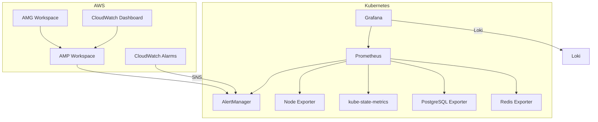
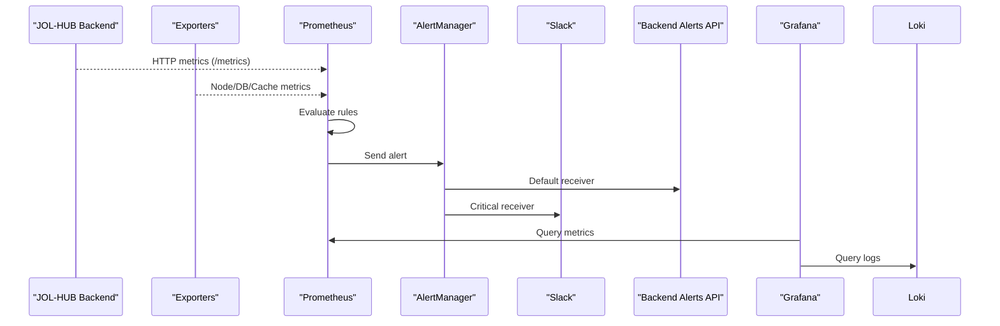
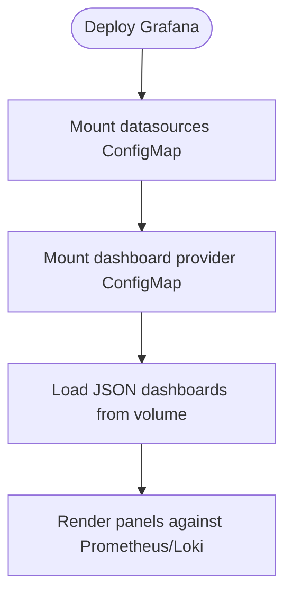
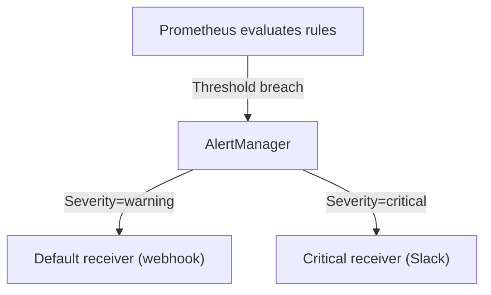
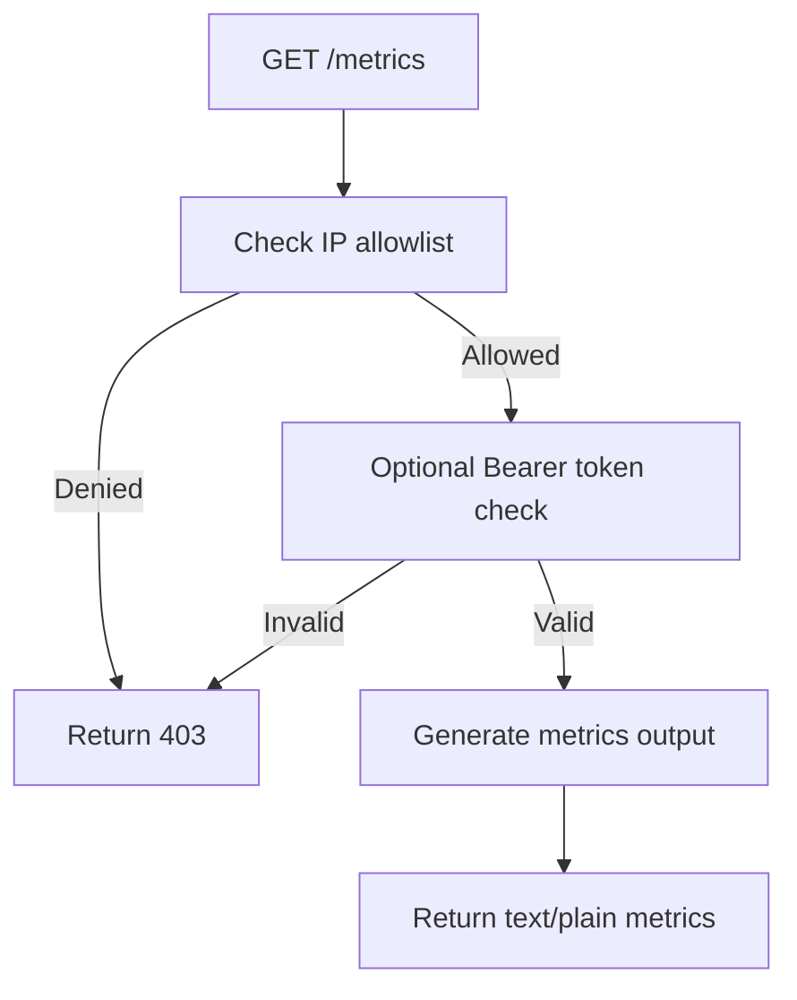
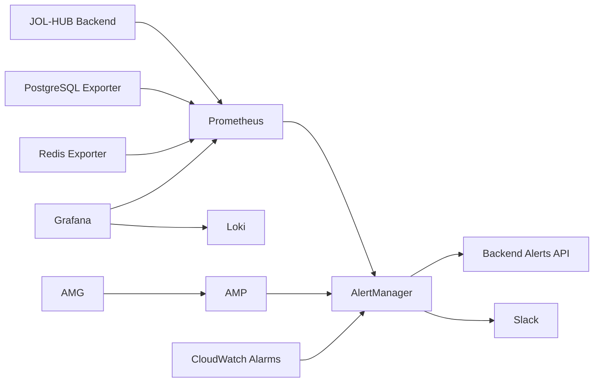

# Alerting & Monitoring Dashboards

<cite>
**Referenced Files in This Document**
- [grafana.yaml](file://infra/kubernetes/monitoring/grafana.yaml)
- [prometheus.yaml](file://infra/kubernetes/monitoring/prometheus.yaml)
- [observability.yaml](file://infra/kubernetes/observability/observability.yaml)
- [alert-rules.yml](file://frontend/apps/template-renderer/observability/alert-rules.yml)
- [grafana-dashboard.json](file://frontend/apps/template-renderer/observability/grafana-dashboard.json)
- [metrics_endpoint.py](file://backend/django/apps/core/metrics_endpoint.py)
- [main.tf](file://infra/terraform/modules/monitoring/main.tf)
- [rules.yaml.tpl](file://infra/terraform/modules/monitoring/templates/rules.yaml.tpl)
- [alertmanager.yaml.tpl](file://infra/terraform/modules/monitoring/templates/alertmanager.yaml.tpl)
</cite>

## Table of Contents
1. Introduction
2. Project Structure
3. Core Components
4. Architecture Overview
5. Detailed Component Analysis
6. Dependency Analysis
7. Performance Considerations
8. Troubleshooting Guide
9. Conclusion
10. Appendices

## Introduction
This document explains the alerting and monitoring dashboard system for JOL-HUB. It covers how Grafana dashboards are provisioned, what Prometheus rules drive alerts, how AlertManager routes notifications, and how to create and manage custom alerts and dashboards. It also includes best practices for access control, sharing, and effective visualization.

## Project Structure
The monitoring stack is defined across Kubernetes manifests and Terraform modules:
- Kubernetes:
  - Grafana with datasources (Prometheus, Loki) and a pre-bundled overview dashboard
  - Prometheus with scrape configs for Kubernetes, backend, PostgreSQL, and Redis
  - AlertManager with routing to webhook and Slack
  - Node exporter, kube-state-metrics, and service exporters
- Terraform (AWS):
  - Amazon Managed Service for Prometheus (AMP) workspace, rule groups, and AlertManager config
  - Amazon Managed Grafana (AMG) workspace with data sources and IAM permissions
  - CloudWatch alarms for API latency, error rate, database CPU, connections, and Redis memory
  - A CloudWatch dashboard aggregating key infrastructure metrics

**Diagram sources**
- [grafana.yaml:10-21](file://infra/kubernetes/monitoring/grafana.yaml#L10-L21)
- [prometheus.yaml:57-151](file://infra/kubernetes/monitoring/prometheus.yaml#L57-L151)
- [observability.yaml:207-292](file://infra/kubernetes/observability/observability.yaml#L207-L292)
- [main.tf:11-48](file://infra/terraform/modules/monitoring/main.tf#L11-L48)
- [main.tf:54-85](file://infra/terraform/modules/monitoring/main.tf#L54-L85)
- [main.tf:163-287](file://infra/terraform/modules/monitoring/main.tf#L163-L287)
- [main.tf:293-390](file://infra/terraform/modules/monitoring/main.tf#L293-L390)

**Section sources**
- [grafana.yaml:1-414](file://infra/kubernetes/monitoring/grafana.yaml#L1-L414)
- [prometheus.yaml:1-225](file://infra/kubernetes/monitoring/prometheus.yaml#L1-L225)
- [observability.yaml:1-392](file://infra/kubernetes/observability/observability.yaml#L1-L392)
- [main.tf:1-391](file://infra/terraform/modules/monitoring/main.tf#L1-L391)

## Core Components
- Grafana
  - Datasources: Prometheus and Loki configured via ConfigMap
  - Pre-bundled dashboard: “JOL-HUB Overview” with panels for API response time, request rate, CPU usage, and memory usage
  - Provisioned via file-based dashboard provider pointing to a mounted JSON
- Prometheus
  - Scrape targets: Kubernetes API server, nodes, pods, JOL-HUB backend, PostgreSQL exporter, Redis exporter
  - Rule files mounted from /etc/prometheus/rules/*.yml
  - Alerting target: AlertManager at alertmanager:9093
- AlertManager
  - Routes grouped by alertname and severity; critical alerts routed to a dedicated receiver
  - Receivers: default webhook to backend and Slack channel for critical alerts
- AWS-managed components
  - AMP workspace with rule groups and AlertManager definition templated from repository templates
  - AMG workspace with SAML auth, data sources (Prometheus, CloudWatch, Loki), and IAM permissions
  - CloudWatch alarms for API latency, error rate, DB CPU, DB connections, and Redis memory
  - CloudWatch dashboard with widgets for API response time, request count, DB CPU, DB connections, Redis memory, and 5XX errors

**Section sources**
- [grafana.yaml:10-48](file://infra/kubernetes/monitoring/grafana.yaml#L10-L48)
- [grafana.yaml:49-315](file://infra/kubernetes/monitoring/grafana.yaml#L49-L315)
- [prometheus.yaml:57-151](file://infra/kubernetes/monitoring/prometheus.yaml#L57-L151)
- [observability.yaml:207-292](file://infra/kubernetes/observability/observability.yaml#L207-L292)
- [main.tf:11-48](file://infra/terraform/modules/monitoring/main.tf#L11-L48)
- [main.tf:54-85](file://infra/terraform/modules/monitoring/main.tf#L54-L85)
- [main.tf:163-287](file://infra/terraform/modules/monitoring/main.tf#L163-L287)
- [main.tf:293-390](file://infra/terraform/modules/monitoring/main.tf#L293-L390)

## Architecture Overview
End-to-end flow:
- Metrics collection:
  - Prometheus scrapes application and infrastructure metrics from Kubernetes, backend, PostgreSQL, and Redis exporters
  - Logs are shipped to Loki and queried by Grafana
- Alerting:
  - Prometheus evaluates rules and sends alerts to AlertManager
  - AlertManager routes alerts to webhooks and Slack based on severity
  - AWS AMP uses templated rules and AlertManager configuration
- Visualization:
  - Grafana displays pre-bundled dashboards and supports additional dashboards stored as JSON
  - AMG provides managed Grafana with SAML authentication and integrated data sources

**Diagram sources**
- [metrics_endpoint.py:68-154](file://backend/django/apps/core/metrics_endpoint.py#L68-L154)
- [prometheus.yaml:57-151](file://infra/kubernetes/monitoring/prometheus.yaml#L57-L151)
- [observability.yaml:207-292](file://infra/kubernetes/observability/observability.yaml#L207-L292)
- [grafana.yaml:10-21](file://infra/kubernetes/monitoring/grafana.yaml#L10-L21)

## Detailed Component Analysis

### Grafana Dashboards and Provisioning
- Datasources:
  - Prometheus and Loki are provisioned via a ConfigMap and mounted into Grafana
- Pre-built dashboard:
  - “JOL-HUB Overview” includes panels for API response time (p95 gauge), request rate (timeseries), CPU usage (gauge), and memory usage (gauge)
  - The dashboard is provided through a file-based dashboard provider that watches a specific path
- Additional frontend dashboard:
  - “JOL Frontend Health” dashboard queries Loki for error rates, HTTP status distribution, client errors, per-tenant error rates, slowest tenants, commerce/booking health, auth security events, and RUM web vitals

**Diagram sources**
- [grafana.yaml:10-48](file://infra/kubernetes/monitoring/grafana.yaml#L10-L48)
- [grafana.yaml:49-315](file://infra/kubernetes/monitoring/grafana.yaml#L49-L315)
- [grafana-dashboard.json:1-163](file://frontend/apps/template-renderer/observability/grafana-dashboard.json#L1-L163)

**Section sources**
- [grafana.yaml:10-48](file://infra/kubernetes/monitoring/grafana.yaml#L10-L48)
- [grafana.yaml:49-315](file://infra/kubernetes/monitoring/grafana.yaml#L49-L315)
- [grafana-dashboard.json:1-163](file://frontend/apps/template-renderer/observability/grafana-dashboard.json#L1-L163)

### Prometheus Rules and Alerting
- In-cluster rules:
  - Prometheus loads rule files from /etc/prometheus/rules/*.yml
  - Example frontend rules define severities P0–P3 covering error rates, HTTP 5xx spikes, auth down, health endpoint down, conversion drops, booking failures, performance budgets, and security advisories
- AWS AMP rules:
  - Templated rule group defines alerts for API latency, error rate, request rate drop, database connections and replication lag, Redis memory and connections, Celery queue backlog and worker availability, container CPU/memory/restarts, and pod crash loops or not-ready states
- AlertManager routing:
  - Groups alerts by alertname and severity
  - Routes critical alerts to a dedicated receiver; default receiver forwards to a webhook endpoint and critical receiver posts to Slack

**Diagram sources**
- [prometheus.yaml:57-73](file://infra/kubernetes/monitoring/prometheus.yaml#L57-L73)
- [alert-rules.yml:18-144](file://frontend/apps/template-renderer/observability/alert-rules.yml#L18-L144)
- [rules.yaml.tpl:1-163](file://infra/terraform/modules/monitoring/templates/rules.yaml.tpl#L1-L163)
- [observability.yaml:207-292](file://infra/kubernetes/observability/observability.yaml#L207-L292)
- [alertmanager.yaml.tpl:1-24](file://infra/terraform/modules/monitoring/templates/alertmanager.yaml.tpl#L1-L24)

**Section sources**
- [prometheus.yaml:57-73](file://infra/kubernetes/monitoring/prometheus.yaml#L57-L73)
- [alert-rules.yml:18-144](file://frontend/apps/template-renderer/observability/alert-rules.yml#L18-L144)
- [rules.yaml.tpl:1-163](file://infra/terraform/modules/monitoring/templates/rules.yaml.tpl#L1-L163)
- [observability.yaml:207-292](file://infra/kubernetes/observability/observability.yaml#L207-L292)
- [alertmanager.yaml.tpl:1-24](file://infra/terraform/modules/monitoring/templates/alertmanager.yaml.tpl#L1-L24)

### Metrics Endpoint Security
- The backend exposes a Prometheus-compatible /metrics endpoint
- Access control:
  - IP allowlist enforced via settings; requests from non-allowed IPs are rejected
  - Optional bearer token check for shared-network deployments
- Multi-process support:
  - Aggregates metrics across workers using a multiprocess directory when configured

**Diagram sources**
- [metrics_endpoint.py:68-154](file://backend/django/apps/core/metrics_endpoint.py#L68-L154)

**Section sources**
- [metrics_endpoint.py:68-154](file://backend/django/apps/core/metrics_endpoint.py#L68-L154)

### AWS Infrastructure Monitoring
- AMP workspace with logging and templated AlertManager and rule groups
- AMG workspace with SAML authentication, data sources, and IAM permissions for querying AMP
- CloudWatch alarms for:
  - API latency (p95)
  - API error rate (derived from 5XX and request counts)
  - Database CPU utilization
  - Database connections approaching limit
  - Redis memory usage
- CloudWatch dashboard with widgets for API response time, request count, DB CPU, DB connections, Redis memory, and 5XX errors

**Section sources**
- [main.tf:11-48](file://infra/terraform/modules/monitoring/main.tf#L11-L48)
- [main.tf:54-85](file://infra/terraform/modules/monitoring/main.tf#L54-L85)
- [main.tf:163-287](file://infra/terraform/modules/monitoring/main.tf#L163-L287)
- [main.tf:293-390](file://infra/terraform/modules/monitoring/main.tf#L293-L390)

## Dependency Analysis
- Prometheus depends on:
  - Kubernetes API, nodes, and pods for discovery
  - Application /metrics endpoint
  - PostgreSQL and Redis exporters
- AlertManager depends on:
  - Prometheus for alert ingestion
  - Webhook endpoint and Slack for notifications
- Grafana depends on:
  - Prometheus and Loki datasources
  - Mounted dashboard JSONs
- AWS dependencies:
  - AMP and AMG workspaces
  - CloudWatch alarms and dashboard
  - IAM roles and policies for secure access

**Diagram sources**
- [prometheus.yaml:57-151](file://infra/kubernetes/monitoring/prometheus.yaml#L57-L151)
- [observability.yaml:207-292](file://infra/kubernetes/observability/observability.yaml#L207-L292)
- [grafana.yaml:10-21](file://infra/kubernetes/monitoring/grafana.yaml#L10-L21)
- [main.tf:11-48](file://infra/terraform/modules/monitoring/main.tf#L11-L48)
- [main.tf:54-85](file://infra/terraform/modules/monitoring/main.tf#L54-L85)

**Section sources**
- [prometheus.yaml:57-151](file://infra/kubernetes/monitoring/prometheus.yaml#L57-L151)
- [observability.yaml:207-292](file://infra/kubernetes/observability/observability.yaml#L207-L292)
- [grafana.yaml:10-21](file://infra/kubernetes/monitoring/grafana.yaml#L10-L21)
- [main.tf:11-48](file://infra/terraform/modules/monitoring/main.tf#L11-L48)
- [main.tf:54-85](file://infra/terraform/modules/monitoring/main.tf#L54-L85)

## Performance Considerations
- Scrape intervals:
  - Prometheus global scrape and evaluation intervals set to 30 seconds
- Retention:
  - Prometheus storage retention configured to 15 days
- Resource limits:
  - Prometheus, Grafana, and AlertManager have explicit CPU and memory requests/limits
- Exporters:
  - Node exporter, postgres-exporter, redis-exporter run with modest resource profiles
- AWS AMP:
  - Logging enabled for Prometheus workspace
  - Rule groups and AlertManager definitions templated for consistent environments

[No sources needed since this section provides general guidance]

## Troubleshooting Guide
Common issues and checks:
- Metrics endpoint returns 403:
  - Verify Prometheus server IP is allowed via settings and optional bearer token matches if enabled
- No metrics in Grafana:
  - Confirm Prometheus datasource URL and access mode; ensure Prometheus is scraping the backend and exporters
- Alerts not firing:
  - Check Prometheus rule files are loaded and evaluated; verify AlertManager is reachable and receivers are configured
- Slack notifications not received:
  - Ensure AlertManager’s Slack configuration is correct and channel exists
- CloudWatch alarms not triggering:
  - Validate metric names, thresholds, and dimensions; confirm SNS topic ARN is set in AlertManager template

**Section sources**
- [metrics_endpoint.py:95-129](file://backend/django/apps/core/metrics_endpoint.py#L95-L129)
- [prometheus.yaml:57-73](file://infra/kubernetes/monitoring/prometheus.yaml#L57-L73)
- [observability.yaml:207-292](file://infra/kubernetes/observability/observability.yaml#L207-L292)
- [alertmanager.yaml.tpl:1-24](file://infra/terraform/modules/monitoring/templates/alertmanager.yaml.tpl#L1-L24)
- [main.tf:163-287](file://infra/terraform/modules/monitoring/main.tf#L163-L287)

## Conclusion
JOL-HUB’s monitoring and alerting stack combines in-cluster Prometheus/Grafana/AlertManager with AWS-managed AMP/AMG and CloudWatch. Pre-bundled dashboards provide immediate visibility into system health and application performance. AlertManager routes critical alerts to Slack and webhooks, while Terraform templates standardize rule groups and receivers. Secure metrics exposure and clear scoping enable reliable operations and rapid incident response.

[No sources needed since this section summarizes without analyzing specific files]

## Appendices

### Creating Custom Alerts
- Add new rules to Prometheus rule files under /etc/prometheus/rules/*.yml
- For AWS AMP, update the templated rule group to include new expressions and labels
- Use consistent severity labels and annotations with summary and description fields

**Section sources**
- [prometheus.yaml:57-73](file://infra/kubernetes/monitoring/prometheus.yaml#L57-L73)
- [rules.yaml.tpl:1-163](file://infra/terraform/modules/monitoring/templates/rules.yaml.tpl#L1-L163)

### Managing Alert Silences
- Silences are managed within AlertManager UI/API
- Apply silences scoped by alertname and labels (e.g., severity, project, environment)
- Set appropriate start/end times and reasons for auditability

**Section sources**
- [observability.yaml:207-292](file://infra/kubernetes/observability/observability.yaml#L207-L292)

### Investigating Alert Incidents
- From Grafana, open the relevant dashboard and filter by time range and labels
- Correlate with Loki logs to identify error fingerprints and affected tenants
- Use Prometheus query editor to validate alert conditions and inspect underlying metrics

**Section sources**
- [grafana-dashboard.json:1-163](file://frontend/apps/template-renderer/observability/grafana-dashboard.json#L1-L163)
- [grafana.yaml:10-21](file://infra/kubernetes/monitoring/grafana.yaml#L10-L21)

### Dashboard Sharing and Access Control
- In-cluster Grafana:
  - Configure authentication via environment variables and secrets
  - Use RBAC and organization-level permissions to restrict access
- Managed Grafana (AMG):
  - Enable SAML authentication providers
  - Restrict network access to private egress and VPC CIDR
  - Attach least-privilege IAM policies for data source access

**Section sources**
- [grafana.yaml:317-414](file://infra/kubernetes/monitoring/grafana.yaml#L317-L414)
- [main.tf:54-85](file://infra/terraform/modules/monitoring/main.tf#L54-L85)
- [main.tf:113-157](file://infra/terraform/modules/monitoring/main.tf#L113-L157)

### Best Practices for Effective Monitoring Visualization
- Use standardized tags and labels (project, environment, severity) for consistent filtering
- Keep dashboards focused: one page per domain (system health, app performance, business KPIs)
- Define clear thresholds and color coding aligned with SLIs/SLOs
- Include runbook links in alert annotations for faster triage
- Regularly review and prune unused dashboards and alerts

[No sources needed since this section provides general guidance]