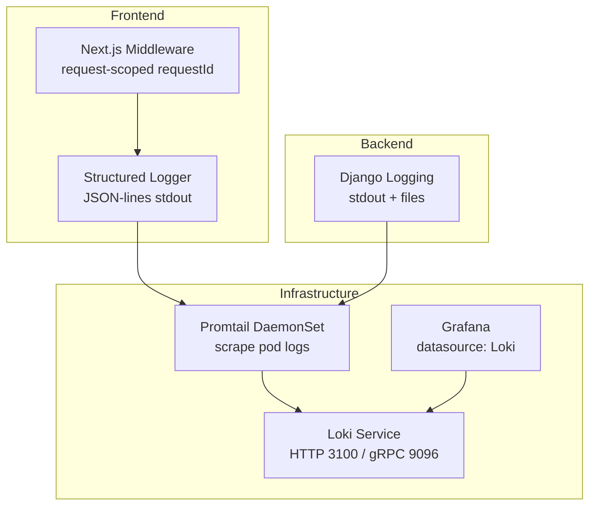
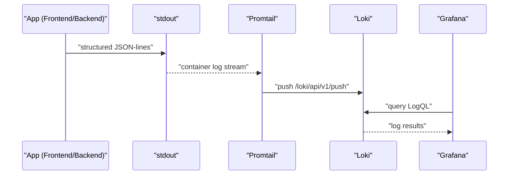
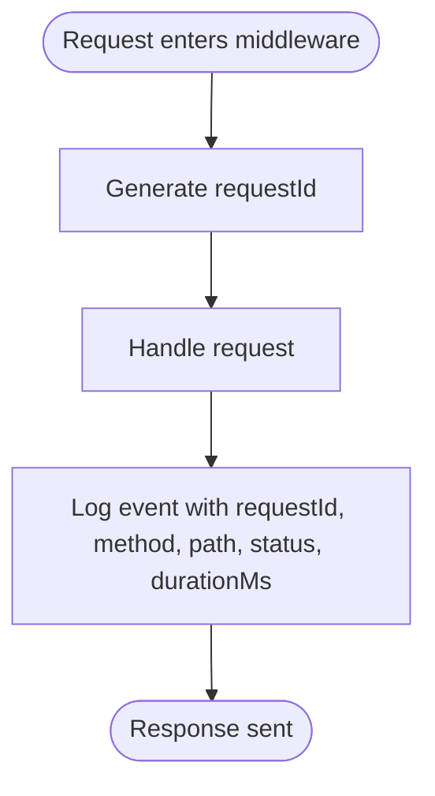
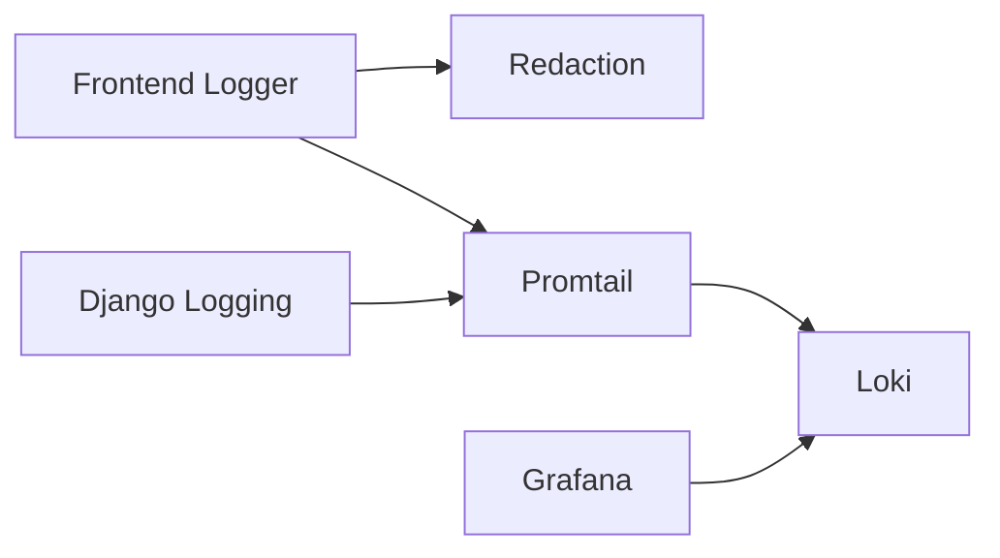

# Centralized Logging with Loki

<cite>
**Referenced Files in This Document**
- [loki.yaml](file://infra/kubernetes/logging/loki.yaml)
- [base.py](file://backend/django/core/settings/base.py)
- [production.py](file://backend/django/core/settings/production.py)
- [development.py](file://backend/django/core/settings/development.py)
- [logger.ts](file://frontend/packages/observability/src/logger.ts)
- [redact.ts](file://frontend/packages/observability/src/redact.ts)
- [index.ts](file://frontend/packages/observability/src/index.ts)
- [middleware.ts](file://frontend/apps/template-renderer/src/middleware.ts)
- [alert-rules.yml](file://frontend/apps/template-renderer/observability/alert-rules.yml)
- [audit_logger.py](file://backend/django/apps/crm/audit_logger.py)
- [grafana.yaml](file://infra/kubernetes/monitoring/grafana.yaml)
</cite>

## Table of Contents
1. [Introduction](#introduction)
2. [Project Structure](#project-structure)
3. [Core Components](#core-components)
4. [Architecture Overview](#architecture-overview)
5. [Detailed Component Analysis](#detailed-component-analysis)
6. [Dependency Analysis](#dependency-analysis)
7. [Performance Considerations](#performance-considerations)
8. [Troubleshooting Guide](#troubleshooting-guide)
9. [Conclusion](#conclusion)
10. [Appendices](#appendices)

## Introduction
This document explains the centralized logging architecture for JOL-HUB using Loki. It covers how logs are produced by backend (Django) and frontend (Next.js) services, how they are aggregated via Promtail into Loki, how structured fields enable correlation across distributed components, and how retention, querying, alerting, and troubleshooting are configured.

Key goals:
- Standardize structured JSON-lines logs from all services.
- Aggregate logs centrally with Loki and visualize/query them in Grafana.
- Enforce PII redaction and safe log levels to protect sensitive data.
- Provide actionable alerting rules and a clear troubleshooting workflow.

## Project Structure
The logging stack spans infrastructure, backend, and frontend layers:
- Infrastructure deploys Loki, Promtail, and Grafana.
- Backend uses Django’s logging configuration and emits structured logs to stdout/files.
- Frontend uses a shared observability package to emit structured JSON-lines to stdout; Next.js middleware injects request context.

**Diagram sources**
- [loki.yaml:23-71](file://infra/kubernetes/logging/loki.yaml#L23-L71)
- [loki.yaml:158-195](file://infra/kubernetes/logging/loki.yaml#L158-L195)
- [grafana.yaml:10-22](file://infra/kubernetes/monitoring/grafana.yaml#L10-L22)
- [logger.ts:1-14](file://frontend/packages/observability/src/logger.ts#L1-L14)
- [middleware.ts:120-141](file://frontend/apps/template-renderer/src/middleware.ts#L120-L141)
- [base.py:439-513](file://backend/django/core/settings/base.py#L439-L513)

**Section sources**
- [loki.yaml:1-251](file://infra/kubernetes/logging/loki.yaml#L1-L251)
- [grafana.yaml:1-354](file://infra/kubernetes/monitoring/grafana.yaml#L1-L354)
- [logger.ts:1-139](file://frontend/packages/observability/src/logger.ts#L1-L139)
- [middleware.ts:120-141](file://frontend/apps/template-renderer/src/middleware.ts#L120-L141)
- [base.py:439-513](file://backend/django/core/settings/base.py#L439-L513)

## Core Components
- Loki stack:
  - Loki server with filesystem storage, embedded query cache, schema v11, compactor, and retention policy.
  - Promtail DaemonSet scraping Kubernetes pod logs and relabeling labels (app, namespace, pod, container).
  - Grafana configured with Loki as a datasource.
- Backend (Django):
  - Structured logging configuration with formatters and handlers; environment-specific level overrides.
  - Audit logger that records compliance events and writes to Python logger.
- Frontend (Next.js):
  - Shared observability package producing one-line JSON per log record with mandatory fields (time, level, msg, service).
  - Automatic PII/secret redaction on every field before serialization.
  - Request-scoped tracing via middleware injecting requestId and access logs.

**Section sources**
- [loki.yaml:23-71](file://infra/kubernetes/logging/loki.yaml#L23-L71)
- [loki.yaml:158-195](file://infra/kubernetes/logging/loki.yaml#L158-L195)
- [grafana.yaml:10-22](file://infra/kubernetes/monitoring/grafana.yaml#L10-L22)
- [base.py:439-513](file://backend/django/core/settings/base.py#L439-L513)
- [production.py:103-108](file://backend/django/core/settings/production.py#L103-L108)
- [development.py:94-101](file://backend/django/core/settings/development.py#L94-L101)
- [logger.ts:1-139](file://frontend/packages/observability/src/logger.ts#L1-L139)
- [redact.ts:1-131](file://frontend/packages/observability/src/redact.ts#L1-L131)
- [audit_logger.py:1-716](file://backend/django/apps/crm/audit_logger.py#L1-L716)

## Architecture Overview
Logs flow from application code to Loki through these steps:
1. Application emits structured logs to stdout (or file for Django).
2. Promtail collects container logs and pushes to Loki.
3. Grafana queries Loki for dashboards and alerts.

**Diagram sources**
- [loki.yaml:158-195](file://infra/kubernetes/logging/loki.yaml#L158-L195)
- [grafana.yaml:10-22](file://infra/kubernetes/monitoring/grafana.yaml#L10-L22)
- [logger.ts:1-14](file://frontend/packages/observability/src/logger.ts#L1-L14)

## Detailed Component Analysis

### Loki Stack Configuration
- Storage and indexing:
  - Filesystem object store with boltdb-shipper index and 24h index periods.
  - Embedded query cache enabled for performance.
- Retention:
  - Reject old samples older than 168 hours.
  - Global retention period set to 744 hours (31 days).
  - Compactor enabled with retention delete delay.
- Relabeling:
  - Pod labels mapped to app, namespace, pod, container for easy filtering.

Operational notes:
- Loki exposes HTTP on port 3100 and gRPC on 9096.
- Persistent volume provisioned for chunks and rules.

**Section sources**
- [loki.yaml:23-71](file://infra/kubernetes/logging/loki.yaml#L23-L71)
- [loki.yaml:73-147](file://infra/kubernetes/logging/loki.yaml#L73-L147)
- [loki.yaml:158-195](file://infra/kubernetes/logging/loki.yaml#L158-L195)

### Promtail Scrape and Relabeling
- Discovers Kubernetes pods and system logs.
- Uses docker parser stage to parse container logs.
- Relabels common Kubernetes metadata into stable labels for querying.

**Section sources**
- [loki.yaml:158-195](file://infra/kubernetes/logging/loki.yaml#L158-L195)

### Grafana Integration
- Configures Prometheus and Loki datasources.
- Provides dashboard provisioning and an overview dashboard for JOL-HUB.

**Section sources**
- [grafana.yaml:10-22](file://infra/kubernetes/monitoring/grafana.yaml#L10-L22)
- [grafana.yaml:28-315](file://infra/kubernetes/monitoring/grafana.yaml#L28-L315)

### Backend Logging (Django)
- Formatters:
  - Verbose, simple, and JSON formatter available.
- Handlers:
  - Console (debug-only), rotating file handlers for general and error logs, admin email handler for errors.
- Root and named loggers:
  - Root defaults to INFO; jolhub logger level depends on DEBUG flag.
- Environment overrides:
  - Development increases verbosity and enables DB query logging.
  - Production sets root to WARNING and jolhub to INFO.

Recommendation:
- For Loki ingestion, ensure Django outputs JSON-lines to stdout in production so Promtail can ship them consistently. The current base config includes a JSON formatter; integrate it with a console handler if not already done.

**Section sources**
- [base.py:439-513](file://backend/django/core/settings/base.py#L439-L513)
- [base.py:773-785](file://backend/django/core/settings/base.py#L773-L785)
- [development.py:94-101](file://backend/django/core/settings/development.py#L94-L101)
- [production.py:103-108](file://backend/django/core/settings/production.py#L103-L108)

### Frontend Logging (Next.js)
- Structured logger:
  - Emits one JSON object per line with time, level, msg, service.
  - Level gating ensures debug is suppressed in production unless explicitly overridden.
  - child() bindings allow attaching tenant, requestId, page, etc., to subsequent logs.
- PII redaction:
  - Deep redaction of values based on sensitive keys and text patterns (emails, JWTs, tokens, card numbers, phone numbers).
  - Protected shapes like UUIDs and ISO timestamps are preserved to maintain traceability.
- Batching sink:
  - Client-side batching reduces network overhead; flushes on timer, buffer full, or error/unload.
- Middleware correlation:
  - Generates a unique requestId per request and attaches it to response headers and logs.
  - Logs method, path, status, and durationMs for each handled request.

**Diagram sources**
- [middleware.ts:120-141](file://frontend/apps/template-renderer/src/middleware.ts#L120-L141)
- [logger.ts:67-108](file://frontend/packages/observability/src/logger.ts#L67-L108)

**Section sources**
- [logger.ts:1-139](file://frontend/packages/observability/src/logger.ts#L1-L139)
- [redact.ts:1-131](file://frontend/packages/observability/src/redact.ts#L1-L131)
- [index.ts:1-61](file://frontend/packages/observability/src/index.ts#L1-L61)
- [middleware.ts:120-141](file://frontend/apps/template-renderer/src/middleware.ts#L120-L141)

### Log Correlation Across Services
- Use requestId propagated from frontend middleware to correlate requests across frontend, backend, and external calls.
- Include tenant and service identifiers in log bindings to segment logs by organization and component.
- Ensure both frontend and backend include consistent fields (service, requestId, tenant) for unified queries.

Practical tips:
- Always attach child bindings for requestId and tenant when logging within a request scope.
- Avoid logging raw user identifiers; prefer hashed or masked IDs where possible.

[No sources needed since this section provides general guidance]

### Sensitive Data Handling
- Frontend redaction:
  - Key-based wholesale replacement for sensitive keys (password, token, secret, authorization, cookie, card, ssn, credential, api key, private key).
  - Pattern-based inline redaction for emails, JWTs, bearer/basic tokens, AWS keys, card numbers, phone numbers.
  - Protection of UUIDs and ISO timestamps to preserve traceability.
- Backend audit logging:
  - Masks sensitive fields and captures only necessary context for compliance.
  - Includes legal basis tracking and integrity mechanisms for audit trails.

**Section sources**
- [redact.ts:18-56](file://frontend/packages/observability/src/redact.ts#L18-L56)
- [redact.ts:68-88](file://frontend/packages/observability/src/redact.ts#L68-L88)
- [redact.ts:96-131](file://frontend/packages/observability/src/redact.ts#L96-L131)
- [audit_logger.py:183-203](file://backend/django/apps/crm/audit_logger.py#L183-L203)
- [audit_logger.py:671-687](file://backend/django/apps/crm/audit_logger.py#L671-L687)

### Log Retention Policies
- Loki retention:
  - Reject old samples older than 168 hours.
  - Global retention period set to 744 hours (31 days).
  - Compactor runs with retention enabled and a delete delay to manage storage.
- File rotation (Django):
  - RotatingFileHandler with size limits and backup counts for local logs.

Operational considerations:
- Adjust retention_period based on compliance requirements and storage capacity.
- Monitor disk usage on Loki PVC and tune compactor settings accordingly.

**Section sources**
- [loki.yaml:62-71](file://infra/kubernetes/logging/loki.yaml#L62-L71)
- [base.py:470-484](file://backend/django/core/settings/base.py#L470-L484)

### Log Querying Techniques (LogQL)
Useful LogQL patterns for JOL-HUB:
- Filter by service and level:
  - `{service="template-renderer"} |= "error"`
- Find errors for a specific request:
  - `{requestId="your-request-id"}`
- Search for booking failures:
  - `{service="template-renderer"} |= "booking" |~ "error|failed"`
- Rate-based queries for alerting:
  - `sum(rate({service="template-renderer", level="error"}[5m]))`
- Combine labels for multi-service correlation:
  - `{namespace="jol-hub", app="backend"}`

Tips:
- Prefer label filters first (e.g., service, namespace, app) then use string matchers (`|=`, `|~`) for content.
- Use time ranges in Grafana to limit query scope and improve performance.

[No sources needed since this section provides general guidance]

### Log-Based Alerting Strategies
Alert rules leverage log-derived rates and health probes:
- Frontend error rate > 1% over 5 minutes triggers P0 alert.
- HTTP 5xx spikes (>10/min) trigger P0 alert.
- Health endpoint down triggers P0 alert.
- Booking failure rate > 5% over 15 minutes triggers P1 alert.
- Performance regressions (LCP budget exceeded) trigger P2 alerts.
- Security advisories and deprecation warnings trigger P3 alerts.

These rules are defined in the frontend observability alert rules and integrated with Prometheus/Grafana.

**Section sources**
- [alert-rules.yml:18-144](file://frontend/apps/template-renderer/observability/alert-rules.yml#L18-L144)

### Troubleshooting Workflow
Step-by-step approach:
1. Identify the symptom (e.g., user reports login failure).
2. Capture the requestId from the browser response header or client logs.
3. Query Loki for all logs with that requestId across services:
   - `{requestId="your-request-id"}`
4. Filter by service and level to narrow down:
   - `{service="template-renderer", level="error"}`
   - `{service="backend", level="error"}`
5. Inspect correlated events:
   - Frontend middleware logs show request handling details.
   - Backend logs show API processing and database interactions.
6. Check alert history and runbooks linked in annotations for known issues.
7. Validate retention windows to ensure logs are still available.

Best practices:
- Always include requestId in cross-service logs.
- Use structured fields for fast filtering (service, level, tenant, path).
- Keep log messages concise and avoid embedding large payloads.

[No sources needed since this section provides general guidance]

## Dependency Analysis
Components and their relationships:
- Frontend logger depends on redaction utilities and exports a standardized interface.
- Next.js middleware depends on the logger to emit access logs with requestId.
- Promtail depends on Kubernetes metadata to relabel logs.
- Loki depends on persistent storage and compactor for retention.
- Grafana depends on Loki datasource to visualize logs.

**Diagram sources**
- [logger.ts:1-14](file://frontend/packages/observability/src/logger.ts#L1-L14)
- [redact.ts:1-131](file://frontend/packages/observability/src/redact.ts#L1-L131)
- [loki.yaml:158-195](file://infra/kubernetes/logging/loki.yaml#L158-L195)
- [grafana.yaml:10-22](file://infra/kubernetes/monitoring/grafana.yaml#L10-L22)

**Section sources**
- [logger.ts:1-139](file://frontend/packages/observability/src/logger.ts#L1-L139)
- [redact.ts:1-131](file://frontend/packages/observability/src/redact.ts#L1-L131)
- [loki.yaml:158-195](file://infra/kubernetes/logging/loki.yaml#L158-L195)
- [grafana.yaml:10-22](file://infra/kubernetes/monitoring/grafana.yaml#L10-L22)

## Performance Considerations
- Enable embedded query cache in Loki to speed up repeated queries.
- Use label-based filtering to reduce scan scope.
- Batch client-side logs to minimize network overhead.
- Rotate and size Django log files appropriately to avoid disk pressure.
- Tune Promtail resource requests/limits to handle log volume.

[No sources needed since this section provides general guidance]

## Troubleshooting Guide
Common issues and resolutions:
- Missing logs in Grafana:
  - Verify Promtail is running and scraping pod logs.
  - Confirm Loki service is reachable and accepting pushes.
- High disk usage:
  - Review retention_period and adjust as needed.
  - Check compactor status and PVC capacity.
- Excessive log volume:
  - Reduce log levels in production (INFO/WARNING).
  - Remove noisy debug logs and batch client emissions.
- PII leaks:
  - Ensure redaction is applied to all log fields.
  - Validate that no sensitive keys are logged directly.

**Section sources**
- [loki.yaml:62-71](file://infra/kubernetes/logging/loki.yaml#L62-L71)
- [redact.ts:18-56](file://frontend/packages/observability/src/redact.ts#L18-L56)
- [production.py:103-108](file://backend/django/core/settings/production.py#L103-L108)

## Conclusion
JOL-HUB’s centralized logging with Loki provides a robust foundation for observability:
- Standardized structured logs from frontend and backend.
- Automated collection and aggregation via Promtail.
- Strong PII protection and safe log levels.
- Actionable alerting and clear troubleshooting workflows.
- Configurable retention aligned with operational needs.

Adopting these practices ensures reliable diagnostics, compliance evidence, and efficient incident response across distributed components.

[No sources needed since this section summarizes without analyzing specific files]

## Appendices

### Example Log Formats
- Frontend structured log:
  - One JSON object per line with fields: time, level, msg, service, plus contextual fields (tenant, requestId, path, status, durationMs).
- Backend structured log:
  - Django JSON formatter output with timestamp, name, level, message; ensure console handler outputs JSON-lines in production.

[No sources needed since this section provides general guidance]

### Log Level Management
- Frontend:
  - Default minimum level is info in production; override via LOG_LEVEL if needed.
- Backend:
  - Base sets INFO for root and jolhub; development increases verbosity; production tightens to WARNING/INFO.

**Section sources**
- [logger.ts:110-116](file://frontend/packages/observability/src/logger.ts#L110-L116)
- [base.py:492-513](file://backend/django/core/settings/base.py#L492-L513)
- [development.py:94-101](file://backend/django/core/settings/development.py#L94-L101)
- [production.py:103-108](file://backend/django/core/settings/production.py#L103-L108)

### Log-Based Alerting Examples
- Error rate threshold:
  - Alert when error rate exceeds 1% over 5 minutes.
- HTTP 5xx spike:
  - Alert when more than 10 HTTP 5xx occur per minute.
- Health endpoint down:
  - Alert when probe_success is zero for a sustained period.

**Section sources**
- [alert-rules.yml:18-66](file://frontend/apps/template-renderer/observability/alert-rules.yml#L18-L66)