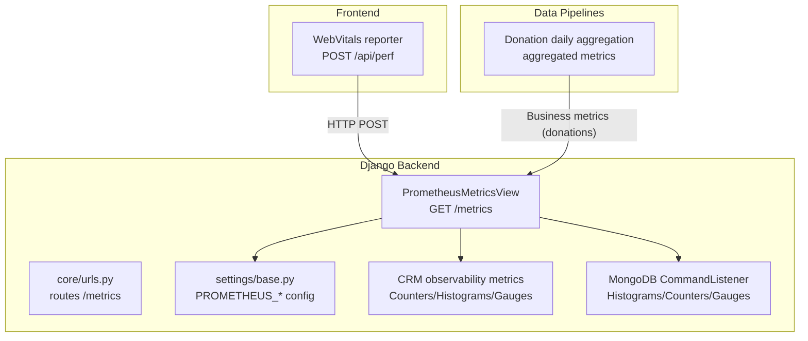
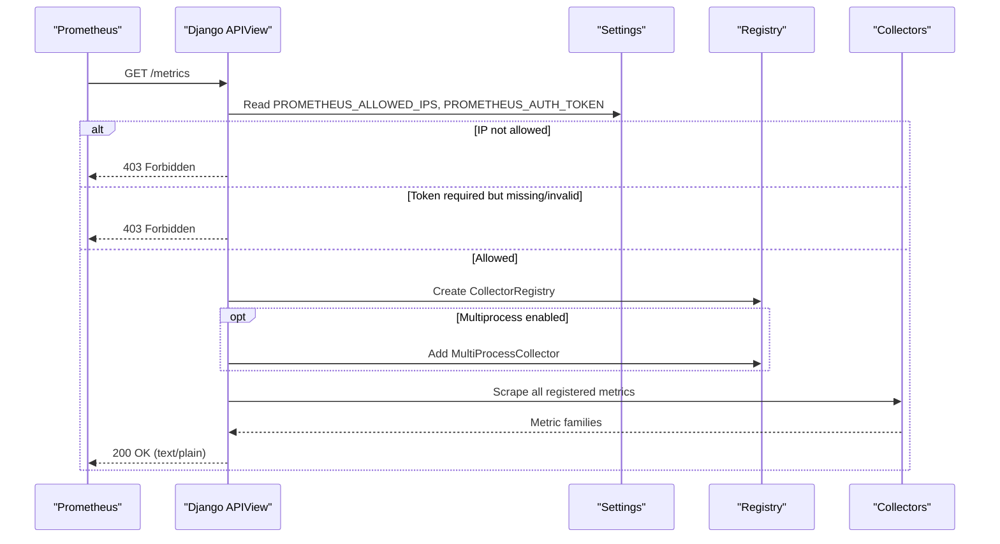
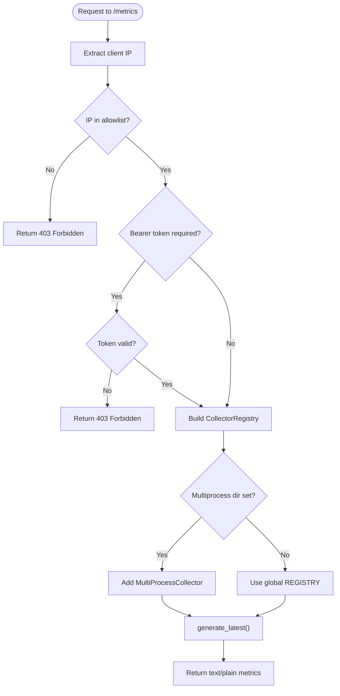
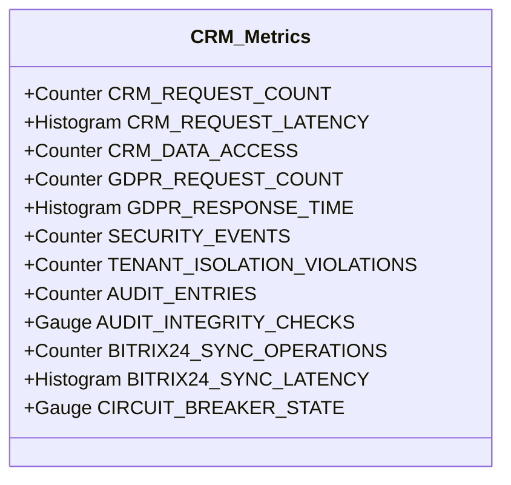
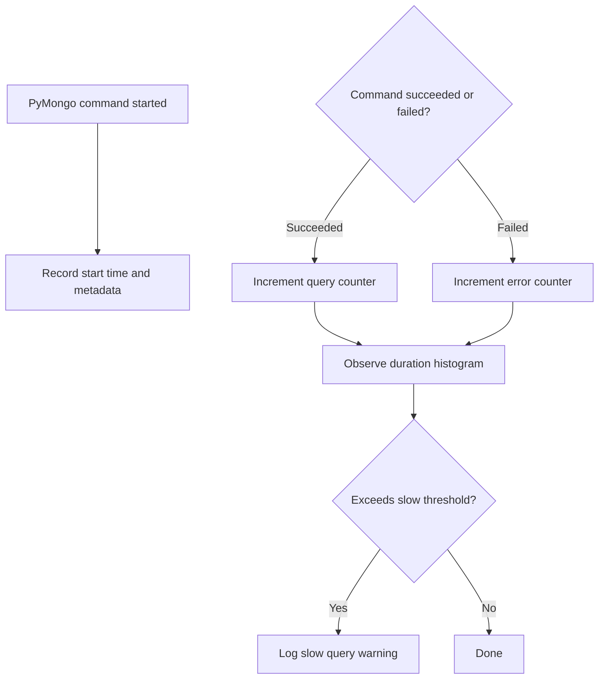
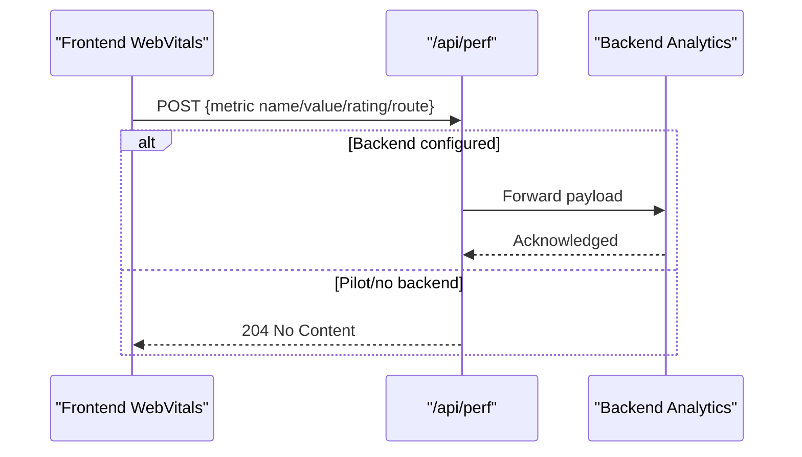
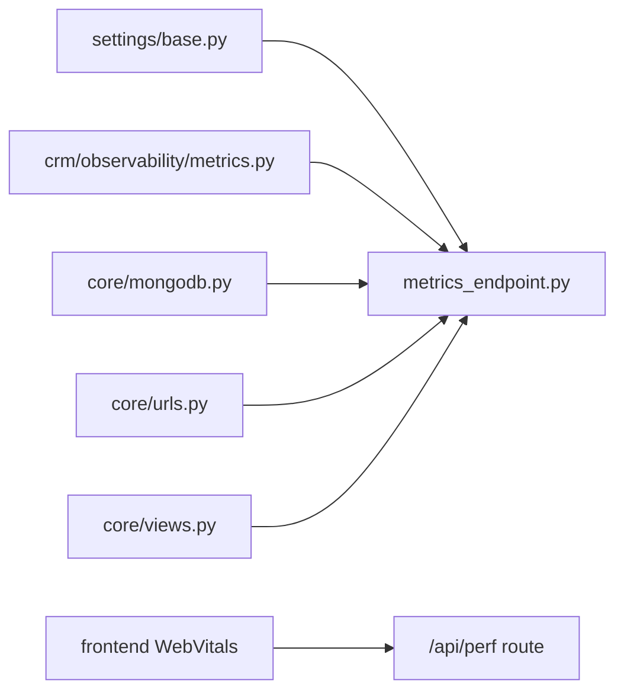

# Metrics Collection & Prometheus

<cite>
**Referenced Files in This Document**
- [metrics_endpoint.py](file://backend/django/apps/core/metrics_endpoint.py)
- [base.py](file://backend/django/core/settings/base.py)
- [urls.py](file://backend/django/apps/core/urls.py)
- [views.py](file://backend/django/apps/core/views.py)
- [metrics.py](file://backend/django/apps/crm/observability/metrics.py)
- [mongodb.py](file://backend/django/apps/core/mongodb.py)
- [daily_aggregation.py](file://data/src/pipelines/donation_analytics/daily_aggregation.py)
- [route.ts](file://frontend/apps/template-renderer/src/app/api/perf/route.ts)
- [WebVitals.tsx](file://frontend/apps/template-renderer/src/components/WebVitals.tsx)
</cite>

## Table of Contents
1. Introduction
2. Project Structure
3. Core Components
4. Architecture Overview
5. Detailed Component Analysis
6. Dependency Analysis
7. Performance Considerations
8. Troubleshooting Guide
9. Conclusion
10. Appendices

## Introduction
This document explains the metrics collection system in JOL-HUB with a focus on Prometheus integration, security controls for the /metrics endpoint, multi-process support for Gunicorn deployments, and application-level metrics across CRM, MongoDB, analytics, and business domains such as donations and user engagement. It also covers how to register custom metrics, configure labels safely under GDPR, and provides examples of Counters, Gauges, and Histograms used throughout the codebase.

## Project Structure
The metrics system spans several layers:
- HTTP exposure: A Django REST Framework view exposes /metrics in standard Prometheus text format.
- Security: IP allowlist and optional bearer token protect the endpoint.
- Multi-process: Optional multiprocess collector supports Gunicorn workers.
- Application metrics: CRM observability module defines domain-specific metrics; MongoDB driver listener emits query performance metrics; analytics pipelines aggregate donation metrics; frontend RUM posts Web Vitals to a backend ingress.

**Diagram sources**
- [metrics_endpoint.py:68-153](file://backend/django/apps/core/metrics_endpoint.py#L68-L153)
- [urls.py:14-35](file://backend/django/apps/core/urls.py#L14-L35)
- [base.py:676-686](file://backend/django/core/settings/base.py#L676-L686)
- [metrics.py:34-113](file://backend/django/apps/crm/observability/metrics.py#L34-L113)
- [mongodb.py:62-91](file://backend/django/apps/core/mongodb.py#L62-L91)
- [route.ts:30-62](file://frontend/apps/template-renderer/src/app/api/perf/route.ts#L30-L62)
- [WebVitals.tsx:36-58](file://frontend/apps/template-renderer/src/components/WebVitals.tsx#L36-L58)
- [daily_aggregation.py:216-241](file://data/src/pipelines/donation_analytics/daily_aggregation.py#L216-L241)

**Section sources**
- [metrics_endpoint.py:1-25](file://backend/django/apps/core/metrics_endpoint.py#L1-L25)
- [urls.py:14-35](file://backend/django/apps/core/urls.py#L14-L35)
- [base.py:676-686](file://backend/django/core/settings/base.py#L676-L686)

## Core Components
- Prometheus /metrics endpoint: Exposes all registered collectors in Prometheus text exposition format with strict access control and optional bearer token. Supports multi-process mode via environment configuration.
- CRM observability metrics: Domain-focused counters, histograms, and gauges for request latency, data access, GDPR requests, security events, audit integrity, and external sync operations.
- MongoDB metrics: Driver-level command listener records query durations, counts, errors, and connection pool status using histograms, counters, and gauges.
- Analytics and business metrics: Donation analytics pipeline aggregates anonymized totals and trends; frontend RUM collects consent-gated Web Vitals and forwards them to the backend.

**Section sources**
- [metrics_endpoint.py:68-153](file://backend/django/apps/core/metrics_endpoint.py#L68-L153)
- [metrics.py:34-113](file://backend/django/apps/crm/observability/metrics.py#L34-L113)
- [mongodb.py:62-91](file://backend/django/apps/core/mongodb.py#L62-L91)
- [daily_aggregation.py:216-241](file://data/src/pipelines/donation_analytics/daily_aggregation.py#L216-L241)
- [route.ts:30-62](file://frontend/apps/template-renderer/src/app/api/perf/route.ts#L30-L62)
- [WebVitals.tsx:36-58](file://frontend/apps/template-renderer/src/components/WebVitals.tsx#L36-L58)

## Architecture Overview
The /metrics endpoint is the single scrape target for Prometheus. It enforces IP allowlisting and optional bearer token authentication before rendering metrics from either the global registry or a multiprocess-aware registry when running multiple Gunicorn workers. Application modules register their own metrics at import time, ensuring they are available to the endpoint without additional wiring.

**Diagram sources**
- [metrics_endpoint.py:84-153](file://backend/django/apps/core/metrics_endpoint.py#L84-L153)
- [base.py:676-686](file://backend/django/core/settings/base.py#L676-L686)

## Detailed Component Analysis

### Prometheus /metrics Endpoint
- Purpose: Serve Prometheus-compatible metrics in standard text format.
- Security:
  - IP allowlist enforced via settings; returns 403 if client IP is not allowed.
  - Optional bearer token check via Authorization header; returns 403 if invalid.
- Multi-process support:
  - If PROMETHEUS_MULTIPROC_DIR is set, uses multiprocess collector to aggregate metrics from multiple workers.
  - Otherwise, uses the default global registry.
- Routing:
  - The view is mounted under core URLs and documented in core views.

**Diagram sources**
- [metrics_endpoint.py:48-153](file://backend/django/apps/core/metrics_endpoint.py#L48-L153)

**Section sources**
- [metrics_endpoint.py:68-153](file://backend/django/apps/core/metrics_endpoint.py#L68-L153)
- [urls.py:14-35](file://backend/django/apps/core/urls.py#L14-L35)
- [views.py:11-11](file://backend/django/apps/core/views.py#L11-L11)
- [base.py:676-686](file://backend/django/core/settings/base.py#L676-L686)

### CRM Observability Metrics
- Request metrics:
  - Counter for total CRM API requests with tenant, endpoint, method, and status labels.
  - Histogram for request latency with tenant and endpoint labels.
- Data access and compliance:
  - Counter for data access operations with entity type, operation, and data classification labels.
  - Counters and histogram for GDPR requests and response times.
- Security and audit:
  - Counters for security events and tenant isolation violations.
  - Gauge for audit integrity checks.
- External integrations:
  - Counters and histogram for Bitrix24 sync operations and latency.
  - Gauge for circuit breaker state per service.

**Diagram sources**
- [metrics.py:34-113](file://backend/django/apps/crm/observability/metrics.py#L34-L113)

**Section sources**
- [metrics.py:34-113](file://backend/django/apps/crm/observability/metrics.py#L34-L113)

### MongoDB Query Performance Metrics
- Driver-level instrumentation via PyMongo’s CommandListener:
  - Histogram for query duration with command, collection, and database labels.
  - Counter for total queries and query errors with appropriate labels.
  - Gauges for active and available connections in the connection pool.
- Slow query detection:
  - Logs warnings when query duration exceeds configured threshold.

**Diagram sources**
- [mongodb.py:101-219](file://backend/django/apps/core/mongodb.py#L101-L219)
- [mongodb.py:62-91](file://backend/django/apps/core/mongodb.py#L62-L91)

**Section sources**
- [mongodb.py:62-91](file://backend/django/apps/core/mongodb.py#L62-L91)
- [mongodb.py:101-219](file://backend/django/apps/core/mongodb.py#L101-L219)

### Business Metrics: Donations and User Engagement
- Donation analytics pipeline computes aggregated totals and trends over recent days, returning anonymized summaries suitable for dashboards and reporting.
- Frontend RUM collects consent-gated Web Vitals and posts them to a backend ingress that can forward to analytics services when configured.

**Diagram sources**
- [WebVitals.tsx:36-58](file://frontend/apps/template-renderer/src/components/WebVitals.tsx#L36-L58)
- [route.ts:30-62](file://frontend/apps/template-renderer/src/app/api/perf/route.ts#L30-L62)
- [daily_aggregation.py:216-241](file://data/src/pipelines/donation_analytics/daily_aggregation.py#L216-L241)

**Section sources**
- [daily_aggregation.py:216-241](file://data/src/pipelines/donation_analytics/daily_aggregation.py#L216-L241)
- [route.ts:30-62](file://frontend/apps/template-renderer/src/app/api/perf/route.ts#L30-L62)
- [WebVitals.tsx:36-58](file://frontend/apps/template-renderer/src/components/WebVitals.tsx#L36-L58)

## Dependency Analysis
- The /metrics endpoint depends on:
  - Django settings for security and multiprocess configuration.
  - Registered prometheus_client collectors from CRM and MongoDB modules.
- CRM metrics depend on tenant context utilities for labeling.
- MongoDB metrics depend on PyMongo monitoring events.
- Frontend RUM depends on consent state and optionally forwards to backend analytics.

**Diagram sources**
- [base.py:676-686](file://backend/django/core/settings/base.py#L676-L686)
- [metrics_endpoint.py:68-153](file://backend/django/apps/core/metrics_endpoint.py#L68-L153)
- [metrics.py:34-113](file://backend/django/apps/crm/observability/metrics.py#L34-L113)
- [mongodb.py:62-91](file://backend/django/apps/core/mongodb.py#L62-L91)
- [urls.py:14-35](file://backend/django/apps/core/urls.py#L14-L35)
- [views.py:11-11](file://backend/django/apps/core/views.py#L11-L11)
- [WebVitals.tsx:36-58](file://frontend/apps/template-renderer/src/components/WebVitals.tsx#L36-L58)
- [route.ts:30-62](file://frontend/apps/template-renderer/src/app/api/perf/route.ts#L30-L62)

**Section sources**
- [base.py:676-686](file://backend/django/core/settings/base.py#L676-L686)
- [metrics_endpoint.py:68-153](file://backend/django/apps/core/metrics_endpoint.py#L68-L153)
- [metrics.py:34-113](file://backend/django/apps/crm/observability/metrics.py#L34-L113)
- [mongodb.py:62-91](file://backend/django/apps/core/mongodb.py#L62-L91)
- [urls.py:14-35](file://backend/django/apps/core/urls.py#L14-L35)
- [views.py:11-11](file://backend/django/apps/core/views.py#L11-L11)
- [WebVitals.tsx:36-58](file://frontend/apps/template-renderer/src/components/WebVitals.tsx#L36-L58)
- [route.ts:30-62](file://frontend/apps/template-renderer/src/app/api/perf/route.ts#L30-L62)

## Performance Considerations
- Histogram buckets:
  - CRM request latency uses buckets tuned for typical API latencies.
  - MongoDB query duration includes fine-grained buckets below the slow-query threshold and coarser buckets above it to detect N+1 queries and unindexed scans.
- Multi-process scraping:
  - Configure PROMETHEUS_MULTIPROC_DIR to ensure Prometheus aggregates metrics across Gunicorn workers.
- Slow query logging:
  - MongoDB listener logs warnings when queries exceed the configured threshold to aid performance tuning.

[No sources needed since this section provides general guidance]

## Troubleshooting Guide
- 403 Forbidden on /metrics:
  - Ensure the Prometheus server IP is included in PROMETHEUS_ALLOWED_IPS.
  - If PROMETHEUS_AUTH_TOKEN is set, include a valid Authorization header with Bearer token.
- Missing metrics:
  - Verify that modules defining metrics are imported so collectors are registered before scraping.
  - In multi-process deployments, confirm PROMETHEUS_MULTIPROC_DIR is set and accessible by the process serving /metrics.
- High error rates:
  - Inspect MongoDB error counters and CRM security event counters to identify failing operations or unauthorized attempts.
- GDPR compliance:
  - Confirm metric labels do not contain personal data; use tenant identifiers and non-PII categories only.

**Section sources**
- [metrics_endpoint.py:95-129](file://backend/django/apps/core/metrics_endpoint.py#L95-L129)
- [base.py:676-686](file://backend/django/core/settings/base.py#L676-L686)
- [mongodb.py:161-172](file://backend/django/apps/core/mongodb.py#L161-L172)
- [metrics.py:34-113](file://backend/django/apps/crm/observability/metrics.py#L34-L113)

## Conclusion
JOL-HUB’s metrics system integrates Prometheus through a secure /metrics endpoint, exposing both infrastructure-level and application-level metrics. CRM observability and MongoDB driver instrumentation provide deep insights into request performance, data access patterns, and external integrations. Business metrics for donations and user engagement are aggregated in pipelines and surfaced via consent-gated analytics. The design emphasizes GDPR compliance by avoiding PII in metric labels and enforcing strict access controls on the metrics endpoint.

[No sources needed since this section summarizes without analyzing specific files]

## Appendices

### Configuration Reference
- PROMETHEUS_ALLOWED_IPS: Comma-separated list of IPs allowed to access /metrics. Empty allows all (development).
- PROMETHEUS_AUTH_TOKEN: Optional bearer token for /metrics. When set, requests must include a matching Authorization header.
- PROMETHEUS_MULTIPROC_DIR: Directory for Prometheus multiprocess metrics aggregation when running multiple Gunicorn workers.

**Section sources**
- [base.py:676-686](file://backend/django/core/settings/base.py#L676-L686)

### How to Register Custom Metrics
- Define a Counter, Gauge, or Histogram at module scope so it is registered when the module is imported.
- Use stable, low-cardinality labels (e.g., tenant_id, endpoint, method, status) and avoid PII.
- Increment or observe values around relevant operations (requests, DB calls, background jobs).
- Ensure your module is imported early in the application lifecycle so collectors are available to /metrics.

**Section sources**
- [metrics.py:34-113](file://backend/django/apps/crm/observability/metrics.py#L34-L113)
- [mongodb.py:62-91](file://backend/django/apps/core/mongodb.py#L62-L91)

### Common Metric Types and Usage Patterns
- Counters:
  - Total CRM API requests, GDPR requests, security events, audit entries, Bitrix24 sync operations, MongoDB queries and errors.
- Histograms:
  - CRM request latency, GDPR response time, Bitrix24 sync latency, MongoDB query duration.
- Gauges:
  - Audit integrity checks, circuit breaker state, MongoDB pool active/available connections.

**Section sources**
- [metrics.py:34-113](file://backend/django/apps/crm/observability/metrics.py#L34-L113)
- [mongodb.py:62-91](file://backend/django/apps/core/mongodb.py#L62-L91)