# Monitoring & Observability

<cite>
**Referenced Files in This Document**
- [metrics_endpoint.py](file://backend/django/apps/core/metrics_endpoint.py)
- [metrics.py](file://backend/django/apps/crm/observability/metrics.py)
- [prometheus.yaml](file://infra/kubernetes/monitoring/prometheus.yaml)
- [grafana.yaml](file://infra/kubernetes/monitoring/grafana.yaml)
- [loki.yaml](file://infra/kubernetes/logging/loki.yaml)
- [observability.yaml](file://infra/kubernetes/observability/observability.yaml)
- [alert-rules.yml](file://frontend/apps/template-renderer/observability/alert-rules.yml)
- [OBSERVABILITY.md](file://frontend/apps/template-renderer/OBSERVABILITY.md)
- [index.ts](file://frontend/packages/observability/src/index.ts)
- [logger.ts](file://frontend/packages/observability/src/logger.ts)
- [observability.test.ts](file://frontend/packages/observability/src/__tests__/observability.test.ts)
</cite>

## Table of Contents
1. Introduction
2. Project Structure
3. Core Components
4. Architecture Overview
5. Detailed Component Analysis
6. Dependency Analysis
7. Performance Considerations
8. Troubleshooting Guide
9. Conclusion

## Introduction
This document describes the monitoring and observability stack for JOL-HUB, covering metrics collection with Prometheus, visualization with Grafana, centralized logging with Loki, alerting rules, application-level metrics (API response times, error rates, database query performance, business metrics), infrastructure monitoring (Kubernetes pods, nodes, network traffic), and frontend performance monitoring (Web Vitals and user experience). It also provides troubleshooting guidance, log analysis techniques, and procedures for investigating performance bottlenecks and system failures.

## Project Structure
Observability is implemented across three layers:
- Application layer: Django backend exposes a secure /metrics endpoint and emits CRM/business metrics; frontend packages provide structured logging, error tracking, and performance utilities.
- Platform layer: Kubernetes manifests deploy Prometheus, Grafana, Loki, Node Exporter, kube-state-metrics, AlertManager, and exporters for PostgreSQL and Redis.
- Frontend observability: JSON-lines logs shipped by Promtail to Loki; Prometheus rule files define alert thresholds for frontend health, errors, and performance budgets.

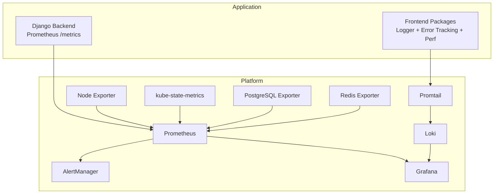

**Diagram sources**
- [prometheus.yaml:57-151](file://infra/kubernetes/monitoring/prometheus.yaml#L57-L151)
- [grafana.yaml:10-21](file://infra/kubernetes/monitoring/grafana.yaml#L10-L21)
- [loki.yaml:23-72](file://infra/kubernetes/logging/loki.yaml#L23-L72)
- [observability.yaml:8-87](file://infra/kubernetes/observability/observability.yaml#L8-L87)
- [observability.yaml:204-293](file://infra/kubernetes/observability/observability.yaml#L204-L293)
- [observability.yaml:294-392](file://infra/kubernetes/observability/observability.yaml#L294-L392)

**Section sources**
- [prometheus.yaml:57-151](file://infra/kubernetes/monitoring/prometheus.yaml#L57-L151)
- [grafana.yaml:10-21](file://infra/kubernetes/monitoring/grafana.yaml#L10-L21)
- [loki.yaml:23-72](file://infra/kubernetes/logging/loki.yaml#L23-L72)
- [observability.yaml:8-87](file://infra/kubernetes/observability/observability.yaml#L8-L87)
- [observability.yaml:204-293](file://infra/kubernetes/observability/observability.yaml#L204-L293)
- [observability.yaml:294-392](file://infra/kubernetes/observability/observability.yaml#L294-L392)

## Core Components
- Secure Prometheus /metrics endpoint in Django with IP allowlist and optional bearer token protection, multi-process support, and standard text exposition.
- CRM observability module exposing counters, histograms, gauges, and compliance/performance helpers for request latency, data access, GDPR requests, security events, audit integrity, Bitrix24 sync, and circuit breaker state.
- Kubernetes monitoring stack: Prometheus scraping config for API server, nodes, pods, and app-specific jobs; persistent storage; alerting integration.
- Grafana provisioning with datasources (Prometheus, Loki) and a default dashboard JSON for overview panels.
- Loki stack with retention, compactor, ruler, and Promtail configuration to scrape Kubernetes pod logs.
- AlertManager configuration routing alerts to webhooks and Slack, plus Terraform template for SNS receivers.
- Frontend alert rules defining severity tiers (P0–P3) for error rates, 5xx spikes, auth down, conversion drops, booking failures, Web Vitals budget regressions, bundle size budgets, and dependency advisories.
- Frontend observability package providing structured JSON-lines logging, redaction, error categorization/fingerprinting, performance phase computation, metric batching, and health aggregation.

**Section sources**
- [metrics_endpoint.py:1-154](file://backend/django/apps/core/metrics_endpoint.py#L1-L154)
- [metrics.py:1-478](file://backend/django/apps/crm/observability/metrics.py#L1-L478)
- [prometheus.yaml:57-151](file://infra/kubernetes/monitoring/prometheus.yaml#L57-L151)
- [grafana.yaml:10-21](file://infra/kubernetes/monitoring/grafana.yaml#L10-L21)
- [loki.yaml:23-72](file://infra/kubernetes/logging/loki.yaml#L23-L72)
- [observability.yaml:204-293](file://infra/kubernetes/observability/observability.yaml#L204-L293)
- [alert-rules.yml:1-144](file://frontend/apps/template-renderer/observability/alert-rules.yml#L1-L144)
- [index.ts:1-60](file://frontend/packages/observability/src/index.ts#L1-L60)
- [logger.ts:1-37](file://frontend/packages/observability/src/logger.ts#L1-L37)

## Architecture Overview
The platform collects metrics from applications and infrastructure, centralizes logs, visualizes everything in Grafana, and routes alerts via AlertManager.

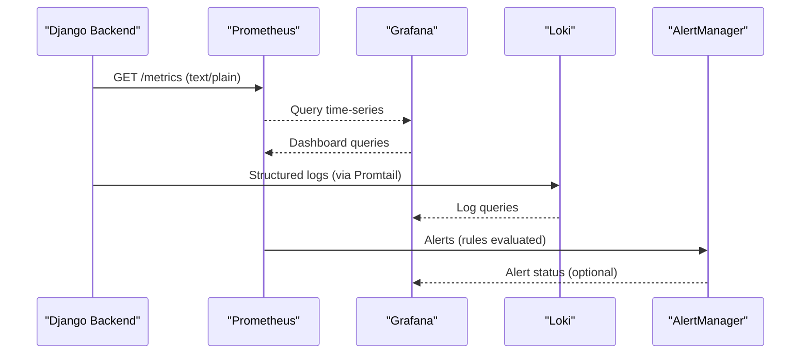

**Diagram sources**
- [metrics_endpoint.py:84-153](file://backend/django/apps/core/metrics_endpoint.py#L84-L153)
- [prometheus.yaml:57-151](file://infra/kubernetes/monitoring/prometheus.yaml#L57-L151)
- [grafana.yaml:10-21](file://infra/kubernetes/monitoring/grafana.yaml#L10-L21)
- [loki.yaml:158-177](file://infra/kubernetes/logging/loki.yaml#L158-L177)
- [observability.yaml:204-293](file://infra/kubernetes/observability/observability.yaml#L204-L293)

## Detailed Component Analysis

### Prometheus Metrics Endpoint (Django)
- Purpose: Expose all registered Prometheus metrics in standard format.
- Security: IP allowlist enforced; optional bearer token check; logs denied attempts.
- Multi-process: Supports multiprocess mode via environment variable for worker-based deployments.
- Output: HTTP 200 with content type latest; HTTP 403 on authorization failure.

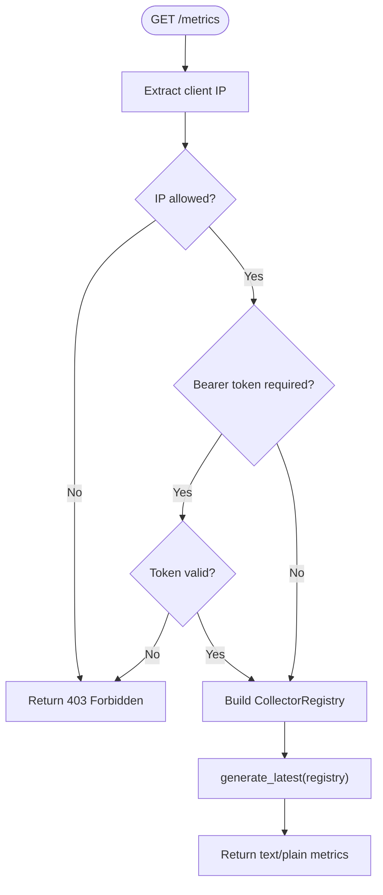

**Diagram sources**
- [metrics_endpoint.py:84-153](file://backend/django/apps/core/metrics_endpoint.py#L84-L153)

**Section sources**
- [metrics_endpoint.py:1-154](file://backend/django/apps/core/metrics_endpoint.py#L1-L154)

### CRM Observability Metrics and Health
- Metrics: Request counts/latency, data access operations, GDPR request counts/response times, security events, tenant isolation violations, audit entries/integrity checks, Bitrix24 sync ops/latency, circuit breaker state.
- Compliance reporting: Aggregates DSR pending/overdue, consent metrics, legal holds, audit integrity, failed access attempts; computes a compliance score and issues list.
- Performance monitoring: Decorator to track per-endpoint latency and request counts; data access tracking helper.
- Health checks: Database connectivity, audit integrity verification, Bitrix24 connectivity with circuit breaker awareness; full health aggregation.

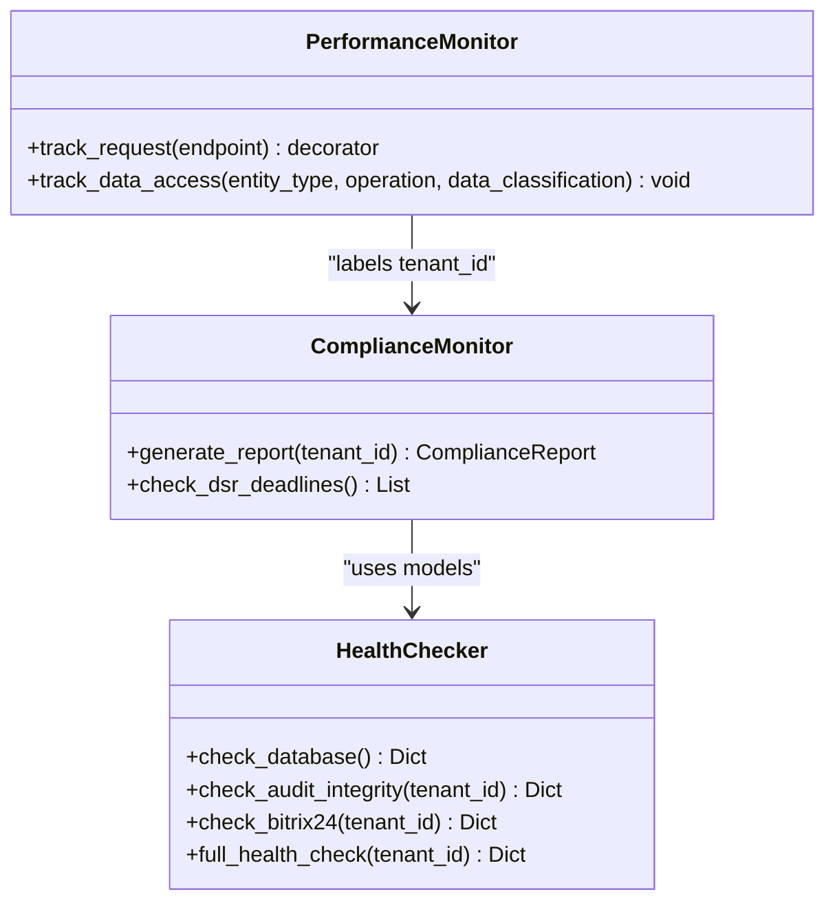

**Diagram sources**
- [metrics.py:125-301](file://backend/django/apps/crm/observability/metrics.py#L125-L301)
- [metrics.py:335-387](file://backend/django/apps/crm/observability/metrics.py#L335-L387)
- [metrics.py:393-478](file://backend/django/apps/crm/observability/metrics.py#L393-L478)

**Section sources**
- [metrics.py:1-478](file://backend/django/apps/crm/observability/metrics.py#L1-L478)

### Prometheus Stack Configuration
- Scrape targets: Kubernetes API server, nodes, pods (annotation-driven), jol-hub backend pods, PostgreSQL exporter, Redis exporter.
- Retention: TSDB retention set to 15 days.
- Alerting: Configured to forward alerts to AlertManager at port 9093.
- RBAC: ClusterRole/ClusterRoleBinding grant read access to nodes, services, endpoints, pods, ingresses, and non-resource /metrics.

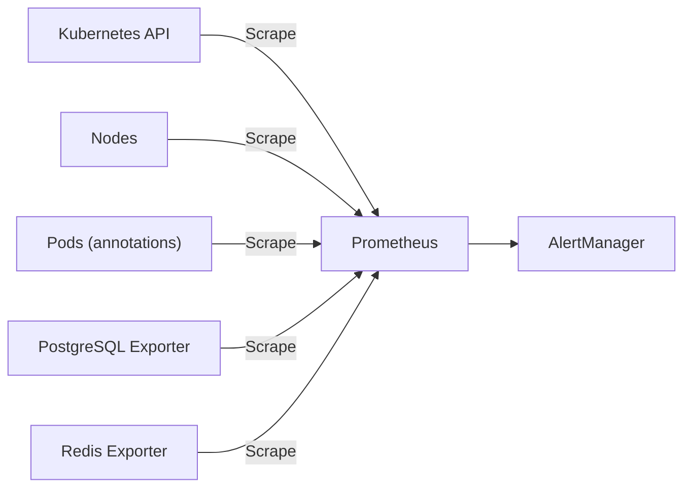

**Diagram sources**
- [prometheus.yaml:57-151](file://infra/kubernetes/monitoring/prometheus.yaml#L57-L151)
- [prometheus.yaml:153-225](file://infra/kubernetes/monitoring/prometheus.yaml#L153-L225)

**Section sources**
- [prometheus.yaml:17-151](file://infra/kubernetes/monitoring/prometheus.yaml#L17-L151)
- [prometheus.yaml:153-225](file://infra/kubernetes/monitoring/prometheus.yaml#L153-L225)

### Grafana Provisioning and Dashboards
- Datasources: Prometheus and Loki provisioned via ConfigMap.
- Dashboards: Default dashboard JSON includes panels for API response time p95, request rate, CPU usage, memory usage.
- Storage: Persistent volume for Grafana data.

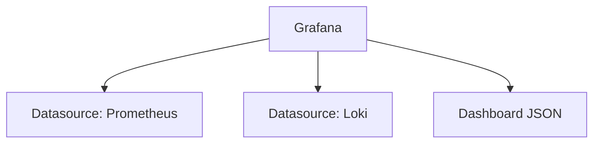

**Diagram sources**
- [grafana.yaml:10-21](file://infra/kubernetes/monitoring/grafana.yaml#L10-L21)
- [grafana.yaml:44-315](file://infra/kubernetes/monitoring/grafana.yaml#L44-L315)

**Section sources**
- [grafana.yaml:10-21](file://infra/kubernetes/monitoring/grafana.yaml#L10-L21)
- [grafana.yaml:44-315](file://infra/kubernetes/monitoring/grafana.yaml#L44-L315)
- [grafana.yaml:317-414](file://infra/kubernetes/monitoring/grafana.yaml#L317-L414)

### Loki Logging and Promtail
- Loki: Filesystem-backed storage, schema v11, retention 31 days, compactor enabled, ruler configured with AlertManager URL.
- Promtail: Scrapes Kubernetes pod logs using docker parser and relabels by pod labels; pushes to Loki push API.

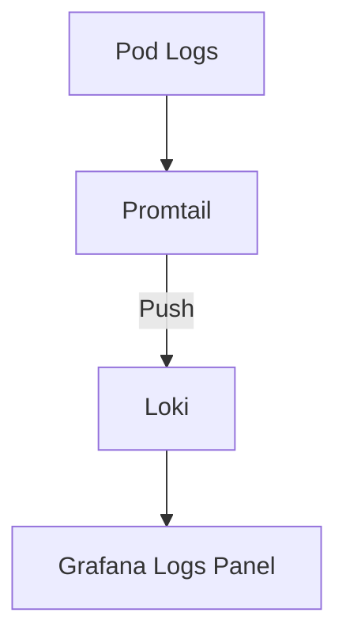

**Diagram sources**
- [loki.yaml:23-72](file://infra/kubernetes/logging/loki.yaml#L23-L72)
- [loki.yaml:158-177](file://infra/kubernetes/logging/loki.yaml#L158-L177)

**Section sources**
- [loki.yaml:1-177](file://infra/kubernetes/logging/loki.yaml#L1-L177)

### Alerting Rules and AlertManager
- Frontend rules: Severity ladder P0–P3 covering error rate, 5xx spikes, auth down, health endpoint down, commerce conversion drop, booking failures, LCP budget regression, bundle size budget, dependency advisories, deprecation warnings.
- AlertManager: Routes grouped by alertname/severity; default receiver webhook to backend; critical receiver to Slack channel; resolve notifications enabled.

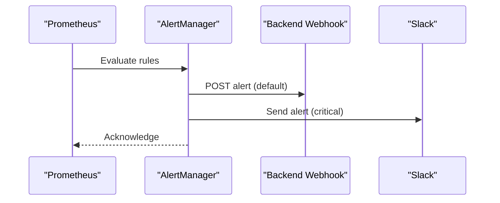

**Diagram sources**
- [alert-rules.yml:18-144](file://frontend/apps/template-renderer/observability/alert-rules.yml#L18-L144)
- [observability.yaml:204-293](file://infra/kubernetes/observability/observability.yaml#L204-L293)

**Section sources**
- [alert-rules.yml:1-144](file://frontend/apps/template-renderer/observability/alert-rules.yml#L1-L144)
- [observability.yaml:204-293](file://infra/kubernetes/observability/observability.yaml#L204-L293)

### Infrastructure Monitoring (Node Exporter, kube-state-metrics, Exporters)
- Node Exporter: DaemonSet exposing host metrics via hostNetwork/hostPID with mounted proc/sys/root.
- kube-state-metrics: Deployment exposing cluster state metrics.
- PostgreSQL and Redis Exporters: Deployments exposing metrics endpoints for databases.

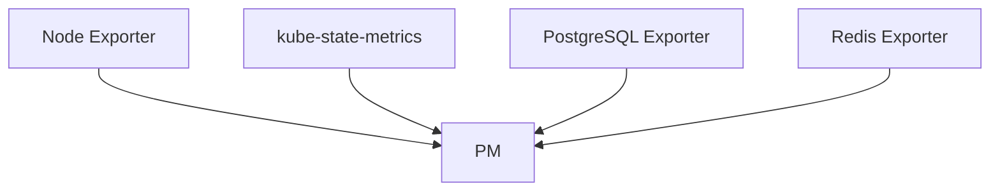

**Diagram sources**
- [observability.yaml:8-87](file://infra/kubernetes/observability/observability.yaml#L8-L87)
- [observability.yaml:88-203](file://infra/kubernetes/observability/observability.yaml#L88-L203)
- [observability.yaml:294-392](file://infra/kubernetes/observability/observability.yaml#L294-L392)

**Section sources**
- [observability.yaml:8-87](file://infra/kubernetes/observability/observability.yaml#L8-L87)
- [observability.yaml:88-203](file://infra/kubernetes/observability/observability.yaml#L88-L203)
- [observability.yaml:294-392](file://infra/kubernetes/observability/observability.yaml#L294-L392)

### Frontend Observability Package
- Logger: Zero-dependency, JSON-lines, level-gated, auto-redacting; supports child bindings and batching sinks.
- Redaction: Removes emails, phone numbers, card numbers, JWTs/bearer tokens, AWS keys; preserves UUIDs/timestamps; handles circular structures.
- Error tracking: Categorize, assess severity, fingerprint similar errors, classify with bounded fields, breadcrumb buffer.
- Performance: Compute navigation phases from timing numbers, identify slowest resources, batch metrics.
- Health: Aggregate dependency statuses with timeouts for probes.

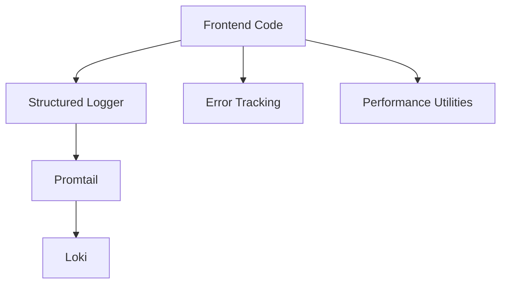

**Diagram sources**
- [index.ts:1-60](file://frontend/packages/observability/src/index.ts#L1-L60)
- [logger.ts:1-37](file://frontend/packages/observability/src/logger.ts#L1-L37)
- [observability.test.ts:32-109](file://frontend/packages/observability/src/__tests__/observability.test.ts#L32-L109)
- [observability.test.ts:115-184](file://frontend/packages/observability/src/__tests__/observability.test.ts#L115-L184)
- [observability.test.ts:190-286](file://frontend/packages/observability/src/__tests__/observability.test.ts#L190-L286)
- [observability.test.ts:302-355](file://frontend/packages/observability/src/__tests__/observability.test.ts#L302-L355)

**Section sources**
- [index.ts:1-60](file://frontend/packages/observability/src/index.ts#L1-L60)
- [logger.ts:1-37](file://frontend/packages/observability/src/logger.ts#L1-L37)
- [observability.test.ts:32-109](file://frontend/packages/observability/src/__tests__/observability.test.ts#L32-L109)
- [observability.test.ts:115-184](file://frontend/packages/observability/src/__tests__/observability.test.ts#L115-L184)
- [observability.test.ts:190-286](file://frontend/packages/observability/src/__tests__/observability.test.ts#L190-L286)
- [observability.test.ts:302-355](file://frontend/packages/observability/src/__tests__/observability.test.ts#L302-L355)

## Dependency Analysis
- Application-to-platform dependencies:
  - Django backend depends on prometheus_client for metrics; exposed via /metrics.
  - Frontend observability package produces structured logs consumed by Promtail/Loki.
- Platform interdependencies:
  - Prometheus scrapes multiple exporters and application endpoints; forwards alerts to AlertManager.
  - Grafana consumes Prometheus and Loki via provisioned datasources.
  - Loki uses compactor and ruler; retains logs for 31 days.
- External integrations:
  - AlertManager routes to backend webhook and Slack; Terraform template shows SNS receiver option.

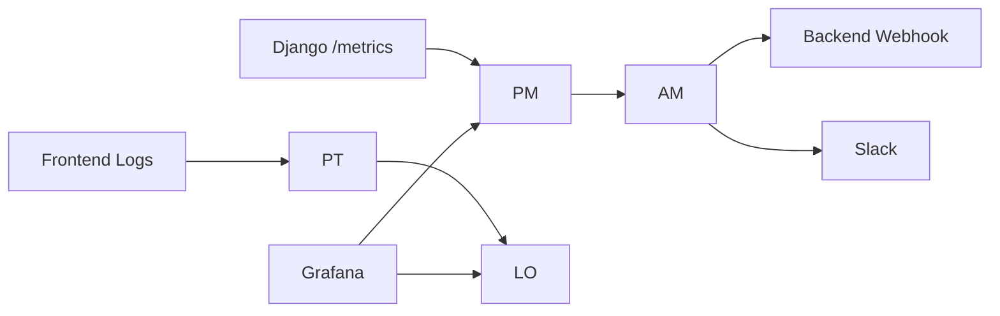

**Diagram sources**
- [metrics_endpoint.py:84-153](file://backend/django/apps/core/metrics_endpoint.py#L84-L153)
- [prometheus.yaml:57-151](file://infra/kubernetes/monitoring/prometheus.yaml#L57-L151)
- [loki.yaml:158-177](file://infra/kubernetes/logging/loki.yaml#L158-L177)
- [observability.yaml:204-293](file://infra/kubernetes/observability/observability.yaml#L204-L293)

**Section sources**
- [metrics_endpoint.py:84-153](file://backend/django/apps/core/metrics_endpoint.py#L84-L153)
- [prometheus.yaml:57-151](file://infra/kubernetes/monitoring/prometheus.yaml#L57-L151)
- [loki.yaml:158-177](file://infra/kubernetes/logging/loki.yaml#L158-L177)
- [observability.yaml:204-293](file://infra/kubernetes/observability/observability.yaml#L204-L293)

## Performance Considerations
- Metrics scraping interval and evaluation intervals are set to 30 seconds; adjust based on load and cardinality.
- Prometheus TSDB retention is 15 days; ensure sufficient storage and consider downsampling for long-term trends.
- Loki retention is 31 days with compaction; monitor disk usage and tune retention/delete delay.
- Frontend alert thresholds prioritize user impact (error rate > 1%, 5xx spikes, LCP budget); align dashboards and runbooks accordingly.
- Use histogram buckets appropriate for expected latencies; avoid excessive label cardinality in custom metrics.

[No sources needed since this section provides general guidance]

## Troubleshooting Guide
- Metrics endpoint returns 403:
  - Verify client IP is in allowlist or disable strict mode in development; confirm bearer token if required.
  - Check logs for “Metrics access denied” messages.
- No metrics scraped:
  - Confirm pod annotations enable scraping and correct path/port; verify Prometheus job relabel configs.
  - Ensure service endpoints exist and are reachable.
- High error rate alert (P0):
  - Correlate with Loki logs filtered by service and level; use requestId to trace requests.
  - Review 5xx spike rules and backend logs for root cause.
- Auth service down:
  - Check probe_success metrics and health endpoints; validate upstream availability.
- Conversion drop (P1):
  - Inspect commerce conversion metrics vs yesterday; investigate funnel steps and payment events.
- Booking failures (P1):
  - Filter logs for booking-related errors; analyze failure patterns and retry behavior.
- LCP budget regression (P2):
  - Review Web Vitals metrics; identify heavy assets and optimize bundles.
- Bundle size over budget (P2):
  - Investigate route bundles; apply code splitting and tree-shaking.
- Dependency advisories (P3):
  - Address high-severity findings promptly; maintain security hygiene.

**Section sources**
- [metrics_endpoint.py:95-129](file://backend/django/apps/core/metrics_endpoint.py#L95-L129)
- [prometheus.yaml:100-151](file://infra/kubernetes/monitoring/prometheus.yaml#L100-L151)
- [alert-rules.yml:18-144](file://frontend/apps/template-renderer/observability/alert-rules.yml#L18-L144)
- [OBSERVABILITY.md:70-105](file://frontend/apps/template-renderer/OBSERVABILITY.md#L70-L105)

## Conclusion
JOL-HUB’s observability stack integrates application metrics, structured logs, and infrastructure telemetry into a cohesive system. Prometheus collects and evaluates metrics; Grafana visualizes them; Loki centralizes logs; AlertManager routes alerts to operational channels. The frontend observability package ensures safe, structured logging and performance insights. Together, these components enable proactive monitoring, rapid incident response, and continuous performance optimization across the platform.

[No sources needed since this section summarizes without analyzing specific files]