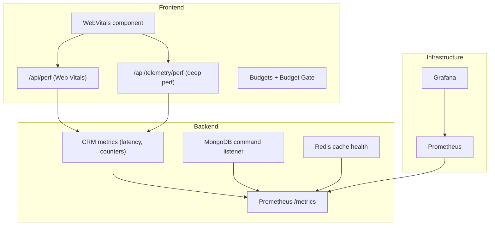
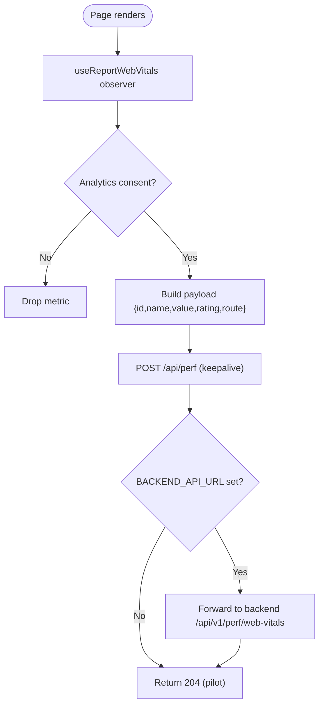
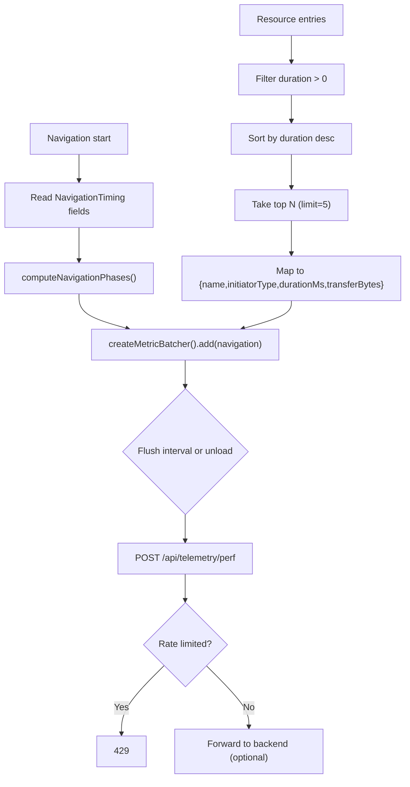
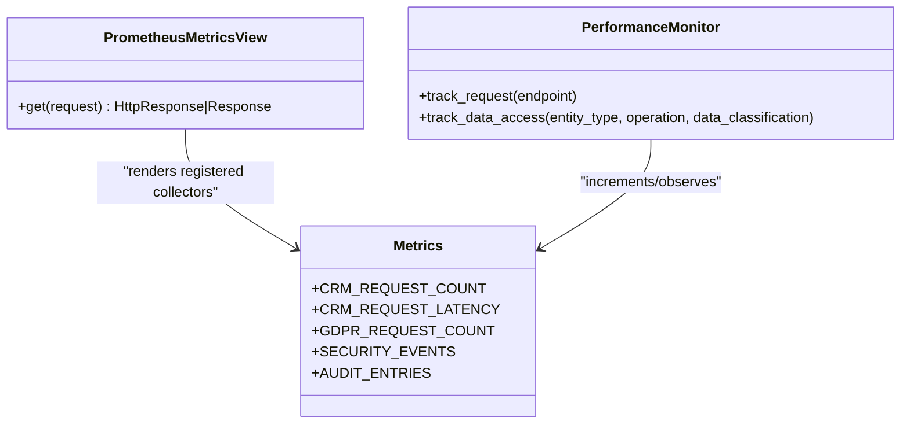
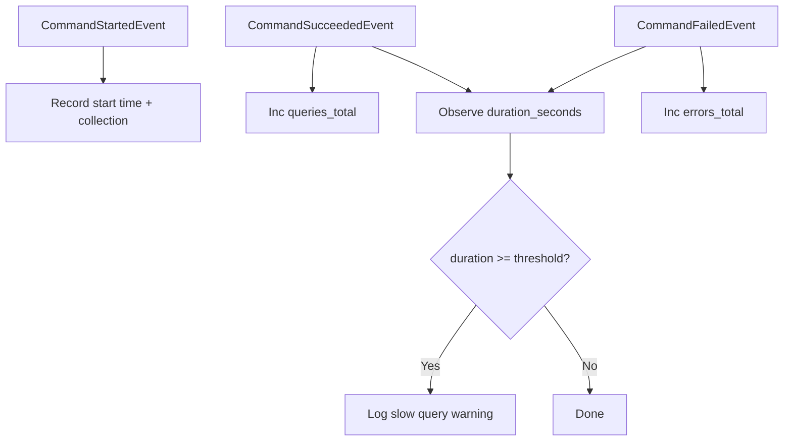
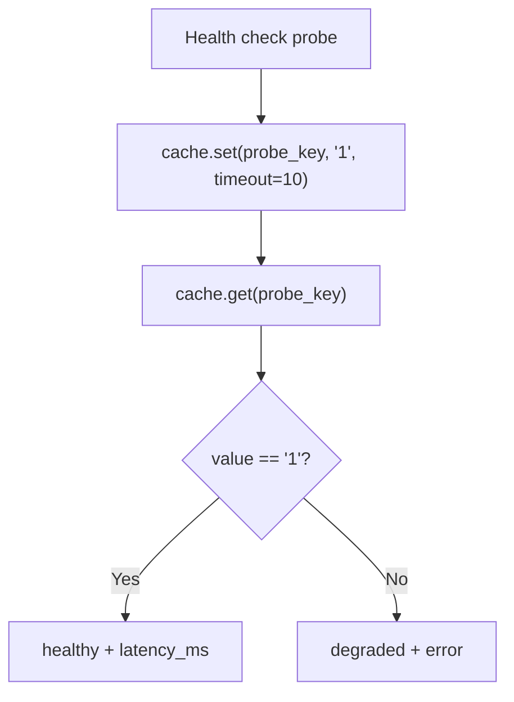
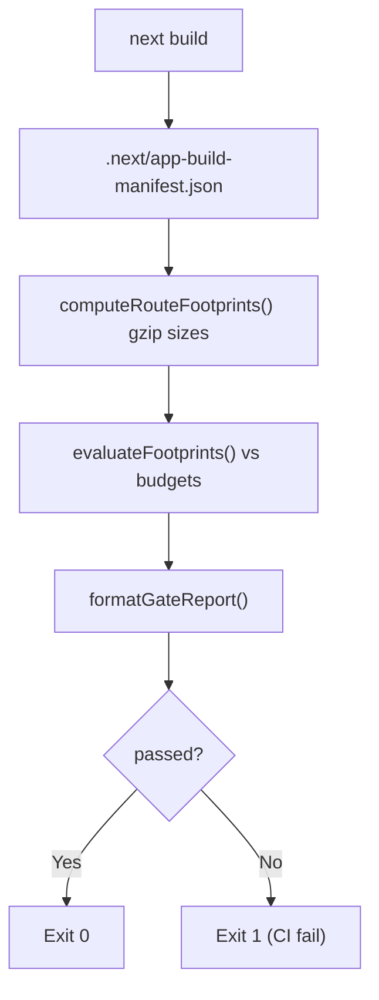
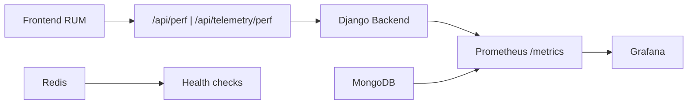

# Performance Monitoring & Web Vitals

<cite>
**Referenced Files in This Document**
- [WebVitals.tsx](file://frontend/apps/template-renderer/src/components/WebVitals.tsx)
- [route.ts (Web Vitals ingress)](file://frontend/apps/template-renderer/src/app/api/perf/route.ts)
- [performance.ts](file://frontend/packages/observability/src/performance.ts)
- [route.ts (Deep perf telemetry ingress)](file://frontend/apps/template-renderer/src/app/api/telemetry/perf/route.ts)
- [budget.json](file://frontend/apps/template-renderer/budget.json)
- [lighthouserc.js](file://frontend/apps/template-renderer/lighthouserc.js)
- [measure.ts](file://frontend/packages/perf/src/measure.ts)
- [report.ts](file://frontend/packages/perf/src/report.ts)
- [check-perf-budget.ts](file://frontend/apps/template-renderer/scripts/check-perf-budget.ts)
- [metrics_endpoint.py](file://backend/django/apps/core/metrics_endpoint.py)
- [metrics.py](file://backend/django/apps/crm/observability/metrics.py)
- [mongodb.py](file://backend/django/apps/core/mongodb.py)
- [base.py](file://backend/django/core/settings/base.py)
- [prometheus.yaml](file://infra/kubernetes/monitoring/prometheus.yaml)
- [grafana.yaml](file://infra/kubernetes/monitoring/grafana.yaml)
</cite>

## Table of Contents
1. Introduction
2. Project Structure
3. Core Components
4. Architecture Overview
5. Detailed Component Analysis
6. Dependency Analysis
7. Performance Considerations
8. Troubleshooting Guide
9. Conclusion
10. Appendices

## Introduction
This document explains how JOL-HUB monitors performance and user experience across the frontend and backend. It covers:
- Web Vitals and Core Web Vitals tracking (LCP, FID/INP, CLS, TTFB, FCP) with consent-gated Real User Monitoring (RUM).
- Deep client performance metrics (navigation phases, slow resources, API latency sampling).
- Backend performance metrics (API response times, database query performance, cache health).
- Performance budgets enforced in CI and offline builds.
- Profiling techniques, bottleneck identification, and optimization strategies.
- Examples for setting up budgets, monitoring regressions, and analyzing UX metrics to improve site performance.

## Project Structure
Performance monitoring spans three layers:
- Frontend RUM and budgets: Next.js components and routes collect and forward metrics; Lighthouse and offline budget checks enforce size and timing budgets.
- Backend observability: Prometheus metrics are exposed via a secured endpoint; MongoDB and cache health are instrumented.
- Infrastructure: Prometheus scrapes application metrics; Grafana visualizes dashboards.



**Diagram sources**
- [WebVitals.tsx:1-58](file://frontend/apps/template-renderer/src/components/WebVitals.tsx#L1-L58)
- [route.ts (Web Vitals ingress):1-62](file://frontend/apps/template-renderer/src/app/api/perf/route.ts#L1-L62)
- [route.ts (Deep perf telemetry ingress):1-85](file://frontend/apps/template-renderer/src/app/api/telemetry/perf/route.ts#L1-L85)
- [metrics_endpoint.py:1-154](file://backend/django/apps/core/metrics_endpoint.py#L1-L154)
- [metrics.py:1-478](file://backend/django/apps/crm/observability/metrics.py#L1-L478)
- [mongodb.py:43-224](file://backend/django/apps/core/mongodb.py#L43-L224)
- [prometheus.yaml:51-152](file://infra/kubernetes/monitoring/prometheus.yaml#L51-L152)
- [grafana.yaml:1-413](file://infra/kubernetes/monitoring/grafana.yaml#L1-L413)

**Section sources**
- [WebVitals.tsx:1-58](file://frontend/apps/template-renderer/src/components/WebVitals.tsx#L1-L58)
- [route.ts (Web Vitals ingress):1-62](file://frontend/apps/template-renderer/src/app/api/perf/route.ts#L1-L62)
- [performance.ts:1-133](file://frontend/packages/observability/src/performance.ts#L1-L133)
- [route.ts (Deep perf telemetry ingress):1-85](file://frontend/apps/template-renderer/src/app/api/telemetry/perf/route.ts#L1-L85)
- [budget.json:1-26](file://frontend/apps/template-renderer/budget.json#L1-L26)
- [lighthouserc.js:1-75](file://frontend/apps/template-renderer/lighthouserc.js#L1-L75)
- [metrics_endpoint.py:1-154](file://backend/django/apps/core/metrics_endpoint.py#L1-L154)
- [metrics.py:1-478](file://backend/django/apps/crm/observability/metrics.py#L1-L478)
- [mongodb.py:43-224](file://backend/django/apps/core/mongodb.py#L43-L224)
- [prometheus.yaml:51-152](file://infra/kubernetes/monitoring/prometheus.yaml#L51-L152)
- [grafana.yaml:1-413](file://infra/kubernetes/monitoring/grafana.yaml#L1-L413)

## Core Components
- Client-side Web Vitals RUM: Collects Core Web Vitals and posts them to a same-origin ingress after analytics consent.
- Deep performance telemetry: Captures navigation phase timings, slow resources, and API latency samples with batching.
- Backend metrics: Prometheus-compatible endpoint exposing request latency histograms, counters, and resource-specific metrics.
- Database observability: MongoDB command listener records durations, errors, and pool status.
- Cache health: Redis connectivity and latency checks integrated into health probes.
- Performance budgets: Lighthouse CI and offline build gates enforce transfer-size and timing budgets.

**Section sources**
- [WebVitals.tsx:1-58](file://frontend/apps/template-renderer/src/components/WebVitals.tsx#L1-L58)
- [performance.ts:1-133](file://frontend/packages/observability/src/performance.ts#L1-L133)
- [metrics_endpoint.py:1-154](file://backend/django/apps/core/metrics_endpoint.py#L1-L154)
- [metrics.py:1-478](file://backend/django/apps/crm/observability/metrics.py#L1-L478)
- [mongodb.py:43-224](file://backend/django/apps/core/mongodb.py#L43-L224)
- [lighthouserc.js:1-75](file://frontend/apps/template-renderer/lighthouserc.js#L1-L75)
- [check-perf-budget.ts:1-93](file://frontend/apps/template-renderer/scripts/check-perf-budget.ts#L1-L93)

## Architecture Overview
The system captures user experience metrics at the edge and correlates them with backend performance signals.

```mermaid
sequenceDiagram
participant U as "User Browser"
participant FE as "Next.js App"
participant RUM as "/api/perf"
participant DEP as "/api/telemetry/perf"
participant BE as "Backend API"
participant PM as "Prometheus"
participant GF as "Grafana"
U->>FE : Page load
FE->>FE : useReportWebVitals()
FE->>RUM : POST {name,value,rating,route}
RUM-->>FE : 204 (pilot or forwarded)
FE->>DEP : POST batch {navigation,resources}
DEP-->>FE : 204 (forwarded or dropped)
Note over FE,RUM : Consent-gated; fire-and-forget
BE->>PM : Scrape /metrics
PM->>GF : Query time series
GF-->>U : Dashboards (API latency, CWV trends)
```

**Diagram sources**
- [WebVitals.tsx:1-58](file://frontend/apps/template-renderer/src/components/WebVitals.tsx#L1-L58)
- [route.ts (Web Vitals ingress):1-62](file://frontend/apps/template-renderer/src/app/api/perf/route.ts#L1-L62)
- [route.ts (Deep perf telemetry ingress):1-85](file://frontend/apps/template-renderer/src/app/api/telemetry/perf/route.ts#L1-L85)
- [metrics_endpoint.py:1-154](file://backend/django/apps/core/metrics_endpoint.py#L1-L154)
- [prometheus.yaml:51-152](file://infra/kubernetes/monitoring/prometheus.yaml#L51-L152)
- [grafana.yaml:1-413](file://infra/kubernetes/monitoring/grafana.yaml#L1-L413)

## Detailed Component Analysis

### Web Vitals RUM (Core Web Vitals)
- Collects LCP, INP/FID, CLS, TTFB, FCP using Next’s web-vitals integration.
- Sends metrics only after analytics consent is granted; payloads contain no personal data.
- Posts to a same-origin route that forwards to the backend when configured; otherwise returns 204 in pilot mode.



**Diagram sources**
- [WebVitals.tsx:1-58](file://frontend/apps/template-renderer/src/components/WebVitals.tsx#L1-L58)
- [route.ts (Web Vitals ingress):1-62](file://frontend/apps/template-renderer/src/app/api/perf/route.ts#L1-L62)

**Section sources**
- [WebVitals.tsx:1-58](file://frontend/apps/template-renderer/src/components/WebVitals.tsx#L1-L58)
- [route.ts (Web Vitals ingress):1-62](file://frontend/apps/template-renderer/src/app/api/perf/route.ts#L1-L62)

### Deep Performance Telemetry (Navigation Phases, Slow Resources, API Latency)
- Computes navigation phase timings (DNS/TCP/SSL/TTFB/download) from Navigation Timing Level 2.
- Identifies slowest resources by duration and transfer size, stripping identifiers to avoid PII.
- Batches samples and flushes on interval or page unload; rate-limited at ingress.



**Diagram sources**
- [performance.ts:1-133](file://frontend/packages/observability/src/performance.ts#L1-L133)
- [route.ts (Deep perf telemetry ingress):1-85](file://frontend/apps/template-renderer/src/app/api/telemetry/perf/route.ts#L1-L85)

**Section sources**
- [performance.ts:1-133](file://frontend/packages/observability/src/performance.ts#L1-L133)
- [route.ts (Deep perf telemetry ingress):1-85](file://frontend/apps/template-renderer/src/app/api/telemetry/perf/route.ts#L1-L85)

### Backend Performance Metrics (API Response Times, Counters, Gauges)
- Exposes a Prometheus-compatible /metrics endpoint with IP allowlist and optional bearer token.
- Tracks CRM request counts and latencies, GDPR request metrics, security events, audit entries, and Bitrix24 sync operations.
- Provides a PerformanceMonitor decorator to wrap endpoints and record latency/counters.



**Diagram sources**
- [metrics_endpoint.py:1-154](file://backend/django/apps/core/metrics_endpoint.py#L1-L154)
- [metrics.py:1-478](file://backend/django/apps/crm/observability/metrics.py#L1-L478)

**Section sources**
- [metrics_endpoint.py:1-154](file://backend/django/apps/core/metrics_endpoint.py#L1-L154)
- [metrics.py:1-478](file://backend/django/apps/crm/observability/metrics.py#L1-L478)

### Database Query Performance (MongoDB)
- A PyMongo CommandListener records started/succeeded/failed commands and maps them to Prometheus metrics:
  - Duration histogram with fine-grained buckets around the slow-query threshold.
  - Total queries counter per command/collection/database.
  - Error counter per error code.
  - Pool active/available gauges per server.
- Logs warnings for slow queries exceeding a configurable threshold.



**Diagram sources**
- [mongodb.py:43-224](file://backend/django/apps/core/mongodb.py#L43-L224)

**Section sources**
- [mongodb.py:43-224](file://backend/django/apps/core/mongodb.py#L43-L224)

### Cache Health and Utilization
- Redis configuration includes connection pooling, timeouts, compression, and key prefix/versioning.
- Health checks perform a set/get round-trip to validate availability and measure latency.
- CloudWatch alarms monitor ElastiCache memory usage thresholds.



**Diagram sources**
- [base.py:392-420](file://backend/django/core/settings/base.py#L392-L420)
- [health.py:156-195](file://backend/django/apps/core/health.py#L156-L195)

**Section sources**
- [base.py:392-420](file://backend/django/core/settings/base.py#L392-L420)
- [health.py:156-195](file://backend/django/apps/core/health.py#L156-L195)

### Performance Budgets and CI Gates
- Central budget file defines resource size and timing budgets for all routes.
- Lighthouse CI enforces score floors and Core Web Vitals limits against a production-like build.
- Offline budget gate measures real gzipped first-load sizes from .next output without a browser and fails the build if budgets are exceeded.



**Diagram sources**
- [budget.json:1-26](file://frontend/apps/template-renderer/budget.json#L1-L26)
- [lighthouserc.js:1-75](file://frontend/apps/template-renderer/lighthouserc.js#L1-L75)
- [measure.ts:1-81](file://frontend/packages/perf/src/measure.ts#L1-L81)
- [report.ts:1-97](file://frontend/packages/perf/src/report.ts#L1-L97)
- [check-perf-budget.ts:1-93](file://frontend/apps/template-renderer/scripts/check-perf-budget.ts#L1-L93)

**Section sources**
- [budget.json:1-26](file://frontend/apps/template-renderer/budget.json#L1-L26)
- [lighthouserc.js:1-75](file://frontend/apps/template-renderer/lighthouserc.js#L1-L75)
- [measure.ts:1-81](file://frontend/packages/perf/src/measure.ts#L1-L81)
- [report.ts:1-97](file://frontend/packages/perf/src/report.ts#L1-L97)
- [check-perf-budget.ts:1-93](file://frontend/apps/template-renderer/scripts/check-perf-budget.ts#L1-L93)

## Dependency Analysis
- Frontend RUM depends on Next’s web-vitals integration and a consent mechanism; it forwards to a local ingress which may proxy to the backend.
- Backend metrics depend on prometheus_client and are exposed through a secured Django view.
- MongoDB metrics depend on PyMongo’s monitoring interface and settings for slow-query thresholds.
- Prometheus scrapes Kubernetes pods annotated for metrics and static targets for exporters; Grafana consumes Prometheus data.



**Diagram sources**
- [WebVitals.tsx:1-58](file://frontend/apps/template-renderer/src/components/WebVitals.tsx#L1-L58)
- [route.ts (Web Vitals ingress):1-62](file://frontend/apps/template-renderer/src/app/api/perf/route.ts#L1-L62)
- [route.ts (Deep perf telemetry ingress):1-85](file://frontend/apps/template-renderer/src/app/api/telemetry/perf/route.ts#L1-L85)
- [metrics_endpoint.py:1-154](file://backend/django/apps/core/metrics_endpoint.py#L1-L154)
- [mongodb.py:43-224](file://backend/django/apps/core/mongodb.py#L43-L224)
- [prometheus.yaml:51-152](file://infra/kubernetes/monitoring/prometheus.yaml#L51-L152)
- [grafana.yaml:1-413](file://infra/kubernetes/monitoring/grafana.yaml#L1-L413)

**Section sources**
- [prometheus.yaml:51-152](file://infra/kubernetes/monitoring/prometheus.yaml#L51-L152)
- [grafana.yaml:1-413](file://infra/kubernetes/monitoring/grafana.yaml#L1-L413)

## Performance Considerations
- Prefer lazy loading and code splitting to reduce initial JS/CSS footprint; enforce budgets in CI to prevent regressions.
- Use the deep telemetry to identify slow network phases (DNS/TCP/SSL) and heavy resources; optimize assets and caching accordingly.
- Monitor MongoDB slow queries and adjust indexes; watch pool utilization to avoid contention.
- Tune Redis timeouts and pool sizes based on observed latency and throughput.
- Keep RUM payloads small and consent-gated; rely on batching to minimize overhead.

[No sources needed since this section provides general guidance]

## Troubleshooting Guide
- RUM not sending:
  - Verify analytics consent is stored and read correctly.
  - Confirm /api/perf and /api/telemetry/perf return 204 and are reachable.
  - If forwarding to backend, ensure BACKEND_API_URL and token are set.
- High API latency:
  - Inspect CRM_REQUEST_LATENCY histogram and CRM_REQUEST_COUNT labels for hot endpoints.
  - Correlate with MongoDB duration histograms and error counters to find slow or failing queries.
- Budget failures:
  - Review the offline budget gate report to identify routes exceeding JS/CSS budgets.
  - Use Lighthouse CI reports to pinpoint timing regressions (FCP/LCP/CLS/TBT/interactive).
- Cache issues:
  - Check health probe latency and status; verify Redis connectivity and timeouts.

**Section sources**
- [WebVitals.tsx:1-58](file://frontend/apps/template-renderer/src/components/WebVitals.tsx#L1-L58)
- [route.ts (Web Vitals ingress):1-62](file://frontend/apps/template-renderer/src/app/api/perf/route.ts#L1-L62)
- [route.ts (Deep perf telemetry ingress):1-85](file://frontend/apps/template-renderer/src/app/api/telemetry/perf/route.ts#L1-L85)
- [metrics.py:1-478](file://backend/django/apps/crm/observability/metrics.py#L1-L478)
- [mongodb.py:43-224](file://backend/django/apps/core/mongodb.py#L43-L224)
- [check-perf-budget.ts:1-93](file://frontend/apps/template-renderer/scripts/check-perf-budget.ts#L1-L93)

## Conclusion
JOL-HUB implements a comprehensive performance monitoring strategy:
- Consent-gated Web Vitals and deep telemetry capture real-user experience.
- Backend metrics expose API latency, database performance, and cache health.
- Budget enforcement in CI and offline builds prevents regressions.
- Prometheus and Grafana provide actionable insights to optimize performance continuously.

[No sources needed since this section summarizes without analyzing specific files]

## Appendices

### Setting Up Performance Budgets
- Define budgets in the central budget file for resource sizes and timing metrics.
- Run Lighthouse CI to assert Core Web Vitals and category scores.
- Add the offline budget gate to your pipeline to fail builds when JS/CSS budgets are exceeded.

**Section sources**
- [budget.json:1-26](file://frontend/apps/template-renderer/budget.json#L1-L26)
- [lighthouserc.js:1-75](file://frontend/apps/template-renderer/lighthouserc.js#L1-L75)
- [check-perf-budget.ts:1-93](file://frontend/apps/template-renderer/scripts/check-perf-budget.ts#L1-L93)

### Monitoring Performance Regressions
- Track p95 API response time and Core Web Vitals distributions in Grafana.
- Alert on spikes in MongoDB slow queries and error rates.
- Watch cache health latency and Redis memory usage alarms.

**Section sources**
- [grafana.yaml:1-413](file://infra/kubernetes/monitoring/grafana.yaml#L1-L413)
- [mongodb.py:43-224](file://backend/django/apps/core/mongodb.py#L43-L224)

### Analyzing User Experience Metrics
- Use navigation phase timings to detect DNS/TCP/SSL bottlenecks.
- Identify slow resources by initiator type and transfer size to prioritize optimization.
- Correlate RUM data with backend latency to isolate client vs server causes.

**Section sources**
- [performance.ts:1-133](file://frontend/packages/observability/src/performance.ts#L1-L133)
- [route.ts (Deep perf telemetry ingress):1-85](file://frontend/apps/template-renderer/src/app/api/telemetry/perf/route.ts#L1-L85)