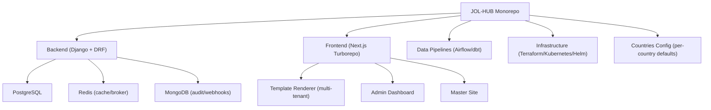
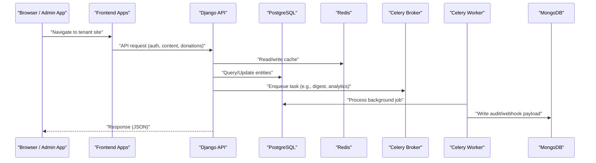
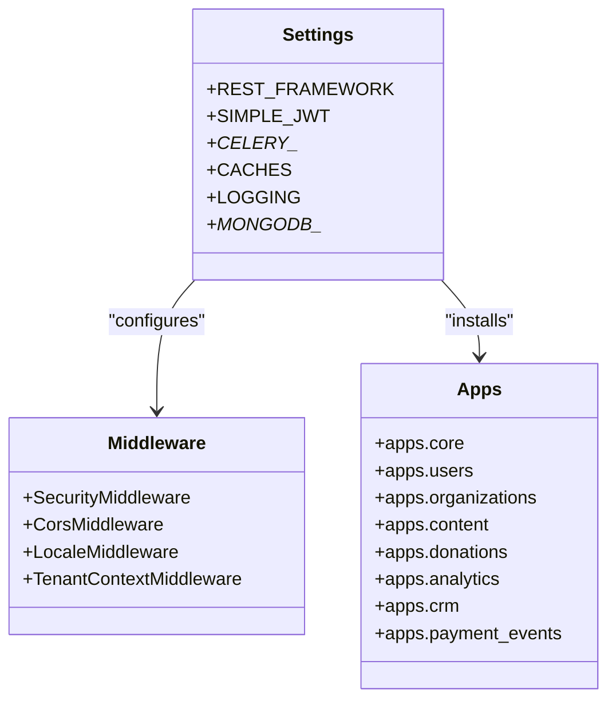
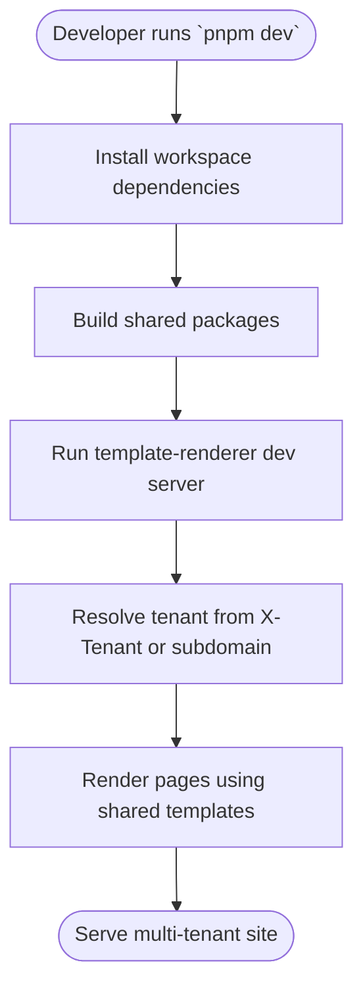
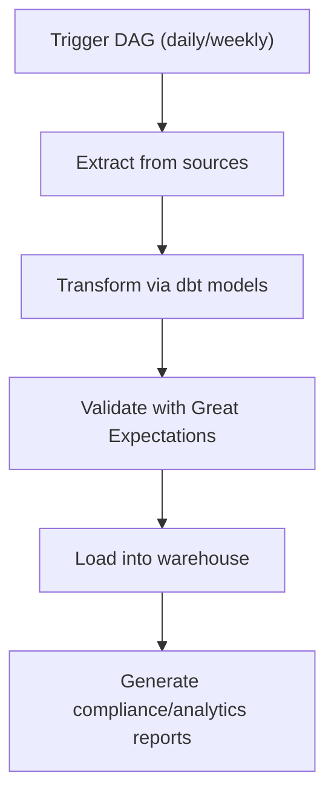
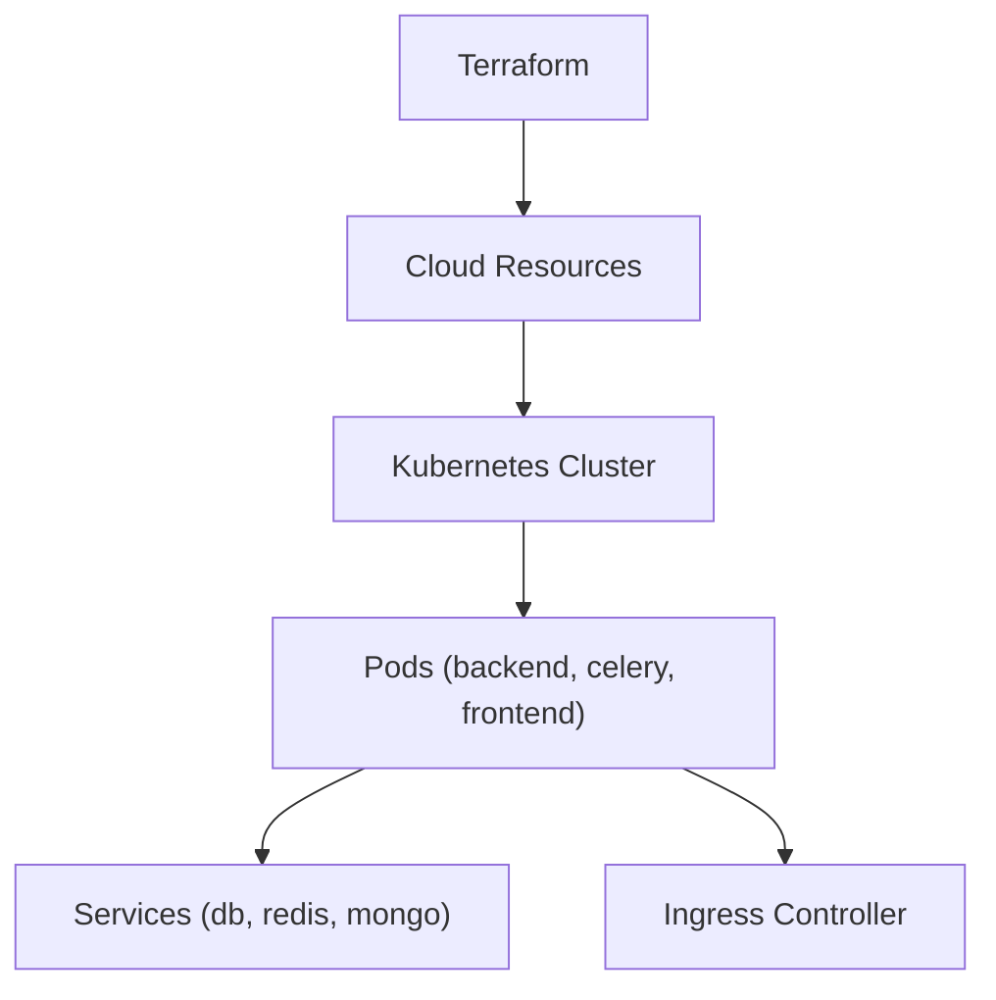
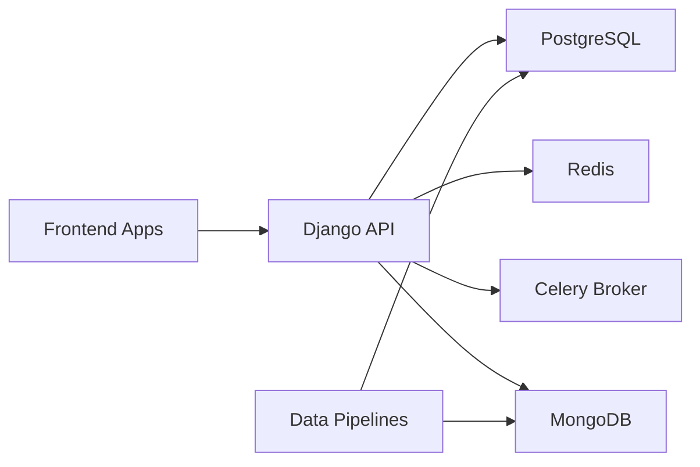

# Project Overview & Getting Started

<cite>
**Referenced Files in This Document**
- [README.md](file://README.md)
- [docker-compose.yml](file://docker-compose.yml)
- [backend/django/core/settings/base.py](file://backend/django/core/settings/base.py)
- [backend/django/core/settings/development.py](file://backend/django/core/settings/development.py)
- [backend/requirements.txt](file://backend/requirements.txt)
- [frontend/README.md](file://frontend/README.md)
- [frontend/package.json](file://frontend/package.json)
- [data/README.md](file://data/README.md)
- [data/.envrc.example](file://data/.envrc.example)
- [CONTRIBUTING.md](file://CONTRIBUTING.md)
</cite>

## Table of Contents
1. [Introduction](#introduction)
2. [Project Structure](#project-structure)
3. [Core Components](#core-components)
4. [Architecture Overview](#architecture-overview)
5. [Detailed Component Analysis](#detailed-component-analysis)
6. [Dependency Analysis](#dependency-analysis)
7. [Performance Considerations](#performance-considerations)
8. [Troubleshooting Guide](#troubleshooting-guide)
9. [Conclusion](#conclusion)
10. [Appendices](#appendices)

## Introduction
JOL-HUB is a multi-tenant website publishing platform designed for religious institutions across 27+ EU countries, serving approximately 400,000 tenant websites. It provides white-label capabilities for Catholic ministries, funeral services, cemetery care, memorial marketplaces, and religious communities. The platform combines a Django-based backend API, a modern frontend monorepo with Next.js apps, data pipelines for ETL and analytics, and infrastructure-as-code for deployment and observability.

This guide explains the platform’s purpose, architecture, prerequisites, local development setup (including SSH key configuration and environment variables), and step-by-step instructions to run the platform using Docker Compose. It also includes conceptual overviews for beginners and technical details for experienced developers.

## Project Structure
The repository is a monorepo that coordinates multiple subsystems:
- Backend APIs and business logic under backend/
- Frontend applications (admin dashboard, master site, template renderer) under frontend/
- Data pipelines, dbt models, Airflow DAGs, and quality checks under data/
- Infrastructure code (Terraform, Kubernetes, Helm) under infra/
- Country-specific configurations and examples under countries/
- Documentation, decisions, and compliance artifacts under docs/

**Diagram sources**
- [README.md:52-81](file://README.md#L52-L81)
- [docker-compose.yml:15-148](file://docker-compose.yml#L15-L148)
- [frontend/README.md:5-21](file://frontend/README.md#L5-L21)

**Section sources**
- [README.md:33-81](file://README.md#L33-L81)
- [frontend/README.md:5-21](file://frontend/README.md#L5-L21)

## Core Components
- Backend (Django + DRF): REST APIs, authentication (JWT), caching (Redis), background tasks (Celery), and integrations (Bitrix24).
- Frontend (Next.js Turborepo): Multi-tenant rendering via a single template-renderer app; admin dashboard for platform operations; marketing master site.
- Data Pipelines: Airflow DAGs and dbt models for country sync, entity import, donation analytics, GDPR reporting, and data quality checks.
- Infrastructure: Terraform modules for cloud resources; Kubernetes manifests and Helm charts for orchestration; CI/CD workflows.
- Countries: Per-country configuration files for compliance, liturgical calendars, SEO, and taxonomy.

Key responsibilities:
- Multi-tenancy: Tenant resolution via headers/subdomains; per-tenant isolation at data and UI layers.
- Compliance: Built-in rate limiting, audit logging, retention policies, and GDPR utilities.
- Observability: Prometheus metrics endpoints, structured logging, and health checks.

**Section sources**
- [backend/django/core/settings/base.py:278-327](file://backend/django/core/settings/base.py#L278-L327)
- [backend/django/core/settings/base.py:357-386](file://backend/django/core/settings/base.py#L357-L386)
- [backend/django/core/settings/base.py:688-725](file://backend/django/core/settings/base.py#L688-L725)
- [frontend/README.md:23-43](file://frontend/README.md#L23-L43)
- [data/README.md:21-63](file://data/README.md#L21-L63)

## Architecture Overview
Conceptually, requests flow from the frontend to the backend API, which interacts with PostgreSQL for relational data, Redis for caching and Celery broker, and MongoDB for high-volume documents (webhooks, audit logs). Background jobs are scheduled via Celery Beat and executed by workers. Data pipelines process and transform data for analytics and compliance reporting.

**Diagram sources**
- [docker-compose.yml:15-148](file://docker-compose.yml#L15-L148)
- [backend/django/core/settings/base.py:357-386](file://backend/django/core/settings/base.py#L357-L386)
- [backend/django/core/settings/base.py:688-725](file://backend/django/core/settings/base.py#L688-L725)

## Detailed Component Analysis

### Backend (Django + DRF)
- Authentication and permissions: JWT-based auth with session support; role-based access via Django Guardian.
- API versioning and documentation: URL path versioning; OpenAPI/Swagger via drf-spectacular.
- Rate limiting: Granular throttling classes for sensitive endpoints (auth, GDPR export/delete, donations).
- Caching: Redis-backed cache with compression and connection pooling.
- Background jobs: Celery worker and beat scheduler for periodic tasks (digests, recurring donations, cleanup).
- Storage: Static files via WhiteNoise; media storage configured for external providers.
- Security: CSRF, HSTS, secure cookies, CORS policy, and strict allowed hosts.

**Diagram sources**
- [backend/django/core/settings/base.py:46-119](file://backend/django/core/settings/base.py#L46-L119)
- [backend/django/core/settings/base.py:121-145](file://backend/django/core/settings/base.py#L121-L145)
- [backend/django/core/settings/base.py:278-327](file://backend/django/core/settings/base.py#L278-L327)
- [backend/django/core/settings/base.py:357-386](file://backend/django/core/settings/base.py#L357-L386)

**Section sources**
- [backend/django/core/settings/base.py:278-327](file://backend/django/core/settings/base.py#L278-L327)
- [backend/django/core/settings/base.py:357-386](file://backend/django/core/settings/base.py#L357-L386)
- [backend/django/core/settings/base.py:439-513](file://backend/django/core/settings/base.py#L439-L513)
- [backend/django/core/settings/base.py:519-577](file://backend/django/core/settings/base.py#L519-L577)

### Frontend (Next.js Turborepo)
- Apps:
  - template-renderer: Serves all tenant sites via dynamic routes and tenant resolution (X-Tenant header or subdomain).
  - admin-dashboard: Platform administration (compliance, tenants, audit).
  - master-site: Public marketing site.
- Packages: Shared libraries for auth, Bitrix SDK, i18n, seed-data, tenant-resolver, UI components.
- Commands: pnpm workspace scripts for build, dev, type-check, tests, e2e, and compliance checks.

**Diagram sources**
- [frontend/README.md:5-21](file://frontend/README.md#L5-L21)
- [frontend/README.md:23-43](file://frontend/README.md#L23-L43)
- [frontend/package.json:11-37](file://frontend/package.json#L11-L37)

**Section sources**
- [frontend/README.md:5-21](file://frontend/README.md#L5-L21)
- [frontend/README.md:23-43](file://frontend/README.md#L23-L43)
- [frontend/package.json:11-37](file://frontend/package.json#L11-L37)

### Data Pipelines (Airflow + dbt)
- Airflow DAGs: Daily sync, weekly reporting, GDPR cleanup, hub ETL.
- dbt models: Staging and marts for donations, users, GDPR reports, and canonical compliance.
- Quality checks: Great Expectations checkpoints and expectations for entity completeness and consent validation.
- Usage: CLI commands to trigger DAGs, generate compliance reports, and validate data quality.

**Diagram sources**
- [data/README.md:21-63](file://data/README.md#L21-L63)

**Section sources**
- [data/README.md:21-63](file://data/README.md#L21-L63)

### Infrastructure (Terraform + Kubernetes + Helm)
- Terraform modules: Database, ECS/EKS, ElastiCache, logging, monitoring, security, storage, VPC.
- Kubernetes: Base configs, app deployments (backend, celery, database, frontend), networking (ingress, vertical router), observability, security policies.
- Helm: Chart for jol-hub with values for environment-specific overrides.

**Diagram sources**
- [infra/terraform/main.tf:290-325](file://infra/terraform/main.tf#L290-L325)

**Section sources**
- [infra/terraform/main.tf:290-325](file://infra/terraform/main.tf#L290-L325)

## Dependency Analysis
- Backend depends on:
  - PostgreSQL for relational data
  - Redis for caching and Celery broker
  - MongoDB for high-volume documents (webhooks, audit logs)
  - Celery for background tasks and scheduling
  - DRF and JWT for API and authentication
- Frontend depends on:
  - Node.js 20.x and pnpm workspace
  - Turborepo for builds and parallel tasks
  - Shared packages (auth, tenant-resolver, i18n, UI)
- Data layer depends on:
  - Airflow for orchestration
  - dbt for SQL transformations
  - Great Expectations for data quality

**Diagram sources**
- [docker-compose.yml:15-148](file://docker-compose.yml#L15-L148)
- [backend/django/core/settings/base.py:357-386](file://backend/django/core/settings/base.py#L357-L386)
- [backend/django/core/settings/base.py:688-725](file://backend/django/core/settings/base.py#L688-L725)

**Section sources**
- [backend/requirements.txt:8-66](file://backend/requirements.txt#L8-L66)
- [frontend/package.json:1-10](file://frontend/package.json#L1-L10)
- [data/README.md:21-63](file://data/README.md#L21-L63)

## Performance Considerations
- Use Redis caching for frequent reads and session storage; tune pool sizes and timeouts.
- Configure Celery concurrency and prefetch multiplier based on workload; monitor task queues.
- Enable compression for cache responses and optimize static assets via WhiteNoise.
- Limit file upload sizes and enforce allowed extensions to prevent abuse.
- For data pipelines, schedule off-peak jobs and use incremental transforms in dbt to reduce load.

[No sources needed since this section provides general guidance]

## Troubleshooting Guide
Common issues and resolutions:
- Missing .env or incorrect credentials: Ensure DATABASE_URL, REDIS_URL, SECRET_KEY, and JWT_SECRET are set; never commit secrets.
- Database connectivity: Verify PostgreSQL container is healthy and ports mapped; check credentials match docker-compose settings.
- Redis/Celery not working: Confirm Redis is running and accessible; ensure Celery worker and beat have correct broker URL.
- MongoDB connection: Check MONGODB_URI and TLS settings; ensure MongoDB container is healthy and bound to loopback only in dev.
- Frontend dev server: Use pnpm workspace commands; ensure Node.js 20.x and pnpm are installed; run type checks and lint before building.

**Section sources**
- [docker-compose.yml:15-148](file://docker-compose.yml#L15-L148)
- [backend/django/core/settings/base.py:169-186](file://backend/django/core/settings/base.py#L169-L186)
- [backend/django/core/settings/base.py:357-386](file://backend/django/core/settings/base.py#L357-L386)
- [backend/django/core/settings/base.py:688-725](file://backend/django/core/settings/base.py#L688-L725)
- [frontend/package.json:11-37](file://frontend/package.json#L11-L37)

## Conclusion
JOL-HUB provides a robust, compliant, and scalable foundation for multi-tenant website publishing tailored to religious institutions across Europe. With a clear monorepo structure, well-defined backend and frontend components, comprehensive data pipelines, and infrastructure-as-code, teams can efficiently develop, test, and deploy features while maintaining security and compliance standards.

[No sources needed since this section summarizes without analyzing specific files]

## Appendices

### Prerequisites
- Ubuntu 24.04 LTS
- Python 3.12 (backend)
- Node.js 20.x LTS with pnpm 9+ (frontend)
- Docker 24.x and Docker Compose 2.x
- Git 2.43+ with GPG signing enabled
- IDEs: PhpStorm (monorepo), PyCharm (Python services)

**Section sources**
- [README.md:192-205](file://README.md#L192-L205)
- [CONTRIBUTING.md:9-18](file://CONTRIBUTING.md#L9-L18)

### Local Development Setup (Step-by-Step)
1. Generate an SSH key for GitHub and configure it in your SSH agent and GitHub settings.
2. Set global Git configuration (user name, email, default branch, editor).
3. Clone the repository to .
4. Create a Python virtual environment and install backend requirements.
5. Install frontend dependencies using pnpm.
6. Start the local stack with Docker Compose (PostgreSQL, Redis, MongoDB, backend, Celery worker, Celery beat).
7. Open the project in your IDE and verify services are running.

**Section sources**
- [README.md:208-277](file://README.md#L208-L277)
- [docker-compose.yml:15-148](file://docker-compose.yml#L15-L148)

### Environment Variables
- Copy the example environment file and configure required variables:
  - DATABASE_URL, REDIS_URL, SECRET_KEY, JWT_SECRET, ALLOWED_HOSTS
  - Optional: BITRIX24_WEBHOOK_URL, AI_API_KEY, DEBUG, LOG_LEVEL, COUNTRY_CODE
- Never commit .env files; use environment variables or a secrets manager.

**Section sources**
- [README.md:294-316](file://README.md#L294-L316)
- [backend/django/core/settings/base.py:28-44](file://backend/django/core/settings/base.py#L28-L44)
- [backend/django/core/settings/development.py:31-53](file://backend/django/core/settings/development.py#L31-L53)

### Running the Platform
- Start all services: docker compose up -d
- Backend API (development): source venv and run uvicorn or Django dev server
- Frontend (development): cd frontend and run pnpm dev
- Run all services via main entrypoint if applicable

**Section sources**
- [README.md:319-336](file://README.md#L319-L336)
- [docker-compose.yml:73-148](file://docker-compose.yml#L73-L148)

### Data Module Quick Start
- Activate the data virtual environment and install requirements.
- Run tests and generate ROPA reports.
- Trigger daily ETL via Airflow and validate data quality.

**Section sources**
- [data/README.md:4-19](file://data/README.md#L4-L19)
- [data/.envrc.example:1-18](file://data/.envrc.example#L1-L18)