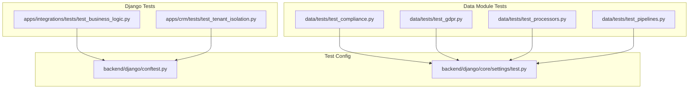
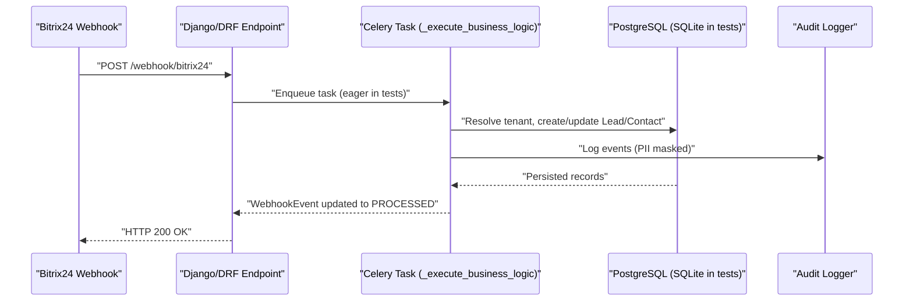
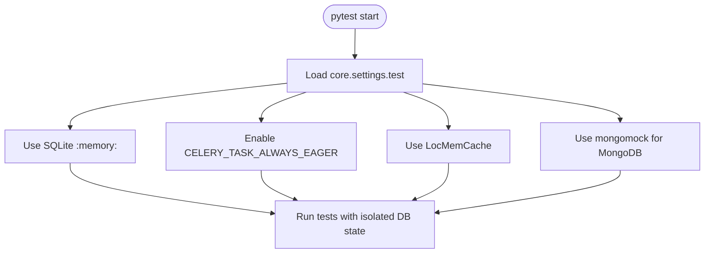
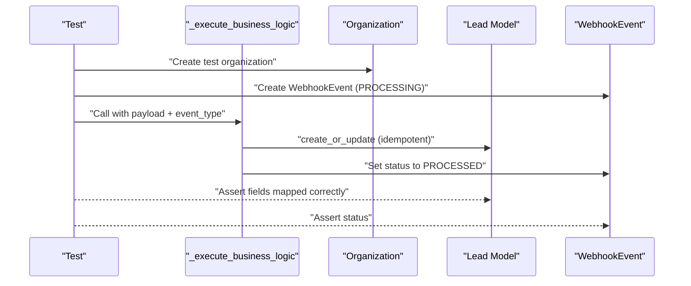
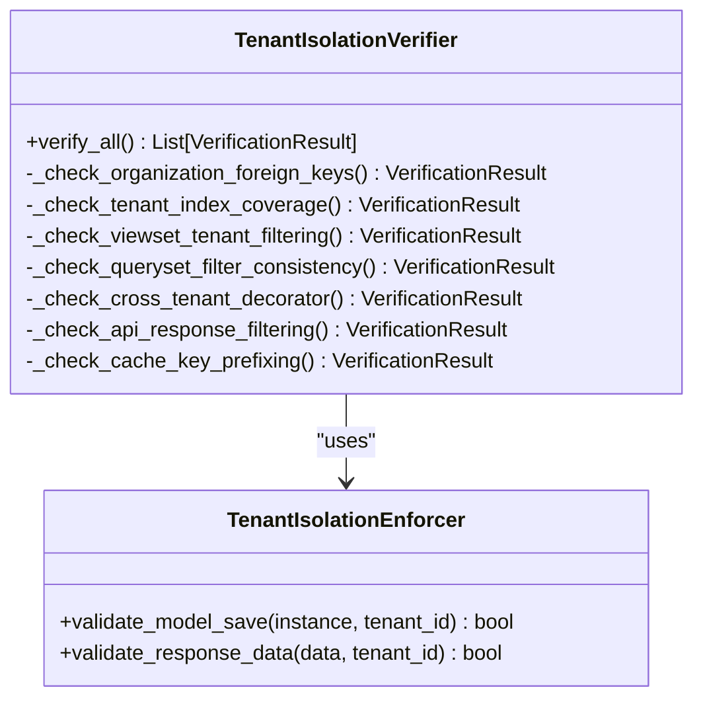
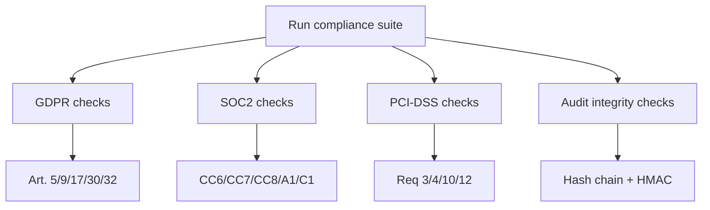
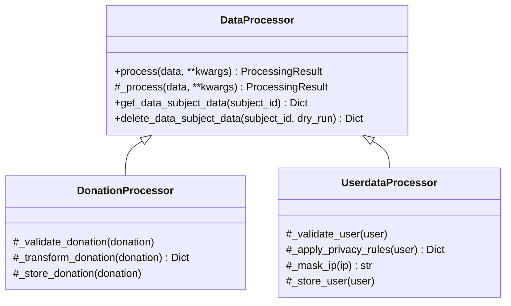
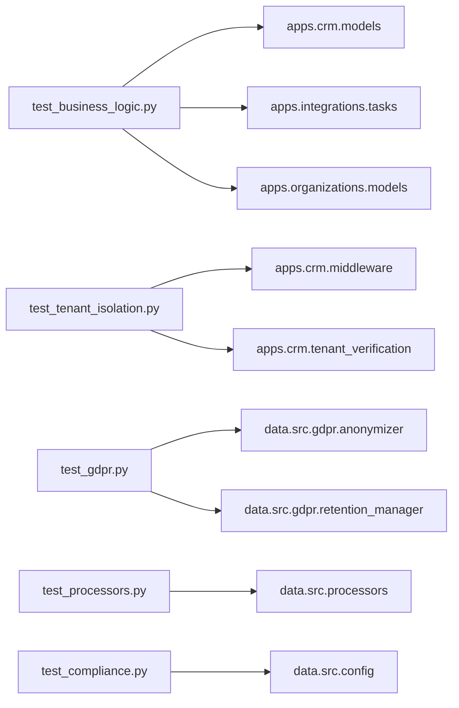

# Backend Testing (Python/Django)

<cite>
**Referenced Files in This Document**
- [conftest.py](file://backend/django/conftest.py)
- [test.py](file://backend/django/core/settings/test.py)
- [test_business_logic.py](file://backend/django/apps/integrations/tests/test_business_logic.py)
- [test_tenant_isolation.py](file://backend/django/apps/crm/tests/test_tenant_isolation.py)
- [test_compliance.py](file://data/tests/test_compliance.py)
- [test_gdpr.py](file://data/tests/test_gdpr.py)
- [test_processors.py](file://data/tests/test_processors.py)
- [test_pipelines.py](file://data/tests/test_pipelines.py)
- [anonymizer.py](file://data/src/gdpr/anonymizer.py)
- [retention_manager.py](file://data/src/gdpr/retention_manager.py)
- [processors.py](file://data/src/processors.py)
- [config.py](file://data/src/config.py)
</cite>

## Table of Contents
1. [Introduction](#introduction)
2. [Project Structure](#project-structure)
3. [Core Components](#core-components)
4. [Architecture Overview](#architecture-overview)
5. [Detailed Component Analysis](#detailed-component-analysis)
6. [Dependency Analysis](#dependency-analysis)
7. [Performance Considerations](#performance-considerations)
8. [Troubleshooting Guide](#troubleshooting-guide)
9. [Conclusion](#conclusion)
10. [Appendices](#appendices)

## Introduction
This document provides comprehensive backend testing guidance for the Django-based services in JOL-HUB. It explains how to run and structure tests using pytest, configure the test environment, and write robust unit and integration tests for models, views, serializers, and business logic. It also covers strategies for compliance checks, data pipeline validation, GDPR processing, core processors, mocking external services like Bitrix24 CRM, database testing with fixtures, transaction management, API endpoint testing, test data management, factory patterns, and multi-tenant integration scenarios.

## Project Structure
The testing surface spans two main areas:
- Django app tests under backend/django/apps/*/tests/ that exercise DRF endpoints, Celery tasks, middleware, and tenant isolation.
- Data module tests under data/tests/ that validate GDPR, processors, pipelines, and compliance rules.

**Diagram sources**
- [test_business_logic.py:1-460](file://backend/django/apps/integrations/tests/test_business_logic.py#L1-L460)
- [test_tenant_isolation.py:1-491](file://backend/django/apps/crm/tests/test_tenant_isolation.py#L1-L491)
- [test_compliance.py:1-800](file://data/tests/test_compliance.py#L1-L800)
- [test_gdpr.py:1-145](file://data/tests/test_gdpr.py#L1-L145)
- [test_processors.py:1-261](file://data/tests/test_processors.py#L1-L261)
- [test_pipelines.py:1-40](file://data/tests/test_pipelines.py#L1-L40)
- [conftest.py:1-99](file://backend/django/conftest.py#L1-L99)
- [test.py:1-125](file://backend/django/core/settings/test.py#L1-L125)

**Section sources**
- [conftest.py:1-99](file://backend/django/conftest.py#L1-L99)
- [test.py:1-125](file://backend/django/core/settings/test.py#L1-L125)

## Core Components
- Test configuration and shared fixtures:
  - Root conftest provides APIClient, RequestFactory, and Bitrix24 webhook helpers for building payloads and signatures.
  - Test settings use an in-memory SQLite database, locmem cache/email, synchronous Celery execution, and mongomock for MongoDB.
- Business logic tests:
  - Integration tests for Bitrix24 webhooks exercising lead/contact creation/update, idempotency, validation errors, PII masking, and consent handling.
- Multi-tenant isolation tests:
  - Thread-local context isolation, database-level checks, queryset filtering, API response filtering, and enforcement utilities.
- Compliance and GDPR tests:
  - Assertions over GDPR articles, SOC2 criteria, PCI-DSS requirements, audit log integrity, retention policies, k-anonymity, and ROPA generation.
- Processors and validators:
  - Unit tests for donation/user processors, validators, audit logging, and DSAR support.

**Section sources**
- [conftest.py:20-99](file://backend/django/conftest.py#L20-L99)
- [test.py:14-125](file://backend/django/core/settings/test.py#L14-L125)
- [test_business_logic.py:1-460](file://backend/django/apps/integrations/tests/test_business_logic.py#L1-L460)
- [test_tenant_isolation.py:1-491](file://backend/django/apps/crm/tests/test_tenant_isolation.py#L1-L491)
- [test_compliance.py:1-800](file://data/tests/test_compliance.py#L1-L800)
- [test_gdpr.py:1-145](file://data/tests/test_gdpr.py#L1-L145)
- [test_processors.py:1-261](file://data/tests/test_processors.py#L1-L261)
- [test_pipelines.py:1-40](file://data/tests/test_pipelines.py#L1-L40)

## Architecture Overview
End-to-end flow for a Bitrix24 webhook processed by Django:

**Diagram sources**
- [test_business_logic.py:73-134](file://backend/django/apps/integrations/tests/test_business_logic.py#L73-L134)
- [test_business_logic.py:141-199](file://backend/django/apps/integrations/tests/test_business_logic.py#L141-L199)
- [test.py:57-62](file://backend/django/core/settings/test.py#L57-L62)

## Detailed Component Analysis

### Django Test Configuration and Fixtures
- Settings:
  - In-memory SQLite, locmem cache/email, synchronous Celery, relaxed security flags, disabled logging, and mongomock for MongoDB.
- Shared fixtures:
  - APIClient and RequestFactory are provided per test.
  - Bitrix24 helpers compute HMAC signatures and build realistic webhook payloads for tests.

**Diagram sources**
- [test.py:14-125](file://backend/django/core/settings/test.py#L14-L125)

**Section sources**
- [test.py:14-125](file://backend/django/core/settings/test.py#L14-L125)
- [conftest.py:20-99](file://backend/django/conftest.py#L20-L99)

### Bitrix24 Webhook Business Logic Tests
Key coverage:
- Valid lead creation from ONCRMLEADADD payload.
- Idempotent update via ONCRMLEADUPDATE.
- Validation errors for unknown fields, missing member_id, or unknown member_id.
- PII masking in audit logs.
- Consent handling based on UF_CONSENT_GRANTED flag.

**Diagram sources**
- [test_business_logic.py:39-66](file://backend/django/apps/integrations/tests/test_business_logic.py#L39-L66)
- [test_business_logic.py:73-134](file://backend/django/apps/integrations/tests/test_business_logic.py#L73-L134)
- [test_business_logic.py:141-199](file://backend/django/apps/integrations/tests/test_business_logic.py#L141-L199)

**Section sources**
- [test_business_logic.py:73-134](file://backend/django/apps/integrations/tests/test_business_logic.py#L73-L134)
- [test_business_logic.py:141-199](file://backend/django/apps/integrations/tests/test_business_logic.py#L141-L199)
- [test_business_logic.py:206-294](file://backend/django/apps/integrations/tests/test_business_logic.py#L206-L294)
- [test_business_logic.py:301-353](file://backend/django/apps/integrations/tests/test_business_logic.py#L301-L353)
- [test_business_logic.py:360-460](file://backend/django/apps/integrations/tests/test_business_logic.py#L360-L460)

### Multi-Tenant Isolation Tests
Coverage highlights:
- Thread-local tenant context set/get/clear and thread safety.
- Database-level isolation checks (foreign keys, indexes).
- QuerySet filtering consistency and middleware presence.
- API-level cross-tenant decorator and response filtering.
- Cache key prefixing.
- Enforcer validations for model saves and responses, including nested structures.

**Diagram sources**
- [test_tenant_isolation.py:19-26](file://backend/django/apps/crm/tests/test_tenant_isolation.py#L19-L26)
- [test_tenant_isolation.py:203-290](file://backend/django/apps/crm/tests/test_tenant_isolation.py#L203-L290)
- [test_tenant_isolation.py:296-356](file://backend/django/apps/crm/tests/test_tenant_isolation.py#L296-L356)

**Section sources**
- [test_tenant_isolation.py:93-197](file://backend/django/apps/crm/tests/test_tenant_isolation.py#L93-L197)
- [test_tenant_isolation.py:203-290](file://backend/django/apps/crm/tests/test_tenant_isolation.py#L203-L290)
- [test_tenant_isolation.py:296-356](file://backend/django/apps/crm/tests/test_tenant_isolation.py#L296-L356)
- [test_tenant_isolation.py:362-407](file://backend/django/apps/crm/tests/test_tenant_isolation.py#L362-L407)
- [test_tenant_isolation.py:413-465](file://backend/django/apps/crm/tests/test_tenant_isolation.py#L413-L465)

### Compliance and GDPR Processing Tests
Highlights:
- GDPR Article assertions across lawfulness, purpose limitation, minimization, accuracy, storage limitation, special categories, erasure, records of processing activities, and security.
- SOC2 Type II criteria covering access control, system operations, change management, availability, confidentiality.
- PCI-DSS requirements for encryption at rest/transmission, audit logging, and policy existence.
- Audit log integrity checks for hash chains and HMAC signatures.
- K-anonymity implementation tests and retention manager behavior.
- ROPA generator report outputs and legal basis presence.

**Diagram sources**
- [test_compliance.py:133-357](file://data/tests/test_compliance.py#L133-L357)
- [test_compliance.py:363-617](file://data/tests/test_compliance.py#L363-L617)
- [test_compliance.py:623-711](file://data/tests/test_compliance.py#L623-L711)
- [test_gdpr.py:15-145](file://data/tests/test_gdpr.py#L15-L145)

**Section sources**
- [test_compliance.py:133-357](file://data/tests/test_compliance.py#L133-L357)
- [test_compliance.py:363-617](file://data/tests/test_compliance.py#L363-L617)
- [test_compliance.py:623-711](file://data/tests/test_compliance.py#L623-L711)
- [test_gdpr.py:15-145](file://data/tests/test_gdpr.py#L15-L145)

### Core Processors and Validators
Focus areas:
- Data classification enums and retention policies.
- Donation and user processors: validation, transformation, storage, DSAR access, and erasure with dry-run support.
- Validators for donations and users, including consent warnings and email format checks.
- Audit logger event creation and serialization.

**Diagram sources**
- [processors.py:94-221](file://data/src/processors.py#L94-L221)
- [processors.py:223-504](file://data/src/processors.py#L223-L504)
- [processors.py:506-762](file://data/src/processors.py#L506-L762)

**Section sources**
- [test_processors.py:38-89](file://data/tests/test_processors.py#L38-L89)
- [test_processors.py:91-144](file://data/tests/test_processors.py#L91-L144)
- [test_processors.py:146-188](file://data/tests/test_processors.py#L146-L188)
- [test_processors.py:190-222](file://data/tests/test_processors.py#L190-L222)
- [test_processors.py:224-257](file://data/tests/test_processors.py#L224-L257)
- [processors.py:94-221](file://data/src/processors.py#L94-L221)
- [processors.py:223-504](file://data/src/processors.py#L223-L504)
- [processors.py:506-762](file://data/src/processors.py#L506-L762)

### Pipeline and Validator Tests
- Importability of country sync templates.
- Bulk loader default configuration values.
- CSV validator schemas presence for entities like parish, donation, priest.

**Section sources**
- [test_pipelines.py:8-24](file://data/tests/test_pipelines.py#L8-L24)
- [test_pipelines.py:26-36](file://data/tests/test_pipelines.py#L26-L36)

### Mocking External Services (Bitrix24 CRM)
- Use the shared helpers in conftest to build realistic webhook payloads and compute HMAC signatures.
- In tests, assert outcomes against Django models and WebhookEvent states rather than calling the real Bitrix24 API.
- For custom integrations, prefer patching or substituting clients with unittest.mock to isolate tests.

**Section sources**
- [conftest.py:20-83](file://backend/django/conftest.py#L20-L83)
- [test_business_logic.py:73-134](file://backend/django/apps/integrations/tests/test_business_logic.py#L73-L134)

### Database Testing with Fixtures and Transactions
- Use @pytest.mark.django_db to enable transactional test databases per test.
- Create minimal fixtures (e.g., Organization) to reduce setup overhead.
- Prefer small, focused assertions on persisted records and related statuses.

**Section sources**
- [test_business_logic.py:39-66](file://backend/django/apps/integrations/tests/test_business_logic.py#L39-L66)
- [test_business_logic.py:73-134](file://backend/django/apps/integrations/tests/test_business_logic.py#L73-L134)

### API Endpoint Testing
- Use the provided APIClient fixture to issue requests to DRF endpoints.
- Validate HTTP status codes, JSON bodies, and side effects (model changes, WebhookEvent updates).
- Combine with request factories for view-level unit tests when appropriate.

**Section sources**
- [conftest.py:89-99](file://backend/django/conftest.py#L89-L99)

### Test Data Management and Factory Patterns
- Keep fixtures minimal and composable; reuse shared objects where possible.
- For complex objects, consider creating small factory functions within tests or dedicated modules to encapsulate object creation logic.
- Centralize constants (e.g., Bitrix24 secrets) in conftest to avoid duplication.

**Section sources**
- [conftest.py:20-99](file://backend/django/conftest.py#L20-L99)
- [test_business_logic.py:39-66](file://backend/django/apps/integrations/tests/test_business_logic.py#L39-L66)

### Integration Testing Approaches for Multi-Tenant Scenarios
- Verify thread-local tenant context isolation and cleanup.
- Assert database-level constraints and index coverage relevant to tenant scoping.
- Ensure QuerySets filter by tenant consistently and API responses do not leak cross-tenant data.
- Use enforcers to validate model saves and response payloads against the current tenant.

**Section sources**
- [test_tenant_isolation.py:93-197](file://backend/django/apps/crm/tests/test_tenant_isolation.py#L93-L197)
- [test_tenant_isolation.py:203-290](file://backend/django/apps/crm/tests/test_tenant_isolation.py#L203-L290)
- [test_tenant_isolation.py:296-356](file://backend/django/apps/crm/tests/test_tenant_isolation.py#L296-L356)

## Dependency Analysis
High-level dependencies among test components and production code:

**Diagram sources**
- [test_business_logic.py:17-32](file://backend/django/apps/integrations/tests/test_business_logic.py#L17-L32)
- [test_tenant_isolation.py:19-26](file://backend/django/apps/crm/tests/test_tenant_isolation.py#L19-L26)
- [test_gdpr.py:9-13](file://data/tests/test_gdpr.py#L9-L13)
- [test_processors.py:10-35](file://data/tests/test_processors.py#L10-L35)
- [test_compliance.py:141-153](file://data/tests/test_compliance.py#L141-L153)

**Section sources**
- [test_business_logic.py:17-32](file://backend/django/apps/integrations/tests/test_business_logic.py#L17-L32)
- [test_tenant_isolation.py:19-26](file://backend/django/apps/crm/tests/test_tenant_isolation.py#L19-L26)
- [test_gdpr.py:9-13](file://data/tests/test_gdpr.py#L9-L13)
- [test_processors.py:10-35](file://data/tests/test_processors.py#L10-L35)
- [test_compliance.py:141-153](file://data/tests/test_compliance.py#L141-L153)

## Performance Considerations
- The test settings use an in-memory SQLite database and locmem cache/email backends to minimize I/O overhead.
- Celery tasks run synchronously during tests to simplify assertions and avoid background job complexity.
- Logging is suppressed to reduce noise and speed up test runs.
- mongomock replaces MongoDB to avoid network calls and external service dependencies.

**Section sources**
- [test.py:14-125](file://backend/django/core/settings/test.py#L14-L125)

## Troubleshooting Guide
Common issues and resolutions:
- Missing or incorrect settings module:
  - Ensure DJANGO_SETTINGS_MODULE points to core.settings.test or pass --ds=core.settings.test to pytest.
- External service failures:
  - Use the Bitrix24 helpers in conftest to build payloads and signatures; avoid hitting the real API in tests.
- Tenant context leakage:
  - Always clear tenant context after tests that set it; verify thread-local isolation.
- Database state persistence between tests:
  - Use @pytest.mark.django_db to ensure transaction isolation per test.
- Unexpected PII in logs:
  - Confirm PII masking in audit logs; adjust masking logic if new fields are added.

**Section sources**
- [test.py:14-125](file://backend/django/core/settings/test.py#L14-L125)
- [conftest.py:20-99](file://backend/django/conftest.py#L20-L99)
- [test_tenant_isolation.py:93-197](file://backend/django/apps/crm/tests/test_tenant_isolation.py#L93-L197)
- [test_business_logic.py:301-353](file://backend/django/apps/integrations/tests/test_business_logic.py#L301-L353)

## Conclusion
JOL-HUB’s backend testing strategy combines fast, isolated Django tests with comprehensive data module tests for compliance and GDPR. Shared fixtures and helpers streamline Bitrix24 webhook testing, while multi-tenant isolation tests enforce strict boundaries. Processors and validators are covered by unit tests ensuring correctness and privacy safeguards. Adopt the patterns shown here to extend coverage confidently as the platform evolves.

## Appendices

### Running Tests
- Django tests:
  - pytest with settings: pytest --ds=core.settings.test
- Data module tests:
  - pytest data/tests/...

**Section sources**
- [test.py:1-10](file://backend/django/core/settings/test.py#L1-L10)

### Key References
- GDPR anonymization and retention:
  - K-anonymity thresholds and checks.
  - Retention rules and legal hold registry.
- Processing activities and classifications:
  - Enumerations and activity registry for GDPR Art. 30.

**Section sources**
- [anonymizer.py:25-84](file://data/src/gdpr/anonymizer.py#L25-L84)
- [anonymizer.py:106-180](file://data/src/gdpr/anonymizer.py#L106-L180)
- [retention_manager.py:78-106](file://data/src/gdpr/retention_manager.py#L78-L106)
- [retention_manager.py:109-185](file://data/src/gdpr/retention_manager.py#L109-L185)
- [config.py:12-27](file://data/src/config.py#L12-L27)
- [config.py:85-124](file://data/src/config.py#L85-L124)