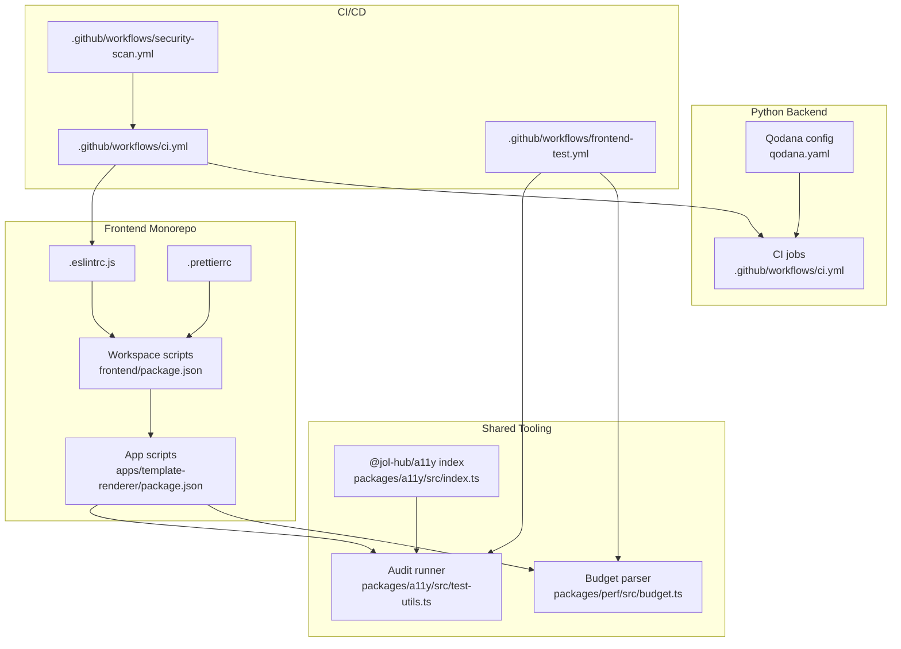
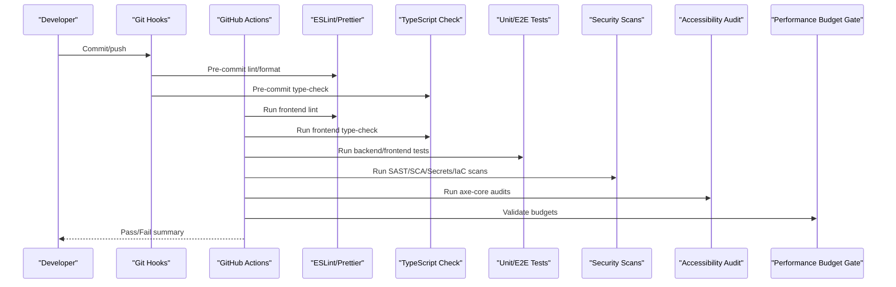
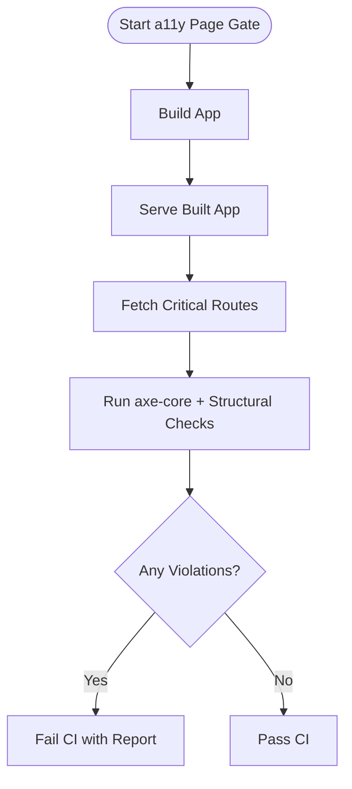
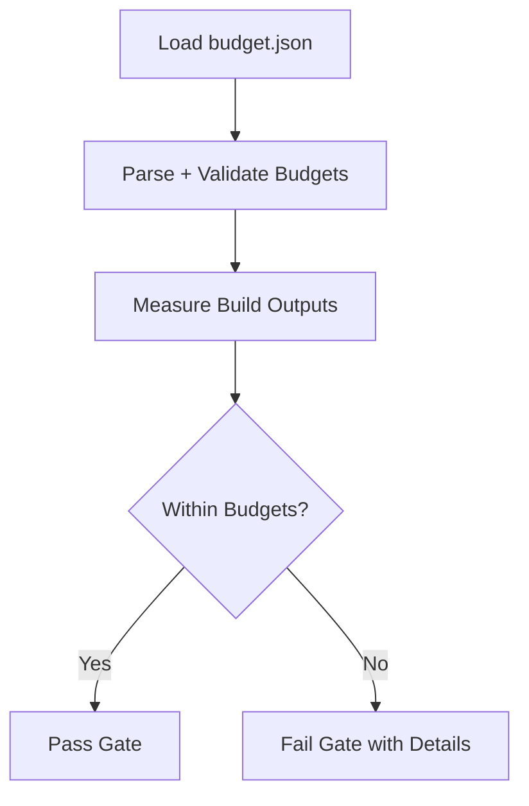
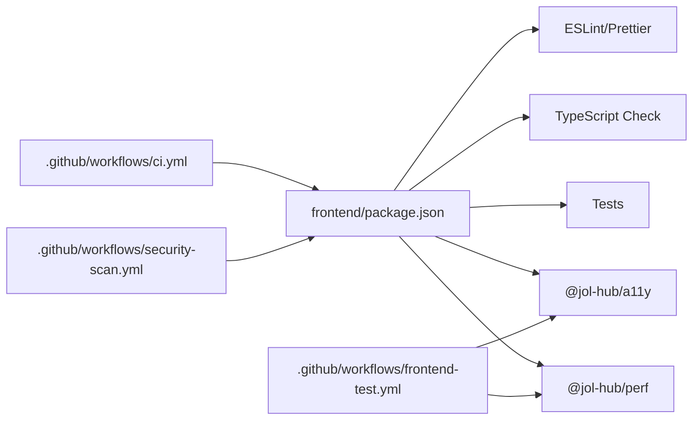

# Code Quality & Static Analysis

<cite>
**Referenced Files in This Document**
- [qodana.yaml](file://qodana.yaml)
- [.github/workflows/ci.yml](file://.github/workflows/ci.yml)
- [.github/workflows/security-scan.yml](file://.github/workflows/security-scan.yml)
- [.github/workflows/frontend-test.yml](file://.github/workflows/frontend-test.yml)
- [frontend/.eslintrc.js](file://frontend/.eslintrc.js)
- [frontend/.prettierrc](file://frontend/.prettierrc)
- [frontend/package.json](file://frontend/package.json)
- [frontend/apps/template-renderer/package.json](file://frontend/apps/template-renderer/package.json)
- [frontend/packages/a11y/src/test-utils.ts](file://frontend/packages/a11y/src/test-utils.ts)
- [frontend/packages/a11y/src/index.ts](file://frontend/packages/a11y/src/index.ts)
- [frontend/apps/template-renderer/scripts/check-a11y-pages.ts](file://frontend/apps/template-renderer/scripts/check-a11y-pages.ts)
- [frontend/packages/perf/src/budget.ts](file://frontend/packages/perf/src/budget.ts)
- [frontend/apps/admin-dashboard/scripts/compliance-audit.js](file://frontend/apps/admin-dashboard/scripts/compliance-audit.js)
</cite>

## Table of Contents
1. Introduction
2. Project Structure
3. Core Components
4. Architecture Overview
5. Detailed Component Analysis
6. Dependency Analysis
7. Performance Considerations
8. Troubleshooting Guide
9. Conclusion
10. Appendices

## Introduction
This document explains how JOL-HUB enforces code quality and static analysis across Python and TypeScript/JavaScript projects. It covers:
- Qodana configuration for Python analysis
- ESLint rules for TypeScript/JavaScript
- Prettier formatting standards
- Accessibility checking tools (WCAG 2.2 AA via axe-core)
- Automated checks in CI/CD, pre-commit hooks, and quality gates
- Custom rule configuration, performance budgeting, accessibility compliance, and security scanning

The goal is to help teams set up consistent quality checks, interpret results, and enforce standards across the monorepo.

## Project Structure
Quality and static analysis are enforced at multiple layers:
- Root-level Qodana configuration for Python analysis
- Frontend ESLint and Prettier configuration for TS/JS
- GitHub Actions workflows orchestrating linting, type-checking, testing, security scans, and accessibility checks
- Shared packages providing reusable tooling (e.g., a11y audit runner, performance budget parser)

**Diagram sources**
- [qodana.yaml:1-50](file://qodana.yaml#L1-L50)
- [.github/workflows/ci.yml:36-95](file://.github/workflows/ci.yml#L36-L95)
- [.github/workflows/ci.yml:179-239](file://.github/workflows/ci.yml#L179-L239)
- [.github/workflows/security-scan.yml:35-103](file://.github/workflows/security-scan.yml#L35-L103)
- [.github/workflows/frontend-test.yml:97-127](file://.github/workflows/frontend-test.yml#L97-L127)
- [frontend/.eslintrc.js:1-81](file://frontend/.eslintrc.js#L1-L81)
- [frontend/.prettierrc:1-14](file://frontend/.prettierrc#L1-L14)
- [frontend/package.json:11-37](file://frontend/package.json#L11-L37)
- [frontend/apps/template-renderer/package.json:6-20](file://frontend/apps/template-renderer/package.json#L6-L20)
- [frontend/packages/a11y/src/index.ts:1-28](file://frontend/packages/a11y/src/index.ts#L1-L28)
- [frontend/packages/a11y/src/test-utils.ts:1-135](file://frontend/packages/a11y/src/test-utils.ts#L1-L135)
- [frontend/packages/perf/src/budget.ts:1-77](file://frontend/packages/perf/src/budget.ts#L1-L77)

**Section sources**
- [qodana.yaml:1-50](file://qodana.yaml#L1-L50)
- [.github/workflows/ci.yml:36-95](file://.github/workflows/ci.yml#L36-L95)
- [.github/workflows/ci.yml:179-239](file://.github/workflows/ci.yml#L179-L239)
- [.github/workflows/security-scan.yml:35-103](file://.github/workflows/security-scan.yml#L35-L103)
- [.github/workflows/frontend-test.yml:97-127](file://.github/workflows/frontend-test.yml#L97-L127)
- [frontend/.eslintrc.js:1-81](file://frontend/.eslintrc.js#L1-L81)
- [frontend/.prettierrc:1-14](file://frontend/.prettierrc#L1-L14)
- [frontend/package.json:11-37](file://frontend/package.json#L11-L37)
- [frontend/apps/template-renderer/package.json:6-20](file://frontend/apps/template-renderer/package.json#L6-L20)
- [frontend/packages/a11y/src/index.ts:1-28](file://frontend/packages/a11y/src/index.ts#L1-L28)
- [frontend/packages/a11y/src/test-utils.ts:1-135](file://frontend/packages/a11y/src/test-utils.ts#L1-L135)
- [frontend/packages/perf/src/budget.ts:1-77](file://frontend/packages/perf/src/budget.ts#L1-L77)

## Core Components
- Qodana (Python): Defines profile and optional thresholds; currently configured with a starter profile and a PHP linter image placeholder. Use this as the anchor for Python SAST in CI when ready.
- ESLint (TypeScript/JavaScript): Centralized ruleset enforcing strict TypeScript practices, React best practices, import hygiene, and general style preferences. Integrates with Prettier.
- Prettier: Enforces consistent formatting across TS/JS/JSON/MD with Tailwind plugin support.
- Accessibility (a11y package): Provides WCAG 2.2 AA auditing using axe-core with jsdom-based page/component audits and structural checkers (headings, alt text, focus order, form labels, ARIA usage).
- Performance budgets: Validates Lighthouse-style budgets to gate builds on resource size and timing metrics.
- CI/CD pipelines: Orchestrate linting, type checks, tests, security scans, and accessibility gates.

How to use these components:
- Run local checks via workspace scripts (lint, format, type-check, test, a11y, perf).
- Rely on CI jobs to fail builds on violations.
- Extend rules by editing ESLint config or adding custom checks in shared packages.

**Section sources**
- [qodana.yaml:1-50](file://qodana.yaml#L1-L50)
- [frontend/.eslintrc.js:1-81](file://frontend/.eslintrc.js#L1-L81)
- [frontend/.prettierrc:1-14](file://frontend/.prettierrc#L1-L14)
- [frontend/packages/a11y/src/index.ts:1-28](file://frontend/packages/a11y/src/index.ts#L1-L28)
- [frontend/packages/perf/src/budget.ts:1-77](file://frontend/packages/perf/src/budget.ts#L1-L77)
- [.github/workflows/ci.yml:36-95](file://.github/workflows/ci.yml#L36-L95)
- [.github/workflows/ci.yml:179-239](file://.github/workflows/ci.yml#L179-L239)
- [.github/workflows/frontend-test.yml:97-127](file://.github/workflows/frontend-test.yml#L97-L127)

## Architecture Overview
The quality pipeline integrates static analysis, testing, security, and accessibility into a cohesive flow that blocks merges when critical issues are found.

**Diagram sources**
- [.github/workflows/ci.yml:36-95](file://.github/workflows/ci.yml#L36-L95)
- [.github/workflows/ci.yml:179-239](file://.github/workflows/ci.yml#L179-L239)
- [.github/workflows/security-scan.yml:35-103](file://.github/workflows/security-scan.yml#L35-L103)
- [.github/workflows/frontend-test.yml:97-127](file://.github/workflows/frontend-test.yml#L97-L127)
- [frontend/package.json:11-37](file://frontend/package.json#L11-L37)

## Detailed Component Analysis

### Qodana Configuration (Python)
- Profile: Uses a starter profile suitable for initial adoption.
- Thresholds: Optional severity thresholds and coverage thresholds can be enabled to fail CI when limits are exceeded.
- Linter image: Currently points to a PHP image; update to a Python-compatible image when integrating Python SAST.

Recommendations:
- Enable severity thresholds to block merges on critical issues.
- Add bootstrap steps to install Python dependencies before analysis.
- Align Qodana rules with existing backend lint/type checks to avoid duplication.

**Section sources**
- [qodana.yaml:1-50](file://qodana.yaml#L1-L50)

### ESLint Rules (TypeScript/JavaScript)
- Extends recommended configs for core, TypeScript, React, React Hooks, and imports.
- Parser: TypeScript with JSX enabled.
- Key rules:
  - Warn on unused variables and explicit any; discourage non-null assertions.
  - Enforce React hooks rules and disable PropTypes in favor of TypeScript.
  - Import ordering disabled; duplicates and unresolved imports warned.
  - General: prefer const, no var, strict equality, limited console usage.

Customization tips:
- Tighten rules gradually (e.g., enable explicit function return types).
- Add project-specific rules under rules section.
- Keep ignorePatterns aligned with build artifacts and generated files.

**Section sources**
- [frontend/.eslintrc.js:1-81](file://frontend/.eslintrc.js#L1-L81)

### Prettier Formatting Standards
- Style: Semicolons, single quotes, 2-space indent, ES5 trailing commas, print width 100, bracket spacing, arrow parens always, LF line endings.
- Tailwind integration via plugin for class sorting.

Usage:
- Format all staged files via lint-staged in the workspace root.
- Enforce formatting in CI via format:check.

**Section sources**
- [frontend/.prettierrc:1-14](file://frontend/.prettierrc#L1-L14)
- [frontend/package.json:57-65](file://frontend/package.json#L57-L65)

### Accessibility Checking Tools (WCAG 2.2 AA)
- The a11y package provides:
  - axe-core configuration and jsdom-based audit runner
  - Structural checkers for headings, alt text, focus order, form labels, ARIA usage
  - Utilities to assert clean audits in CI

Workflow:
- Build the app, serve it locally, then run page audits against critical routes.
- Fail CI if any violations are detected.

**Diagram sources**
- [frontend/apps/template-renderer/scripts/check-a11y-pages.ts:68-101](file://frontend/apps/template-renderer/scripts/check-a11y-pages.ts#L68-L101)
- [frontend/packages/a11y/src/test-utils.ts:1-135](file://frontend/packages/a11y/src/test-utils.ts#L1-L135)

**Section sources**
- [frontend/packages/a11y/src/index.ts:1-28](file://frontend/packages/a11y/src/index.ts#L1-L28)
- [frontend/packages/a11y/src/test-utils.ts:1-135](file://frontend/packages/a11y/src/test-utils.ts#L1-L135)
- [frontend/apps/template-renderer/scripts/check-a11y-pages.ts:68-101](file://frontend/apps/template-renderer/scripts/check-a11y-pages.ts#L68-L101)
- [.github/workflows/frontend-test.yml:97-127](file://.github/workflows/frontend-test.yml#L97-L127)

### Performance Budgeting
- Budget file parsing validates Lighthouse-style budgets for resource sizes and timing metrics.
- CI runs a performance gate that fails if budgets are exceeded.

**Diagram sources**
- [frontend/packages/perf/src/budget.ts:1-77](file://frontend/packages/perf/src/budget.ts#L1-L77)
- [.github/workflows/frontend-test.yml:69-93](file://.github/workflows/frontend-test.yml#L69-L93)

**Section sources**
- [frontend/packages/perf/src/budget.ts:1-77](file://frontend/packages/perf/src/budget.ts#L1-L77)
- [.github/workflows/frontend-test.yml:69-93](file://.github/workflows/frontend-test.yml#L69-L93)

### Security Scanning and Compliance
- Secret detection: Gitleaks and TruffleHog scan history and diffs.
- SAST: Bandit and Semgrep for Python; Semgrep for TypeScript/React/Next.js.
- SCA: Safety and pip-audit for Python; pnpm audit and Snyk for Node.
- Container scanning: Trivy filesystem scans for backend and frontend directories.
- IaC scanning: Checkov and Terrascan for Terraform/Docker/Kubernetes.
- CodeQL: Security and quality queries for Python and JavaScript/TypeScript.

Interpretation:
- Review SARIF reports in the Security tab.
- Treat CRITICAL/HIGH findings as blockers until remediated.

**Section sources**
- [.github/workflows/security-scan.yml:35-103](file://.github/workflows/security-scan.yml#L35-L103)
- [.github/workflows/security-scan.yml:105-141](file://.github/workflows/security-scan.yml#L105-L141)
- [.github/workflows/security-scan.yml:147-231](file://.github/workflows/security-scan.yml#L147-L231)
- [.github/workflows/security-scan.yml:237-302](file://.github/workflows/security-scan.yml#L237-L302)
- [.github/workflows/security-scan.yml:315-344](file://.github/workflows/security-scan.yml#L315-L344)

### Pre-commit Hooks and Local Enforcement
- Workspace includes Husky and lint-staged to auto-run ESLint and Prettier on staged files.
- Recommended additions:
  - Add mypy/black/isort checks for Python changes
  - Add a11y and perf budget checks for affected apps
  - Ensure hooks run consistently across OS environments

**Section sources**
- [frontend/package.json:23-23](file://frontend/package.json#L23-L23)
- [frontend/package.json:57-65](file://frontend/package.json#L57-L65)

### Interpreting Analysis Results
- Linting/formatting: Fix warnings/errors reported by ESLint/Prettier; use --fix where applicable.
- Type checking: Resolve TypeScript errors surfaced by tsc.
- Tests: Address failing unit/integration/e2e tests; add missing cases for new logic.
- Security: Triage SARIF findings; prioritize CRITICAL/HIGH; suppress only with justification.
- Accessibility: Fix WCAG violations; re-run page/component audits to confirm fixes.
- Performance: Reduce bundle size or adjust budgets with evidence and approval.

**Section sources**
- [.github/workflows/ci.yml:36-95](file://.github/workflows/ci.yml#L36-L95)
- [.github/workflows/ci.yml:179-239](file://.github/workflows/ci.yml#L179-L239)
- [.github/workflows/security-scan.yml:35-103](file://.github/workflows/security-scan.yml#L35-L103)
- [.github/workflows/frontend-test.yml:97-127](file://.github/workflows/frontend-test.yml#L97-L127)

## Dependency Analysis
Quality tooling depends on:
- Workspace scripts to orchestrate per-app tasks
- Shared packages for a11y and perf
- CI workflows to execute checks consistently

**Diagram sources**
- [frontend/package.json:11-37](file://frontend/package.json#L11-L37)
- [.github/workflows/ci.yml:179-239](file://.github/workflows/ci.yml#L179-L239)
- [.github/workflows/security-scan.yml:35-103](file://.github/workflows/security-scan.yml#L35-L103)
- [.github/workflows/frontend-test.yml:97-127](file://.github/workflows/frontend-test.yml#L97-L127)

**Section sources**
- [frontend/package.json:11-37](file://frontend/package.json#L11-L37)
- [.github/workflows/ci.yml:179-239](file://.github/workflows/ci.yml#L179-L239)
- [.github/workflows/security-scan.yml:35-103](file://.github/workflows/security-scan.yml#L35-L103)
- [.github/workflows/frontend-test.yml:97-127](file://.github/workflows/frontend-test.yml#L97-L127)

## Performance Considerations
- Cache dependencies in CI (pnpm cache) to speed up runs.
- Parallelize independent jobs (lint, type-check, tests, security).
- Limit full-page a11y audits to critical routes to balance cost and coverage.
- Use budget validation to prevent regressions early.
- Avoid running heavy scans on every PR; schedule nightly for broad coverage.

[No sources needed since this section provides general guidance]

## Troubleshooting Guide
Common issues and resolutions:
- ESLint failures:
  - Update rules incrementally; fix violations flagged by the report.
  - Ensure ignorePatterns exclude generated/build artifacts.
- Prettier mismatches:
  - Run formatter on staged files; ensure editor settings match .prettierrc.
- Type errors:
  - Resolve TypeScript errors; consider enabling stricter options over time.
- Accessibility violations:
  - Follow WCAG guidance; re-run audits after fixes.
- Performance budget failures:
  - Analyze bundle composition; reduce third-party payloads; adjust budgets with team agreement.
- Security findings:
  - Prioritize CRITICAL/HIGH; validate false positives; document exceptions.

**Section sources**
- [frontend/.eslintrc.js:1-81](file://frontend/.eslintrc.js#L1-L81)
- [frontend/.prettierrc:1-14](file://frontend/.prettierrc#L1-L14)
- [frontend/packages/a11y/src/test-utils.ts:1-135](file://frontend/packages/a11y/src/test-utils.ts#L1-L135)
- [frontend/packages/perf/src/budget.ts:1-77](file://frontend/packages/perf/src/budget.ts#L1-L77)
- [.github/workflows/security-scan.yml:35-103](file://.github/workflows/security-scan.yml#L35-L103)

## Conclusion
JOL-HUB implements a comprehensive quality and static analysis strategy:
- Python: Qodana-ready with extensible thresholds and profiles
- TypeScript/JavaScript: Strong ESLint rules and consistent Prettier formatting
- Accessibility: WCAG 2.2 AA audits integrated into CI
- Performance: Budget validation to guard bundle size and timing
- Security: Multi-layered scanning (SAST, SCA, secrets, containers, IaC, CodeQL)
Adopting these practices ensures consistent code quality, safer releases, and accessible user experiences across the monorepo.

[No sources needed since this section summarizes without analyzing specific files]

## Appendices

### How to Set Up Automated Code Quality Checks
- Backend (Python):
  - Install and run Black, isort, flake8, pylint, and mypy locally and in CI.
  - Optionally integrate Qodana with a Python-compatible image and enable thresholds.
- Frontend (TypeScript/JavaScript):
  - Run ESLint and Prettier via workspace scripts; enforce in CI.
  - Run TypeScript checks and tests; publish coverage.
- Accessibility:
  - Build and serve the app; run page/component audits; fail CI on violations.
- Security:
  - Run secret detection, SAST/SCA, container scans, and IaC scans in CI.

**Section sources**
- [.github/workflows/ci.yml:36-95](file://.github/workflows/ci.yml#L36-L95)
- [.github/workflows/ci.yml:179-239](file://.github/workflows/ci.yml#L179-L239)
- [.github/workflows/security-scan.yml:35-103](file://.github/workflows/security-scan.yml#L35-L103)
- [.github/workflows/frontend-test.yml:97-127](file://.github/workflows/frontend-test.yml#L97-L127)

### Configuring Custom Rules
- ESLint:
  - Add or override rules under the rules section in the root ESLint config.
  - Create plugins or shareable configs for team-wide standards.
- Prettier:
  - Adjust options in .prettierrc; add plugins as needed.
- Qodana:
  - Include/exclude inspections and set severity thresholds to tailor Python analysis.

**Section sources**
- [frontend/.eslintrc.js:37-70](file://frontend/.eslintrc.js#L37-L70)
- [frontend/.prettierrc:1-14](file://frontend/.prettierrc#L1-L14)
- [qodana.yaml:12-46](file://qodana.yaml#L12-L46)

### Setting Up Pre-commit Hooks
- Use Husky and lint-staged to run ESLint and Prettier on staged files.
- Add Python checks (black/isort/flake8/mypy) for backend changes.
- Ensure hooks are cross-platform compatible and fast.

**Section sources**
- [frontend/package.json:23-23](file://frontend/package.json#L23-L23)
- [frontend/package.json:57-65](file://frontend/package.json#L57-L65)

### Integrating Quality Gates in CI/CD
- Block merges on failed lint/type-check/tests/security/a11y/perf gates.
- Publish reports (coverage, SARIF) for traceability.
- Use job summaries to highlight failures quickly.

**Section sources**
- [.github/workflows/ci.yml:347-379](file://.github/workflows/ci.yml#L347-L379)
- [.github/workflows/security-scan.yml:350-379](file://.github/workflows/security-scan.yml#L350-L379)
- [.github/workflows/frontend-test.yml:192-208](file://.github/workflows/frontend-test.yml#L192-L208)

### Maintaining Consistent Code Style Across Python and TypeScript
- Python:
  - Enforce Black formatting, isort import ordering, flake8 style, and mypy typing.
- TypeScript/JavaScript:
  - Enforce ESLint rules and Prettier formatting across all apps and packages.
- Documentation:
  - Share style guides and examples; review PRs for adherence.

**Section sources**
- [.github/workflows/ci.yml:36-95](file://.github/workflows/ci.yml#L36-L95)
- [frontend/.eslintrc.js:1-81](file://frontend/.eslintrc.js#L1-L81)
- [frontend/.prettierrc:1-14](file://frontend/.prettierrc#L1-L14)