# Data Pipeline Testing

<cite>
**Referenced Files in This Document**
- [jol_daily_sync.py](file://data/airflow/dags/jol_daily_sync.py)
- [jol_hub_etl.py](file://data/airflow/dags/jol_hub_etl.py)
- [jol_operators.py](file://data/airflow/plugins/jol_operators.py)
- [lt_sync.py](file://data/src/pipelines/country_sync/lt_sync.py)
- [template_sync.py](file://data/src/pipelines/country_sync/template_sync.py)
- [bulk_loader.py](file://data/src/pipelines/entity_import/bulk_loader.py)
- [processors.py](file://data/src/processors.py)
- [entity_completeness.py](file://data/src/quality/expectations/entity_completeness.py)
- [gdpr_consent_validation.py](file://data/src/quality/expectations/gdpr_consent_validation.py)
- [test_pipelines.py](file://data/tests/test_pipelines.py)
- [test_gdpr.py](file://data/tests/test_gdpr.py)
- [test_compliance.py](file://data/tests/test_compliance.py)
- [test_dependency_guard.py](file://data/tests/test_dependency_guard.py)
</cite>

## Table of Contents
1. Introduction
2. Project Structure
3. Core Components
4. Architecture Overview
5. Detailed Component Analysis
6. Dependency Analysis
7. Performance Considerations
8. Troubleshooting Guide
9. Conclusion

## Introduction
This document provides comprehensive testing guidance for Apache Airflow DAGs and data processing scripts in the JOL-HUB project. It focuses on ETL pipeline testing, data transformation validation, dependency management, country synchronization processes, entity import workflows, and data quality checks. It also covers test data generation strategies, mocking external sources, integration testing for multi-step workflows, error handling and retry logic, and performance monitoring.

## Project Structure
The data layer is organized around:
- Airflow DAGs that orchestrate daily ETL and GDPR-related tasks
- Country-specific sync pipelines with a reusable template
- Entity import bulk loader with progress tracking and rollback
- Data processors implementing GDPR rights (access, erasure, portability)
- Quality expectations for entity completeness and consent validation
- A robust test suite covering pipelines, GDPR compliance, and dependency guards

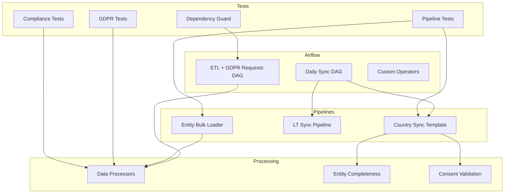

**Diagram sources**
- [jol_daily_sync.py:83-126](file://data/airflow/dags/jol_daily_sync.py#L83-L126)
- [jol_hub_etl.py:73-113](file://data/airflow/dags/jol_hub_etl.py#L73-L113)
- [jol_operators.py:10-34](file://data/airflow/plugins/jol_operators.py#L10-L34)
- [template_sync.py:49-163](file://data/src/pipelines/country_sync/template_sync.py#L49-L163)
- [lt_sync.py:48-207](file://data/src/pipelines/country_sync/lt_sync.py#L48-L207)
- [bulk_loader.py:72-320](file://data/src/pipelines/entity_import/bulk_loader.py#L72-L320)
- [processors.py:94-762](file://data/src/processors.py#L94-L762)
- [entity_completeness.py:81-189](file://data/src/quality/expectations/entity_completeness.py#L81-L189)
- [gdpr_consent_validation.py:52-211](file://data/src/quality/expectations/gdpr_consent_validation.py#L52-L211)
- [test_pipelines.py:8-39](file://data/tests/test_pipelines.py#L8-L39)
- [test_gdpr.py:15-145](file://data/tests/test_gdpr.py#L15-L145)
- [test_compliance.py:133-800](file://data/tests/test_compliance.py#L133-L800)
- [test_dependency_guard.py:36-68](file://data/tests/test_dependency_guard.py#L36-L68)

**Section sources**
- [jol_daily_sync.py:83-126](file://data/airflow/dags/jol_daily_sync.py#L83-L126)
- [jol_hub_etl.py:73-113](file://data/airflow/dags/jol_hub_etl.py#L73-L113)
- [test_pipelines.py:8-39](file://data/tests/test_pipelines.py#L8-L39)

## Core Components
- Airflow DAGs: Daily sync across EU countries, donation aggregation, retention cleanup, and compliance reporting; separate DAG for GDPR data subject requests.
- Custom operators: GDPR-compliant operator wrapping PythonOperator to enforce audit logging and PII masking in logs.
- Country sync pipelines: Reusable template and Lithuania implementation with fetch, validate, transform, load steps and k-anonymization for donations.
- Entity import bulk loader: Batched imports with progress tracking, validation, anonymization, rollback, and audit logging.
- Data processors: Donation and Userdata processors implementing GDPR Art. 15/17/20 with database interactions and audit trails.
- Quality expectations: Entity completeness rules and GDPR consent validation with batch support and compliance statistics.
- Test suites: Unit tests for pipelines and validators, GDPR module tests, comprehensive compliance assertions, and dependency guard tests.

**Section sources**
- [jol_daily_sync.py:15-73](file://data/airflow/dags/jol_daily_sync.py#L15-L73)
- [jol_operators.py:10-34](file://data/airflow/plugins/jol_operators.py#L10-L34)
- [template_sync.py:22-163](file://data/src/pipelines/country_sync/template_sync.py#L22-L163)
- [lt_sync.py:23-207](file://data/src/pipelines/country_sync/lt_sync.py#L23-L207)
- [bulk_loader.py:24-320](file://data/src/pipelines/entity_import/bulk_loader.py#L24-L320)
- [processors.py:94-762](file://data/src/processors.py#L94-L762)
- [entity_completeness.py:14-189](file://data/src/quality/expectations/entity_completeness.py#L14-L189)
- [gdpr_consent_validation.py:15-211](file://data/src/quality/expectations/gdpr_consent_validation.py#L15-L211)
- [test_pipelines.py:8-39](file://data/tests/test_pipelines.py#L8-L39)
- [test_gdpr.py:15-145](file://data/tests/test_gdpr.py#L15-L145)
- [test_compliance.py:133-800](file://data/tests/test_compliance.py#L133-L800)
- [test_dependency_guard.py:36-68](file://data/tests/test_dependency_guard.py#L36-L68)

## Architecture Overview
The system orchestrates multi-country ETL via Airflow, applies data quality checks, aggregates analytics, enforces retention, and generates compliance reports. GDPR data subject request flows are handled by a dedicated DAG with independent task triggers.

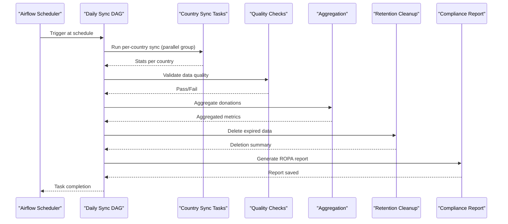

**Diagram sources**
- [jol_daily_sync.py:83-126](file://data/airflow/dags/jol_daily_sync.py#L83-L126)

**Section sources**
- [jol_daily_sync.py:83-126](file://data/airflow/dags/jol_daily_sync.py#L83-L126)

## Detailed Component Analysis

### Airflow Daily Sync DAG
- Orchestrates parallel country synchronization using a TaskGroup, then runs data quality checks, donation aggregation, retention cleanup, and compliance reporting.
- Retry and email-on-failure configured at the DAG level for resilience and observability.

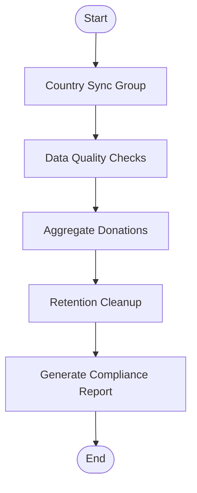

**Diagram sources**
- [jol_daily_sync.py:83-126](file://data/airflow/dags/jol_daily_sync.py#L83-L126)

**Section sources**
- [jol_daily_sync.py:15-73](file://data/airflow/dags/jol_daily_sync.py#L15-L73)
- [jol_daily_sync.py:83-126](file://data/airflow/dags/jol_daily_sync.py#L83-L126)

### GDPR Data Subject Requests DAG
- Provides manual-triggered tasks for access, erasure, and portability requests, each logging GDPR events and invoking relevant processors.

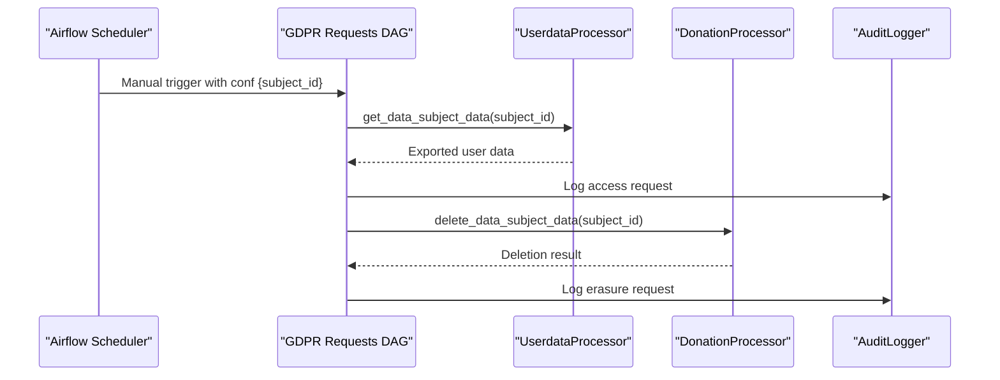

**Diagram sources**
- [jol_hub_etl.py:117-214](file://data/airflow/dags/jol_hub_etl.py#L117-L214)
- [processors.py:282-503](file://data/src/processors.py#L282-L503)

**Section sources**
- [jol_hub_etl.py:117-214](file://data/airflow/dags/jol_hub_etl.py#L117-L214)
- [processors.py:282-503](file://data/src/processors.py#L282-L503)

### Custom GDPR-Compliant Operator
- Wraps execution to log start/completion without PII, ensuring consistent audit behavior across tasks.

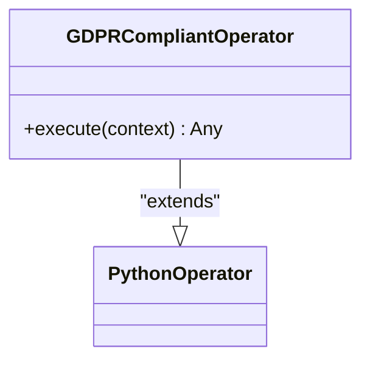

**Diagram sources**
- [jol_operators.py:10-34](file://data/airflow/plugins/jol_operators.py#L10-L34)

**Section sources**
- [jol_operators.py:10-34](file://data/airflow/plugins/jol_operators.py#L10-L34)

### Country Synchronization Pipeline (Template and LT)
- Template defines configuration, compliance verification, and a full sync workflow (entities, donations, events).
- LT implementation adds source enumeration, incremental sync hooks, validation, anonymization, and GDPR rights methods.

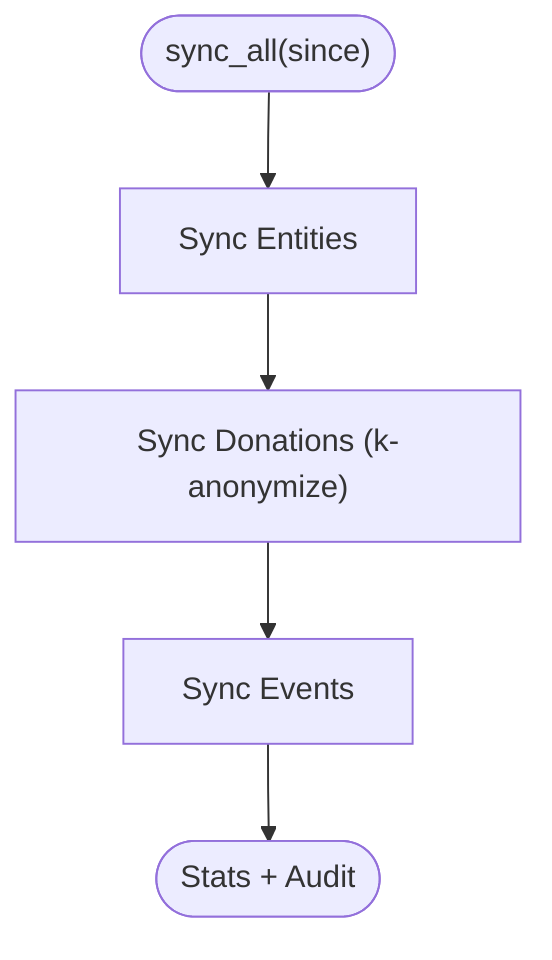

**Diagram sources**
- [template_sync.py:84-127](file://data/src/pipelines/country_sync/template_sync.py#L84-L127)
- [lt_sync.py:72-140](file://data/src/pipelines/country_sync/lt_sync.py#L72-L140)

**Section sources**
- [template_sync.py:22-163](file://data/src/pipelines/country_sync/template_sync.py#L22-L163)
- [lt_sync.py:23-207](file://data/src/pipelines/country_sync/lt_sync.py#L23-L207)

### Entity Import Bulk Loader
- Processes iterators or lists in configurable batches, validates rows, anonymizes PII, inserts records, tracks progress, and supports rollback on failure.

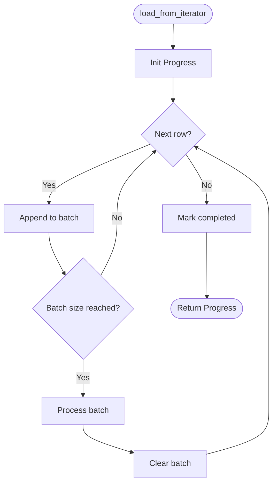

**Diagram sources**
- [bulk_loader.py:96-151](file://data/src/pipelines/entity_import/bulk_loader.py#L96-L151)

**Section sources**
- [bulk_loader.py:72-320](file://data/src/pipelines/entity_import/bulk_loader.py#L72-L320)

### Data Processors (Donation and Userdata)
- Implement GDPR Art. 15/17/20 with database queries, transformations, and audit logging. Donation processor enforces financial retention and anonymization; Userdata processor handles memberships and soft deletion.

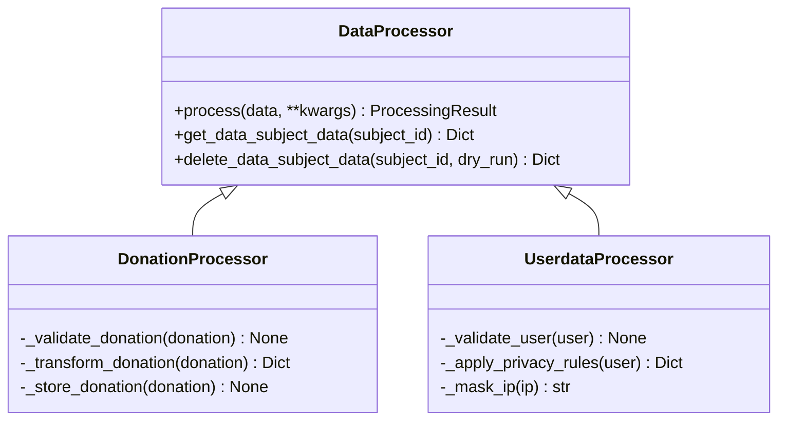

**Diagram sources**
- [processors.py:94-762](file://data/src/processors.py#L94-L762)

**Section sources**
- [processors.py:223-503](file://data/src/processors.py#L223-L503)
- [processors.py:506-762](file://data/src/processors.py#L506-L762)

### Data Quality Expectations
- Entity completeness checker enforces required and conditional fields, calculates completeness percentages, and validates parish-priest relationships.
- Consent validator ensures active, non-expired consents per processing type and provides batch validation and compliance stats.

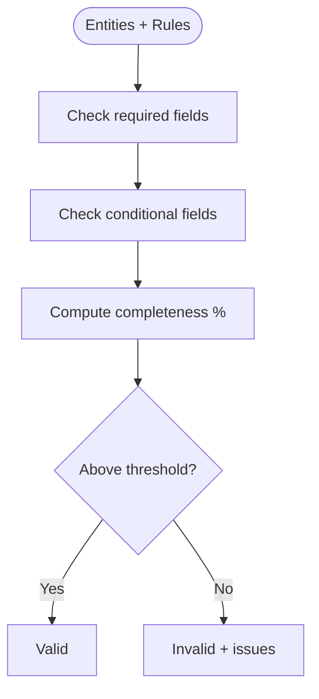

**Diagram sources**
- [entity_completeness.py:95-166](file://data/src/quality/expectations/entity_completeness.py#L95-L166)

**Section sources**
- [entity_completeness.py:14-189](file://data/src/quality/expectations/entity_completeness.py#L14-L189)
- [gdpr_consent_validation.py:52-211](file://data/src/quality/expectations/gdpr_consent_validation.py#L52-L211)

### Testing Strategies and Examples
- Pipeline tests assert importability and default configurations for templates and loaders.
- GDPR tests verify k-anonymity defaults, record anonymization, retention rules, and ROPA generation formats.
- Compliance tests perform static analysis to ensure GDPR/SOC2/PCI-DSS requirements are implemented across code paths.
- Dependency guard tests enforce payment boundary constraints by checking environment and manifests.

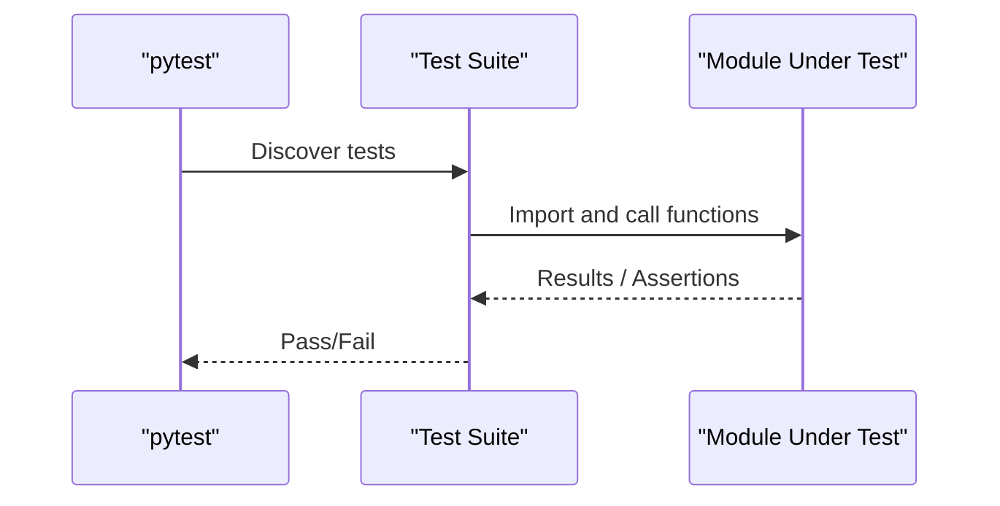

**Diagram sources**
- [test_pipelines.py:8-39](file://data/tests/test_pipelines.py#L8-L39)
- [test_gdpr.py:15-145](file://data/tests/test_gdpr.py#L15-L145)
- [test_compliance.py:133-800](file://data/tests/test_compliance.py#L133-L800)
- [test_dependency_guard.py:36-68](file://data/tests/test_dependency_guard.py#L36-L68)

**Section sources**
- [test_pipelines.py:8-39](file://data/tests/test_pipelines.py#L8-L39)
- [test_gdpr.py:15-145](file://data/tests/test_gdpr.py#L15-L145)
- [test_compliance.py:133-800](file://data/tests/test_compliance.py#L133-L800)
- [test_dependency_guard.py:36-68](file://data/tests/test_dependency_guard.py#L36-L68)

## Dependency Analysis
- DAG-level dependencies: Country sync tasks run in parallel within a TaskGroup; subsequent stages depend on prior stage completion.
- Module-level dependencies: Pipelines rely on validators, anonymizers, and audit logging; processors depend on database connections and audit modules.
- External boundaries: Payment boundary enforced by dependency guard tests; no Stripe SDK allowed in hub runtime.

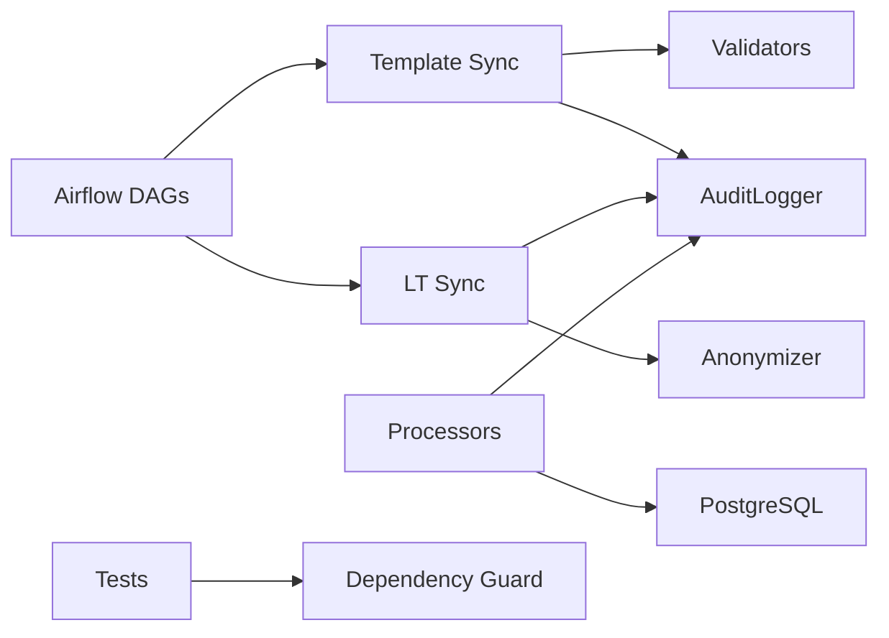

**Diagram sources**
- [jol_daily_sync.py:83-126](file://data/airflow/dags/jol_daily_sync.py#L83-L126)
- [template_sync.py:84-127](file://data/src/pipelines/country_sync/template_sync.py#L84-L127)
- [lt_sync.py:147-175](file://data/src/pipelines/country_sync/lt_sync.py#L147-L175)
- [processors.py:29-37](file://data/src/processors.py#L29-L37)
- [test_dependency_guard.py:36-68](file://data/tests/test_dependency_guard.py#L36-L68)

**Section sources**
- [jol_daily_sync.py:83-126](file://data/airflow/dags/jol_daily_sync.py#L83-L126)
- [test_dependency_guard.py:36-68](file://data/tests/test_dependency_guard.py#L36-L68)

## Performance Considerations
- Use batch sizes tuned to dataset volume and resource limits; monitor progress callbacks and durations in bulk loader.
- Apply k-anonymization selectively to minimize overhead while preserving privacy.
- Configure DAG retries and timeouts appropriately; avoid catchup to prevent backfill storms.
- Leverage parallel TaskGroups for country sync to maximize throughput.
- Monitor query performance in processors and consider indexing strategies in databases.

[No sources needed since this section provides general guidance]

## Troubleshooting Guide
- Common failures:
  - Missing required fields in entity imports: Ensure schemas and validators are aligned; check ENTITY_SCHEMAS usage in tests.
  - Consent validation failures: Verify consent timestamps, withdrawal status, and validity periods; use batch validation to identify patterns.
  - Retention policy violations: Confirm retention rules and deletion routines; use dry-run modes to preview actions.
  - Dependency boundary violations: If tests fail due to Stripe presence, remove from environment and manifests.
- Debugging tips:
  - Inspect audit logs for start/complete/error events in processors and bulk loader.
  - Review DAG logs for retry attempts and error messages.
  - Use pytest verbosity to pinpoint failing assertions in test suites.

**Section sources**
- [test_pipelines.py:17-35](file://data/tests/test_pipelines.py#L17-L35)
- [gdpr_consent_validation.py:77-142](file://data/src/quality/expectations/gdpr_consent_validation.py#L77-L142)
- [bulk_loader.py:138-151](file://data/src/pipelines/entity_import/bulk_loader.py#L138-L151)
- [test_dependency_guard.py:36-68](file://data/tests/test_dependency_guard.py#L36-L68)

## Conclusion
The JOL-HUB data pipeline testing strategy combines unit, integration, and compliance tests to ensure correctness, privacy, and regulatory adherence. Airflow DAGs orchestrate scalable, resilient workflows; country sync templates standardize new integrations; bulk loaders provide safe, audited imports; and quality expectations enforce data integrity. The test suite validates core behaviors, compliance requirements, and architectural boundaries, enabling confident deployments and continuous improvement.

[No sources needed since this section summarizes without analyzing specific files]