# End-to-End Testing with Playwright

<cite>
**Referenced Files in This Document**
- [playwright.config.ts](file://frontend/apps/template-renderer/playwright.config.ts)
- [package.json](file://frontend/apps/template-renderer/package.json)
- [01-home-news.spec.ts](file://frontend/apps/template-renderer/e2e/01-home-news.spec.ts)
- [02-contact-form.spec.ts](file://frontend/apps/template-renderer/e2e/02-contact-form.spec.ts)
- [03-booking.spec.ts](file://frontend/apps/template-renderer/e2e/03-booking.spec.ts)
- [04-donation.spec.ts](file://frontend/apps/template-renderer/e2e/04-donation.spec.ts)
- [05-auth-gates.spec.ts](file://frontend/apps/template-renderer/e2e/05-auth-gates.spec.ts)
- [08-language-switch.spec.ts](file://frontend/apps/template-renderer/e2e/08-language-switch.spec.ts)
- [09-mobile-nav.spec.ts](file://frontend/apps/template-renderer/e2e/09-mobile-nav.spec.ts)
- [10-seo.spec.ts](file://frontend/apps/template-renderer/e2e/10-seo.spec.ts)
- [frontend-test.yml](file://.github/workflows/frontend-test.yml)
- [lighthouserc.js](file://frontend/apps/template-renderer/lighthouserc.js)
- [testing.md](file://frontend/docs/testing.md)
- [check-a11y-pages.ts](file://frontend/apps/template-renderer/scripts/check-a11y-pages.ts)
- [a11y index.ts](file://frontend/packages/a11y/src/index.ts)
- [registry.ts](file://frontend/packages/seed-data/src/registry.ts)
</cite>

## Table of Contents
1. Introduction
2. Project Structure
3. Core Components
4. Architecture Overview
5. Detailed Component Analysis
6. Dependency Analysis
7. Performance Considerations
8. Troubleshooting Guide
9. Conclusion

## Introduction
This document explains how end-to-end testing is implemented for the JOL-HUB platform using Playwright. It covers configuration, multi-page test structure, tenant-aware workflows, and strategies for validating authentication gates, donation surfaces, contact forms, booking services, internationalization, accessibility, SEO, and mobile navigation. It also documents CI execution, debugging techniques, and performance validation via Lighthouse integration.

## Project Structure
The E2E suite lives under the template-renderer app and targets a built Next.js application. The configuration defines three browser projects (desktop Chromium, desktop Firefox, mobile WebKit), parallel workers, retries in CI, and failure artifacts. A web server step builds and starts the app before tests run.

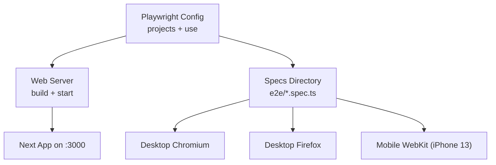

**Diagram sources**
- [playwright.config.ts:15-58](file://frontend/apps/template-renderer/playwright.config.ts#L15-L58)

**Section sources**
- [playwright.config.ts:1-59](file://frontend/apps/template-renderer/playwright.config.ts#L1-L59)
- [package.json:6-21](file://frontend/apps/template-renderer/package.json#L6-L21)

## Core Components
- Playwright configuration:
  - Test directory, timeouts, parallelism, retries, reporters, base URL, traces/screenshots/video capture, extra headers for tenant resolution, and three browser projects.
  - Web server auto-starts the production build and serves it on port 3000.
- Spec suite:
  - Ten focused flows covering home/news, contact form, services/booking surface, donation surface, auth/editor gates, i18n switching, mobile navigation, and SEO assertions.
- CI pipeline:
  - Installs dependencies, installs Playwright browsers, runs specs, and uploads reports as artifacts.

**Section sources**
- [playwright.config.ts:15-58](file://frontend/apps/template-renderer/playwright.config.ts#L15-L58)
- [frontend-test.yml:154-187](file://.github/workflows/frontend-test.yml#L154-L187)
- [testing.md:30-60](file://frontend/docs/testing.md#L30-L60)

## Architecture Overview
The E2E flow exercises the built Next.js app through real browser contexts. Tests navigate tenant-scoped routes (for example, /lt/{tenant}) and assert UI behavior, content presence, and structural correctness. The configuration injects headers that mirror production tenant routing so the same code paths are validated.

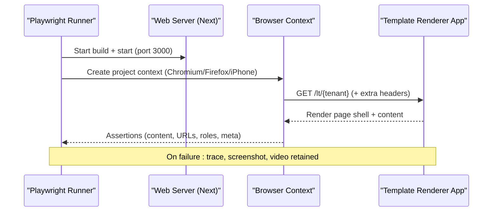

**Diagram sources**
- [playwright.config.ts:26-58](file://frontend/apps/template-renderer/playwright.config.ts#L26-L58)
- [01-home-news.spec.ts:14-27](file://frontend/apps/template-renderer/e2e/01-home-news.spec.ts#L14-L27)

## Detailed Component Analysis

### Playwright Configuration
- Projects: Desktop Chrome, Desktop Firefox, Mobile WebKit (iPhone 13).
- Execution: Fully parallel, 4 workers, retries in CI, forbidOnly in CI.
- Artifacts: Traces retained on failure; screenshots and videos captured only on failure.
- Base URL and headers: Uses an environment variable for base URL and sets x-forwarded-proto to match production tenant resolution.
- Web server: Builds and starts the app; reuses existing server locally; long timeout for CI.

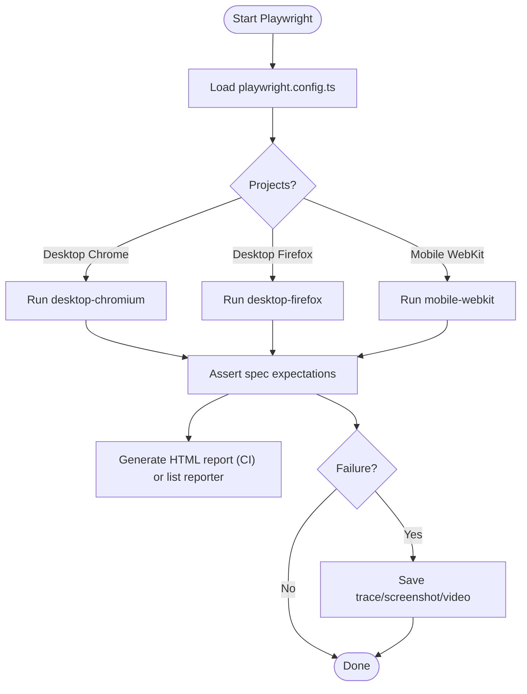

**Diagram sources**
- [playwright.config.ts:15-58](file://frontend/apps/template-renderer/playwright.config.ts#L15-L58)

**Section sources**
- [playwright.config.ts:1-59](file://frontend/apps/template-renderer/playwright.config.ts#L1-L59)

### Home and News Flow
- Navigates to the tenant’s home page and verifies tenant identity text.
- Clicks the primary news link and asserts URL routing to the news route.
- Validates the honest empty state when backend content is not yet wired.

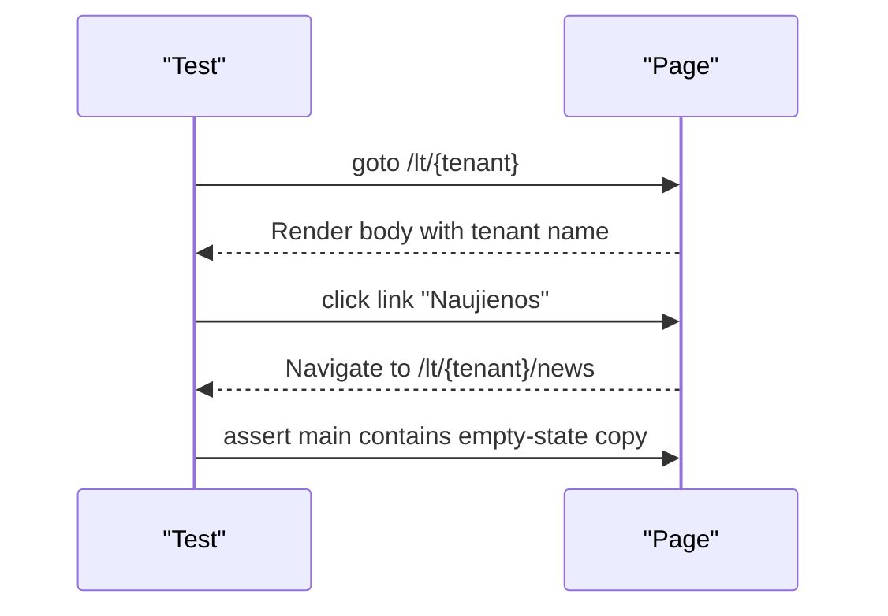

**Diagram sources**
- [01-home-news.spec.ts:14-27](file://frontend/apps/template-renderer/e2e/01-home-news.spec.ts#L14-L27)

**Section sources**
- [01-home-news.spec.ts:1-29](file://frontend/apps/template-renderer/e2e/01-home-news.spec.ts#L1-L29)

### Contact Form Flow
- Fills name, email, message, and consent checkbox.
- Submits and asserts success copy appears within a longer timeout.
- Confirms submission without consent does not show success (GDPR gate).

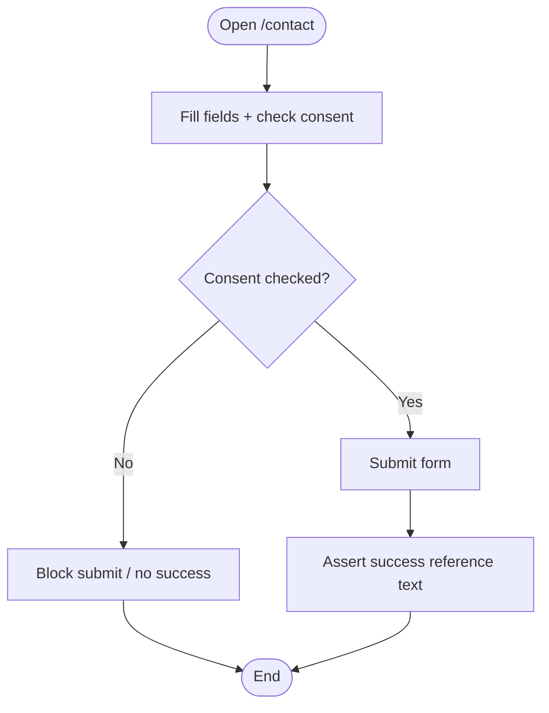

**Diagram sources**
- [02-contact-form.spec.ts:9-31](file://frontend/apps/template-renderer/e2e/02-contact-form.spec.ts#L9-L31)

**Section sources**
- [02-contact-form.spec.ts:1-33](file://frontend/apps/template-renderer/e2e/02-contact-form.spec.ts#L1-L33)

### Booking Services Surface
- Verifies the services page renders with an honest empty state.
- Ensures unknown service slugs return a soft 404 instead of crashing.

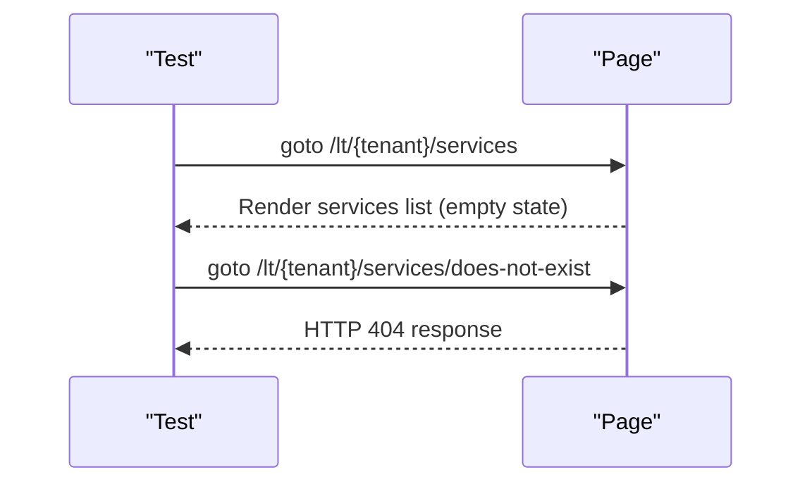

**Diagram sources**
- [03-booking.spec.ts:14-23](file://frontend/apps/template-renderer/e2e/03-booking.spec.ts#L14-L23)

**Section sources**
- [03-booking.spec.ts:1-25](file://frontend/apps/template-renderer/e2e/03-booking.spec.ts#L1-L25)

### Donation Surface
- Asserts the home page shows the payments-pending notice.
- Confirms no live Stripe elements leak into the DOM during pilot.

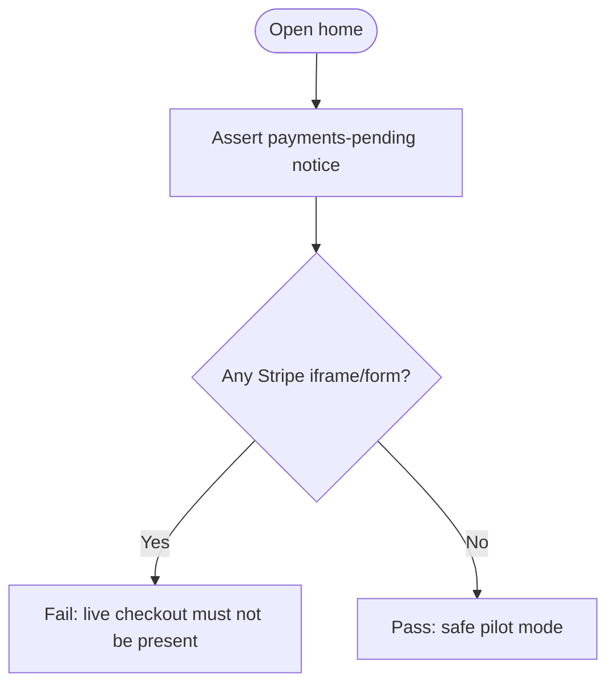

**Diagram sources**
- [04-donation.spec.ts:13-21](file://frontend/apps/template-renderer/e2e/04-donation.spec.ts#L13-L21)

**Section sources**
- [04-donation.spec.ts:1-23](file://frontend/apps/template-renderer/e2e/04-donation.spec.ts#L1-L23)

### Authentication Gates (Editor/Admin/Moderation)
- Editor renders with pilot notices and no live moderation data.
- Moderation queue exposes no items and no decision buttons.
- Admin dashboard stays inert without the auth plane (either pilot notice or 403).

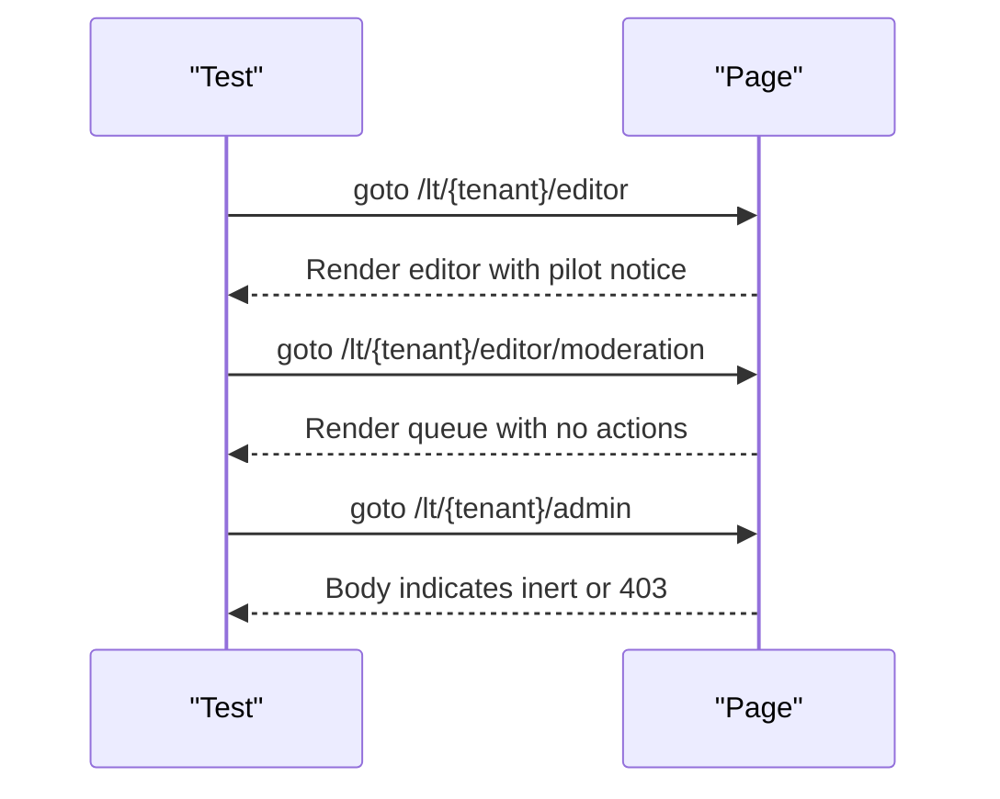

**Diagram sources**
- [05-auth-gates.spec.ts:17-45](file://frontend/apps/template-renderer/e2e/05-auth-gates.spec.ts#L17-L45)

**Section sources**
- [05-auth-gates.spec.ts:1-47](file://frontend/apps/template-renderer/e2e/05-auth-gates.spec.ts#L1-L47)

### Internationalization (i18n)
- Switching locale updates navigation and URL segment.
- Locale persists across internal navigation via cookie.

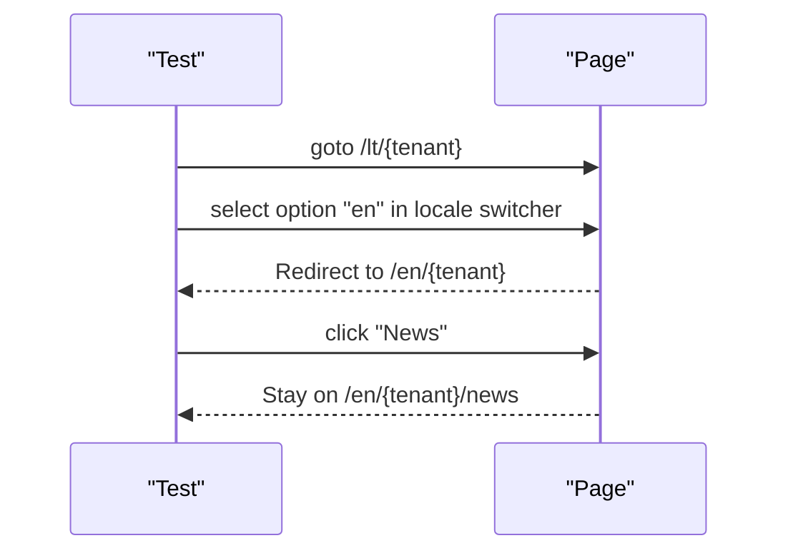

**Diagram sources**
- [08-language-switch.spec.ts:8-28](file://frontend/apps/template-renderer/e2e/08-language-switch.spec.ts#L8-L28)

**Section sources**
- [08-language-switch.spec.ts:1-30](file://frontend/apps/template-renderer/e2e/08-language-switch.spec.ts#L1-L30)

### Mobile Navigation
- Hamburger menu opens/closes and exposes links.
- Skip link exists and targets main content.

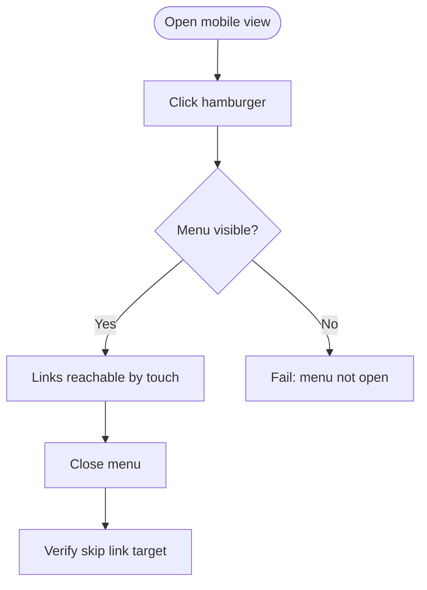

**Diagram sources**
- [09-mobile-nav.spec.ts:11-32](file://frontend/apps/template-renderer/e2e/09-mobile-nav.spec.ts#L11-L32)

**Section sources**
- [09-mobile-nav.spec.ts:1-34](file://frontend/apps/template-renderer/e2e/09-mobile-nav.spec.ts#L1-L34)

### SEO Validation
- Title, description, canonical, Open Graph tags present.
- JSON-LD structured data present and parseable.
- Robots meta present; html lang matches locale segment.

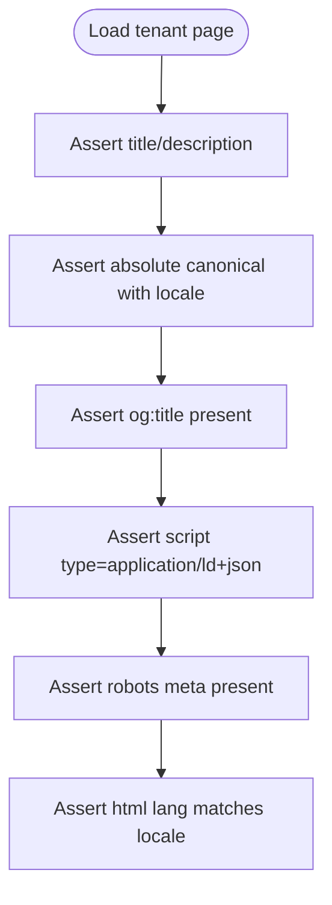

**Diagram sources**
- [10-seo.spec.ts:9-46](file://frontend/apps/template-renderer/e2e/10-seo.spec.ts#L9-L46)

**Section sources**
- [10-seo.spec.ts:1-48](file://frontend/apps/template-renderer/e2e/10-seo.spec.ts#L1-L48)

### Fixture Management for Tenant Data
- The suite uses a known fixture tenant slug resolved from the seed-data registry.
- The registry validates fixtures at load time and provides fallback behavior for unknown tenants.

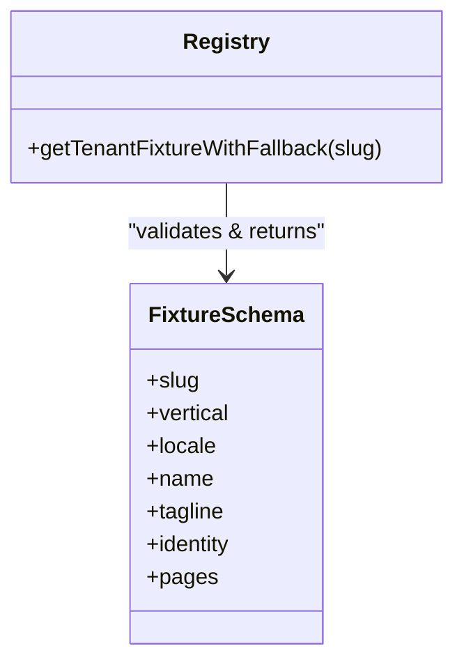

**Diagram sources**
- [registry.ts:1-88](file://frontend/packages/seed-data/src/registry.ts#L1-L88)

**Section sources**
- [registry.ts:1-88](file://frontend/packages/seed-data/src/registry.ts#L1-L88)

### Page Object Patterns and Fixtures
- Current specs use direct selectors and role-based queries for simplicity and stability.
- For larger suites, consider extracting reusable Page Objects per route (e.g., HomePage, ContactFormPage) and shared fixtures for tenant setup and headers.
- Use Playwright fixtures to centralize tenant selection, base URL overrides, and header injection for consistent cross-browser runs.

[No sources needed since this section provides general guidance]

### Cross-Browser Testing Setup
- Three projects ensure coverage across desktop Chromium, desktop Firefox, and mobile WebKit.
- CI installs all three browsers and runs the full suite.

**Section sources**
- [playwright.config.ts:37-50](file://frontend/apps/template-renderer/playwright.config.ts#L37-L50)
- [frontend-test.yml:174-180](file://.github/workflows/frontend-test.yml#L174-L180)

### Visual Regression Testing
- The current suite focuses on functional and structural assertions.
- To add visual regression, integrate snapshot comparisons per page or component and store baselines per project/browser.
- Capture images on failures already enabled; extend to baseline checks for critical pages.

[No sources needed since this section provides general guidance]

### Accessibility Compliance
- An axe-core based page audit script scans critical routes with tenant headers and strips scripts to avoid hydration noise.
- The a11y package exports utilities to assert clean audits and format reports.

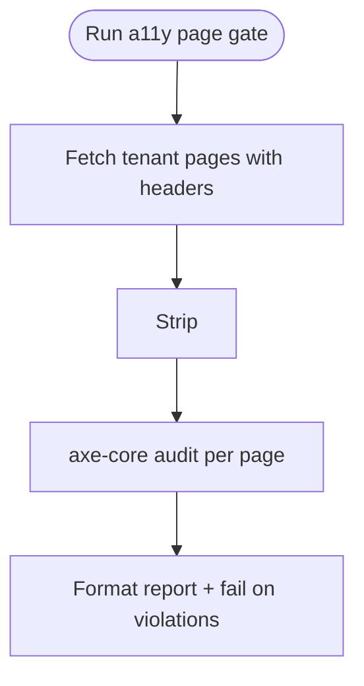

**Diagram sources**
- [check-a11y-pages.ts:29-70](file://frontend/apps/template-renderer/scripts/check-a11y-pages.ts#L29-L70)
- [a11y index.ts:1-28](file://frontend/packages/a11y/src/index.ts#L1-L28)

**Section sources**
- [check-a11y-pages.ts:29-70](file://frontend/apps/template-renderer/scripts/check-a11y-pages.ts#L29-L70)
- [a11y index.ts:1-28](file://frontend/packages/a11y/src/index.ts#L1-L28)

### Performance Testing with Lighthouse Integration
- Lighthouse CI config targets key tenant routes, emulates mid-tier mobile on 4G, and enforces budgets and Core Web Vitals thresholds.
- Extra headers simulate tenant routing and HTTPS forwarding for accurate rendering.

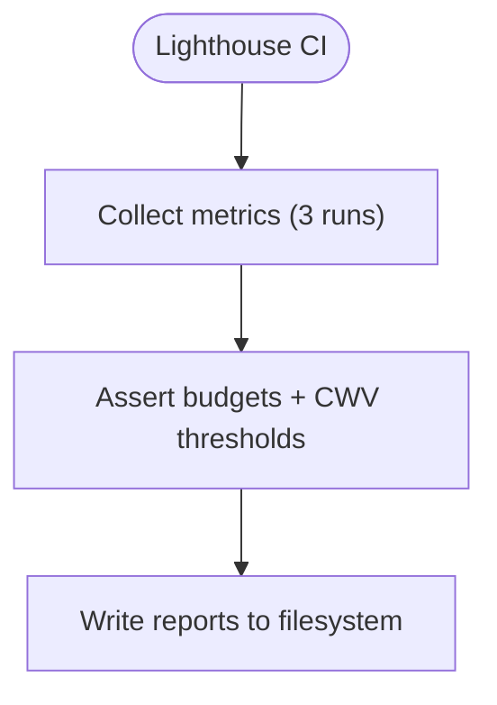

**Diagram sources**
- [lighthouserc.js:19-73](file://frontend/apps/template-renderer/lighthouserc.js#L19-L73)

**Section sources**
- [lighthouserc.js:1-75](file://frontend/apps/template-renderer/lighthouserc.js#L1-L75)

## Dependency Analysis
- Specs depend on the running Next app served by Playwright’s webServer.
- Tenant routing relies on headers configured in both Playwright and Lighthouse.
- Seed-data registry supplies fixture data used by the renderer and tests.

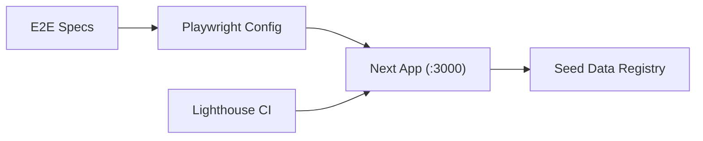

**Diagram sources**
- [playwright.config.ts:26-58](file://frontend/apps/template-renderer/playwright.config.ts#L26-L58)
- [lighthouserc.js:21-49](file://frontend/apps/template-renderer/lighthouserc.js#L21-L49)
- [registry.ts:1-88](file://frontend/packages/seed-data/src/registry.ts#L1-L88)

**Section sources**
- [playwright.config.ts:15-58](file://frontend/apps/template-renderer/playwright.config.ts#L15-L58)
- [lighthouserc.js:19-73](file://frontend/apps/template-renderer/lighthouserc.js#L19-L73)
- [registry.ts:1-88](file://frontend/packages/seed-data/src/registry.ts#L1-L88)

## Performance Considerations
- Keep each spec focused and short to meet the total budget.
- Use role-based queries and minimal DOM interactions to reduce flakiness.
- Leverage parallel workers and retries in CI to balance speed and reliability.
- Validate performance budgets with Lighthouse in CI; keep number of runs modest for runner constraints.

[No sources needed since this section provides general guidance]

## Troubleshooting Guide
- Flaky tests:
  - Enable retries in CI and inspect traces/screenshots/videos retained on failure.
  - Prefer stable locators (roles, labels) over brittle CSS selectors.
- Tenant routing issues:
  - Ensure extraHTTPHeaders include x-forwarded-proto and any required tenant headers.
  - Verify base URL points to the correct local or CI endpoint.
- Lighthouse failures:
  - Confirm the server is ready and headers emulate production tenant routing.
  - Adjust numberOfRuns or budgets if hardware differs significantly.
- Accessibility gate:
  - Use the page audit script to isolate failing routes and review axe reports.

**Section sources**
- [playwright.config.ts:26-58](file://frontend/apps/template-renderer/playwright.config.ts#L26-L58)
- [lighthouserc.js:21-49](file://frontend/apps/template-renderer/lighthouserc.js#L21-L49)
- [check-a11y-pages.ts:29-70](file://frontend/apps/template-renderer/scripts/check-a11y-pages.ts#L29-L70)

## Conclusion
The Playwright E2E suite validates critical user journeys across multiple browsers and devices, ensuring tenant-aware rendering, safe pilot behavior, and compliance with SEO and accessibility standards. Combined with Lighthouse budgets and an axe-core page audit, the suite provides robust confidence for releases. Extend with page objects, fixtures, and visual regression as the suite scales, while maintaining focus, stability, and clear reporting in CI.