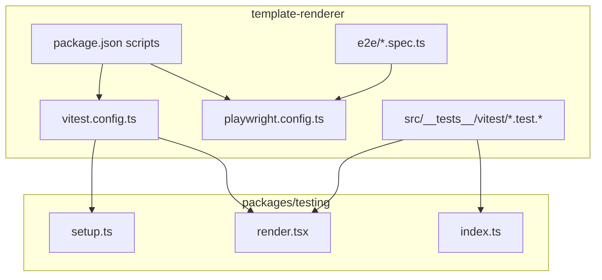
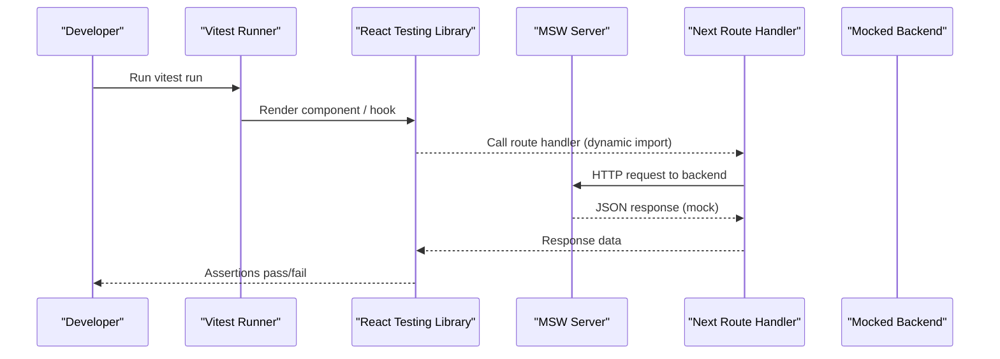
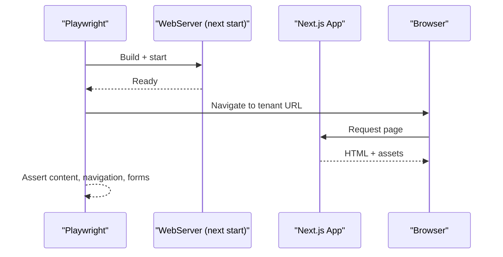
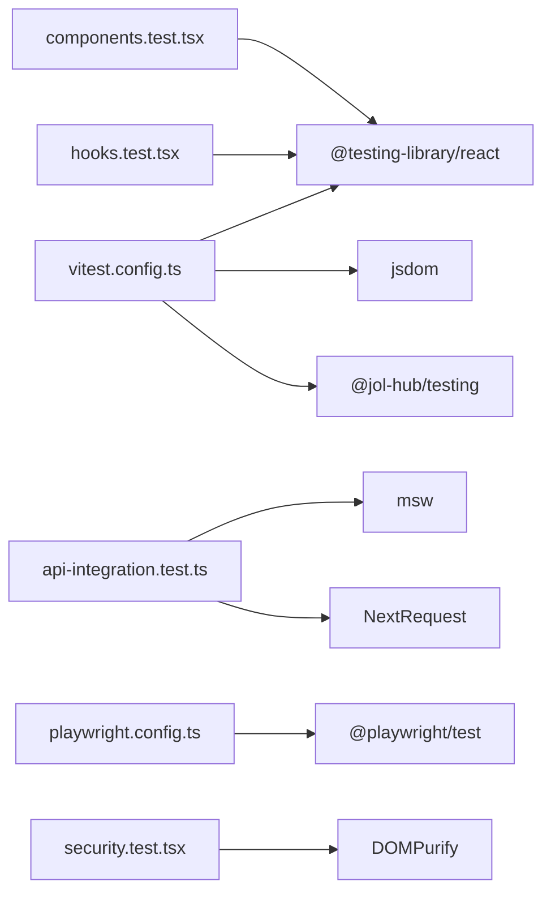

# Frontend Testing (Next.js/TypeScript)

<cite>
**Referenced Files in This Document**
- [vitest.config.ts](file://frontend/apps/template-renderer/vitest.config.ts)
- [playwright.config.ts](file://frontend/apps/template-renderer/playwright.config.ts)
- [package.json](file://frontend/apps/template-renderer/package.json)
- [setup.ts](file://frontend/packages/testing/src/setup.ts)
- [render.tsx](file://frontend/packages/testing/src/render.tsx)
- [index.ts](file://frontend/packages/testing/src/index.ts)
- [hooks.test.tsx](file://frontend/apps/template-renderer/src/__tests__/vitest/hooks.test.tsx)
- [components.test.tsx](file://frontend/apps/template-renderer/src/__tests__/vitest/components.test.tsx)
- [api-integration.test.ts](file://frontend/apps/template-renderer/src/__tests__/vitest/api-integration.test.ts)
- [security.test.tsx](file://frontend/apps/template-renderer/src/__tests__/vitest/security.test.tsx)
- [01-home-news.spec.ts](file://frontend/apps/template-renderer/e2e/01-home-news.spec.ts)
- [05-auth-gates.spec.ts](file://frontend/apps/template-renderer/e2e/05-auth-gates.spec.ts)
- [lighthouserc.js](file://frontend/apps/template-renderer/lighthouserc.js)
- [types.ts](file://frontend/packages/perf/src/types.ts)
</cite>

## Table of Contents
1. Introduction
2. Project Structure
3. Core Components
4. Architecture Overview
5. Detailed Component Analysis
6. Dependency Analysis
7. Performance Considerations
8. Troubleshooting Guide
9. Conclusion

## Introduction
This document explains the frontend testing strategy for Next.js applications in JOL-HUB, focusing on:
- Unit and component testing with Vitest and React Testing Library
- End-to-end testing with Playwright
- Testing strategies for React components, hooks, API integrations, authentication flows, internationalization, and responsive design
- Snapshot testing guidance, test organization, and continuous integration setup
- Performance testing with Lighthouse budgets and CI gates

The approach is layered: fast unit tests for logic, component tests for UI behavior, integration tests for route handlers with MSW, E2E tests against a built app, and performance budgets enforced in CI.

## Project Structure
The template-renderer app organizes tests into three tiers:
- Unit/integration tests under src/__tests__/vitest using Vitest + jsdom + MSW
- E2E tests under e2e using Playwright against a built Next.js server
- Shared test utilities and fixtures under packages/testing

**Diagram sources**
- [vitest.config.ts:1-79](file://frontend/apps/template-renderer/vitest.config.ts#L1-L79)
- [playwright.config.ts:1-59](file://frontend/apps/template-renderer/playwright.config.ts#L1-L59)
- [package.json:6-21](file://frontend/apps/template-renderer/package.json#L6-L21)
- [setup.ts:1-51](file://frontend/packages/testing/src/setup.ts#L1-L51)
- [render.tsx:1-33](file://frontend/packages/testing/src/render.tsx#L1-L33)
- [index.ts:1-38](file://frontend/packages/testing/src/index.ts#L1-L38)

**Section sources**
- [vitest.config.ts:1-79](file://frontend/apps/template-renderer/vitest.config.ts#L1-L79)
- [playwright.config.ts:1-59](file://frontend/apps/template-renderer/playwright.config.ts#L1-L59)
- [package.json:6-21](file://frontend/apps/template-renderer/package.json#L6-L21)

## Core Components
- Vitest configuration sets jsdom environment, includes component/integration/security tests, configures coverage thresholds for security-critical editor code, and aliases the source root.
- Playwright configuration defines multi-browser projects, parallel workers, retries in CI, failure artifacts, and a webServer that builds and starts the Next.js app for E2E runs.
- Shared test harness provides deterministic globals, RTL cleanup, timezone control, jsdom shims, and a provider-aware render helper to wrap components with theme and i18n contexts.

Key responsibilities:
- Deterministic, isolated tests without network or timers unless explicitly faked
- Real context behavior via providers rather than broad mocks
- Coverage focused on security-critical editor core
- E2E against a real build with tenant fixtures

**Section sources**
- [vitest.config.ts:1-79](file://frontend/apps/template-renderer/vitest.config.ts#L1-L79)
- [playwright.config.ts:1-59](file://frontend/apps/template-renderer/playwright.config.ts#L1-L59)
- [setup.ts:1-51](file://frontend/packages/testing/src/setup.ts#L1-L51)
- [render.tsx:1-33](file://frontend/packages/testing/src/render.tsx#L1-L33)
- [index.ts:1-38](file://frontend/packages/testing/src/index.ts#L1-L38)

## Architecture Overview
The testing architecture spans four layers:

**Diagram sources**
- [api-integration.test.ts:1-300](file://frontend/apps/template-renderer/src/__tests__/vitest/api-integration.test.ts#L1-L300)
- [index.ts:1-38](file://frontend/packages/testing/src/index.ts#L1-L38)

For E2E:

**Diagram sources**
- [playwright.config.ts:1-59](file://frontend/apps/template-renderer/playwright.config.ts#L1-L59)
- [01-home-news.spec.ts:1-29](file://frontend/apps/template-renderer/e2e/01-home-news.spec.ts#L1-L29)

## Detailed Component Analysis

### Vitest Setup and Test Tiers
- Environment: jsdom for DOM APIs; automatic JSX transform before import analysis; alias @ to src.
- Include pattern: only vitest suites under src/__tests__/vitest.
- Coverage: v8 provider, targeted include paths for editor lib and components, thresholds set to enforce minimums.
- Determinism: timeouts and hookTimeout configured; global setup ensures cleanup and stable environment.

Practical implications:
- Use renderWithProviders for components to exercise real i18n/theme contexts
- Use MSW for route handler integration tests without touching the backend
- Keep pure logic tests separate from DOM tests

**Section sources**
- [vitest.config.ts:1-79](file://frontend/apps/template-renderer/vitest.config.ts#L1-L79)
- [setup.ts:1-51](file://frontend/packages/testing/src/setup.ts#L1-L51)

### Component Testing with React Testing Library
- Primitives like Button and Badge are tested for rendering, props, disabled/loading states, and accessibility attributes.
- Composite components like ContactForm validate GDPR consent gating, submission flow, error display, and field presence.
- Tests use fireEvent and waitFor to simulate user interactions and async updates.

Best practices demonstrated:
- Role-based queries (getByRole) for accessibility-first testing
- Explicit async assertions with waitFor
- Provider-wrapped renders to avoid brittle mocks

**Section sources**
- [components.test.tsx:1-122](file://frontend/apps/template-renderer/src/__tests__/vitest/components.test.tsx#L1-L122)

### Hook Testing Strategy
- Internationalization: verify namespaced key resolution, locale switching, and missing-key fallback behavior.
- Tenant feature gating: assert feature flags per tenant type and ensure server schema fields are not exposed client-side.
- Cart persistence: verify add/remove/clear operations and tenant-namespaced localStorage keys.
- Theme toggling: assert class toggling, persistence, and restoration across reloads.

Patterns:
- renderHook with wrapper providers to inject real context
- act around state mutations
- Clear localStorage between tests to isolate tenant-scoped storage

**Section sources**
- [hooks.test.tsx:1-171](file://frontend/apps/template-renderer/src/__tests__/vitest/hooks.test.tsx#L1-L171)

### API Integration Testing with MSW
- Route handlers are dynamically imported and invoked with NextRequest objects.
- MSW intercepts backend calls with predefined handlers and fixtures.
- Scenarios cover happy paths, validation ordering (400 before 503), backend error mapping (500 to 502), invalid JSON bodies, and pilot mode when backend is unconfigured.

Key behaviors validated:
- Tenant isolation headers forwarded to backend
- Input validation rejects unsafe block types and javascript: links
- Moderation endpoints require reasons for reject decisions
- Media uploads return quarantined state and enforce alt text

**Section sources**
- [api-integration.test.ts:1-300](file://frontend/apps/template-renderer/src/__tests__/vitest/api-integration.test.ts#L1-L300)
- [index.ts:1-38](file://frontend/packages/testing/src/index.ts#L1-L38)

### Security Testing
- XSS defense: run canonical payloads through the full render pipeline and sanitize layer; assert no executable tags or event handlers survive.
- URL policy: reject dangerous schemes and spoofed hosts; allow internal paths and approved https hosts.
- RBAC matrix: deny admin routes for non-admin roles; enforce tenant scoping; superadmin override behavior.
- Tenant isolation: reject hostile slugs at all input schemas.

These tests provide evidence for compliance requirements and guardrails against common attack surfaces.

**Section sources**
- [security.test.tsx:1-211](file://frontend/apps/template-renderer/src/__tests__/vitest/security.test.tsx#L1-L211)

### End-to-End Testing with Playwright
- Multi-browser projects: desktop Chromium/Firefox and mobile WebKit.
- Parallel execution with limited retries in CI; screenshots/video retained on failure.
- WebServer builds and starts the Next.js app; baseURL configurable for local vs CI.
- Flows include visitor navigation, editor surfaces in pilot mode, moderation queue behavior, and admin dashboard inertness without auth.

Example flows:
- Home page renders tenant identity and navigates to news
- Editor shows pilot notices and no live moderation actions
- Admin dashboard returns either pilot notice or 403 without auth plane

**Section sources**
- [playwright.config.ts:1-59](file://frontend/apps/template-renderer/playwright.config.ts#L1-L59)
- [01-home-news.spec.ts:1-29](file://frontend/apps/template-renderer/e2e/01-home-news.spec.ts#L1-L29)
- [05-auth-gates.spec.ts:1-47](file://frontend/apps/template-renderer/e2e/05-auth-gates.spec.ts#L1-L47)

### Internationalization Testing
- Verify resolved translations by key and locale
- Confirm missing keys surface as visible key paths to catch translation drift early
- Use renderWithProviders to load correct messages for the selected locale

**Section sources**
- [hooks.test.tsx:19-39](file://frontend/apps/template-renderer/src/__tests__/vitest/hooks.test.tsx#L19-L39)
- [render.tsx:1-33](file://frontend/packages/testing/src/render.tsx#L1-L33)

### Responsive Design Testing
- Playwright projects include mobile WebKit device emulation to assert layout and navigation on small screens.
- Combine with viewport-specific assertions (e.g., menu visibility) within specs.

**Section sources**
- [playwright.config.ts:37-50](file://frontend/apps/template-renderer/playwright.config.ts#L37-L50)

### Authentication Flow Testing
- E2E specs lock safe pilot behavior when auth is unconfigured, ensuring editors and moderation queues do not expose live data.
- Unit/integration tiers enforce RBAC rules regardless of auth mode, preventing bypass scenarios.

**Section sources**
- [05-auth-gates.spec.ts:1-47](file://frontend/apps/template-renderer/e2e/05-auth-gates.spec.ts#L1-L47)
- [security.test.tsx:112-164](file://frontend/apps/template-renderer/src/__tests__/vitest/security.test.tsx#L112-L164)

### Template Rendering and Snapshot Testing Guidance
- For static template outputs, consider snapshot tests to detect unintended markup changes.
- Prefer behavioral assertions (roles, text, attributes) over snapshots for resilience; snapshots can complement critical UI surfaces.
- Ensure snapshots are updated intentionally and reviewed in PRs.

[No sources needed since this section provides general guidance]

### Continuous Integration Setup for Frontend Tests
- Scripts in package.json expose commands for unit/component tests, coverage, E2E, security tests, and performance checks.
- Playwright uses CI-aware settings: retries, reporter, and artifact retention.
- Lighthouse CI runs against the production build with defined URLs and thresholds.

Run examples:
- Unit/component tests: pnpm --filter template-renderer test:vitest
- Coverage: pnpm --filter template-renderer test:vitest:coverage
- E2E: pnpm --filter template-renderer test:e2e
- Security: pnpm --filter template-renderer test:security

**Section sources**
- [package.json:6-21](file://frontend/apps/template-renderer/package.json#L6-L21)
- [playwright.config.ts:17-24](file://frontend/apps/template-renderer/playwright.config.ts#L17-L24)

## Dependency Analysis
Test dependencies and relationships:

**Diagram sources**
- [vitest.config.ts:49-57](file://frontend/apps/template-renderer/vitest.config.ts#L49-L57)
- [api-integration.test.ts:14-20](file://frontend/apps/template-renderer/src/__tests__/vitest/api-integration.test.ts#L14-L20)
- [playwright.config.ts:13-18](file://frontend/apps/template-renderer/playwright.config.ts#L13-L18)
- [components.test.tsx:10-14](file://frontend/apps/template-renderer/src/__tests__/vitest/components.test.tsx#L10-L14)
- [hooks.test.tsx:8-17](file://frontend/apps/template-renderer/src/__tests__/vitest/hooks.test.tsx#L8-L17)
- [security.test.tsx:14-24](file://frontend/apps/template-renderer/src/__tests__/vitest/security.test.tsx#L14-L24)

**Section sources**
- [vitest.config.ts:49-57](file://frontend/apps/template-renderer/vitest.config.ts#L49-L57)
- [api-integration.test.ts:14-20](file://frontend/apps/template-renderer/src/__tests__/vitest/api-integration.test.ts#L14-L20)
- [playwright.config.ts:13-18](file://frontend/apps/template-renderer/playwright.config.ts#L13-L18)

## Performance Considerations
- Lighthouse CI enforces Core Web Vitals and best practices thresholds against the production build.
- Budgets are centralized and applied both in Chrome environments and offline build checks.
- Emulation targets mid-tier mobile on 4G to reflect realistic constraints.

Recommendations:
- Keep bundle sizes within budget; monitor regressions in CI
- Validate CWV metrics regularly; address CLS and LCP issues proactively
- Use performance budgets as a gate in merge pipelines

**Section sources**
- [lighthouserc.js:1-74](file://frontend/apps/template-renderer/lighthouserc.js#L1-L74)
- [types.ts:1-48](file://frontend/packages/perf/src/types.ts#L1-L48)

## Troubleshooting Guide
Common issues and resolutions:
- Flaky E2E tests: adjust expect timeouts and rely on retries in CI; inspect traces/screenshots/videos retained on failure
- Network errors in integration tests: ensure MSW server is listening and handlers match expected paths; reset handlers between tests
- Timezone-related failures: confirm global setup sets TZ to UTC; avoid relying on host machine time
- Missing DOM APIs in jsdom: shims for matchMedia and scrollTo are provided; extend if new APIs are required
- Provider context errors: use renderWithProviders to supply i18n/theme contexts; wrap with app-level providers via options.wrapper

Debugging tips:
- Use Playwright traces to replay failures
- Narrow failing specs to isolate issues
- Add explicit waits for async UI updates

**Section sources**
- [playwright.config.ts:17-35](file://frontend/apps/template-renderer/playwright.config.ts#L17-L35)
- [setup.ts:16-51](file://frontend/packages/testing/src/setup.ts#L16-L51)

## Conclusion
JOL-HUB’s frontend testing strategy combines fast, deterministic unit and component tests with robust integration and E2E coverage. Vitest handles DOM and integration scenarios with MSW, while Playwright validates real user flows across browsers. Security and compliance are enforced through dedicated tests, and performance budgets protect runtime quality in CI. Following these patterns ensures reliable releases, clear regression signals, and maintainable test suites aligned with the application’s multi-tenant, secure-by-design goals.