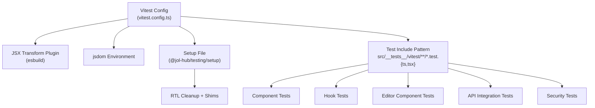
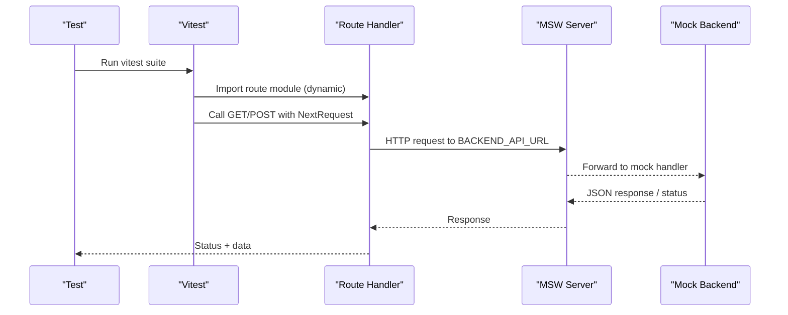
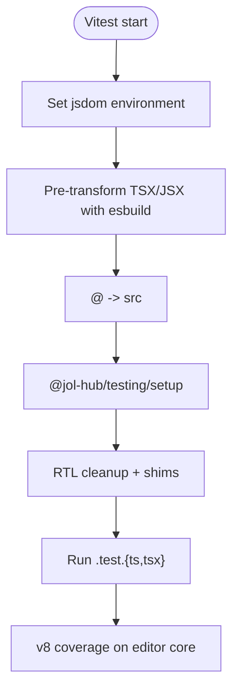
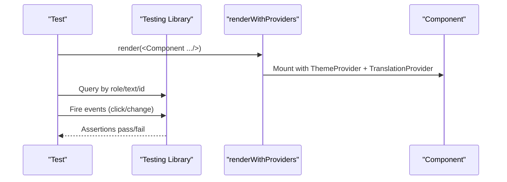
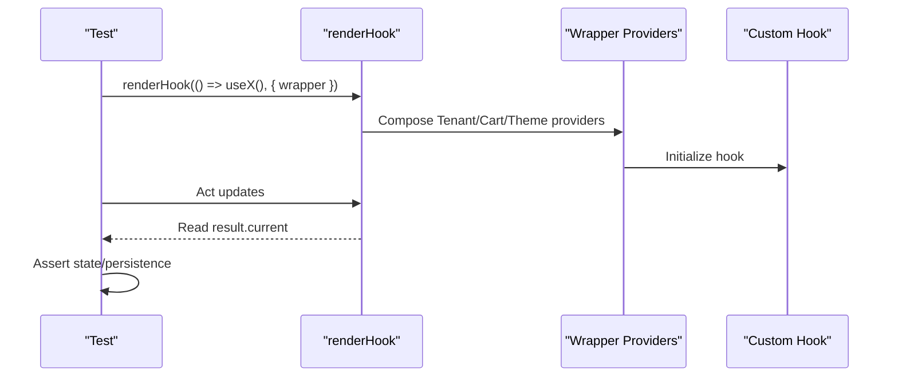
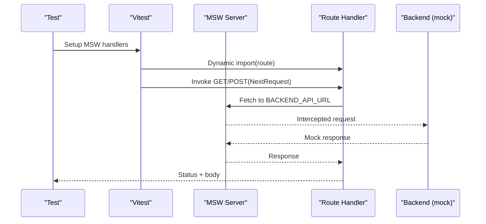
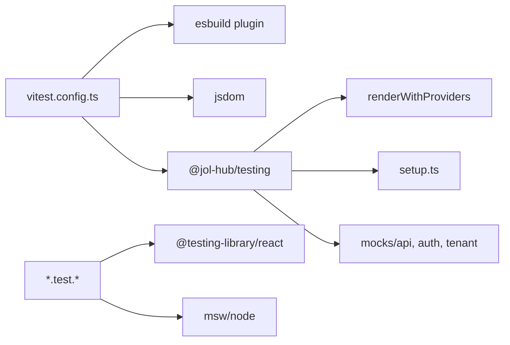

# Unit & Component Testing with Vitest

<cite>
**Referenced Files in This Document**
- [vitest.config.ts](file://frontend/apps/template-renderer/vitest.config.ts)
- [setup.ts](file://frontend/packages/testing/src/setup.ts)
- [render.tsx](file://frontend/packages/testing/src/render.tsx)
- [index.ts](file://frontend/packages/testing/src/index.ts)
- [package.json](file://frontend/packages/testing/package.json)
- [components.test.tsx](file://frontend/apps/template-renderer/src/__tests__/vitest/components.test.tsx)
- [hooks.test.tsx](file://frontend/apps/template-renderer/src/__tests__/vitest/hooks.test.tsx)
- [editor-components.test.tsx](file://frontend/apps/template-renderer/src/__tests__/vitest/editor-components.test.tsx)
- [api-integration.test.ts](file://frontend/apps/template-renderer/src/__tests__/vitest/api-integration.test.ts)
- [security.test.tsx](file://frontend/apps/template-renderer/src/__tests__/vitest/security.test.tsx)
- [editor-lib.test.ts](file://frontend/apps/template-renderer/src/__tests__/vitest/editor-lib.test.ts)
</cite>

## Table of Contents
1. [Introduction](#introduction)
2. [Project Structure](#project-structure)
3. [Core Components](#core-components)
4. [Architecture Overview](#architecture-overview)
5. [Detailed Component Analysis](#detailed-component-analysis)
6. [Dependency Analysis](#dependency-analysis)
7. [Performance Considerations](#performance-considerations)
8. [Troubleshooting Guide](#troubleshooting-guide)
9. [Conclusion](#conclusion)
10. [Appendices](#appendices)

## Introduction
This document explains how unit and component testing are implemented for the JOL-HUB template renderer using Vitest. It covers configuration (jsdom environment, JSX transformation via esbuild), test organization patterns, React Testing Library usage, mocking Next.js routes and APIs, testing custom hooks with proper cleanup, snapshot-style assertions, coverage thresholds for security-critical code, and deterministic testing best practices. It also provides guidance for testing internationalization, forms, authentication flows, and error boundaries within this project’s conventions.

## Project Structure
The template renderer uses a tiered approach:
- Pure logic tests run under node:test for speed and determinism.
- Vitest runs DOM-based component tests, integration tests against route handlers with MSW, and security-focused tests.

Key locations:
- Vitest configuration: frontend/apps/template-renderer/vitest.config.ts
- Shared test harness package: frontend/packages/testing
- Test suites:
  - Component tests: src/__tests__/vitest/components.test.tsx
  - Hook tests: src/__tests__/vitest/hooks.test.tsx
  - Editor components: src/__tests__/vitest/editor-components.test.tsx
  - API integration: src/__tests__/vitest/api-integration.test.ts
  - Security: src/__tests__/vitest/security.test.tsx
  - Editor core: src/__tests__/vitest/editor-lib.test.ts

**Diagram sources**
- [vitest.config.ts:1-79](file://frontend/apps/template-renderer/vitest.config.ts#L1-L79)
- [setup.ts:1-51](file://frontend/packages/testing/src/setup.ts#L1-L51)

**Section sources**
- [vitest.config.ts:1-79](file://frontend/apps/template-renderer/vitest.config.ts#L1-L79)
- [package.json:1-52](file://frontend/packages/testing/package.json#L1-L52)

## Core Components
- Vitest configuration:
  - Uses jsdom to provide a browser-like environment for React Testing Library.
  - Pre-transforms TSX/JSX with esbuild using automatic JSX runtime before import analysis.
  - Sets up alias resolution for @ pointing to src.
  - Inlines workspace packages (@jol-hub/ui, @jol-hub/i18n, @jol-hub/testing) so they compile in-pipeline.
  - Enforces deterministic timeouts and coverage thresholds for security-critical editor code.
- Shared test harness (@jol-hub/testing):
  - Provides renderWithProviders that wraps components with ThemeProvider and TranslationProvider, plus an optional app-level wrapper (e.g., TenantProvider).
  - Exposes mocks for tenant, auth sessions, and backend handlers/fixtures.
  - Global setup ensures RTL cleanup, fixed timezone, matchMedia/scrollTo shims, and React act environment flag.

Usage patterns:
- Render components with renderWithProviders to exercise real i18n/theme contexts.
- Use vi.fn() for callbacks and vi.stubGlobal('fetch', ...) or MSW for network.
- For hooks, use renderHook with appropriate wrappers to simulate provider context.

**Section sources**
- [vitest.config.ts:18-79](file://frontend/apps/template-renderer/vitest.config.ts#L18-L79)
- [render.tsx:1-48](file://frontend/packages/testing/src/render.tsx#L1-L48)
- [setup.ts:1-51](file://frontend/packages/testing/src/setup.ts#L1-L51)
- [index.ts:1-39](file://frontend/packages/testing/src/index.ts#L1-L39)

## Architecture Overview
The Vitest runner orchestrates three layers:
- Component layer: renders UI with providers; asserts behavior via RTL queries.
- Integration layer: imports Next.js route handlers dynamically and calls them with NextRequest; MSW intercepts backend calls.
- Security layer: validates XSS defense, URL policy, RBAC, and tenant isolation through schemas and sanitizers.

**Diagram sources**
- [api-integration.test.ts:1-300](file://frontend/apps/template-renderer/src/__tests__/vitest/api-integration.test.ts#L1-L300)
- [vitest.config.ts:42-79](file://frontend/apps/template-renderer/vitest.config.ts#L42-L79)

## Detailed Component Analysis

### Vitest Configuration and Setup
- Environment: jsdom enables DOM APIs required by React Testing Library.
- JSX transform: A pre-plugin transforms TSX/JSX with esbuild using automatic JSX runtime, ensuring deterministic compilation independent of Next.js tsconfig.
- Aliases: @ resolves to src for consistent imports in tests.
- Workspace inline deps: Ensures TypeScript sources of workspace packages are transformed during test execution.
- Determinism: Strict hook/test timeouts; global setup fixes timezone and adds missing globals.
- Coverage: v8 provider with include paths targeting editor lib and components; thresholds set for lines, functions, branches, statements.

**Diagram sources**
- [vitest.config.ts:18-79](file://frontend/apps/template-renderer/vitest.config.ts#L18-L79)
- [setup.ts:1-51](file://frontend/packages/testing/src/setup.ts#L1-L51)

**Section sources**
- [vitest.config.ts:1-79](file://frontend/apps/template-renderer/vitest.config.ts#L1-L79)
- [setup.ts:1-51](file://frontend/packages/testing/src/setup.ts#L1-L51)

### Writing Component Tests with React Testing Library
- Use renderWithProviders to wrap components with theme and i18n contexts.
- Assert rendering, props, states, events, and accessibility attributes.
- Example patterns:
  - Button variants and disabled/loading states.
  - Form submission gating (consent) and success/error messaging.
  - Composite components like ContactForm validate GDPR-required fields.

**Diagram sources**
- [components.test.tsx:1-122](file://frontend/apps/template-renderer/src/__tests__/vitest/components.test.tsx#L1-L122)
- [render.tsx:1-48](file://frontend/packages/testing/src/render.tsx#L1-L48)

**Section sources**
- [components.test.tsx:1-122](file://frontend/apps/template-renderer/src/__tests__/vitest/components.test.tsx#L1-L122)

### Testing Custom Hooks with Proper Cleanup
- Use renderHook from React Testing Library with wrapper options to inject providers (TenantProvider, CartProvider, ThemeProvider).
- Clear localStorage in beforeEach where persistence is involved.
- Validate state transitions, computed values, and side effects (e.g., class toggling, localStorage writes).
- Ensure cleanup via global afterEach that restores mocks and cleans DOM.

**Diagram sources**
- [hooks.test.tsx:1-171](file://frontend/apps/template-renderer/src/__tests__/vitest/hooks.test.tsx#L1-L171)
- [setup.ts:1-51](file://frontend/packages/testing/src/setup.ts#L1-L51)

**Section sources**
- [hooks.test.tsx:1-171](file://frontend/apps/template-renderer/src/__tests__/vitest/hooks.test.tsx#L1-L171)

### Mocking Next.js Router and API Routes
- Integration tests dynamically import route modules and call exported handlers with NextRequest objects.
- Use MSW server to intercept backend requests at the network layer; no real backend is touched.
- Stub environment variables (BACKEND_API_URL, service tokens) per test to control routing behavior.
- Validate validation ordering (400 before 503), error mapping (backend 500 → 502), and tenant isolation headers.

**Diagram sources**
- [api-integration.test.ts:1-300](file://frontend/apps/template-renderer/src/__tests__/vitest/api-integration.test.ts#L1-L300)

**Section sources**
- [api-integration.test.ts:1-300](file://frontend/apps/template-renderer/src/__tests__/vitest/api-integration.test.ts#L1-L300)

### Snapshot Testing for UI Components
- While explicit snapshots are not used in the referenced tests, the same pattern applies: render with renderWithProviders and assert stable output via textContent or serialized HTML when needed.
- Prefer behavioral assertions over brittle snapshots for resilience; snapshots can be used sparingly for complex rendered structures if stability is maintained.

[No sources needed since this section provides general guidance]

### Testing Internationalization
- Use renderWithProviders with locale option to switch languages and verify resolved keys.
- Missing keys should surface as key paths to signal regressions early.
- Provider stack ensures TranslationProvider is active without manual mocking.

**Section sources**
- [hooks.test.tsx:19-39](file://frontend/apps/template-renderer/src/__tests__/vitest/hooks.test.tsx#L19-L39)
- [render.tsx:19-48](file://frontend/packages/testing/src/render.tsx#L19-L48)

### Testing Form Components
- Fill fields programmatically and submit with consent gating enforced.
- Validate that submissions only proceed when required consents are present.
- Assert success and error messages surfaced to the user.

**Section sources**
- [components.test.tsx:61-122](file://frontend/apps/template-renderer/src/__tests__/vitest/components.test.tsx#L61-L122)

### Testing Authentication Flows
- Use provided session mocks to simulate roles and platform privileges.
- Validate RBAC decisions across roles and tenants; ensure cross-tenant isolation.
- Confirm that unauthorized features do not trigger backend calls.

**Section sources**
- [security.test.tsx:112-164](file://frontend/apps/template-renderer/src/__tests__/vitest/security.test.tsx#L112-L164)

### Testing Error Boundaries
- While not explicitly shown in the referenced files, error boundary behavior can be tested by rendering components that throw and asserting fallback UI via RTL queries.
- Use renderWithProviders to ensure providers are present; assert that error state surfaces correctly.

[No sources needed since this section provides general guidance]

### Editor Components and Security-Critical Logic
- Editor components rely on provider stacks and fetch stubbing; tests cover pilot notices, draft loading, file-type validation, and RBAC refusal.
- Editor core tests validate block constraints, revision diffs, moderation helpers, prohibited patterns, and safe rendering of allowed blocks.

**Section sources**
- [editor-components.test.tsx:1-150](file://frontend/apps/template-renderer/src/__tests__/vitest/editor-components.test.tsx#L1-L150)
- [editor-lib.test.ts:1-170](file://frontend/apps/template-renderer/src/__tests__/vitest/editor-lib.test.ts#L1-L170)

## Dependency Analysis
- The Vitest config depends on:
  - esbuild for TSX/JSX transformation.
  - jsdom for DOM environment.
  - @jol-hub/testing for setup and utilities.
  - Workspace packages inlined for in-pipeline transformation.
- Tests depend on:
  - React Testing Library for DOM interactions.
  - MSW for network interception in integration tests.
  - Provided mocks for tenant/auth/backend fixtures.

**Diagram sources**
- [vitest.config.ts:18-79](file://frontend/apps/template-renderer/vitest.config.ts#L18-L79)
- [package.json:1-52](file://frontend/packages/testing/package.json#L1-L52)

**Section sources**
- [vitest.config.ts:18-79](file://frontend/apps/template-renderer/vitest.config.ts#L18-L79)
- [package.json:1-52](file://frontend/packages/testing/package.json#L1-L52)

## Performance Considerations
- Keep tests fast and deterministic:
  - Avoid real network; use MSW or injected fetch.
  - Use strict timeouts to catch accidental async waits.
  - Clear shared state (localStorage) between tests.
- Coverage targets focus on security-critical editor code; raise thresholds conservatively.
- Prefer targeted assertions over heavy snapshots to reduce flakiness.

[No sources needed since this section provides general guidance]

## Troubleshooting Guide
Common issues and resolutions:
- Missing DOM APIs: Ensure jsdom environment is configured and setup.ts shims are applied.
- JSX transform errors: Verify the pre-plugin transforms TSX/JSX with automatic runtime before import analysis.
- Provider context not available: Use renderWithProviders with appropriate wrapper to inject TenantProvider or other app-level providers.
- Network calls failing: Configure MSW handlers or stub fetch globally; reset handlers between tests.
- Timezone-related failures: Global setup sets TZ to UTC; avoid relying on host timezone.
- Stale modules in integration tests: Reset modules before dynamic imports to pick up env changes.

**Section sources**
- [setup.ts:1-51](file://frontend/packages/testing/src/setup.ts#L1-L51)
- [api-integration.test.ts:1-300](file://frontend/apps/template-renderer/src/__tests__/vitest/api-integration.test.ts#L1-L300)

## Conclusion
The template renderer’s testing strategy combines Vitest with React Testing Library, a robust shared test harness, and MSW-backed integration tests. Configuration enforces determinism, secure defaults, and focused coverage for critical editor code. By following the patterns outlined here—provider-aware rendering, careful mocking, strict timeouts, and clear assertions—you can write reliable tests for components, hooks, routes, and security-sensitive logic.

[No sources needed since this section summarizes without analyzing specific files]

## Appendices

### Best Practices Checklist
- Always render with renderWithProviders to exercise real i18n/theme contexts.
- Mock external dependencies (network, timers) and restore mocks after each test.
- Use MSW for route handler integration tests; never hit the real backend.
- Keep tests isolated: clear localStorage, reset modules, and unmount components.
- Favor behavioral assertions; use snapshots sparingly and maintain stability.
- Enforce deterministic timezones and timeouts; avoid randomness.

[No sources needed since this section provides general guidance]