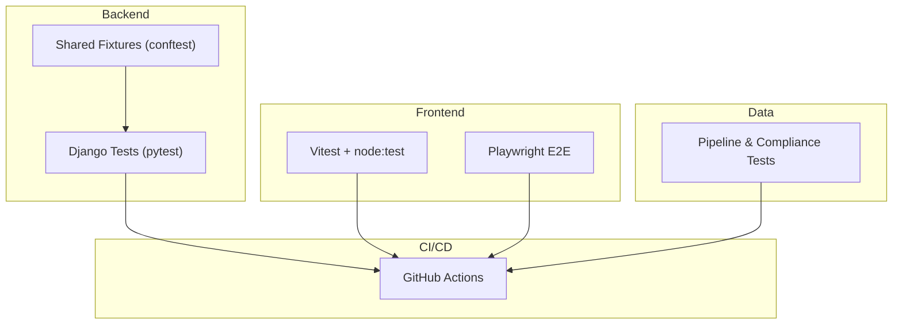
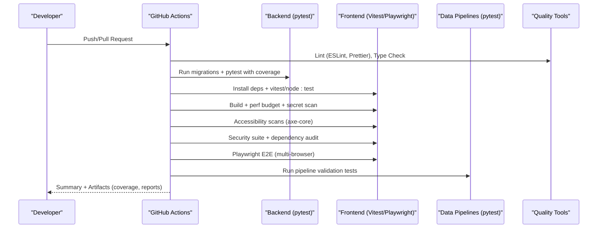
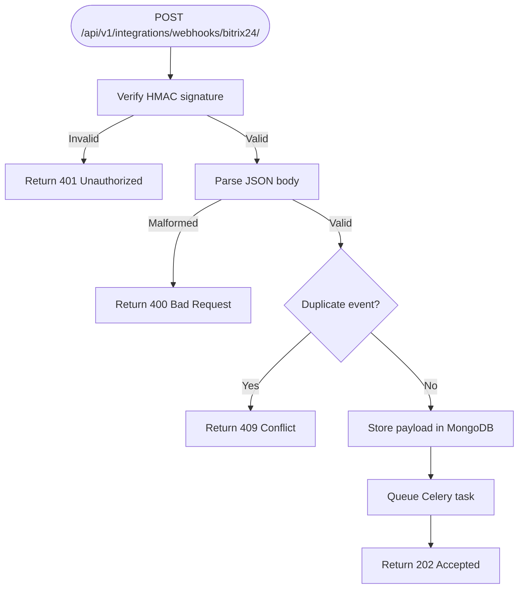
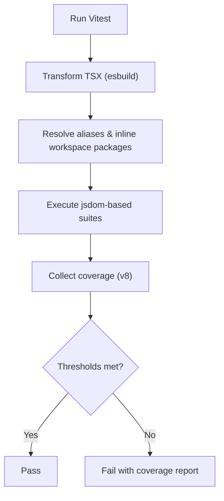
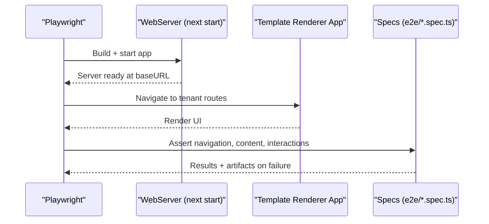
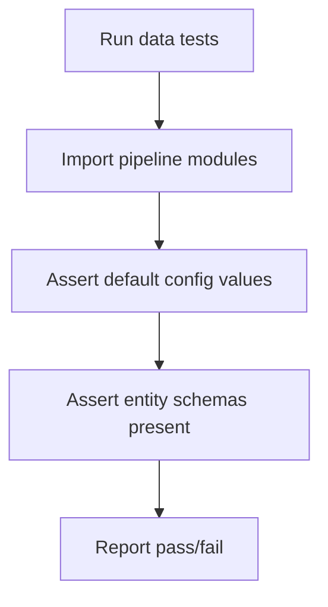
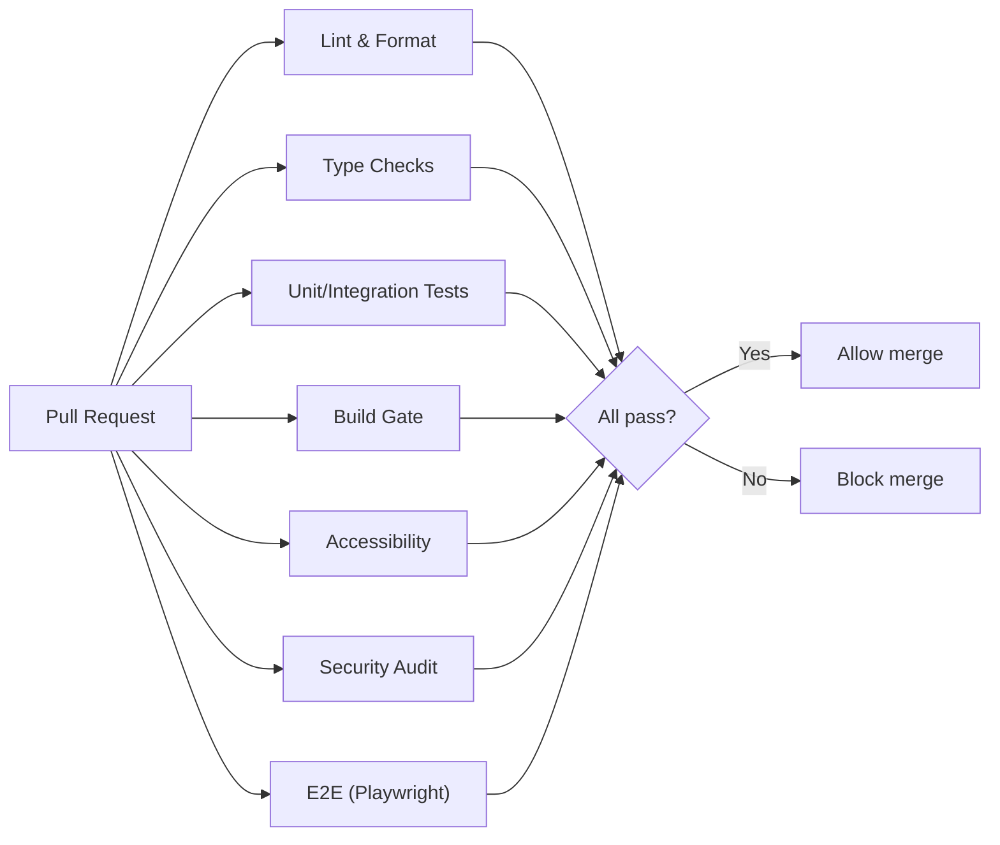
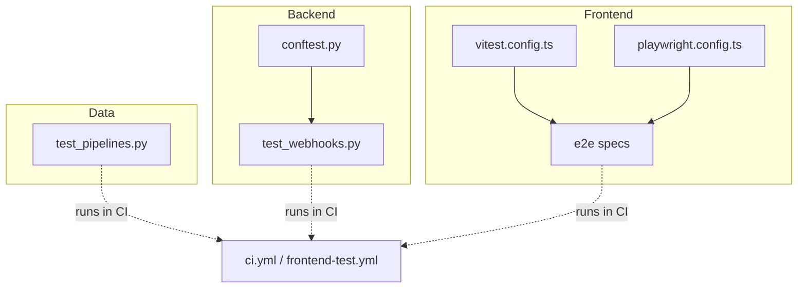

# Testing & Quality Assurance

<cite>
**Referenced Files in This Document**
- [ci.yml](file://.github/workflows/ci.yml)
- [frontend-test.yml](file://.github/workflows/frontend-test.yml)
- [conftest.py](file://backend/django/conftest.py)
- [test_webhooks.py](file://backend/django/apps/integrations/tests/test_webhooks.py)
- [test_pipelines.py](file://data/tests/test_pipelines.py)
- [vitest.config.ts](file://frontend/apps/template-renderer/vitest.config.ts)
- [playwright.config.ts](file://frontend/apps/template-renderer/playwright.config.ts)
- [01-home-news.spec.ts](file://frontend/apps/template-renderer/e2e/01-home-news.spec.ts)
- [qodana.yaml](file://qodana.yaml)
</cite>

## Table of Contents
1. Introduction
2. Project Structure
3. Core Components
4. Architecture Overview
5. Detailed Component Analysis
6. Dependency Analysis
7. Performance Considerations
8. Troubleshooting Guide
9. Conclusion

## Introduction
This document describes the testing and quality assurance strategy for the JOL-HUB platform across backend services, frontend applications, data pipelines, and CI/CD pipelines. It covers unit tests (pytest), integration tests (API endpoints), end-to-end tests (Playwright), data pipeline validation, test data management, mocking strategies, continuous integration workflows, code quality tools (ESLint, Prettier, Qodana), performance testing approaches, guidelines for writing effective tests, coverage targets, debugging failed tests, and quality gates in CI/CD.

## Project Structure
The repository organizes testing artifacts by tier:
- Backend unit and integration tests under Django apps using pytest with shared fixtures and helpers.
- Frontend unit/integration/security tests via Vitest and node:test, plus E2E tests via Playwright.
- Data pipeline tests validating importers, validators, and compliance logic.
- CI/CD pipelines orchestrating linting, type checks, tests, builds, accessibility scans, security audits, and E2E runs.

[No sources needed since this diagram shows conceptual workflow, not actual code structure]

## Core Components
- Backend testing harness:
  - Shared fixtures and helpers for API clients, request factories, and Bitrix24 webhook payload/signature generation to standardize tests across apps.
  - Integration tests validate webhook ingestion, idempotency, signature verification, and task dispatch.
- Frontend testing stack:
  - Vitest configured for jsdom-based component/integration/security tests with coverage thresholds for critical editor components.
  - Playwright E2E suite targeting multiple browsers/devices with built-in build-and-start lifecycle and failure artifacts.
- Data pipeline validation:
  - Pytest suites verify pipeline imports, configuration defaults, and schema availability for entity imports.
- CI/CD orchestration:
  - GitHub Actions jobs run backend lint/type-check/tests, frontend lint/type-check/tests/build, Docker build, accessibility scans, security audits, and E2E flows. Coverage is uploaded to Codecov.

**Section sources**
- [conftest.py:1-99](file://backend/django/conftest.py#L1-L99)
- [test_webhooks.py:1-274](file://backend/django/apps/integrations/tests/test_webhooks.py#L1-L274)
- [vitest.config.ts:1-79](file://frontend/apps/template-renderer/vitest.config.ts#L1-L79)
- [playwright.config.ts:1-59](file://frontend/apps/template-renderer/playwright.config.ts#L1-L59)
- [test_pipelines.py:1-40](file://data/tests/test_pipelines.py#L1-L40)
- [ci.yml:1-379](file://.github/workflows/ci.yml#L1-L379)
- [frontend-test.yml:1-208](file://.github/workflows/frontend-test.yml#L1-L208)

## Architecture Overview
The testing architecture spans four layers with clear boundaries and automation:

**Diagram sources**
- [ci.yml:36-174](file://.github/workflows/ci.yml#L36-L174)
- [frontend-test.yml:37-208](file://.github/workflows/frontend-test.yml#L37-L208)

**Section sources**
- [ci.yml:1-379](file://.github/workflows/ci.yml#L1-L379)
- [frontend-test.yml:1-208](file://.github/workflows/frontend-test.yml#L1-L208)

## Detailed Component Analysis

### Backend Unit and Integration Tests (pytest)
- Shared fixtures and helpers:
  - Centralized conftest provides APIClient and RequestFactory instances, plus helpers to build and sign Bitrix24 webhook payloads deterministically.
- Webhook integration tests:
  - Validate success path (202 Accepted), idempotency (duplicate returns 409), signature verification (wrong or missing signature returns 401), and malformed payloads (returns 400).
  - Use @patch to mock Celery tasks and assert correct dispatch parameters.
  - Verify MongoDB storage of raw payloads and idempotency keys.

**Diagram sources**
- [test_webhooks.py:82-125](file://backend/django/apps/integrations/tests/test_webhooks.py#L82-L125)
- [test_webhooks.py:132-160](file://backend/django/apps/integrations/tests/test_webhooks.py#L132-L160)
- [test_webhooks.py:167-226](file://backend/django/apps/integrations/tests/test_webhooks.py#L167-L226)
- [test_webhooks.py:233-274](file://backend/django/apps/integrations/tests/test_webhooks.py#L233-L274)

**Section sources**
- [conftest.py:20-99](file://backend/django/conftest.py#L20-L99)
- [test_webhooks.py:1-274](file://backend/django/apps/integrations/tests/test_webhooks.py#L1-L274)

### Frontend Unit, Integration, and Security Tests (Vitest + node:test)
- Test tiers:
  - Pure logic suites via node:test across packages.
  - DOM-tier tests via Vitest with jsdom environment, including component and route handler tests, plus security-focused tests.
- Configuration highlights:
  - Custom plugin transforms TSX before import analysis for deterministic compilation.
  - Workspace packages inlined for faster resolution during tests.
  - Strict timeouts to enforce determinism; coverage thresholds set for security-critical editor code paths.

**Diagram sources**
- [vitest.config.ts:18-79](file://frontend/apps/template-renderer/vitest.config.ts#L18-L79)

**Section sources**
- [vitest.config.ts:1-79](file://frontend/apps/template-renderer/vitest.config.ts#L1-L79)

### End-to-End Tests (Playwright)
- Scope:
  - Critical user flows validated against a built Next.js app served locally during tests.
- Configuration highlights:
  - Multi-project matrix: Desktop Chromium/Firefox and mobile WebKit (iPhone).
  - Parallel execution with workers; retries in CI; traces/screenshots/video retained on failure.
  - Base URL configurable; extra headers mirror production tenant routing behavior.
  - WebServer auto-builds and starts the app per run.

**Diagram sources**
- [playwright.config.ts:15-59](file://frontend/apps/template-renderer/playwright.config.ts#L15-L59)
- [01-home-news.spec.ts:1-29](file://frontend/apps/template-renderer/e2e/01-home-news.spec.ts#L1-L29)

**Section sources**
- [playwright.config.ts:1-59](file://frontend/apps/template-renderer/playwright.config.ts#L1-L59)
- [01-home-news.spec.ts:1-29](file://frontend/apps/template-renderer/e2e/01-home-news.spec.ts#L1-L29)

### Data Pipeline Validation Tests
- Purpose:
  - Ensure pipeline modules are importable and configurations match expected defaults.
  - Validate that CSV schemas exist for key entity types used in bulk imports.
- Execution:
  - Standard pytest discovery; can be run standalone or within CI.

**Diagram sources**
- [test_pipelines.py:8-36](file://data/tests/test_pipelines.py#L8-L36)

**Section sources**
- [test_pipelines.py:1-40](file://data/tests/test_pipelines.py#L1-L40)

### Continuous Integration Testing Pipelines
- CI Pipeline:
  - Backend: lint/format check (Black, isort, Flake8), type check (mypy), unit/integration tests with PostgreSQL and Redis services, coverage upload to Codecov.
  - Frontend: lint/format check (ESLint, Prettier), TypeScript check, unit tests with coverage, build artifact creation, Docker image build test.
  - Summary job aggregates results and enforces pass/fail.
- Frontend Testing Pipeline:
  - Unit + integration (vitest + node:test) with coverage artifacts.
  - Build gate enforcing performance budgets and secret leakage scan.
  - Accessibility scans (axe-core) against built app.
  - Security suite and production dependency audit.
  - E2E (Playwright) across three browser projects with report artifacts.

**Diagram sources**
- [ci.yml:36-379](file://.github/workflows/ci.yml#L36-L379)
- [frontend-test.yml:37-208](file://.github/workflows/frontend-test.yml#L37-L208)

**Section sources**
- [ci.yml:1-379](file://.github/workflows/ci.yml#L1-L379)
- [frontend-test.yml:1-208](file://.github/workflows/frontend-test.yml#L1-L208)

## Dependency Analysis
- Backend tests depend on:
  - Django test settings and services (PostgreSQL, Redis) provisioned by CI.
  - Shared fixtures for consistent API client and webhook helpers.
- Frontend tests depend on:
  - Workspace packages inlined for Vitest.
  - Playwright browsers installed in CI; web server started per run.
- Data tests depend on:
  - Python environment and module imports; no external services required.

**Diagram sources**
- [conftest.py:1-99](file://backend/django/conftest.py#L1-L99)
- [test_webhooks.py:1-274](file://backend/django/apps/integrations/tests/test_webhooks.py#L1-L274)
- [vitest.config.ts:1-79](file://frontend/apps/template-renderer/vitest.config.ts#L1-L79)
- [playwright.config.ts:1-59](file://frontend/apps/template-renderer/playwright.config.ts#L1-L59)
- [test_pipelines.py:1-40](file://data/tests/test_pipelines.py#L1-L40)
- [ci.yml:1-379](file://.github/workflows/ci.yml#L1-L379)
- [frontend-test.yml:1-208](file://.github/workflows/frontend-test.yml#L1-L208)

**Section sources**
- [ci.yml:1-379](file://.github/workflows/ci.yml#L1-L379)
- [frontend-test.yml:1-208](file://.github/workflows/frontend-test.yml#L1-L208)

## Performance Considerations
- Frontend performance budget gating:
  - The CI pipeline includes a dedicated step to enforce Core Web Vitals budgets after building the template renderer.
- Deterministic test execution:
  - Vitest sets strict hook and test timeouts to prevent flaky network/time-dependent tests.
- E2E stability:
  - Playwright uses parallel workers with limited retries in CI and retains traces/videos only on failure to balance speed and diagnostics.

[No sources needed since this section provides general guidance]

## Troubleshooting Guide
- Backend tests failing due to service connectivity:
  - Ensure PostgreSQL and Redis services are up; verify environment variables for database and Celery broker URLs in CI.
- Webhook signature mismatches:
  - Confirm the HMAC secret used in tests matches the setting override; ensure payload serialization matches the signature computation exactly.
- Vitest coverage threshold failures:
  - Review the v8 coverage report; expand coverage for security-critical editor paths or adjust thresholds conservatively.
- Playwright E2E flakes:
  - Inspect traces, screenshots, and videos from artifacts; increase timeouts if necessary; ensure the web server has time to start before assertions.
- Data pipeline import errors:
  - Validate module paths and dependencies; confirm schemas exist for expected entities.

**Section sources**
- [ci.yml:103-174](file://.github/workflows/ci.yml#L103-L174)
- [test_webhooks.py:167-226](file://backend/django/apps/integrations/tests/test_webhooks.py#L167-L226)
- [vitest.config.ts:59-79](file://frontend/apps/template-renderer/vitest.config.ts#L59-L79)
- [playwright.config.ts:20-59](file://frontend/apps/template-renderer/playwright.config.ts#L20-L59)
- [test_pipelines.py:11-36](file://data/tests/test_pipelines.py#L11-L36)

## Conclusion
JOL-HUB employs a layered testing strategy backed by robust CI/CD automation:
- Backend: pytest with shared fixtures and comprehensive integration tests for webhook ingestion, idempotency, and security.
- Frontend: Vitest for unit/integration/security tests with coverage thresholds; Playwright for multi-browser E2E flows with rich failure artifacts.
- Data: Pytest-based validation for pipeline imports, configuration, and schemas.
- CI/CD: Enforced quality gates through linting, type checks, tests, builds, accessibility scans, security audits, and E2E runs, with coverage reporting to Codecov.

Adhering to these practices ensures high reliability, maintainability, and safety across the platform’s evolving features.