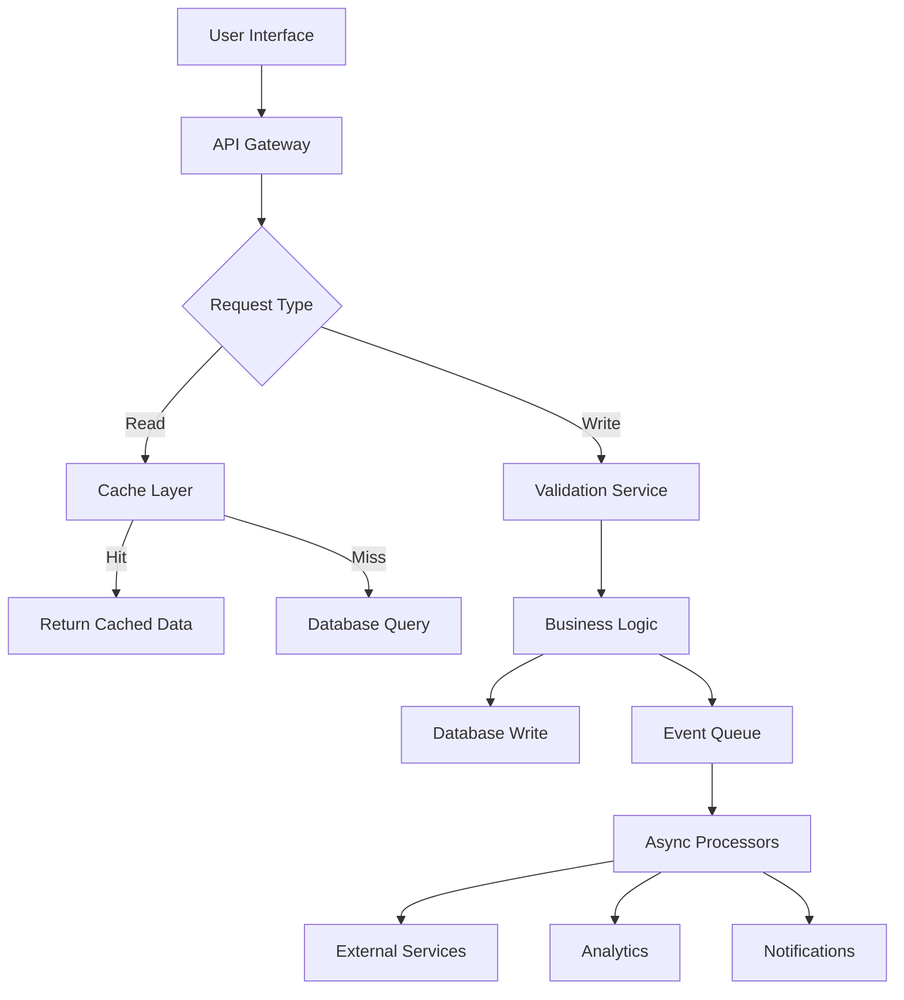

# Data Flow Architecture

## Overview

This document describes the flow of data through the JOL-HUB system, from user interaction to persistence and external integrations. Understanding these flows is critical for maintaining data integrity, security, and GDPR compliance.

## Data Flow Principles

1. **Data Minimization**: Only collect and process necessary data
2. **Purpose Limitation**: Use data only for specified purposes
3. **Transparency**: All data flows are documented and auditable
4. **Security**: Encryption in transit and at rest
5. **Consent**: User consent captured and respected throughout the flow

## High-Level Data Flow Diagram



## Request-Response Flow

### 1. User Request Initiation

**Entry Points:**
- Web Browser (React SPA)
- Mobile Application
- Third-party API consumers
- Internal services

**Data Captured:**
- HTTP headers (user agent, accept-language, etc.)
- Authentication tokens
- Request payload
- Timestamp
- IP address (anonymized for GDPR)

### 2. CDN/Edge Layer

**Processing:**
- Static asset caching
- SSL/TLS termination
- Geographic routing
- DDoS protection
- Request filtering

**Data Transformed:**
- TLS encryption applied
- Geographic metadata added
- Request rate limiting enforced

### 3. Load Balancer

**Functions:**
- Distributes requests across application instances
- Health check monitoring
- Session affinity (when required)
- Traffic shaping

**Data Logged:**
- Request metadata
- Routing decisions
- Performance metrics

### 4. API Gateway

**Processing Steps:**

#### 4.1 Authentication & Authorization
```
User Request → Token Validation → Permission Check → Context Creation
```

**Data Validated:**
- JWT token signature and expiration
- OAuth scopes
- API key validity (for service accounts)
- Rate limit quotas

**Context Enrichment:**
- User ID attached to request context
- Role and permissions loaded
- Tenant/country identification
- Preferred language

#### 4.2 Request Validation
- Schema validation against OpenAPI spec
- Input sanitization
- Content-type verification
- Size limit enforcement

### 5. Backend Processing (Django)

#### 5.1 Controller Layer
```python
# Example flow
def handle_request(request):
    # 1. Extract validated data
    data = request.validated_data
    
    # 2. Apply business logic
    result = service_layer.process(data, request.user)
    
    # 3. Return response
    return Response(result)
```

#### 5.2 Service Layer
- Business rule enforcement
- Transaction management
- Cross-cutting concerns (logging, metrics)
- Orchestration of data operations

#### 5.3 Data Access Layer
- ORM queries (Django Models)
- Query optimization
- Connection pooling
- Read/write routing (replicas)

### 6. Cache Layer (Redis)

**Caching Strategy:**

#### Multi-Level Cache
```
L1: Application Memory (milliseconds)
L2: Redis Distributed Cache (microseconds)
L3: Database (persistent storage)
```

**Cache Patterns:**

1. **Cache-Aside (Lazy Loading)**
   ```
   Request → Check Cache → Miss → Database → Update Cache → Return
   ```

2. **Write-Through**
   ```
   Write → Cache → Database → Confirm
   ```

3. **Write-Behind**
   ```
   Write → Cache → Async → Database
   ```

**Cached Data Types:**
- User sessions
- Frequently accessed reference data
- Computed aggregations
- API response caches

### 7. Database Layer (PostgreSQL)

#### 7.1 Write Operations

**Transaction Flow:**
```
BEGIN TRANSACTION
→ Validate constraints
→ Insert/Update records
→ Trigger audit logging
→ Publish domain events
COMMIT TRANSACTION
```

**Data Written:**
- Entity records
- Audit trail entries
- Event log entries
- Metrics data points

#### 7.2 Read Operations

**Query Execution:**
```
ORM Query → SQL Generation → Query Optimization
→ Index Scan/Seek → Result Mapping → Response
```

**Read Replicas:**
- Read queries routed to replicas
- Replication lag monitoring
- Failover to primary if needed

### 8. Asynchronous Processing (Celery)

#### 8.1 Task Queue Flow

```
Web Request → Publish Task → Message Broker (Redis/RabbitMQ)
→ Celery Worker → Task Execution → Result Storage
```

#### 8.2 Common Async Tasks

**Background Jobs:**
- Email notifications
- Report generation
- Data exports
- Image processing
- Search index updates
- Cleanup/archival tasks

**Scheduled Tasks:**
- Daily aggregations
- Weekly reports
- Monthly billing
- Regular data syncs

### 9. External Service Integration

#### 9.1 Outbound Data Flows

**Payment Processors:**
```
System → Payment Gateway API → Confirmation → Update Records
```
**Data Shared:** Transaction amount, currency, reference ID
**Data Received:** Payment status, transaction ID

**Email/SMS Providers:**
```
System → Communication Service → Delivery Confirmation
```
**Data Shared:** Recipient, message content, template variables
**Data Received:** Delivery status, bounce notifications

**Government APIs:**
```
System → National Registry → Verification Result
```
**Data Shared:** Citizen ID (encrypted), verification request
**Data Received:** Identity confirmation, eligibility status

#### 9.2 Data Synchronization

**Batch Sync:**
```
Extract → Transform → Load → Validate → Confirm
```

**Real-time Sync:**
```
Event → Webhook → Transformation → API Call → Response
```

## Data Lifecycle

### 1. Data Creation

**Sources:**
- User input (forms, uploads)
- System generation (IDs, timestamps)
- External imports
- Computed/aggregated data

**Validation:**
- Schema validation
- Business rule checks
- Duplicate detection
- Quality scoring

### 2. Data Storage

**Primary Storage:**
- PostgreSQL databases
- Encrypted at rest (AES-256)
- Automated backups
- Point-in-time recovery

**Secondary Storage:**
- Redis cache (volatile)
- Elasticsearch indices
- S3 object storage
- CDN edge caches

### 3. Data Usage

**Access Patterns:**
- Read queries (SELECT)
- Updates (INSERT/UPDATE/DELETE)
- Aggregations (GROUP BY, analytics)
- Exports (CSV, PDF, API responses)

**Access Controls:**
- Role-based permissions
- Row-level security
- Column masking for sensitive data
- Audit logging of all access

### 4. Data Retention

**Retention Policies:**
- Active data: Immediate access
- Archived data: Cold storage after 2 years
- Deleted data: Secure deletion after 7 years (or per country requirements)

**Archival Process:**
```
Identify → Extract → Compress → Encrypt → Transfer → Verify → Delete Original
```

### 5. Data Deletion

**Deletion Triggers:**
- User request (right to erasure)
- Retention period expiry
- Consent withdrawal
- Legal requirement

**Secure Deletion:**
```
Mark for Deletion → Remove from Primary → Overwrite Storage
→ Update Indices → Log Deletion → Confirm
```

## Country-Specific Data Flows

### Example: Lithuania (countries/lt)

```
LT User → LT CDN Edge → LT Language Processing
→ Local Payment Processor → VMI (Tax Authority)
→ Local Data Center (GDPR compliance)
```

**Localization:**
- Language-specific processing
- Local currency (EUR)
- Country-specific tax calculations
- National registry integrations

## Data Flow Security

### Encryption Points

1. **In Transit:**
   - TLS 1.3 from edge to backend
   - Internal service mesh encryption
   - Database connection encryption

2. **At Rest:**
   - Database TDE (Transparent Data Encryption)
   - Encrypted backups
   - Encrypted cache storage
   - Encrypted file storage

### Data Masking

**In Application:**
- PII masked in logs
- Sensitive fields encrypted in memory
- Credit card numbers tokenized

**In Database:**
- Dynamic data masking for sensitive columns
- Row-level security policies
- Column-level encryption

### Audit Trail

**Logged Events:**
- All data creation events
- All data modification events
- All data deletion events
- All data access (for sensitive data)
- All data exports and imports

**Audit Log Structure:**
```json
{
  "timestamp": "2026-03-05T10:30:00Z",
  "user_id": "uuid",
  "action": "CREATE|UPDATE|DELETE|READ",
  "entity_type": "User|Organization|Donation",
  "entity_id": "uuid",
  "field_changes": {...},
  "ip_address": "anonymized",
  "user_agent": "...",
  "correlation_id": "uuid"
}
```

## Monitoring & Observability

### Metrics Collected

**Flow Metrics:**
- Request latency (p50, p95, p99)
- Throughput (requests/second)
- Error rates by endpoint
- Cache hit/miss ratios

**Data Metrics:**
- Database query performance
- Replication lag
- Queue depths
- Task execution times

### Distributed Tracing

**Trace Propagation:**
```
Client → Trace ID Generated → Propagate through all services
→ Collect spans → Aggregate → Store → Visualize
```

**Span Data:**
- Operation name
- Start/end timestamps
- Tags (metadata)
- Logs (structured events)
- References (parent/child relationships)

## GDPR Compliance in Data Flow

### Lawful Basis Tracking

For each data element:
1. **Legal basis recorded** (consent, contract, legal obligation, legitimate interest)
2. **Purpose documented** in processing records
3. **Retention period** defined and enforced
4. **Data subject rights** supported (access, rectification, erasure, portability)

### Consent Management

```
User Interaction → Consent Request → Explicit Consent Capture
→ Store Consent Record → Apply to Processing → Respect Withdrawal
```

### Data Subject Rights Implementation

**Right to Access:**
```
Request → Identity Verification → Data Discovery → Compilation
→ Review → Secure Delivery → Log Fulfillment
```

**Right to Erasure:**
```
Request → Identity Verification → Locate All Data
→ Assess Exceptions → Execute Deletion → Confirm → Notify
```

**Right to Portability:**
```
Request → Verify → Extract Machine-Readable Format
→ Secure Packaging → Delivery → Audit Trail
```

## Performance Optimization

### Query Optimization
- Index strategy (B-tree, GIN, GiST)
- Query plan analysis
- Materialized views for complex aggregations
- Partitioning for large tables

### Caching Strategy
- Multi-level caching hierarchy
- Cache invalidation patterns
- TTL policies by data type
- Warm-up strategies for critical data

### Async Processing
- Offload non-critical paths
- Batch processing for efficiency
- Priority queues for time-sensitive tasks
- Backpressure handling

## Error Handling & Recovery

### Error Propagation
```
Error Occurs → Catch & Log → Transform to Standard Format
→ Add Context → Propagate → Handle at Boundary → User Feedback
```

### Retry Strategies
- Exponential backoff with jitter
- Circuit breaker pattern
- Dead letter queues for failed messages
- Manual intervention workflows

### Data Consistency
- Sagas for distributed transactions
- Event sourcing for audit trail
- Compensating transactions for rollbacks
- Idempotency keys for duplicate prevention

## Related Documentation

- [System Overview](system-overview.md) - Overall architecture
- [Security Model](security-model.md) - Security controls and practices
- [API Specification](../api/openapi-spec.yaml) - API contracts
- [GDPR Checklist](../compliance/GDPR-checklist.md) - Compliance requirements

---

*Last Updated: March 2026*
*Document Owner: Architecture Team*
