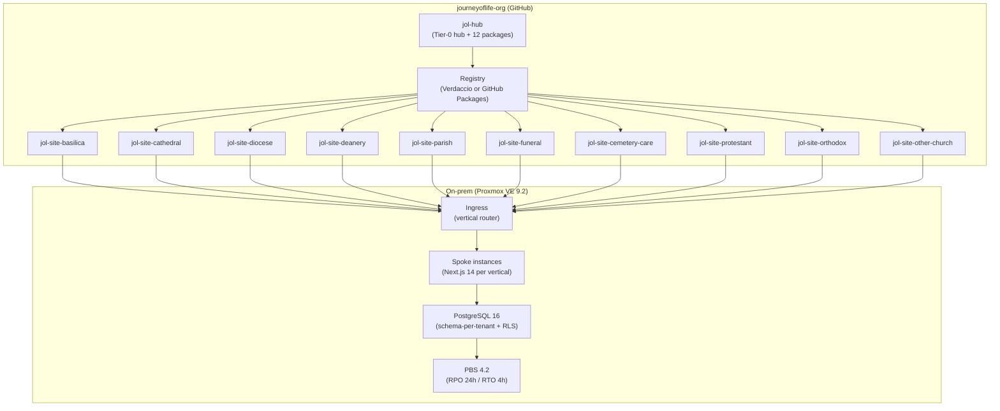
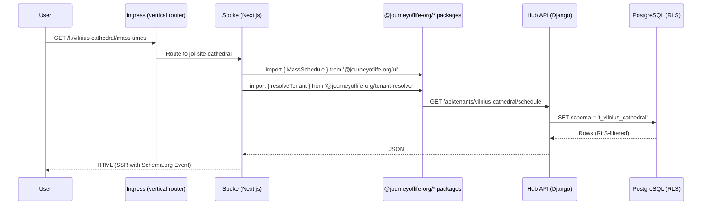
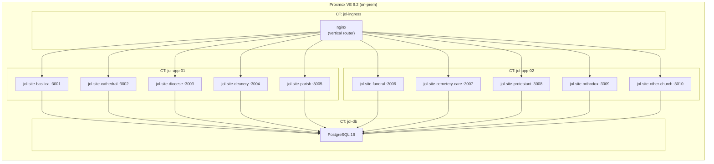

# Frontend Topology — Ten Vertical Hub-and-Spoke

> **Authoritative decision:** ADR-011 (2026-09-11). This document is the
> technical companion to that ADR.

## System Context

## Component Inventory

### Hub (`jol-hub`)

| Component | Role |
|---|---|
| `frontend/apps/template-renderer` | Integration test-bed; renders all 32 pilot tenants |
| `frontend/packages/ui` | Shared component library (primitives, composite, layout) |
| `frontend/packages/i18n` | Trilingual translations (lt/ru/en), 27-locale architecture |
| `frontend/packages/seo` | Schema.org builders, hreflang, sitemap, IndexNow |
| `frontend/packages/commerce` | Tier-gated feature flags, display-only handoff (ADR-009) |
| `frontend/packages/tenant-resolver` | Resolution chain: subdomain → tenant → schema → locale |
| `frontend/packages/seed-data` | Tenant fixtures, vertical registry, block schema |
| `frontend/packages/auth` | Authentication contracts |
| `frontend/packages/bitrix-sdk` | Bitrix24 CRM integration client |
| `frontend/packages/a11y` | Accessibility utilities |
| `frontend/packages/perf` | Performance monitoring |
| `frontend/packages/observability` | Logging and tracing |
| `frontend/packages/testing` | Shared test utilities |
| `backend/django/` | Django REST API, schema-per-tenant, RLS |
| `scripts/` | Policy-as-code guards (payment boundary, theme literals) |
| `data/` | ROPA records, compliance pipelines, dbt models |

### Spokes (10 repositories)

Each spoke contains **only** vertical composition code:
- `next.config.js` with vertical-specific settings
- Page routes consuming `@journeyoflife-org/*` packages
- Vertical-specific theme tokens (accent colour, hero variant)
- Vertical-specific Schema.org types
- No shared logic, no duplicated packages

## Technology Stack (verified)

| Layer | Technology |
|---|---|
| Frontend framework | Next.js 14 App Router |
| UI library | React 18 |
| Language | TypeScript strict |
| Styling | Tailwind CSS + design tokens |
| Build | Turborepo + pnpm 10.30.3 (never npm) |
| Backend | Python 3.12+ / Django 6.x / DRF |
| Database | PostgreSQL 16 (schema-per-tenant + RLS) |
| Infrastructure | Proxmox VE 9.2, Ubuntu Server 24.04 LTS |
| Backup | PBS 4.2 (RPO 24h / RTO 4h) |
| CI/CD | GitHub Actions (reusable workflows) |
| Secrets | SOPS/age with tiered recipients |
| Package registry | Verdaccio (on-prem) or GitHub Packages |

## Interaction Diagram

## Invariants (enforced as CI)

See ADR-011 §Decision for the full table (INV-1 through INV-11).

## Vertical Matrix

| # | Spoke | Vertical | Layout | Template | Commercial |
|---|---|---|---|---|---|
| 1 | jol-site-basilica | basilica | sacred | church-template | No |
| 2 | jol-site-cathedral | cathedral | sacred | church-template | No |
| 3 | jol-site-diocese | diocese | administrative | diocese-template | No |
| 4 | jol-site-deanery | deanery | administrative | deanery-template | No |
| 5 | jol-site-parish | church | sacred | church-template | No |
| 6 | jol-site-funeral | funeral | memorial | funeral-template | Yes (booking) |
| 7 | jol-site-cemetery-care | cemetery-cleaning | memorial | cleaning-template | Yes (booking) |
| 8 | jol-site-protestant | protestant | eastern | church-template | No |
| 9 | jol-site-orthodox | orthodox | eastern | church-template | No |
| 10 | jol-site-other-church | other-church | eastern | church-template | No |

## Deployment Topology

## Domain Strategy (D-006, D-051)

- `gyvenimo-kelias.lt` — LT ccTLD; tenant subdomains
- `dzives-cels.lv` — LV ccTLD
- `elu-tee.ee` — EE ccTLD
- `jol-hub.com` — brand/marketplace hub only

Each spoke serves one or more tenant subdomains under the ccTLD.

## Compliance Control Map

| Control | Mechanism | Scope |
|---|---|---|
| GDPR Art. 9 | Schema-per-tenant + RLS (ADR-001) | Hub + all spokes |
| GDPR Art. 30 | ROPA records per vertical | `data/exports/ropa/lt/` |
| GDPR Art. 35 | DPIA per spoke before go-live | Per-spoke compliance |
| PCI-DSS SAQ A | Payment boundary CLOSED (ADR-009) | All spokes + hub |
| SOC 2 CC6.1 | Opaque 404 for unknown tenant/page/locale | All spokes |
| WCAG 2.1 AA | axe-core in CI | All spokes |
| DS-THEME-01 | `check-theme-literals.sh` | Hub packages + all spokes |
