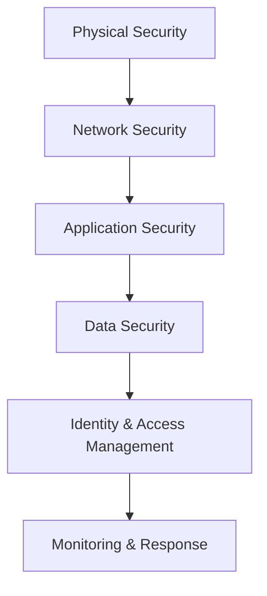

# Security Model

## Executive Summary

This document outlines the comprehensive security architecture for JOL-HUB, protecting 400,000 websites across 27 EU countries. Our security model implements defense-in-depth strategies, zero-trust principles, and GDPR compliance by design.

## Security Principles

### Core Tenets

1. **Zero Trust**: Never trust, always verify
2. **Defense in Depth**: Multiple layers of security controls
3. **Least Privilege**: Minimum necessary access rights
4. **Security by Design**: Integrated from inception, not bolted on
5. **Privacy by Default**: Automatic privacy protections
6. **Continuous Monitoring**: Real-time threat detection and response
7. **Compliance Automation**: Automated enforcement of regulatory requirements

## Security Architecture Layers



## 1. Network Security

### Perimeter Defense

**Edge Protection:**
- Cloudflare/Akamai CDN with WAF (Web Application Firewall)
- DDoS mitigation (Layer 3/4/7 protection)
- Rate limiting at edge (100 requests/minute per IP default)
- Geographic blocking for high-risk regions
- IP reputation scoring and blocking

**Firewall Configuration:**
```
Internet → Edge WAF → Load Balancer → Application Firewall
→ Private Subnet → Database Firewall → Database
```

**Network Segmentation:**
- Public subnet: Load balancers, bastion hosts
- Private subnet: Application servers
- Isolated subnet: Databases, sensitive data stores
- Management subnet: Admin interfaces, monitoring

### Internal Network Security

**Service Mesh:**
- Istio/Linkerd for mTLS between services
- Automatic certificate rotation
- Traffic encryption within cluster
- Fine-grained traffic policies

**Micro-segmentation:**
- Namespace isolation in Kubernetes
- Network policies restricting pod-to-pod communication
- Default-deny policies with explicit allow rules

### VPN & Private Connectivity

**Access Methods:**
- WireGuard/OpenVPN for remote access
- AWS Direct Connect / Azure ExpressRoute for dedicated connectivity
- SSH via bastion hosts with MFA
- No direct database access from public internet

## 2. Application Security

### Secure SDLC

**Development Phase:**
- Threat modeling for new features
- Security requirements definition
- Secure coding guidelines (OWASP Top 10)
- Pre-commit hooks for secret detection

**Testing Phase:**
- SAST (Static Application Security Testing) with SonarQube, Semgrep
- DAST (Dynamic Application Security Testing) with OWASP ZAP, Burp
- SCA (Software Composition Analysis) with Dependabot, Snyk
- Container scanning with Trivy, Clair
- IaC scanning with Checkov, Terrascan

**Deployment Phase:**
- Image signing with Cosign/Notary
- Admission controllers (OPA Gatekeeper, Kyverno)
- Runtime security monitoring
- Automated rollback on security anomalies

### API Security

**Authentication:**
- OAuth 2.1 / OpenID Connect
- JWT tokens with short expiration (15 minutes access, 7 days refresh)
- PKCE (Proof Key for Code Exchange) for public clients
- API keys for service-to-service communication (rotated quarterly)

**Authorization:**
- RBAC (Role-Based Access Control)
- ABAC (Attribute-Based Access Control) for fine-grained permissions
- Policy engine: OPA (Open Policy Agent)

**API Protection:**
- Rate limiting per user/API key
- Request validation against OpenAPI schema
- SQL injection prevention (parameterized queries)
- XSS prevention (Content Security Policy, output encoding)
- CSRF protection (SameSite cookies, CSRF tokens)

### Input Validation & Sanitization

**Validation Layers:**
```
Client-side → API Gateway → Backend Service → Database Constraints
```

**Techniques:**
- Allowlist validation for all inputs
- Type checking and range validation
- File upload restrictions (type, size, content scanning)
- HTML sanitization for rich text inputs

### Session Management

**Cookie Security:**
- `Secure` flag (HTTPS only)
- `HttpOnly` flag (no JavaScript access)
- `SameSite=Strict` (CSRF protection)
- Short expiration times
- Rotation on privilege changes

**Session Storage:**
- Redis with encryption at rest
- Server-side session storage (no sensitive data in client)
- Automatic invalidation on logout/password change

## 3. Data Security

### Encryption

**In Transit:**
- TLS 1.3 for all external communication
- TLS 1.2 minimum for internal services
- HSTS (HTTP Strict Transport Security) enabled
- Certificate pinning for mobile apps
- Perfect Forward Secrecy (ECDHE cipher suites)

**At Rest:**
- AES-256 encryption for databases
- Encrypted file systems (LUKS, BitLocker)
- S3 server-side encryption (SSE-S3, SSE-KMS)
- Client-side encryption for highly sensitive data
- Envelope encryption with key hierarchy

**Key Management:**
- HashiCorp Vault / AWS KMS / Azure Key Vault
- Key rotation (automatic, minimum annually)
- Separation of duties (key admins ≠ data admins)
- Audit logging for all key operations

### Data Classification

**Classification Levels:**

1. **Public**: Marketing materials, public content
   - No special handling required

2. **Internal**: Business documents, non-sensitive operational data
   - Access limited to employees
   - Encrypted in transit

3. **Confidential**: Personal data, business metrics
   - PII, user information
   - Encrypted in transit and at rest
   - Access logged and audited

4. **Highly Confidential**: Payment data, health information, credentials
   - Special category data (GDPR Article 9)
   - Enhanced encryption (field-level)
   - Strict access controls (need-to-know)
   - Additional audit requirements

### Data Loss Prevention (DLP)

**Prevention Controls:**
- Email scanning for sensitive data patterns
- Upload scanning for credit card numbers, national IDs
- Watermarking for confidential documents
- Clipboard restrictions in admin interfaces
- Download restrictions for sensitive data

**Detection Rules:**
- Regular expressions for common patterns (credit cards, IBAN, personal codes)
- Machine learning-based classification
- Contextual analysis (unusual data volumes, destinations)

### Database Security

**Access Controls:**
- Separate database users per application/service
- Principle of least privilege (read-only where possible)
- Row-Level Security (RLS) for multi-tenant data
- Column-level encryption for sensitive fields

**Auditing:**
- All queries logged for sensitive tables
- Anomaly detection for unusual query patterns
- Real-time alerting on bulk data exports
- Quarterly access reviews

**Masking & Tokenization:**
- Dynamic masking in non-production environments
- Tokenization for payment card data
- Pseudonymization for analytics use cases

## 4. Identity & Access Management (IAM)

### Authentication Systems

**User Authentication:**
- Multi-Factor Authentication (MFA) required for all users
- TOTP (Time-based One-Time Password) via authenticator apps
- WebAuthn/FIDO2 for passwordless authentication
- SMS fallback (with country-specific considerations)

**Employee Authentication:**
- SSO via SAML 2.0 / OIDC
- Integration with corporate identity provider (Azure AD, Okta)
- Hardware security keys (YubiKey) for privileged access
- Just-In-Time (JIT) access for temporary privileges

### Authorization Model

**Role Hierarchy:**
```
System Administrator
├── Security Admin
├── Database Admin
├── Application Admin
│   ├── Content Manager
│   ├── User Support
│   └── Analyst
└── Country Admin
    ├── Country Manager
    └── Local Support
```

**Permission Model:**
- Resource-based permissions (CRUD per entity type)
- Action-based permissions (approve, publish, delete)
- Context-aware permissions (time, location, device)
- Delegation support (temporary access grants)

### Privileged Access Management (PAM)

**Admin Access:**
- Break-glass accounts for emergencies (heavily monitored)
- Time-limited elevated privileges (max 8 hours)
- Approval workflows for privilege escalation
- Session recording for all admin activities

**Secret Management:**
- No secrets in code or configuration files
- Centralized secret storage (HashiCorp Vault)
- Automatic rotation (database passwords, API keys)
- Audit logging for all secret access

## 5. Infrastructure Security

### Container Security

**Image Security:**
- Minimal base images (distroless, Alpine)
- Regular vulnerability scanning
- Signed images only
- No root containers

**Runtime Security:**
- Read-only root filesystem
- Dropped capabilities (CAP_NET_RAW, CAP_SYS_ADMIN)
- Seccomp profiles restricting syscalls
- AppArmor/SELinux profiles

### Kubernetes Security

**Cluster Hardening:**
- RBAC enabled and regularly audited
- Pod Security Standards (Restricted profile)
- Network policies default-deny
- etcd encryption

**Workload Isolation:**
- Separate namespaces per environment/country
- Resource quotas and limit ranges
- Pod disruption budgets for availability
- Anti-affinity rules for critical workloads

### Cloud Security

**AWS Specific:**
- IAM roles with least privilege
- SCPs (Service Control Policies) for guardrails
- GuardDuty for threat detection
- Security Hub for compliance monitoring
- VPC Flow Logs for network monitoring

**Azure Specific:**
- Azure AD Conditional Access
- Azure Policy for compliance
- Microsoft Defender for Cloud
- Private endpoints for PaaS services

## 6. Monitoring & Incident Response

### Security Monitoring

**SIEM Integration:**
- Centralized log aggregation (ELK Stack, Splunk)
- Correlation rules for attack patterns
- UEBA (User and Entity Behavior Analytics)
- Automated alerting and ticket creation

**Detection Rules:**

*Authentication:*
- Multiple failed login attempts (>5 in 5 minutes)
- Logins from unusual geolocations
- Impossible travel (logins from distant locations in short time)
- Privilege escalation attempts

*Application:*
- SQL injection attempt patterns
- Directory traversal attempts
- Unusual API call patterns
- Bulk data export attempts

*Infrastructure:*
- Unauthorized API calls
- Configuration changes
- New user/account creation
- Security group/rule modifications

### Incident Response

**Response Process:**
```
Detection → Triage → Containment → Eradication → Recovery → Lessons Learned
```

**Severity Levels:**

**P1 - Critical**: Active breach, data exfiltration
- Response time: < 15 minutes
- 24/7 on-call escalation
- Executive notification

**P2 - High**: Vulnerability with active exploit
- Response time: < 1 hour
- Security team engagement
- Mitigation within 4 hours

**P3 - Medium**: Security control failure
- Response time: < 4 hours
- Resolution within 24 hours

**P4 - Low**: Policy violation, minor misconfiguration
- Response time: < 24 hours
- Resolution within 1 week

### Forensics & Investigation

**Evidence Preservation:**
- Automated snapshot creation on incident detection
- Memory capture for compromised systems
- Network packet capture retention (7 days)
- Chain of custody documentation

**Analysis Tools:**
- Timeline analysis
- Log correlation across systems
- Malware analysis sandbox
- Threat intelligence integration

## 7. GDPR & Privacy Compliance

### Legal Basis Management

**Tracking:**
- Consent records stored with timestamp, IP, user agent
- Granular consent per processing purpose
- Easy withdrawal mechanism
- Regular consent refresh (every 2 years)

### Data Subject Rights

**Right to Access:**
- Self-service data export portal
- 30-day fulfillment requirement
- Identity verification before disclosure
- Machine-readable format (JSON, XML)

**Right to Erasure:**
- Automated deletion workflows
- Cascade deletion to related data
- Backup exclusion after deletion
- Exception handling (legal hold, public interest)

**Right to Portability:**
- Standard formats (CSV, JSON)
- Direct transmission to other controllers
- Complete data history included

**Right to Object:**
- Objection tracking system
- Legitimate interest assessment
- Processing cessation upon valid objection

### Data Protection Impact Assessment (DPIA)

**Triggers:**
- New technology implementation
- Large-scale processing of sensitive data
- Systematic monitoring of public areas
- Automated decision-making with significant effects

**Process:**
1. Describe processing operations
2. Assess necessity and proportionality
3. Identify risks to data subjects
4. Define mitigation measures
5. Document and approve

### Data Breach Notification

**Internal Process:**
```
Discovery → Initial Assessment → Containment → Classification
→ DPO Notification → Authority Notification (72 hours)
→ Affected Individuals → Remediation
```

**Notification Criteria:**
- Risk to individuals' rights and freedoms
- Special category data involved
- Large number of affected individuals
- Potential for discrimination, identity theft, financial loss

## 8. Third-Party Risk Management

### Vendor Security Assessment

**Assessment Process:**
- Security questionnaire (SIG Lite, CAIQ)
- SOC 2 Type II / ISO 27001 certification review
- Penetration test results review
- Contract security requirements

**Ongoing Monitoring:**
- Annual reassessment
- Continuous security rating (SecurityScorecard, BitSight)
- Incident notification requirements
- Right to audit clauses

### Data Processing Agreements

**Required Clauses:**
- Purpose limitation
- Data subject rights assistance
- Subprocessor approval and flow-down requirements
- Security measures specification
- Breach notification (< 24 hours)
- Audit rights
- Data return/deletion at termination

## 9. Security Governance

### Policies & Standards

**Policy Framework:**
- Information Security Policy (board-approved)
- Acceptable Use Policy
- Access Control Policy
- Encryption Policy
- Incident Response Policy
- Change Management Policy
- Remote Work Security Policy

**Standards:**
- Secure Coding Standard (OWASP ASVS Level 2)
- Cloud Security Standard (CIS Benchmarks)
- Network Security Standard
- Endpoint Security Standard

### Training & Awareness

**Requirements:**
- Annual security awareness training (all employees)
- Role-based training (developers, admins, executives)
- Phishing simulation exercises (quarterly)
- Secure development training (developers)
- Incident response tabletop exercises (bi-annually)

### Compliance Audits

**Internal Audits:**
- Quarterly access reviews
- Monthly vulnerability scan reviews
- Weekly security metric reviews
- Daily log reviews (automated + spot checks)

**External Audits:**
- Annual SOC 2 Type II
- Annual penetration testing (internal, external, physical)
- GDPR compliance audits (as required)
- Country-specific regulatory audits

## 10. Security Metrics & KPIs

### Operational Metrics

- Mean Time to Detect (MTTD): Target < 1 hour
- Mean Time to Respond (MTTR): Target < 4 hours
- Patch deployment time: Critical < 24 hours, High < 7 days
- Vulnerability remediation rate: > 95% within SLA
- Phishing click rate: < 5%
- MFA adoption rate: > 99%

### Strategic Metrics

- Security control coverage: > 98%
- Policy exception count: Trending down
- Security training completion: 100%
- Third-party assessment completion: 100%
- Incident recurrence rate: 0%

## 11. Business Continuity & Disaster Recovery

### Backup Security

**Backup Requirements:**
- Encryption (AES-256) with separate key management
- Immutable backups (WORM storage)
- Geographic separation (different region)
- Regular restoration testing (quarterly)

**Recovery Objectives:**
- RTO (Recovery Time Objective): 4 hours
- RPO (Recovery Point Objective): 15 minutes

### Disaster Recovery

**DR Sites:**
- Primary: Frankfurt (EU-Central)
- Secondary: Amsterdam (EU-West)
- Tertiary: Dublin (EU-North)

**Failover Process:**
- Automated failover for critical services
- Manual failover for complex scenarios
- Regular DR testing (bi-annually)
- Documentation and runbooks maintained

## 12. Emerging Threats & Continuous Improvement

### Threat Intelligence

**Sources:**
- Commercial feeds (Recorded Future, CrowdStrike)
- Industry ISACs (Information Sharing and Analysis Centers)
- Government advisories (ENISA, CISA, NCSC)
- Vendor security bulletins

**Integration:**
- IOC (Indicators of Compromise) ingestion into SIEM
- Automated blocking of malicious IPs/domains
- Threat hunting based on TTPs (Tactics, Techniques, Procedures)

### Security Research & Development

**Focus Areas:**
- AI/ML for anomaly detection
- Zero-trust architecture enhancement
- Privacy-enhancing technologies (PETs)
- Quantum-resistant cryptography preparation

### Continuous Improvement

**Processes:**
- Post-incident reviews with action items
- Regular architecture reviews
- Red team exercises (annual)
- Bug bounty program (planned)
- Security champion program

## Related Documentation

- [System Overview](system-overview.md) - Overall architecture
- [Data Flow](data-flow.md) - Data movement through systems
- [GDPR Checklist](../compliance/GDPR-checklist.md) - Compliance requirements
- [API Specification](../api/openapi-spec.yaml) - API security contracts

## References

- OWASP Top 10: https://owasp.org/www-project-top-ten/
- NIST Cybersecurity Framework: https://www.nist.gov/cyberframework
- GDPR Official Text: https://gdpr.eu/
- ISO 27001: https://www.iso.org/isoiec-27001-information-security.html
- CIS Benchmarks: https://www.cisecurity.org/benchmark

---

*Last Updated: March 2026*
*Document Owner: Security Team*
*Review Cycle: Quarterly*
*Classification: Internal Use Only*
