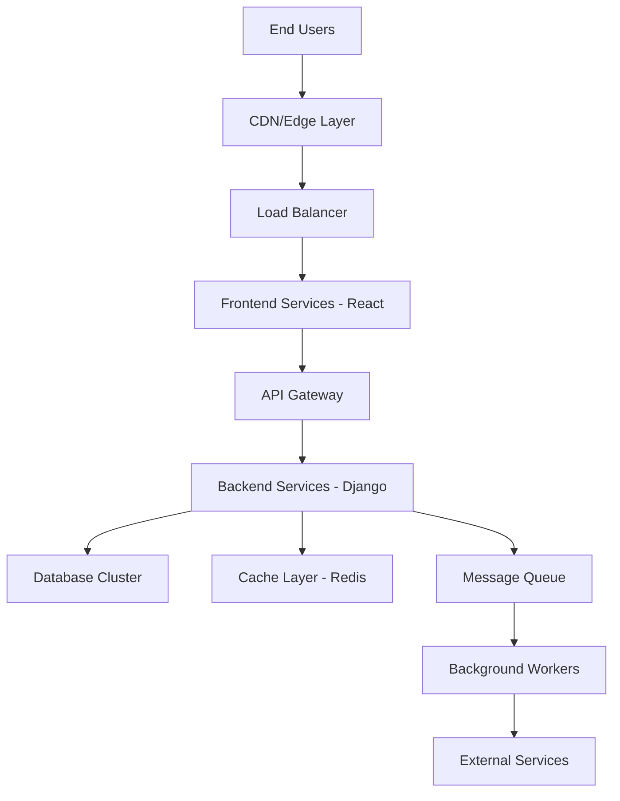

# System Architecture Overview

## Introduction

This document provides a comprehensive overview of the JOL-HUB (Journey Of Life) enterprise monorepo architecture. The system is designed to support 400,000 websites for religious institutions across 27 EU countries.

## System Goals

- **Scalability**: Support hundreds of thousands of websites with efficient resource utilization
- **Multi-tenancy**: Enable country-specific deployments with localized features
- **Maintainability**: Monorepo structure for code sharing and consistent practices
- **Compliance**: Full GDPR and EU regulatory compliance
- **Performance**: High availability and low latency across all regions

## High-Level Architecture



## Core Components

### 1. Frontend Layer (`frontend/react`)
- Modern React-based single-page applications
- Component library for consistent UI/UX
- Country-specific customizations
- Progressive Web App (PWA) capabilities

### 2. Backend Layer (`backend/django`)
- Django REST Framework for API services
- Authentication and authorization
- Business logic implementation
- Data validation and processing

### 3. Data Layer
- **Primary Database**: PostgreSQL with read replicas
- **Caching**: Redis for session management and frequently accessed data
- **Search**: Elasticsearch for content discovery
- **Storage**: S3-compatible object storage for media assets

### 4. Infrastructure (`infra`)
- Kubernetes-based container orchestration
- Infrastructure as Code (Terraform/Pulumi)
- CI/CD pipelines
- Monitoring and observability stack

### 5. Country-Specific Deployments (`countries/*`)
- Localized configurations per country
- Region-specific compliance requirements
- Local payment processors and integrations
- Language and cultural adaptations

## Technology Stack

### Frontend
- React 18+ with TypeScript
- Next.js for SSR/SSG capabilities
- Tailwind CSS for styling
- Redux/Zustand for state management
- Vite for build tooling

### Backend
- Python 3.11+
- Django 4.x / Django REST Framework
- Celery for async task processing
- PostgreSQL 15+
- Redis 7+

### DevOps & Infrastructure
- Docker & Kubernetes
- GitHub Actions / GitLab CI
- Prometheus & Grafana
- ELK Stack for logging
- Terraform for IaC

## Monorepo Structure

```
jol-hub/
├── backend/          # Django backend services
├── frontend/         # React frontend applications
├── countries/        # Country-specific configurations
├── entities/         # Shared domain models
├── tools/            # Development and deployment tools
├── infra/            # Infrastructure definitions
├── ops/              # Operational runbooks and scripts
├── ai/               # AI/ML components
├── docs/             # Documentation
└── tests/            # Test suites
```

## Deployment Architecture

### Environments
1. **Development**: Feature branch deployments
2. **Staging**: Pre-production testing
3. **Production**: Live country deployments

### Deployment Strategy
- Blue-green deployments for zero-downtime updates
- Canary releases for gradual rollouts
- Automated rollback on failure detection
- Country-level feature flags

## Security Architecture

- Zero-trust network model
- End-to-end encryption (TLS 1.3)
- OAuth 2.0 / OIDC for authentication
- Role-Based Access Control (RBAC)
- Regular security audits and penetration testing
- GDPR compliance by design

See [Security Model](security-model.md) for detailed information.

## Data Flow

Data flows through the system in a controlled and auditable manner:

1. User requests enter through CDN/Edge
2. Load balancer distributes to application servers
3. Backend processes requests via API layer
4. Data validated and persisted to database
5. Cache layer optimizes read performance
6. Async workers handle background processing
7. Audit logs capture all operations

See [Data Flow](data-flow.md) for detailed diagrams.

## Scalability Considerations

### Horizontal Scaling
- Stateless application servers
- Database read replicas
- Distributed caching
- Sharding strategy for high-volume tables

### Performance Optimization
- CDN for static assets
- Database query optimization
- Connection pooling
- Async processing for non-critical paths

## Monitoring & Observability

### Metrics Collection
- Application performance metrics
- Business KPIs
- Infrastructure health
- User experience metrics

### Logging Strategy
- Structured logging (JSON format)
- Centralized log aggregation
- Log retention policies
- Real-time alerting

### Tracing
- Distributed tracing with OpenTelemetry
- Request correlation IDs
- Performance bottleneck identification

## Compliance & Governance

- GDPR compliance across all EU operations
- Country-specific regulatory requirements
- Data residency requirements
- Regular compliance audits

See [GDPR Checklist](../compliance/GDPR-checklist.md) for detailed requirements.

## Disaster Recovery

### Backup Strategy
- Continuous database backups
- Point-in-time recovery capability
- Geographic redundancy
- Regular backup restoration tests

### Business Continuity
- Multi-region failover
- RTO (Recovery Time Objective): < 4 hours
- RPO (Recovery Point Objective): < 15 minutes

## Future Considerations

- Microservices migration path for specific components
- Edge computing opportunities
- AI/ML integration for personalization
- Enhanced automation and self-healing

## Related Documentation

- [Data Flow](data-flow.md) - Detailed data flow diagrams
- [Security Model](security-model.md) - Security architecture and controls
- [API Specification](../api/openapi-spec.yaml) - Complete API documentation
- [GDPR Checklist](../compliance/GDPR-checklist.md) - Compliance requirements

---

*Last Updated: March 2026*
*Document Owner: Architecture Team*
